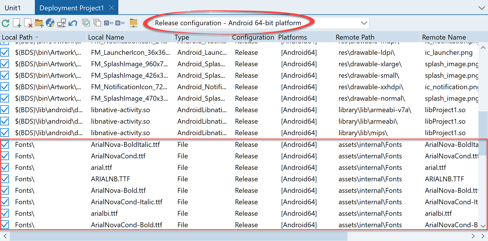
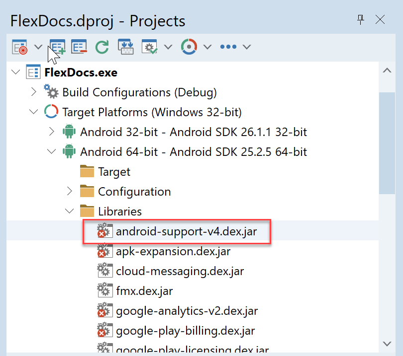
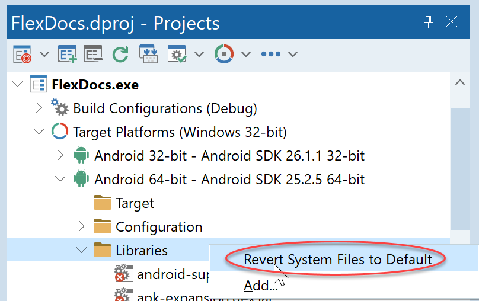
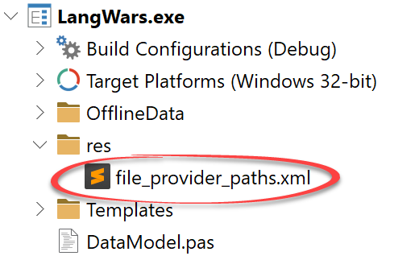
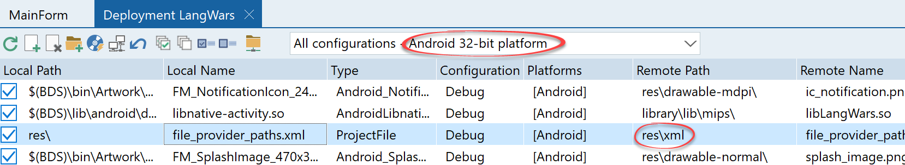
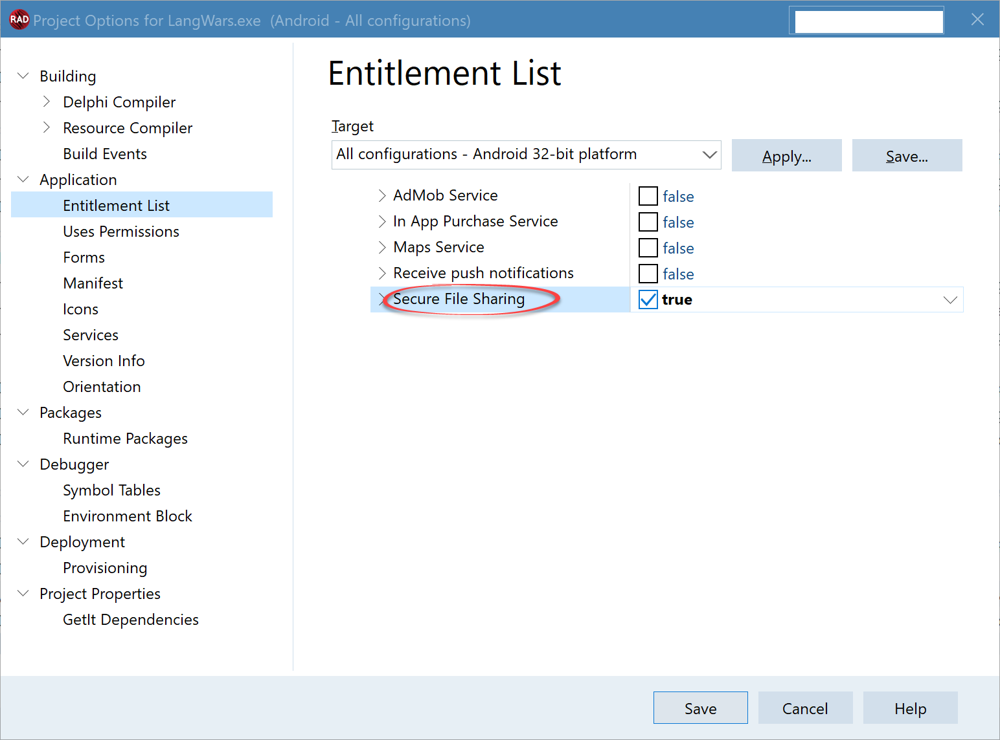

# FlexCel Android Guide

## Introduction

As it is the case with [iOS](xref:iOSGuide) and most of the platforms we support, the FlexCel code you have to write for Android itself is very similar to the code for normal Delphi VCL apps in Windows. We’ve reused most of the code from FlexCel in our Android implementation, and you can still use APIMate, the Demos, everything that you could in Windows when coding for Android.

## Fonts

The biggest difference with Windows apps is that Android by default has a single font: “**Roboto**”. When exporting documents to PDF the lack of extra fonts can be a problem.

There are multiple ways to workaround this:

### 1. Replacing all fonts in the document by internal fonts. 

If you are **only using [ANSI Windows-1252 ](https://en.wikipedia.org/wiki/Windows-1252) characters** and a single font, and you don’t care about the exact font used, you can use the code:

[TFlexCelPdfExport.FontMapping](~/api/FlexCel.Render/TFlexCelPdfExport/FontMapping.md) := [TFontMapping](~/api/FlexCel.Pdf/TFontMapping.md).ReplaceAllFonts;

before exporting to PDF.

A PDF viewer is required to understand 3 basic fonts: A Sans-Serif (Arial or Helvetica like), a Serif (Times or Times New Roman like), and a proportional font (Courier or Courier New like).

So if you don’t embed any font and are fine with using the internal fonts, you can get a smaller file and forget about other issues by replacing the fonts by internal ones**. However, note that this will only work if you are not using characters outside of the [ANSI Windows-1252 range](https://en.wikipedia.org/wiki/Windows-1252)**: The internal fonts don’t support Unicode, so if you have Unicode characters, you need to provide a font that has the needed characters.

### 2. Deploying the fonts with your app.

 You can provide FlexCel the fonts you need in the place where FlexCel expects them. The simplest way to do that is to deploy the font files needed as internal assets in your application.

To do it, in Rad Studio go to Menu-&gt;Project-&gt;Deployment, and add the font files you want, sending them to “**assets\\internal\\Fonts**” This is the default folder where FlexCel will search for them, so the simplest solution is just to copy them there.

You can copy the \*.ttf files in a “Font” folder in your app, and then set up your deploy manager like this:

With all the fonts going to assets\\internal\\Fonts.

> [!Warning]
> 
> **The path is case sensitive**: “fonts” instead of “Fonts” will not work.

> [!Warning]
> 
> The files that you add in the Deployment manager apply only to Debug or Release configurations. **So you need to add the fonts twice: Once for Release and one for Debug**.

You can read more about deploying here:

<http://docwiki.embarcadero.com/RADStudio/en/Creating_an_Android_App#Loading_and_Deploying_Files>

> [!Important]
> 
> Make sure you have the rights to distribute the fonts that you deploy.

### 3. Providing the font data via an event.

If you deploy your fonts to the **assets\internal\Fonts** folder as explained in the point above, then you have nothing more to do.

But if your app already deploys the fonts to some other folder, you can use the **[TFlexCelPdfExport.GetFontFolder](~/api/FlexCel.Render/TFlexCelPdfExport/GetFontFolder.md)** event to change where FlexCel will look for the fonts. For example, if your fonts happen to be inside assets\\internal\\Shared Fonts, you could use the following code:

<pre class="shiki shiki-themes light-plus dark-plus" style="background-color:#FFFFFF;--shiki-dark-bg:#1E1E1E;color:#000000;--shiki-dark:#D4D4D4" tabindex="0"><code>procedure LocateFontFolder(const sender: TObject; const e: TGetFontFolderEventArgs);
begin
  e.FontPath := TPath.Combine(TPath.GetDocumentsPath, 'Shared Fonts');
end;
</code></pre>

You can get the path to assets\\internal with **TPath.GetDocumentsPath** and the path to the external folder with **TPath.GetSharedDocumentsPath**. Both methods are defined in the unit **IOUtils** which you must use to get them.

## Saving files

Android has 2 types of storage: "Internal storage" and "External storage". While historically internal storage might have been in the device and external outside it, today there is normally no such difference. What makes internal different from external is the permissions: Your app has full permissions to the internal storage, and those files belong to your app. If you uninstall the app, the files on its internal storage will be deleted with it. On the other side, you need permissions for external storage, and those files are available for other apps too.

### Internal storage

For internal storage there is not much more to say: You can create, modify and delete those files as you like. 
To get the path to the internal storage from your code, you can use 

[TPath.GetDocumentsPath](http://docwiki.embarcadero.com/Libraries/en/System.IOUtils.TPath.GetDocumentsPath) 

### External storage

External storage can on its own be divided into 2 different types: **Private** and **Public** external storage. Both are publicly available for the rest of the apps, but conceptually private files are expected to be used by your app, while public files are to be freely shared. 

To save a file in external storage, you can use

  * For private external storage: [TPath.GetPublicPath](http://docwiki.embarcadero.com/Libraries/en/System.IOUtils.TPath.GetPublicPath)

  * For public external storage: [TPath.GetSharedDocumentsPath](http://docwiki.embarcadero.com/Libraries/en/System.IOUtils.TPath.GetSharedDocumentsPath) 

> [!Note]
> 
>   The method Get**Public**Path can be a little confusing, because it is used to access **Private** external storage. But that is just the way it is. Here, public refers to the fact that those files are in external storage, not that they are public external storage files.
>   

You can find a good description of external storage here (even if targeted for .NET instead of Rad Studio, concepts are the same): https://docs.microsoft.com/en-us/xamarin/android/platform/files/external-storage

Also, you can check https://developer.android.com/training/data-storage/files for more information about the kind of folders where you can save the data.

#### Getting permissions to external storage

In order to read or save a file into external storage, you first need to get permissions from Android. In older Android versions, adding those permissions to the manifest was enough. But if you target Android 6 or newer, you also need to dynamically ask for the permissions when you want to use them.

You can find the code needed to ask for the permissions here:

http://docwiki.embarcadero.com/RADStudio/en/Android_Permission_Model

You can also read more about android permissions here (once again targeted for .NET, but useful anyway):
https://docs.microsoft.com/en-us/xamarin/android/app-fundamentals/permissions

## Sharing files

### A tale of two APIs

A long, long time ago, the way to share files in Android was to store the file in external storage and then call an intent to share the file. This had multiple problems, one of those being that both the app sharing the file and the app consuming it should have permissions to read/write external storage.

To fix this, Android introduced the [FileProvider](https://developer.android.com/reference/android/support/v4/content/FileProvider) class which was made available via a [support library](https://developer.android.com/topic/libraries/support-library/features#v4) to Android 4 (Ice Cream Sandwich) and later.

But there was little reason to change the FileProvider API, since the old API was still working despite its problems. That changed with Android 7 (Nougat), which deprecated the old way to share files: https://developer.android.com/about/versions/nougat/android-7.0-changes#perm

And still, there was no need to change the old ways: you could still target an older Android version and have it run in Android 7 without issues. The new behavior only happened if you explicitly targeted Android 7.

> [!Note]
> 
> The versions in Android can be a little confusing, and it makes sense that we clarify them a little before continuing. 
> 
> The **target** version in Android is **not the minimum Android version your app will run**. The minimum version is given by **minSdkVersion**. The target version instead is the version your app is optimized for. You can target Android 7 and still have a minimum version of Android 4, but if you target Android 7, the Android 7 rules will apply to your code so the old way to share files won't work. If you target Android 4 (and have a minimum version of Android 4 too), then the Android 4 rules will apply, even if you are running in Android 7.
> 
> This all means that if you target Android 4 and have a minimum SDK of Android 4, you don't have to care about the new Android 7 rules, and your app will still work in Android 7. If you target Android 7, even if your minimum supported version is still 4, you have to use the new way to share files.
> 
> You can read more about Android versioning here: https://developer.android.com/guide/topics/manifest/uses-sdk-element#ApiLevels

Now, going back to our story: in August 2018 this all changed again. Google started to [ask for a **target** version of 8.0 or newer](https://android-developers.googleblog.com/2017/12/improving-app-security-and-performance.html) to be able to publish in the Play store. When you set a target version of 8.0 (no matter if your minimum version is lower), then the old-style way to share files won't work anymore in devices running Nougat or later. Old tricks won't work anymore, and it is time to change to the new system.

> [!Important]
> 
> Since Android 9, the [support library](https://developer.android.com/topic/libraries/support-library/features#v4)  is also deprecated, and now FileProvider is at https://developer.android.com/reference/androidx/core/content/FileProvider
> 
> So you need to decide what to use: If the not-deprecated androidx which only supports Android 9 or newer, or the old support library which isn't updated anymore but supports older devices.
> 
> 
> But the choice depends in your Rad Studio version. To use AndroidX you need at least [Rad Studio 11](https://www.embarcadero.com/products/rad-studio/whats-new-in-11-alexandria), and Rad Studio 11 or newer will only work with AndroidX. On the other side. Older Rad Studio versions will only work with the support library.
> 
> 

In the examples bundled with FlexCel we will show AndroidX, but note the differences with Support Library. 
If you want a working example with Support Library, you can find it in GitHub: 
https://github.com/tmssoftware/TMS-FlexCel.VCL-demos/releases/tag/v7.12

## Converting to AndroidX

If you are migrating from an older version than Rad Studio 11 to Rad Studio 11 or newer, you need to check the libraries you are including:

If you aren't using special functionality, you might want to just reset the libraries to the default:

Remember to do this for both Android 32 and 64 bits if you are supporting both.

Once you've done that, you need to adapt the FileProvider from android.support.v4.content.FileProvider to androidx.core.content.FileProvider as shown below.

## Using FileProvider to share files

To share files in the new way, you need to define a [FileProvider](https://developer.android.com/reference/androidx/core/content/FileProvider).

You can read about the concepts here: https://developer.android.com/training/secure-file-sharing/

And in the rest of this section we will discuss how to share a simple file created by FlexCel. You can find a finished working example here: [LangWars](xref:LangWars-FireMonkey_Mobile)

### Step 1. Declare the file provider. 

The first thing we need to do is to [modify the file AndroidManifest.template.xml](http://docwiki.embarcadero.com/RADStudio/en/Preparing_an_Android_Application_for_Deployment#Customizing_Your_AndroidManifest.xml_File) and add a provider.

Edit the file AndroidManifest.template.xml in your project, and add the following &lt;provider> below the &lt;application> tag:

<pre class="shiki shiki-themes light-plus dark-plus" style="background-color:#FFFFFF;--shiki-dark-bg:#1E1E1E;color:#000000;--shiki-dark:#D4D4D4" tabindex="0"><code>   &#x3C;application ...>
      ...
      &#x3C;provider android:name="androidx.core.content.FileProvider" 
         android:grantUriPermissions="true" 
         android:exported="false" 
         android:authorities="%package%.fileprovider">
         &#x3C;meta-data android:name="android.support.FILE_PROVIDER_PATHS" 
            android:resource="@xml/file_provider_paths" />
      &#x3C;/provider>
   &#x3C;/application>
</code></pre>

> [!Note]
> 
> To use support library instead of AndroidX, set the provider to be:
> <pre class="shiki shiki-themes light-plus dark-plus" style="background-color:#FFFFFF;--shiki-dark-bg:#1E1E1E;color:#000000;--shiki-dark:#D4D4D4" tabindex="0"><code>&#x3C;provider android:name="android.support.v4.content.FileProvider"
> </code></pre>
> 
> Also note that it is always "android.support.FILE_PROVIDER_PATHS", even in AndroidX
> 

> [!Important]
> 
> As we are manually modifying the Android manifest, we now need to remember to update it every time we update Delphi as explained here:
> 
> http://docwiki.embarcadero.com/RADStudio/en/Preparing_an_Android_Application_for_Deployment#Re-creating_the_AndroidManifest.template.xml_File
> 

### Step 2. Declare the paths that the FileProvider can use.

In step 1 we defined a resource:

<pre class="shiki shiki-themes light-plus dark-plus" style="background-color:#FFFFFF;--shiki-dark-bg:#1E1E1E;color:#000000;--shiki-dark:#D4D4D4" tabindex="0"><code>Resource = "@xml/file_provider_paths"
</code></pre>

Now we need to create this resource, where we will tell Android which are the paths that the provider will use. To do so, we will create a file named **file_provider_paths.xml**. In this example we will put it inside a "res" folder, but you can put it wherever you want.

For our example, we are going to store the file in the root data folder in the internal memory, so we will add this to the provider paths. The file **file_provider_paths.xml** will be:

<pre class="shiki shiki-themes light-plus dark-plus" style="background-color:#FFFFFF;--shiki-dark-bg:#1E1E1E;color:#000000;--shiki-dark:#D4D4D4" tabindex="0"><code>&#x3C;?xml version="1.0" encoding="utf-8" ?>
&#x3C;paths>
  &#x3C;files-path name="files" path="." />
&#x3C;/paths>
</code></pre>

If you need to share a file in external storage or on a different path, you should change this file accordingly. For more information about what you can write in this file, please read https://developer.android.com/reference/androidx/core/content/FileProvider#SpecifyFiles

### Step 3. Deploy the file with the paths as a resource.

Now we need to deploy the file we created in step 2 as an Android resource to our app.

> [!Note]
> 
> **Delphi resources** are not the same as **Android resources**. Delphi resources are defined in a cross-platform way, and are the ones that you can access with TResourceStream. But here we need to define an **Android** resource, which is a different thing. To create an Android resource, you need to deploy the file to a **res** folder from the base folder of your app.

To do so, go to Menu->Project->Deployment in Delphi and make sure the file file_provider_paths.xml is deployed to the "res\xml" folder. **Make sure also that you select "Android" in the platform combobox.**

> [!Note]
> 
> Since Delphi 10.3 Rio, Rad Studio includes a checkbox named "Secure File Sharing" in the Project Options->Application->Entitlement List:
> 
> 
> 
> If you check this checkbox, Delphi will generate both a provider inside the Android manifest, and create a file named **provider_paths.xml** which contains the paths referenced by the provider, as mentioned here: http://docwiki.embarcadero.com/RADStudio/en/Entitlement_List#Entitlement_List_for_Android
> 
> This would be almost perfect, since it would avoid the need to manually modify AndroidManifestTemplate.xml and do steps 1 to 3. But there is a caveat:
> The generated file **provider_paths.xml** will have this content, which you cannot modify:
> 
> <pre class="shiki shiki-themes light-plus dark-plus" style="background-color:#FFFFFF;--shiki-dark-bg:#1E1E1E;color:#000000;--shiki-dark:#D4D4D4" tabindex="0"><code>&#x3C;?xml version="1.0" encoding="utf-8"?>
> &#x3C;paths xmlns:android="http://schemas.android.com/apk/res/android">
>     &#x3C;external-path name="external_files" path="." />
> &#x3C;/paths>
> </code></pre>
> 
> 
> As you can see, it defines an external path, which requires permissions to external storage, which was what we were trying to avoid in the first place. So unless your app is already using external storage for sharing files, you can't use this very convenient option. **If the files you want to share are already in the external storage for different reasons, then you should just check this checkbox and forget about modifying the manifest manually.**
> 

### Step 4. Write the code. 

Once the provider is correctly declared, the last step is to write the code to share the file. FlexCel comes with a component that does the work for us, so we will just drop a TFlexCelDocExport component into the form and write the following code:

<pre class="shiki shiki-themes light-plus dark-plus" style="background-color:#FFFFFF;--shiki-dark-bg:#1E1E1E;color:#000000;--shiki-dark:#D4D4D4" tabindex="0"><code>FlexCelDocExport.ExportFile(btnShare, PdfPath);
</code></pre>

> [!Note]
> 
> If you get a NullPointerExeption like the following:
> 
> 
> <pre class="shiki shiki-themes light-plus dark-plus" style="background-color:#FFFFFF;--shiki-dark-bg:#1E1E1E;color:#000000;--shiki-dark:#D4D4D4" tabindex="0"><code>Project Reports.apk raised exception class EJNIException with message 'java.lang.NullPointerException: Attempt to invoke virtual method 'android.content.res.XmlResourceParser android.content.pm.ProviderInfo.loadXmlMetaData(android.content.pm.PackageManager, java.lang.String)' on a null object reference'.
> </code></pre>
> 
> Then the provider is not defined correctly in the application.
> 
> 
> If instead you get an error similar to:
> 
> <pre class="shiki shiki-themes light-plus dark-plus" style="background-color:#FFFFFF;--shiki-dark-bg:#1E1E1E;color:#000000;--shiki-dark:#D4D4D4" tabindex="0"><code>Project Reports.apk raised exception class EJNIException with message 'java.lang.IllegalArgumentException: Failed to find configured root that contains /data/data/com.tms.Reports/files/delphiversions.pdf'.
> </code></pre>
> 
> 
> Then the problem is in the files listed inside file_provider_paths.xml
> 

