# FlexCel API Developer Guide

## Introduction

The FlexCel API (Application Programmer Interface) is what you use to
read or write Excel files in a low-level way. By “low-level” we mean
that this API is designed to work really “close to the metal” and there
aren’t many layers between you and the xls/xlsx file being created. For
example, FlexCel API doesn’t know about datasets, because datasets are a
higher level concept. If you want to dump a dataset into an Excel file
using the API, you need to loop in all records and enter the contents
into the cells.

In addition to the FlexCel API we provide a higher level abstraction,
[TFlexCelReport](~/api/FlexCel.Report/TFlexCelReport/index.md), that knows about datasets and in general works at a
more functional level; a declarative approach instead of an imperative
approach. What is best for you depends on your needs.

## Basic Concepts

Before starting writing code, there are some basic concepts you should
be familiar with. Mastering them will make things much easier down the road.

### Arrays and Cells

To maintain our syntax compatible with Excel OLE automation, most
FlexCel indexes/arrays are 1-based.

That is, cell A1 is (1,1) and not (0,0). To set the first sheet as
ActiveSheet, you would write `ActiveSheet := 1` and not `ActiveSheet := 0`.

So, in C++ loops should read: `for (int i = 1; i <= Count; i++)`, and in
 Delphi they should be like `for i := 1 to Count`. 

The two exceptions to this rule are XF and Font indexes, which are 0
based because they are so in Excel.

### Cell Formats

All formats (colors, fonts, borders, etc.) on an Excel workbook are
stored into a list, and referred by number. This number is known as the
XF (e**X**tended **F**ormat) index. A simple example follows:

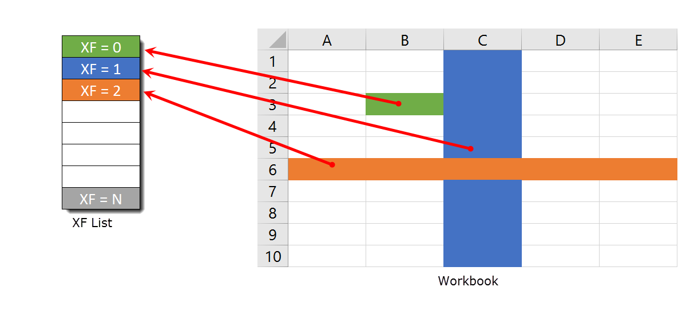

Here Cell B3 has XF = 0 and the XF definition for the background color is
green. Row 6 has XF = 2, so all the empty cells on row 6 are orange.
Column C has XF = 1, so all the empty cells on column C that do not have a
Row Format are blue.

The priority goes, from higher to lower: Cell format->Row format->Column format.
This means that if column A has a column format red and Row 1 has row format green,
the cell A1 will be green. If you apply a cell format to cell A1, it will be used instead
of either row or column formats as it has the highest priority.

> [!Note]
> 
> Sometimes when you work in Excel, it might look like Excel is handling priority differently. For example if you format
> a row green and after that a column red, you will see that the intersection between the column and row is red.
> 
> What is happening under the hood is that when you format the column red, Excel applies a **column format** red to
> the column, and after that a **cell format** red to the cell in the intersection. This way it can look like
> the column format is taking priority over the row, but it is actually the cell format applied to the cell at the
> intersection which has the priority.

Most formatting methods at FlexCel return an **XF** index, and then you
have to look at the XF list (using the [TExcelFile.GetFormat](~/api/FlexCel.Core/TExcelFile/GetFormat.md) method) to get a
class encapsulating the real format. There is a helper method:
 [TExcelFile.GetCellVisibleFormatDef](~/api/FlexCel.Core/TExcelFile/GetCellVisibleFormatDef.md) that obtain the **XF**
index and return the format class in one step.

To create new formats, you have to use the [TExcelFile.AddFormat](~/api/FlexCel.Core/TExcelFile/AddFormat.md) method. Once
you get the Id of the new XF, you can use it as you wish.

> [!Note]
> 
> You don't have to worry also on inserting a format 2 times: If it
> already exists AddFormat will return the existing id and not add a new
> XF entry.

### Cell and Style Formats

XF formats can be of two types, “Cell” or “Style”. Cell formats are
applied directly to a cell and can have a “[ParentStyle](~/api/FlexCel.Core/TFlxFormat//ParentStyle.md)” which must
be a style format. Style formats cannot have ParentStyle and cannot be
applied to cells, but they can be used as the base for defining different
Cell formats. You can know if a [TFlxFormat](~/api/FlexCel.Core/TFlxFormat/index.md) contains a “Style” or “Cell”
format by looking at its “[IsStyle](~/api/FlexCel.Core/TFlxFormat//IsStyle.md)” property. Also, a cell style can
link only parts of its format to its parent style, for example have the
font linked so when you change the font in the style it changes the font
in the cell, but not the cell borders. In order to set which properties
are linked to the main style, you need to change the “[LinkedStyle](~/api/FlexCel.Core/TFlxFormat//LinkedStyle.md)”
property in [TFlxFormat](~/api/FlexCel.Core/TFlxFormat/index.md).

You can create new Style formats with [TExcelFile.SetStyle](~/api/FlexCel.Core/TExcelFile/SetStyle.md), and new Cell
formats with [TExcelFile.AddFormat](~/api/FlexCel.Core/TExcelFile/AddFormat.md). Once you create a new style and give
it a name, you can get its definition as a [TFlxFormat](~/api/FlexCel.Core/TFlxFormat/index.md), change its
[TFlxFormat.IsStyle](~/api/FlexCel.Core/TFlxFormat/IsStyle.md) property to true, define which properties you want to link
with the [TFlxFormat.LinkedStyle](~/api/FlexCel.Core/TFlxFormat/LinkedStyle.md) property, and add that format using [AddFormat](~/api/FlexCel.Core/TExcelFile//AddFormat.md) to
get the cell format. Once you have the cell style, you can just apply it
to a cell.

> [!Note]
> 
> The [TLinkedStyle](~/api/FlexCel.Core/TLinkedStyle/index.md) record has a member, [TLinkedStyle.AutomaticChoose](~/api/FlexCel.Core/TLinkedStyle/AutomaticChoose.md), which if left
> to true (the default) will compare your new format with the style and
> only link those properties that are the same.
> 
> For example, let’s imagine you create a style “MyHyperlink”, with font
> blue and underlined. Then you create a Cell format that uses
> “MyHyperLink” as parent style, but also has a red background, and apply it
> to cell A1. If you leave [AutomaticChoose](~/api/FlexCel.Core/TLinkedStyle//AutomaticChoose.md) true, FlexCel will detect that
> the cell format is equal in everything to its parent style except in the
> background, so it will not link the background of the cell to the style.
> If you later change the background of MyHyperlink, cell A1 will continue
> to be red.
> 
> This allows for having “partial styles” as in the example above: a
> “hyperlink” style defines that text should be blue and underlined, but
> it doesn’t care about the cell background. If you want to manually set
> which properties you want to have linked instead of FlexCel calculating
> that for you, you need to set [TLinkedStyle.AutomaticChoose](~/api/FlexCel.Core/TLinkedStyle/AutomaticChoose.md) to false and set the
> “Linked….” Properties in [TLinkedStyle](~/api/FlexCel.Core/TLinkedStyle/index.md) to the values you want.

### Font Indexes

The same way we have an XF list where we store the formats for global
use, there is a Font list where fonts are stored to be used by XFs. You
normally don't need to worry about the FONT list because inserting on
this list is automatically handled for you when you define an XF format.
But, if you want to, you can for example change Font number 7 to be 15
points, and all XFs referencing Font 7 will automatically change to 15
points.

### Colors

While colors in Excel up to 2003 were indexes to a palette of 56 colors,
Excel 2007 introduces true colors, and FlexCel implements it too since version 5.0.
One thing that is nice about the new colors is that they can be retrofitted in the xls file
format, so while you won’t be able to see true color in Excel 2003 (Excel 2003 just doesn't know about them),
the data is there in the xls file anyway. So if you open the xls file with FlexCel 5 or later Excel 2007 and later
you will see the true colors, even if the xls file format originally didn't know about them.

There are four kinds of colors that you can use in Excel:

-   **RGB**: This is just a standard color specified by its Red, Green
    and Blue values.

-   **Theme**: There are 12 theme colors, and each of them can have a
    different tint (brightness) applied. Theme colors are the default
    in newer Excel versions and you are likely using them even if not aware.

    Given the importance of theme colors in newer Excel, and that they
    aren't trivial to describe, we will cover them in a separate section below.

-   **Indexed Colors**. This is kept for background compatibility with
    Excel 2003, but we strongly recommend you forget about them.

-   **Automatic Color**. An automatic color changes depending on whether the color is used as
    a background or as a foreground. For foreground colors (like a font color) the
    Automatic color is **black**. For background colors (like a cell back color)
    the automatic color is **white**

You can access any of these variants with the record [TExcelColor](~/api/FlexCel.Core/TExcelColor/index.md).

[TExcelColor](~/api/FlexCel.Core/TExcelColor/index.md) also automatically converts from a system TColor, so you can
just specify something like:

MyObject.Color = clBlue;

If you want to use a theme color, you will have to use:

MyObject.Color = [TExcelColor.FromTheme](~/api/FlexCel.Core/TExcelColor/FromTheme.md)(…);

The “NearestColorIndex” used in older version of FlexCel has been
deprecated and you shouldn’t use it.

#### Theme colors
Theme colors are an interesting topic well worth its own section in this manual.
Excel uses theme colors by default, which means that most spreadsheets you see around
are using them, even if the people who created the files didn't know what a "theme" color was.

The first thing to notice is that Excel has 12 theme colors, which FlexCel maps inside the [TThemeColor](~/api/FlexCel.Core/TThemeColor.md) enumeration.
Each one of those 12 colors can be made lighter or darker by changing its [TExcelColor.Tint](~/api/FlexCel.Core/TExcelColor/Tint.md) leading
to millions of possible colors derived from those basic 12 colors.

When you open a color dialog in Excel, the colors that are shown in the main square are different variations of the 12 theme colors:

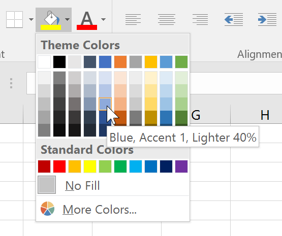

Each one of the 12 theme colors takes one column in the grid, and in the rows of the grid you can see
variations of those colors with different tints.

> [!Note]
> 
> We kind of lied here: If you tried to count the columns in the image, you would
> see that there are 10 columns instead of 12. This is because even when Excel has 12 defined theme colors,
> only 10 of them are visible. The other 2 are the color for a **hyperlink** and a **visited hyperlink**, and
> they don't show in the Excel UI as usable colors.

The selected color you see in the image above is a color of the theme **Accent1**
(all colors in column 4 are of theme **Accent1**). It also has applied
a tint which makes it 40% lighter than the standard **Accent1** color, as shown in the Excel tooltip.

Themes are a nice way to specify colors, since you can change the
theme later, and all colors will change to match. This means that you can go to
the theme selector in the Excel ribbon (in the Page Layout tab) and change what
**Accent1** (and all the other theme colors) mean:

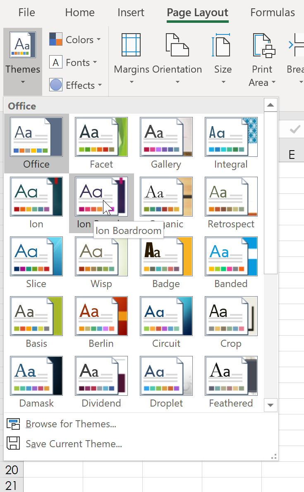

If you select for example the "Ion Boardroom" theme as shown in the image, you will see the
color palette changes to:

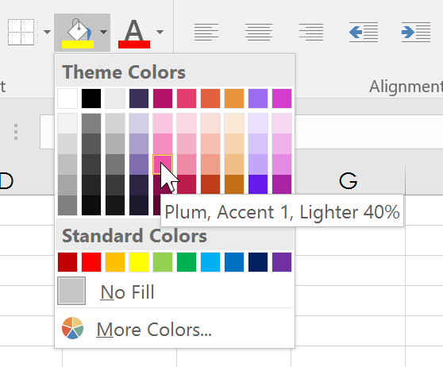

Note how the color **Accent1** is now **Plum** instead of **Blue**.
When you change the theme of your spreadsheet, all cells which had
**Accent1** theme colors will change from blue to plum, while cells which
had a **Blue RGB color** set will continue to be blue.

When setting colors in a file you are creating, it is a nice thing to use theme colors
instead of RGB colors, so your users will be able to change the theme. FlexCel has
full support of theme colors, and you can easily find out how to use them in your code with APIMate.

You can find more information about Excel 2007 colors at

http://tmssoftware.com/site/blog.asp?post=135

### Date Cells

As you might already know, there is no DATE datatype in Excel.

Dates are saved as a double floating number where the integer part is
the number of days that have passed from 1/1/1900, and the fractional
part is the corresponding fraction of the day. For example, the number 2.75
stands for "02/01/1900 06:00:00 p.m." You can see this easily at Excel
by entering a number on a cell and then changing the cell format to a
date, or changing the cell format of a date back to a number.

The good news is that you can set a cell value to a DateTimeValue, and
FlexCel will automatically convert the value to a double, keeping in
count “1904” date settings (see below). That is, if you enter

`XlsFile.SetCellValue(1, 1, Now)`, and the cell (1,1) has date format, you
will write the actual value of "now" to the sheet.

The bad news is that you have no way to know if a cell has a number or a
date just by looking at its value. If you enter a date value into a cell
and then read it back, you will get a double. So you have to look at the
format of the cell. There is a helper function,
FormatValue that can return if the cell has a date or not
by looking at the format.

> [!Important]
> 
> [TExcelFile.GetCellValue](~/api/FlexCel.Core/TExcelFile/GetCellValue.md) will return a [TCellValue](~/api/FlexCel.Core/TCellValue/index.md) record and
> TCellValue has a [ValueType](~/api/FlexCel.Core/TCellValue//ValueType.md) which can be of type [TCellValueType](~/api/FlexCel.Core/TCellValueType.md).DateTime.
> 
> So it might be tempting to write code like this:
> 

<pre class="shiki shiki-themes light-plus dark-plus" style="background-color:#FFFFFF;--shiki-dark-bg:#1E1E1E;color:#000000;--shiki-dark:#D4D4D4" tabindex="0"><code>var
  CellValue: TCellValue;
...
  CellValue := xls.GetCellValue(row, col);

  //This is WRONG. CellValue.IsDateTime is always false
  //when reading values from a sheet.
  //The dates you see in the sheet are just numbers with
  //a date format, so their ValueType is Number.
  if CellValue.IsDateTime then
  begin
    LogMessage(('Cell ' + TCellAddress.Create(row, col).CellRef) + ' contains a Date and Time');
  end;
</code></pre>

Sadly this code won't work. In Excel dates are stored as numbers, so the ValueType FlexCel will
return for a cell with a date will be Number, not DateTime. [TCellValueType](~/api/FlexCel.Core/TCellValueType.md).DateTime exists
only for setting values into FlexCel (so you can write `xls.SetCellValue(row, col, Now)` and FlexCel
can manage to correctly enter the datetime with the 1904 settings of the file).

But [TCellValueType](~/api/FlexCel.Core/TCellValueType.md).DateTime won't help when reading files and trying to figure out if a cell contains
a date. The only way to find out that is by looking at the format of the cell.

This would be the correct way to find out if a cell contains a date:

<pre class="shiki shiki-themes light-plus dark-plus" style="background-color:#FFFFFF;--shiki-dark-bg:#1E1E1E;color:#000000;--shiki-dark:#D4D4D4" tabindex="0"><code>var
  fmt: TFlxFormat;
...
  fmt := xls.GetCellVisibleFormatDef(row, col);
  if TFlxNumberFormat.HasDateOrTime(fmt.Format) then
  begin
    LogMessage(('Cell ' + TCellAddress.Create(row, col).CellRef) + ' contains a Date and Time');
  end;

  if TFlxNumberFormat.HasDate(fmt.Format) then
  begin
    LogMessage(('Cell ' + TCellAddress.Create(row, col).CellRef) + ' contains a Date');
  end;

  if TFlxNumberFormat.HasTime(fmt.Format) then
  begin
    LogMessage(('Cell ' + TCellAddress.Create(row, col).CellRef) + ' contains a Time');
  end;
</code></pre>

Note how the actual value of the cell doesn't matter, only the format of the cell.

> [!Note]
> 
> Excel also has a “**1904**” date mode, where dates begin at 1904 and
> not 1900. This mode was used on **Excel for mac** before OSX: today
> both OSX and Windows use a 1900 date system. But you can change this option
> in Excel for OSX or Windows today too, so you might come across some file
> using the 1904 date system. FlexCel completely supports 1900 and 1904
> dates, but you need to be careful when converting dates to numbers and
> back.
> 
> You can read more information here:
> https://support.microsoft.com/en-us/help/214330/differences-between-the-1900-and-the-1904-date-system-in-excel

> [!Note]
> 
> There is a bug in how Excel handles the 1900 year. It considers it to be a leap year but 1900 was a normal year and February 29 1900
> never happened. This means that the serial number used to represent the date gets one day out of sync with the serial number used
> by Delphi. The serial number 0 will show in Excel
> as "January 0, 1900" (even if there was never a January 0 either)
> 
> 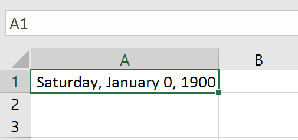
> 
> While in Delphi it will show as **December 30, 1899**
> 
> 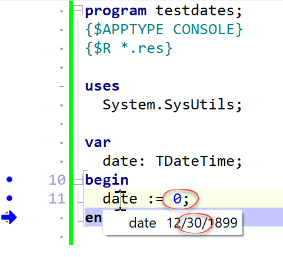
> 
> Note that even if Excel cared to display correctly the 0 as December **31**, 1899 instead of January 0, 1900
> it would still be off by a day with the dates as used in Delphi, which displays December **30**.
> 
> FlexCel will try to do the best to replicate the Excel bug so you get the same values as Excel (ironically, Excel
> has the bug only because it was replicating a bug in Lotus 1-2-3). This means that for example [TFlxDateTime.FromOADate](~/api/FlexCel.Core/TFlxDateTime/FromOADate.md)(0, false)
> will return a TDateTime of January 31, 1899 which is the closest we can get to the value Excel shows. (we can't return a TDateTime with a value of January 0, that is not possible). But whatever we do, the reality is that dates in Excel before March 1, 1900 are wrong. Avoid using them.
> 
> 
> You can read more information on this bug here.
> https://support.microsoft.com/en-us/help/214326/excel-incorrectly-assumes-that-the-year-1900-is-a-leap-year

### Copying and pasting native Excel data

[TExcelFile](~/api/FlexCel.Core/TExcelFile/index.md) has a group of methods that allow you to copy/paste from/to
FlexCel to/from Excel in native Excel format (Biff8). You can copy data
to the clipboard in Biff8, Tabbed Text, and HTML formats. You can paste
from the clipboard in BIFF8 and Tabbed-Text format.

Normally copying in Biff8 is good for pasting the data in Excel, Html is
good if you later want to paste in Word or PowerPoint, and text works
for pasting into applications that don’t understand Biff8 or HTML.

Copying and pasting in native BIFF8 format is a great advance over
copying/pasting on plain text only. It allows you to keep cell
formats/colors/rounding decimals/merged cells/etc. But it has its
limitations too:

-   It can't copy/paste images

-   It can't copy/paste strings longer than 255 characters

-   It can't copy the data on multiple sheets.

We would like to say that these limitations are not FlexCel's fault. The
BIFF8 specification is correctly implemented; those are limitations on
Excel's part.

Of course, Excel can copy and paste everything without problems, but
this is because Excel doesn't use the clipboard to do the operation. If
you close all instances of Excel, open a Worksheet, copy some cells to
the clipboard, close Excel and open it again you will run into the same
limitations. Copy/paste limitations on Excel don't show when it is kept
in memory.

## Reading and Writing Files

The native FlexCel engine is encapsulated on the class [TXlsFile](~/api/FlexCel.XlsAdapter/TXlsFile/index.md).

This class stores an Excel file in memory, and has methods allowing
loading a new file into it, modifying it, or saving its contents to a
file or a stream.

> [!Note]
> 
> [TExcelFile](~/api/FlexCel.Core/TExcelFile/index.md) is the abstract class that provides the interface that [TXlsFile](~/api/FlexCel.XlsAdapter/TXlsFile/index.md) implements.
> In this documentation, we use [TExcelFile](~/api/FlexCel.Core/TExcelFile/index.md) and [TXlsFile](~/api/FlexCel.XlsAdapter/TXlsFile/index.md) interchangeably, because both
> implement the same methods and properties. The first is an abstract class which specifies the functionality, and the second is the actual code.

> [!Important]
> 
> Keep in mind that a TXlsFile object stores a full spreadsheet in memory. **Do not leave global TXlsFile objects hanging around when you don't need them**
> because they can use a lot of memory.
> Free them as soon as you are done using them.

### Starting to use FlexCel

The first thing to do in order to use FlexCel is to add FlexCel to the uses clause. There are 9
units you can use: **FlexCel.VCLSupport**, **FlexCel.FMXSupport**, **FlexCel.SKIASupport**, **FlexCel.LCLSupport**, **FlexCel.Core**,
**FlexCel.XlsAdapter**, **FlexCel.Render**, **FlexCel.Pdf**, and **FlexCel.Report**.

**You always need to use FlexCel.VCLSupport, FlexCel.FMXSupport, FlexCel.SKIASupport or FlexCel.LCLSupport
once in your application**, since that unit will set up FlexCel to be
used in a VCL, FireMonkey, SKIA or Lazarus environment. Most of the code in FlexCel is
platform agnostic, but the bits that do depend on the framework are
isolated in the packages “VCL\_FlexCel\_Core”, “FMX\_FlexCel\_Core” and “SKIA\_FlexCel\_Core”,
which you use by using the corresponding unit.

But note that you need to use FlexCel.VCLSupport, FlexCel.FMXSupport, FlexCel.SKIASupport or FlexCel.LCLSupport just
once, and that might be in the main project unit. those units don't expose any functionality, you just need to add them so they are linked in.

After that, you need to use **FlexCel.Core**. This unit provides the core types used by FlexCel, and is used by all the others.

You will probably also need to use FlexCel.XlsAdapter, since that is the
Xls/x engine that does the actual work. So, at least one unit in a **VCL
app** will have a line like this:

<pre class="shiki shiki-themes light-plus dark-plus" style="background-color:#FFFFFF;--shiki-dark-bg:#1E1E1E;color:#000000;--shiki-dark:#D4D4D4" tabindex="0"><code>uses FlexCel.VCLSupport, FlexCel.Core, FlexCel.XlsAdapter;
</code></pre>

And for a **FireMonkey app** it will have one line like this:

<pre class="shiki shiki-themes light-plus dark-plus" style="background-color:#FFFFFF;--shiki-dark-bg:#1E1E1E;color:#000000;--shiki-dark:#D4D4D4" tabindex="0"><code>uses FlexCel.FMXSupport, FlexCel.Core, FlexCel.XlsAdapter;
</code></pre>

For a **Linux app** you would do:
<pre class="shiki shiki-themes light-plus dark-plus" style="background-color:#FFFFFF;--shiki-dark-bg:#1E1E1E;color:#000000;--shiki-dark:#D4D4D4" tabindex="0"><code>uses FlexCel.SKIASupport, FlexCel.Core, FlexCel.XlsAdapter;
</code></pre>

For a **Lazarus app** you would do:
<pre class="shiki shiki-themes light-plus dark-plus" style="background-color:#FFFFFF;--shiki-dark-bg:#1E1E1E;color:#000000;--shiki-dark:#D4D4D4" tabindex="0"><code>uses FlexCel.LCLSupport, FlexCel.Core, FlexCel.XlsAdapter;
</code></pre>

This is normally in the main App unit. All the other units using FlexCel
will have a line like this:

<pre class="shiki shiki-themes light-plus dark-plus" style="background-color:#FFFFFF;--shiki-dark-bg:#1E1E1E;color:#000000;--shiki-dark:#D4D4D4" tabindex="0"><code>uses FlexCel.Core, FlexCel.XlsAdapter;
</code></pre>

And it will be the same for VCL, FireMonkey or Linux units, allowing you
to reuse the code. As the only platform-specific unit is FlexCel.PlatformSupport, and that unit is only used in the main app, all the code you write will work in all platforms without modifications.

If you are using runtime packages, you will need to redistribute the
corresponding package to each of the 7 units available, including both
**FlexCel\_Core.bpl and FMX\_FlexCel\_Core.bpl** or **FlexCel\_Core.bpl and VCL\_FlexCel\_Core.bpl**
or **FlexCel\_Core.bpl and SKIA\_FlexCel\_Core**
depending if this is a VCL, FM or Linux application.

### Opening and saving files

A simple code to process an Excel file would be:

<pre class="shiki shiki-themes light-plus dark-plus" style="background-color:#FFFFFF;--shiki-dark-bg:#1E1E1E;color:#000000;--shiki-dark:#D4D4D4" tabindex="0"><code>procedure ProcessFile(const sourceFileName: string; const destFileName: string);
var
  xls: TXlsFile;
begin
  xls := TXlsFile.Create(true);
  try
    xls.Open(sourceFileName);
     //... process the file
    xls.Save(destFileName);
  finally
    xls.Free;
  end;
end;
</code></pre>

Here we can note:

1.  By default, FlexCel never overwrites an existing file. So, before
    saving you always have to call File.Delete, or set
    [TExcelFile.AllowOverWritingFiles](~/api/FlexCel.Core/TExcelFile/AllowOverWritingFiles.md) property = true. On this example, we
    set **AllowOverWritingFiles = true** when we construct the object in the line:
    `xls := TXlsFile.Create(true)`.

2.  While you can explicitly specify the file format when saving, normally
    you don’t need to do it. FlexCel is smart enough to know that
    files with extension “xlsx” or “xlsm” must be saved in xlsx file
    format, and that files with extension “xls” must be saved as xls.
    **When saving to a stream, then you need to specify the file format**,
    or it will be xls by default.

### Modifying files

Once you have loaded a document with [TExcelFile.Open](~/api/FlexCel.Core/TExcelFile/Open.md) or created a new
empty file with [TExcelFile.NewFile](~/api/FlexCel.Core/TExcelFile/NewFile.md) you can proceed to modify it. Add
cells, formats, images, insert sheets, delete ranges, merge cells or
copy ranges from one place to another. It is not on the scope of this
document to show each and every thing you can do because there are hundreds of commands and that would take
another book. To learn about specific methods, take a look at the [examples](xref:examples)
and use the **APIMate tool** as described [here in the Getting Started guide](xref:GettingStarted#2-creating-a-more-complex-file-with-code).

### Inserting, Copying and Moving Cells / Rows / Columns and Sheets

While APIMate will cover much of the API, there is a whole category of
commands that can’t be shown there, and that are very important while
manipulating files. Those commands are the ones used to insert/copy/move
cells/sheets, etc. One of FlexCel strongest points is the big support
offered for all those operations. Since those methods are used
everywhere in FlexCel Reporting engine, they are at the core of the
engine, not added as an afterthought. They perform very well, and
they are deeply tested.

Now, something that might be non-intuitive if you are not aware
of it, is that FlexCel provides that functionality in a few very
powerful and overloaded methods, instead of a million standalone
methods. That is, instead of having “InsertRow” “InsertColumns”,
“InsertCells” “CopyColumns”, “CopyCells” “CopyRows”,
“InsertAndCopyRows” “InsertAndCopyColumns”, etc., FlexCel just provides a single
“[InsertAndCopyRange](~/api/FlexCel.Core/TExcelFile//InsertAndCopyRange.md)” method that does all of this and more (like copying
rows from one file and inserting them into another)

The reason we kept it this way (few powerful methods instead of many
specialized and simpler methods) is that fewer methods are easier to
remember. From the editor, you just need to remember to start typing
“InsertAnd…” and intellisense will show most options. No need to guess
if the method to add a new sheet was named “AddSheet” or “InsertSheet”.

Naming probably isn’t the best either, this is for historical reasons
(because original implementations did only insert and copy, and then, as
we added more functionality it was added to those methods), but also
because a better naming isn’t easy either. Calling a method
InsertAndOrCopyCellsOrColumnsOrRanges() isn’t much better. So just
remember that whatever you want to do, you can probably do it with one
of the following methods:

-   **InsertAndCopyRange**: Probably the most important of the
    manipulating methods. Inserts or copies or inserts and copies a
    range of cells or rows or columns from one sheet to the same sheet,
    or to a different sheet, or to a different file. It works exactly as
    Excel does, if you copy a formula “=A1” down to row 2, it will
    change to be “=A2”. Images and objects might or might not be copied
    too depending in the parameters to this method.

-   **MoveRange**: Moves a range of cells, or a column or a row inside a
    sheet.

-   **DeleteRange**: Deletes a range of cells, a row or a column in a
    sheet, moving the other cells left or up as needed. If InsertMode is
    NoneDown or NoneRight, cells will be cleared, but other cells won’t
    move.

-   **InsertAndCopySheets**: Inserts and or copies a sheet. Use this
    method to add a new empty sheet.

-   **DeleteSheet**: Deletes a number of sheets from the file.

-   **ClearSheet**: Clears all content in a sheet, but leaves it in
    place.

> [!Note]
> 
> InsertAndCopy operations could be theoretically implemented as
> “Insert” then “Copy”, but that would be much slower. In many cases
> we want to insert and copy at the same time, and doing it all at
> once is much faster. Also in some border cases where the inserted
> cells are inside the range of the copied cells, inserting and then
> copying can give the wrong results.

## Considerations about Excel 2007 support

FlexCel 5.0 introduced support for Excel 2007 file format (xlsx),
and also for the new features in it, like 1 million rows or true color.

While most changes are under the hood, and we made our best effort to
keep the API unchanged, some little things did change and could bring
issues when updating:

- **The number of rows by default in FlexCel is now 1048576, and the
  number of columns is 16384**. This can have some subtle effects:

  - **Named ranges that were valid before might become invalid**. For
    example, the name **LAB1** would be a valid cell reference in 2007
    mode, (Just like **A1**). In Excel 2003 you can have up to column
    “IV”, but in Excel 2007 you can have up to column “XFD”, so almost
    any combination of 3 characters and a number is going to be a valid
    cell reference, and thus can’t be a name. If you have issues with
    this and can’t change the names, you will have to use the
    “Compatibility mode” by setting the static variable:

    [TExcelFile.ExcelVersion](~/api/FlexCel.Core/TExcelFile/ExcelVersion.md)

  - **“Full Ranges” might become partial**. Full ranges have the
    property that they don’t shrink when you delete rows. That is, if
    for example you set the print area to be A1:C65536 in Excel 2003, and
    you delete or insert rows the range will stay the same. If you open
    this file with FlexCel 5 or Excel 2007, and delete the row 1, the
    range will shrink to A1:C65535, as it is not full anymore. To
    prevent this, FlexCel automatically converts ranges that go to the
    last row or column in an xls file to go to the last row or column in
    an xlsx file. If you don’t want FlexCel to autoexpand the ranges,
    you can change this setting with the static variable:

    [TExcelFile.KeepMaxRowsAndColumnsWhenUpdating](~/api/FlexCel.Core/TExcelFile/KeepMaxRowsAndColumnsWhenUpdating.md)

    Also, when using XlsFile, use references like “=Sum(a:b)” to sum in a
    column instead of “=Sum(a1:b65536)”

  - **Conditional Formats might become invalid.** This is a limitation
    on how Conditional Formats are stored in an xls file. They are
    stored as a complement-2 of 2 bytes for the rows and one byte for
    the column. For example, if you have a formula in a conditional
    format that references the cell in the row above, this will be
    stored as “0xFFFF”, which is the same s “-1” if you are using signed
    math.

    And as you have exactly 2 bytes of rows and 1 byte of columns they are
    also the same. It is the same to add 65535 rows (wrapping) or to
    subtract one, you will always arrive to the cell above. Now, with more
    columns and rows this is not true anymore. And you can’t know by
    reading a file if the value was supposed to mean “-1” or “+65535”. So
    both Excel and FlexCel might interpret a CF formula wrong when the
    cells are separated by too many rows or columns.

    Again the solution if you have this issue is to turn
    [TExcelFile.ExcelVersion](~/api/FlexCel.Core/TExcelFile/ExcelVersion.md) back to 2003.

- **Colors are now true color, not indexed**.

  - In order to support true color, we needed to change all
    “**Object.ColorIndex**” properties to “**Object.Color**”, so old FlexCel code
    won’t compile right away. You need to do a search and replace for
    “ColorIndex” properties. See the section about colors in this
    document for more information about colors and themes.

  - If you relied on changing the palette to change cell colors, this
    code might break. Before, you had only indexed colors, so if you
    changed the palette color 3 from red to blue, all red cells would
    turn blue. Now, **the color will only change if the cell has indexed
    color**. You might have a cell with the exact same red but with the
    color specified as RGB, and this won’t change when you change the
    palette. It is recommended that you use themes now in situations like
    this.

-   **Default File Format for Saving**: In FlexCel 3 finding the default
    file format for saving was simple; it saved everything xls. Now, it isn’t so
    simple. By default, if you do a simple xls.Save(filename) without
    specifying a file format we will use the file extension to determine
    it. When it is not possible (for example if you are saving to a
    stream) we will use the format the file was originally in when you
    loaded it. If you prefer to change the default, you can change the
    static property

    [TExcelFile.DefaultFileFormat](~/api/FlexCel.Core/TExcelFile/DefaultFileFormat.md)

-   **Headers and footer changes:** Now headers and footers can be set
    differently for odd and even pages, or for the first page. While the
    properties [PageHeader](~/api/FlexCel.Core/TExcelFile//PageHeader.md) and [PageFooter](~/api/FlexCel.Core/TExcelFile//PageFooter.md) still exist in XlsFile, you are
    advised to use [GetPageHeaderAndFooter](~/api/FlexCel.Core/TExcelFile//GetPageHeaderAndFooter.md) and [SetPageHeaderAndFooter](~/api/FlexCel.Core/TExcelFile//SetPageHeaderAndFooter.md)
    instead for better control. Also the method to change the images in
    the headers and footers changed to accept these different
    possibilities. Look at APIMate to see how to use these new methods.

## Autofitting Rows and Columns

FlexCel offers support for “autofitting” a row or a column, so it
expands or shrinks depending on the data on the cells.

But **autofitting is not done automatically,** and we have good reasons
for it to be this way.

To explain this better, let's try a simple example:

1. Imagine that we create a new Excel File, write “Hello world” on cell
A1, and go to “Format-&gt;Column-&gt;AutoFit Selection”. We will get
something like this:

   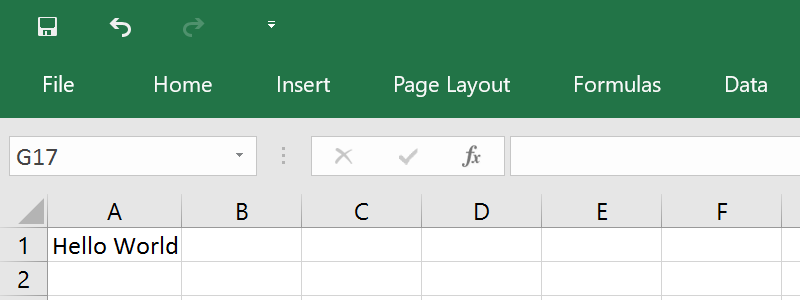

2. As you see, column “A” was resized so “Hello World” fits inside.
Easy, isn't it? Well, not as much as we would like it to be. Let's now
change the zoom to 50%:

   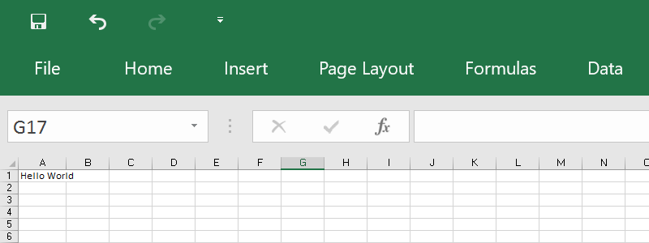

3. Now the text “Hello world” is using part of column “B”. We didn't
change anything except the zoom and now text does not fit anymore, in
fact, you can autofit it again and column “A” will get bigger.

What happened here? The easy answer is that Excel is resolution
dependent. Fonts scale in “steps”, and they look different at different
resolutions. What is worse, printing also changes depending on the
printer, and as a thumb rule, it is not similar at what you see on the
screen.

So, what should a FlexCel autofit do? Make column A the width needed to
show “Hello world” at 100% zoom, 96 dpi screen resolution? Resize column
A so “Hello world” shows fine when printing? On a dot matrix printer? On
a laser printer? Any answer we choose will lead us to a different column
width, and there is no “correct” answer.

And it gets better. FlexCel uses GDI+, not GDI for rendering and
calculating metrics, and GDI+ is resolution independent. But GDI and
GDI+ font metrics are different: for example the space between letters
on GDI+ for a font might be less than the space GDI gives to them. You
will need less column width to fit “Hello world” on GDI+ than in GDI for
that font, so the width calculated by FlexCel(GDI+) will be less than
the width calculated by Excel(GDI).

As you can imagine, if we used all this space to describe the problem,
is because there is not a real solution. Autofit on FlexCel will try to
adapt row heights and column widths so the text prints fine from Excel
on a 600 dpi laser printer, but text might not fit exactly on the
screen. Autofit methods on FlexCel also provide an “Adjustment”
parameter that you can use to make a bigger fit. For example, using 1.1
as adjustment, most text will display inside the cells in Excel at
normal screen resolution, but when printing you might find whitespace at
the border, since columns or rows are bigger than what they need to be.

Of course, autofit on FlexCel will work fine when printing from FlexCel,
since FlexCel is resolution independent and it should always be the
same. The problem arises when opening the files in Excel.

And this was the reason we do not automatically autofit rows (as Excel
does). Because of the mentioned differences between GDI+ and GDI (and
also between GDI at different resolutions), we cannot calculate exactly
what Excel would calculate. If we calculated the row height must be
“149” and Excel calculated “155”, as all rows are by default autoheight,
just opening an Excel file on FlexCel would change all row heights, and
probably move page breaks. Due to the error accumulation, maybe in
FlexCel you can enter one more row per page, and the header of the new
page could land at the bottom of the previous.

The lesson, do the autofit yourself when you need to and on the rows
that really need autofit(most don't). If you are using XlsFile, you have
**XlsFile.Autofit**... methods that you can use for that. If you are
using FlexCelReport, use the **&lt;\#Row Height(Autofit)&gt;** and
**&lt;\#Column Width(Autofit)&gt;** tags to autofit the rows or columns
you want.

By default, Excel autofits all rows. So, when opening the file in Excel,
it will recalculate row heights and show them fine. But when printing
from FlexCel, make sure you autofit the rows you need, since FlexCel
will not automatically do that.

### Autofitting Merged Cells

Merged cells can be difficult to autofit, for two basic reasons:

1. If you are autofitting a row, and a merged cell spans over more than
   one row, which row should be expanded to autofit the cell? Imagine
   we have the following:

   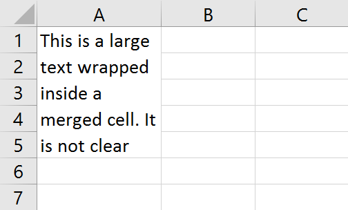

   We could make the text fit by enlarging for example row 1, or row 5:

   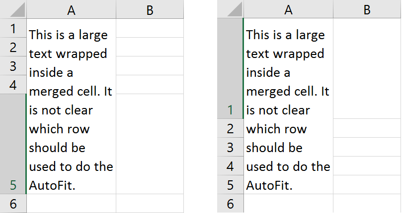

   We could also enlarge all rows by the same amount instead of changing
   only one row.

   FlexCel by default will use the last row of the merged cell to
   autofit, since in our experience this is what you will normally need.
   But you can change this behavior by changing the parameter
   “**autofitMerged**” when you call the “Autofit” methods, or, if you
   are using reports, you can use the &lt;\#Autofit settings&gt; tag to
   do so.

2. The second issue is that probably because of issue 1, Excel will
   never autofit merged cells. Even in cases where there would be no
   problem doing so, for example you are autofitting a row and the
   merged cell has only one row (but 2 columns). In all of those cases,
   Excel will just make the row the standard height. So, if you apply
   FlexCel autofitting but leave the autofit on, when you open the file
   in Excel, Excel will try to re-autofit the merged cell, and you will
   end up with a single-size row always. So, when autofitting rows with
   merged cells in FlexCel **make sure you set autofitting off for
   Excel.** You don’t need to do this for columns, since they don’t
   autofit automatically in Excel.

> [!Note]
> 
> All the above was done in rows for simplicity,
> but it applies the same to columns and merged cells over more than one column.

## Preparing for Printing

After creating a spreadsheet, one thing that can be problematic is to
make it look good when printing or exporting to PDF.

### Making the sheet fit in one page of width

This is probably the first thing you should do when preparing most
documents for printing. Go to the “Page Layout” tab in the ribbon, and
look at the “Width” and “Height” boxes

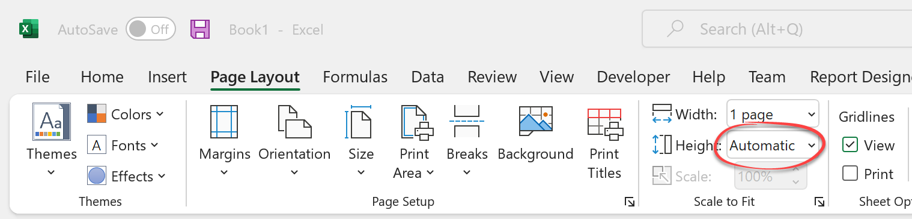

Make the “Height” box “Automatic, to allow your document have as many
pages as it needs. You can do this directly in Excel when using
Templates to create your documents, or you can do this in FlexCel API by
setting [TExcelFile.PrintToFit](~/api/FlexCel.Core/TExcelFile/PrintToFit.md) = true,  [TExcelFile.PrintNumberOfHorizontalPages](~/api/FlexCel.Core/TExcelFile/PrintNumberOfHorizontalPages.md)
= 1, and  [TExcelFile.PrintNumberOfVerticalPages](~/api/FlexCel.Core/TExcelFile/PrintNumberOfVerticalPages.md) = 0.

### Repeating Rows and Columns at the top

Another useful thing you can do is press the “Print Titles” button to
access the “Page Setup” dialog. There you can set up some rows and
columns to be repeated on every page.

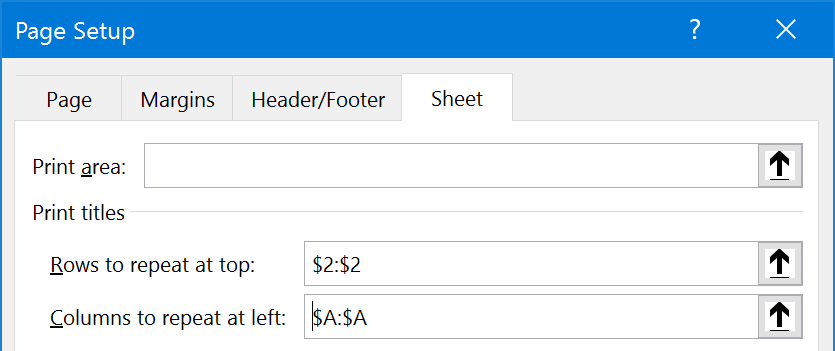

This way your tables can keep their headers in every page. By the way,
while you are in the “Sheet” tab, you might want to look at the option
to print the gridlines or the column and row headings (The “A”, “B”,
etc. at the top and “1”, “2”, etc. numbers at the left of the sheet)

You can do this directly in Excel when using Templates to create your
documents, or you can do this in FlexCel API by writing something like this:

<pre class="shiki shiki-themes light-plus dark-plus" style="background-color:#FFFFFF;--shiki-dark-bg:#1E1E1E;color:#000000;--shiki-dark:#D4D4D4" tabindex="0"><code>  xls.SetNamedRange(TXlsNamedRange.Create(TXlsNamedRange.GetInternalName(TInternalNameRange.Print_Titles), SheetIndex, 0, '=1:2,A:B'));
</code></pre>

to set up the rows and columns to repeat, or set [TExcelFile.PrintGridLines](~/api/FlexCel.Core/TExcelFile/PrintGridLines.md) = true
and [TExcelFile.PrintHeadings](~/api/FlexCel.Core/TExcelFile/PrintHeadings.md) = true to set up printing of gridlines
and headings.

### Using Page Headers/Footers

Besides repeating rows and columns, you can also add headers and footers
from the page setup dialog. One interesting feature in Excel XP or newer
is the ability to include images in the page headers or footers. As
those images can be transparent, you can have a lot of creative ways to
repeat information on every sheet.

From FlexCel API, use the [TExcelFile.PageHeader](~/api/FlexCel.Core/TExcelFile/PageHeader.md) and [TExcelFile.PageFooter](~/api/FlexCel.Core/TExcelFile/PageFooter.md) properties
to set the header and footer text. If using a template, you can just set
those things in the template.

### Cell indentation

#### The problem

Cell indentation in Excel doesn't work the way most of us would expect it, and in this section we will cover what is wrong and how we tried to fix it.

To understand the problem, let's create a new blank document in Excel, and write the word "HELLO" in cells A1 and A2:

Now, let's give the cell A2 an indentation of 3. You can do this by clicking the indent button in the ribbon 3 times:

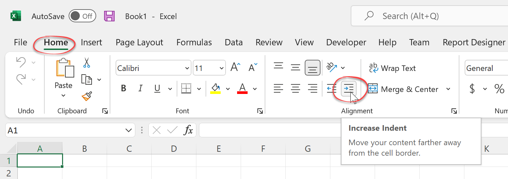

Or by right-clicking the cell, selecting "Format Cells..." and in the "Alignment" tab setting the indent to 3:

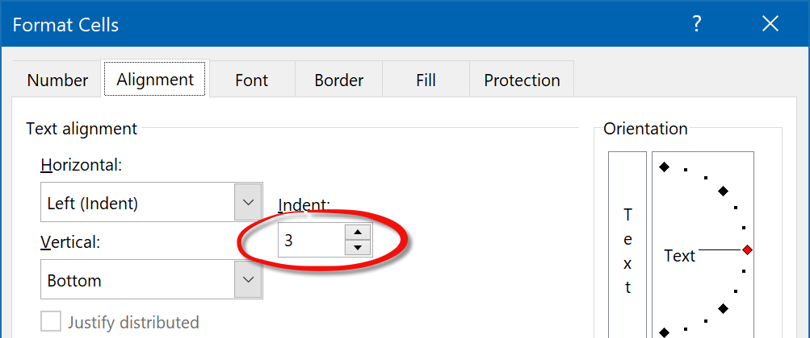

No matter how you did it, now the file should look like this:

Now let's try to do a print preview. Go to File->Print and it should look like this:

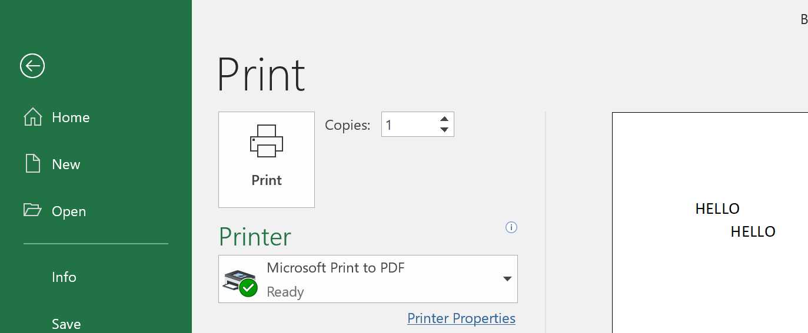

As you can see, the image looks similar (if not exactly the same) to what was shown on the screen, with the "H" in cell A2 roughly below the "O" in cell A1. We are used to small differences between what you see and what is printed, so up to now, everything is fine.

But now, let's change the **Print Scale** to 50%. Go to the page setup dialog, and change the print scale:

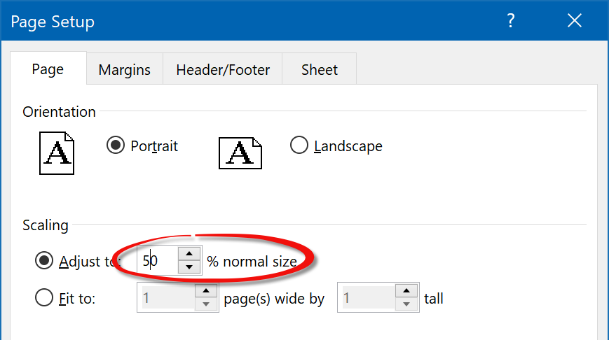

And now we get:

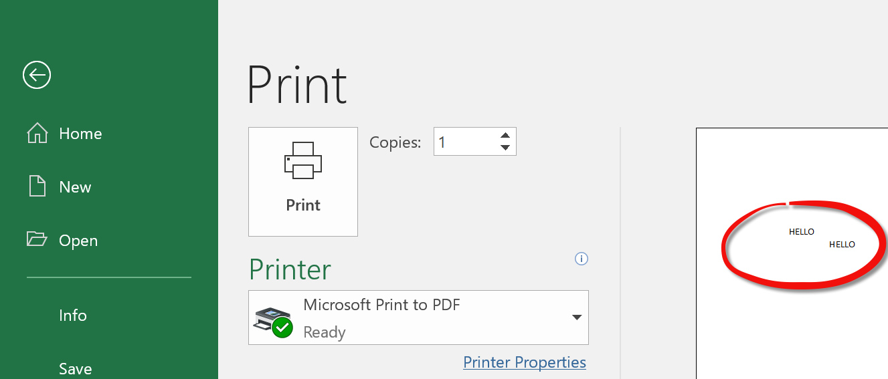

Now, the "H" in cell A2 is way more to the right from the "O" in A1 than before. What happened? We just changed the print scaling, and the layout of the document changed. This is not how we generally expect scaling to work. Going a little more in depth, what happened was that Excel reduced all element sizes, fonts, etc. by 50%, but left the indentation the same. We can see it more clear if we superimpose the 50% and 100% print preview images and zoom in:

The **absolute** value of the indentation remained the same, and didn't reduce by 50% like everything else. This causes the layout to break.

> [!Note]
> 
> When "Print Headings" is selected:
> 
> 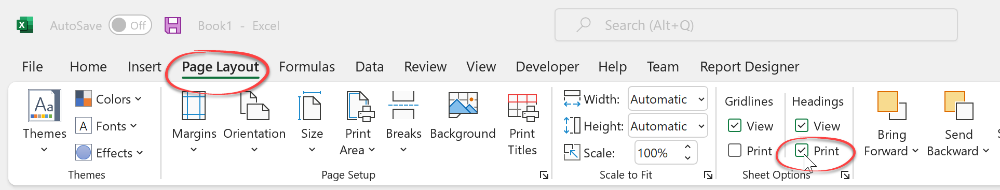
> 
> Then Excel behaves differently and it scales the indentation proportional to the print scale:
> 
> 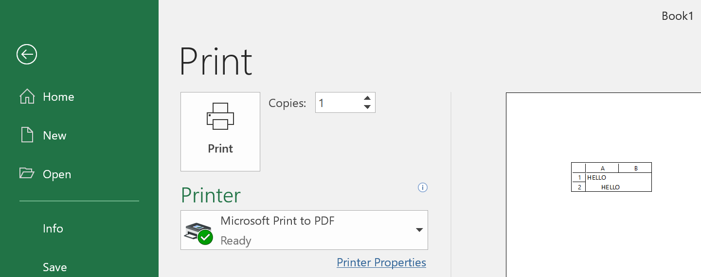
> 
> But printing with "print headings" on isn't common, so for most cases, we can say that the indentation doesn't scale with the print scale.

#### The solution

Up to version 6.23, FlexCel copied the Excel behavior and didn't scale the cell indentation together with the rest of page elements (it wasn't the exact Excel behavior as FlexCel didn't scale either even if **print page headings** was selected, but printing with page headings is rare).

This original FlexCel behavior matched Excel (and FlexCel has always been about matching Excel even with Excel bugs), but it caused a lot of issues. The most evident one, of course, was that the layout would break when changing the page scaling, and text that was aligned at 100% scaling would become unaligned at 75%. 

But there were more subtle issues too: For example FlexCel autofitting runs at 100% scaling (because you can't know at autofitting time which will be the final page scaling). So if you autofitted a column in a page designed to be printed at 75% scaling, it might happen that the exported pdf file couldn't fit the text anymore and had to be printed in 2 lines.
Because the autofit was done at 100% and the exporting at 75%, and the indentation is not proportional to the scale like everything else, the free space in the cell is smaller at 75%.

So starting with FlexCel 6.24, we introduced a new Property named [TExcelFile.CellIndentationRendering](~/api/FlexCel.Core/TExcelFile/CellIndentationRendering.md) which you can now use to tell FlexCel how to deal with cell indentation and scaling. It offers 3 options:

 * The new default behavior: Always scale indentation with page scale.
 * The old FlexCel behavior: Never scale indentation with page scale.
 * The Excel behavior: Scale indentation only if printing headings, don't scale otherwise.

> [!Important]
> 
> This is a **breaking change** in FlexCel 6.24, in that it might break "pixel-perfect" layouts of files with small zoom and cell indentations. It isn't likely to affect you because the new indentations are smaller at smaller zooms, and so more text will fit than before. But if you want to revert to the old behavior, just change [TExcelFile.CellIndentationRendering](~/api/FlexCel.Core/TExcelFile/CellIndentationRendering.md)

#### Conclusion

What we can get from this section is: If you can control the files you are creating, **try to avoid using cell indentation in Excel**. Cell indentation in Excel is simply broken, and we can fix it on our side, but we can't fix Excel. 

Cell indentation also doesn't work all all with Google docs (at the time of this writing), and in Libre/OpenOffice it scales with the print scaling. So using cell indentation will also reduce the portability of your files to other Spreadsheet apps.

If you can't avoid cell indentation, review which value of [TExcelFile.CellIndentationRendering](~/api/FlexCel.Core/TExcelFile/CellIndentationRendering.md) is better for you.

### Intelligent Page Breaks

Excel offers the ability to include page breaks, but it has no support
for any kind of “smart” page breaks that will only break if there is a
need for it.

Let's look at an example:

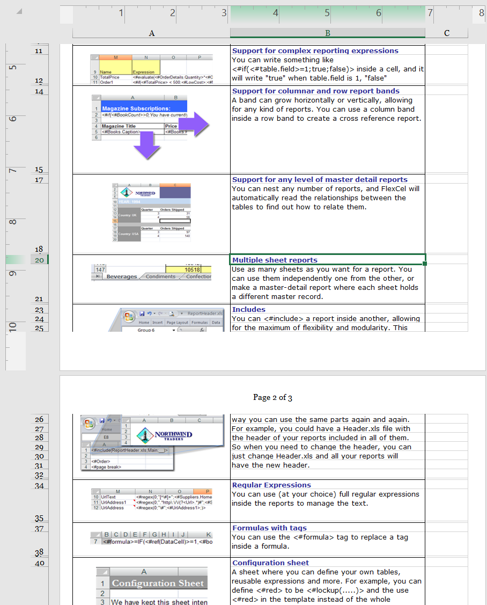

Here, the image in page 1 is being cut in the middle by a page break, so
part of it appears on page 1 and part on page 2. While this is no
problem when looking at the spreadsheet in Excel, it is clearly not what
we want when printing or exporting to PDF. We want to place a page break
before that image, so it prints completely in page 2. However, we don't want
to put a break before every image, since we can print many in page 2.
We need page breaks that only apply when the image does not fit in the
current page.

FlexCel offers a way to deal with this. In short, you need to say which
rows or columns you would like to keep together by calling
[TExcelFile.KeepRowsTogether](~/api/FlexCel.Core/TExcelFile/KeepRowsTogether.md) or [TExcelFile.KeepColsTogether](~/api/FlexCel.Core/TExcelFile/KeepColsTogether.md), and once
you have finished creating your file, call [TExcelFile.AutoPageBreaks](~/api/FlexCel.Core/TExcelFile/AutoPageBreaks.md) to
paginate your whole document and create page breaks in a way your rows
and columns are kept together as much as possible.

> [!Note]
> 
> The call to [AutoPageBreaks](~/api/FlexCel.Core/TExcelFile//AutoPageBreaks.md) must be the last before saving your
> file, so the document is in its final state. If you insert rows or
> autofit things after calling AutoPageBreaks then the page breaks will be
> moved out of place. Remember that this is not an Excel feature, so it is
> simulated by dumb page breaks in Excel, and once set, those page breaks
> will remain at where they were.

#### The Widow / Orphan problem

When paginating a document there are actually two similar but different
things: **widow** and **orphan** lines. In the example above we saw orphan lines,
that is, rows that have their “parents” in the previous sheet. But there
are also widow lines, and those are rows that are alone in a sheet
because the lines below are in a different group, as shown in the
following image:

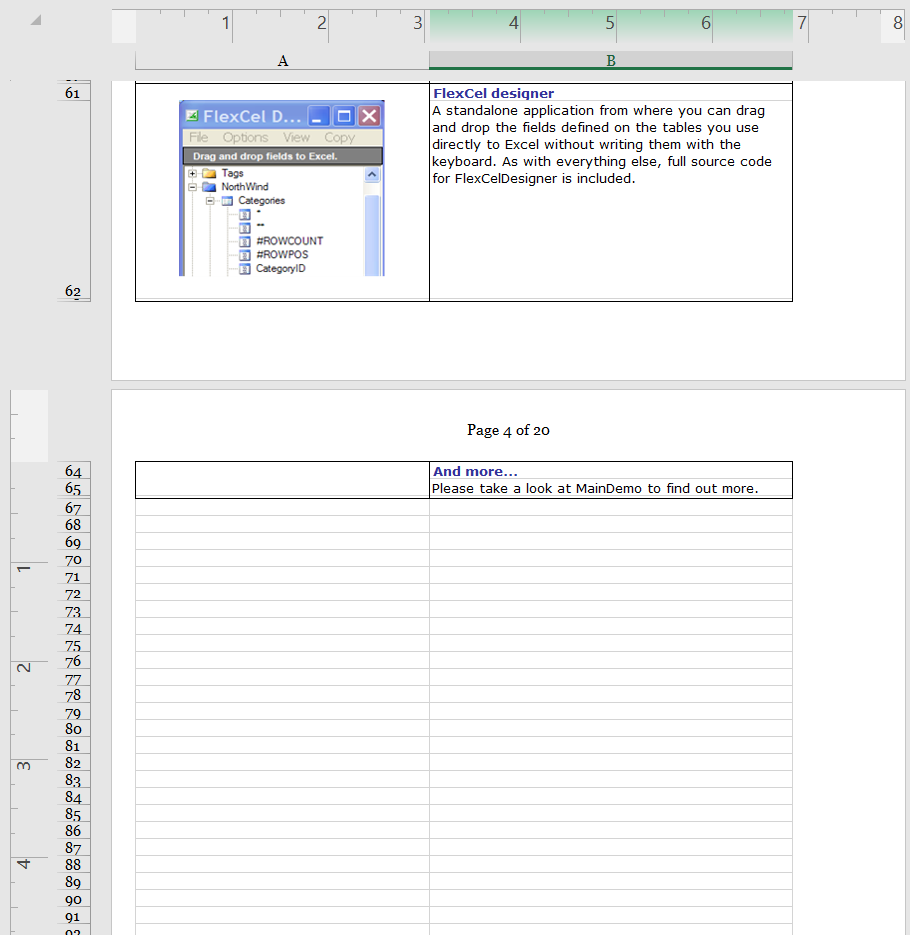

In this example, sheet 4 is almost empty,
because there are only two lines from the current group on it, and the
next group starts at the next page.

When there is so little written on one page, you will normally want to
start the next group on the same page instead of having an empty sheet.

And you can control this in FlexCel with the “PercentOfUsedSheet”
parameter when you call [AutoPageBreaks](~/api/FlexCel.Core/TExcelFile//AutoPageBreaks.md). **PercentOfUsedSheet** defaults
at 20, which means that in order to add a page break, the page must be
filled in at least 20%.

In the example above, no page break would be made on page 4, since
the 20% of the sheet has not been used yet, and so the next group would
start on page 4 too. If you set the PercentOfUsedSheet parameter to 0%
there will be no widow control, and the next group will start on page 5
no matter if page 4 has one single line.

Setting PercentOfUsedSheet at 100% means no widow or orphan control at all, since in
order to set a page break the 100% of the page must have been used, so
FlexCel has no margin to add the page breaks. It will not be able to set
the page break somewhere before the 100% of the page, so all page breaks
will be set at the last row, and it will not be able to keep any rows
together. You are advised to keep the PercentOfUsedSheet parameter around 20%

#### The different printers problem

As explained in the [Autofitting Rows and
Columns](#autofitting-rows-and-columns) section, Excel prints different things to different printers,
and even with the same paper size, some printers have different printing
sizes. Printers can have "hard margins" which are places of the sheet where they can't physically print
(for example because that part of the sheet is what the printer uses to grab the paper) and this can
reduce the effective printing size of the page.

This can be problematic, since a document calculated to have
breaks every 30 cm, will have a lot of widow lines if printed in a page
with an effective 29.5 cm printing area:

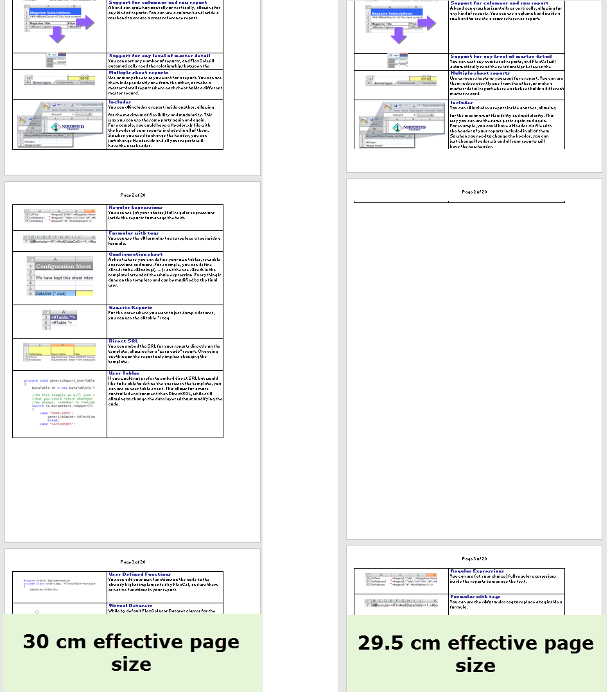

As you can see in the images above, reducing a little the page height
might cause the last row not to enter on that page and be printed in the
next. As FlexCel added an automatic page break after that row (so it
would break correctly with the 30 cm it used for the calculation), you
end up with an empty page with only one row.

To solve this issue, the second parameter to AutoPageBreaks is the
percentage of the page that will be used by FlexCel to calculate the
page breaks. It defaults at 95%, which means that it will consider a
page 30 cm tall to be 30\*0.95 = 28.5 cm, and calculate the page breaks
for that sheet. So it will print correctly in a 29.5 cm sheet.

When calculating the page breaks to directly export to PDF you can keep
this parameter at 100%, since FlexCel is resolution independent, and it
will not have this issues. But when calculating the page breaks to print
from Excel, you need to have a smaller value here so it can fit in all
the printers where you might print this sheet. Normally if targeting only
laser printers you can have a larger value like 99%, but when other kinds
of printers can be used it might be wise to lower this value.

#### Using different levels of “Keep together”

Normally just marking the rows you want to keep together and then
calling [AutoPageBreaks](~/api/FlexCel.Core/TExcelFile//AutoPageBreaks.md) should be enough for most cases. But sometimes
you might have more than one “keep together” level to keep, and you can
set this as one of the parameters in KeepRows/ColsTogether.

Imagine you have a master-detail report with a list of stores, then the
customers of each store and the orders for each customer. You might want
to keep all customers of a store together on one page, but if that is
not possible, at least keep the orders together. You can do this by
assigning a level of “2” to the orders, and a level of “1” to the
customers. The actual numbers don't matter, you could use a level of
“10” for orders and “5” for customers. The only important thing is that
one level is bigger than the other.

When you assign different levels to different rows, FlexCel will try to
keep lower levels first, but if not possible, it will try to fit at
least the higher ones.

#### Inserting and copying Rows with a “keep together” level

Inserting and copying rows works as expected, when you copy a group of
rows with a level of 2 and insert them in another place, the “2” level
will be copied. It also works when copying across different files, but
you need to copy **full rows** in any case. When copying ranges that are
not the complete rows, those values will not be copied, as expected.

#### Debugging Intelligent Page Breaks

Intelligent page breaks are a tested technology: They work well and we aren't aware of bugs on its implementation. But sometimes, they might produce results that look wrong at first sight. And when they aren't working as you expect them to, it helps to understand a little more in depth what is going on under the hood.

> [!Note]
> 
> For simplicity in this section we are going to speak always about row breaks, but the column breaks work in a similar fashion.

The first thing to notice is that intelligent page breaks work by marking the rows (or columns) to be kept together with a level. So let's imagine we have this file: A master-detail report with the best selling albums in each decade and some of their songs:

We want to keep together every decade on its own page, or if not possible, at least keep together every full album. For this we can define the following keep together ranges:
 1. Rows 1 to 15, level 1 
 2. Rows 16 to 22, level 1
 3. Rows 2 to 8, level 2
 4. Rows 9 to 15, level 2
 5. Rows 17 to 22, level 2

Or with code:

<pre class="shiki shiki-themes light-plus dark-plus" style="background-color:#FFFFFF;--shiki-dark-bg:#1E1E1E;color:#000000;--shiki-dark:#D4D4D4" tabindex="0"><code>  xls.KeepRowsTogether(1, 15, 1, false);
  xls.KeepRowsTogether(16, 22, 1, false);
  xls.KeepRowsTogether(2, 8, 2, false);
  xls.KeepRowsTogether(9, 15, 2, false);
  xls.KeepRowsTogether(17, 22, 2, false);
</code></pre>

> [!Tip]
> 
> Of course the code above is not how you will set the intelligent page breaks in normal use. In real code you will be using some kind of loop, or inserting and copying rows, or setting keep together ranges in reports. But the effect once that is done is similar to manually calling [TExcelFile.KeepRowsTogether](~/api/FlexCel.Core/TExcelFile/KeepRowsTogether.md) with the values above.

To better understand what is happening, let's see now how FlexCel translates those [TExcelFile.KeepRowsTogether](~/api/FlexCel.Core/TExcelFile/KeepRowsTogether.md) commands into its data model. Conceptually it is simple: When you call [TExcelFile.KeepRowsTogether](~/api/FlexCel.Core/TExcelFile/KeepRowsTogether.md) for rows 1 to 15 to be level 1 (as in the first line of the example above), FlexCel will mark rows **1 to 14** to be level 1. There was no typo in the previous line: Marking rows 1 to 15 to be level 1 makes FlexCel mark rows 1 to 14 to be level 1. If we add a small column to visualize the marked rows after marking rows 1 to 15, the file should look like this:

So why is FlexCel marking one less row than what you marked? This should become clear when we call the second KeepTogether line to keep rows 16 to 22. After that call, the file will look like this:

Note how there is a 0 at row 15. If the first call to KeepRowsTogether had marked rows 1 to 15 instead of 14, then row 15 would also have a 1 there. And the full rows 1 to 22 would be marked as level 1, the same as if we had just caller KeepRowsTogether from row 1 to 22. But we didn't make a single call from rows 1 to 22. We marked rows 1 to 15 and 16 to 22. We want FlexCel to know that it can break the page at row 15 if it needs to. When running the actual page break algorithm, FlexCel will take into account that missing row, and still know that row 15 belongs together with row 14 even if internally row 15 is marked with level 0.

**Marking one less row than the rows you mark allows you to mark 2 consecutive ranges like 1:5 and 5:10 and have them still be separated ranges instead of becoming a single 1:10 range** 
> [!Important]
> 
> You might be wondering why we spent so much time explaining an implementation detail like how FlexCel maps your calls to KeepRowsTogether to its internal data model. After all, it shouldn't really matter how FlexCel internally models your commands. And in most cases, it won't actually matter. 
> 
> But this section is about debugging page breaks, and you will need to debug them when something went wrong. There are 2 reasons why it helps to understand the internal representation FlexCel does from your commands:
> 
> 1. The fact that when you mark rows 1 to 2 only row 1 is marked is the **most common** cause of discrepancies between what you think FlexCel should do and what FlexCel actually does. In most cases, it will work just as you expect it to work and you don't need to think in the internals. Just mark the block you want to keep together and know they will be kept together. But if it is not working as it should, then it likely is caused by this. 
> 
> 2. As we will see shortly, when debugging reports you will be able to see this internal FlexCel representation, so you will need to understand how it is implemented.

Ok, now let's run the full code and add the lines that call KeepRowsTogether with level 2. This is how the file will end up marked:

When FlexCel runs the intelligent page breaks in this page it will:
1. Try to fit all level 1+ rows on one page, adding an extra row because the rows marked are one less. So, the first block of levels >=1 go from 1 to 14. Adding the extra row, FlexCel will try to fit the block **1 to 15** in a single page.
2. If it can't fit rows 1 to 15 in a single page, it will try with level 2+. The first block of level 2+ goes from rows 2 to 7. So it will try to fit the rows **1 to 8** in a single page. And so on.

After diving in the technical details, we can see it is doing what we told it to do. It first tries to fit rows 1 to 15 (the first KeepRowsTogether call), then 2 to 8 (the third KeepRowsTogether call) and then the others.

Now, wouldn't it be nice to be able to directly see FlexCel's internal representation for those cases where the page breaks aren't working as they should? Without having to do it manually as we did here?

The good news is that yes, it is possible. FlexCel has commands for both the API and reports that let you see the levels that FlexCel sees. **To understand those levels, you just need to remember that the last line of each keep together block isn't marked, but considered anyway to belong to the group**.

When using the API, FlexCel has 2 commands: [TExcelFile.DumpKeepRowsTogetherLevels](~/api/FlexCel.Core/TExcelFile/DumpKeepRowsTogetherLevels.md) and [TExcelFile.DumpKeepColsTogetherLevels](~/api/FlexCel.Core/TExcelFile/DumpKeepColsTogetherLevels.md). The first one will write all row levels in the column you specify, and the second will do the same for columns. Looking at the actual numbers should help understanding how FlexCel sees your blocks.

When using reports you have two ways to enter intelligent page breaks debug mode, similar to [Report Debug mode and Errors in result file modes](xref:ReportsDesignerGuide#debugging-reports):
1. You can set [TFlexCelReport.DebugIntelligentPageBreaks](~/api/FlexCel.Report/TFlexCelReport/DebugIntelligentPageBreaks.md) to true in the code.
2. You can write a tag &lt;\#Debug Intelligent Page Breaks&gt; anywhere in the Expressions
column of the config sheet.

As with the debug mode and Errors in Result File mode, the second way to enter Debug Intelligent Page Breaks mode is better when you are
editing a template and want to do a debug without modifying the code,
while the first way is better if you are automating testing and do not
want to modify the templates.

> [!Note]
> 
> When inserting and deleting rows, FlexCel doesn't just insert or delete them, but adapts the levels so they still behave as you would expect. This can cause issues understanding why a row ended up with a level. For example, if in our last screenshot we removed row 8, a naive implementation would just remove that row, and the group that ends at row 8 (Eagles) would be joined with the group that starts at row 9 (Pink Floyd). But when you remove that row, FlexCel is smart enough to make row 7 level 1, so the file still behaves as it should and you still have one group for the Eagles and one for Pink Floyd. The fact that you removed a song from the Eagles group is no reason for it to become one big group with Pink Floyd.
> 
> While FlexCel always tries to do "the right thing", sometimes the right thing might not be what you expected, or it might not be the right thing for a specific situation. This is why being able to see the actual values of levels added by FlexCel can be so helpful.

## Using Excel's User-defined Functions (UDF)

### Introduction

User-defined functions in Excel are macros that return a value, and can
be used along with internal functions in cell formulas. Those macros
must be defined inside VBA Modules, and can be in the same file or in an
external file or addin.

While we are not going to describe UDFs in detail here, we will cover
the basic information you need to handle them with FlexCel. If you need
a more in-depth documentation in UDFs in Excel, there is a lot of information on
them everywhere.

So let's start by defining a simple UDF that will return true if a
number is bigger than 100, false otherwise.

We need to open the VBA editor from Excel (Alt-F11), create a new
module, and define a macro inside that module:

<pre class="shiki shiki-themes light-plus dark-plus" style="background-color:#FFFFFF;--shiki-dark-bg:#1E1E1E;color:#000000;--shiki-dark:#D4D4D4" tabindex="0"><code>Function NumIsBiggerThan100(Num As Single) As Boolean
    NumIsBiggerThan100 = Num > 100
End Function
</code></pre>

And then write “=NumIsBiggerThan100(120)” inside a cell. If everything
went according to the plan, the cell should read “True”

Now, when recalculating this sheet FlexCel is not going to understand
the “NumIsBiggerThan100” function, and so it will write **\#Name?** in the
cell instead. Also, if you want to enter “=NumIsBiggerThan100(5)” say in
cell A2, FlexCel will complain that this is not a valid function name
and raise an Exception.

In order to have full access to UDFs in FlexCel, you need to define them
as a class in Delphi or C++ Builder and then add them to the recalculation engine.

### Step 1: Defining the Function in Delphi

To create a function, you need to derive a class from
[TUserDefinedFunction](~/api/FlexCel.Core/TUserDefinedFunction/index.md), and override the [Evaluate](~/api/FlexCel.Core/TUserDefinedFunction//Evaluate.md) method. For the
example above, we would create:

<pre class="shiki shiki-themes light-plus dark-plus" style="background-color:#FFFFFF;--shiki-dark-bg:#1E1E1E;color:#000000;--shiki-dark:#D4D4D4" tabindex="0"><code>type
  TNumIsBiggerThan100 = class (TUserDefinedFunction)
  public
    constructor Create;
    function Evaluate(const arguments: TUdfEventArgs;
                      const parameters: TFormulaValueArray): TFormulaValue; override;
  end;

{ TNumIsBiggerThan100 }
constructor TNumIsBiggerThan100.Create;
begin
  inherited Create('NumIsBiggerThan100');
end;

function TNumIsBiggerThan100.Evaluate(const arguments: TUdfEventArgs;
                             const parameters: TFormulaValueArray): TFormulaValue;
var
  Err: TFlxFormulaErrorValue;
  Number: RealNumber;
begin
  //Do not define any global variable here.

  //Check we have only one parameter
  if not CheckParameters(parameters, 1, Err) then
    exit(Err);

  //The parameter should be a double.
  if not TryGetDouble(arguments.Xls, parameters[0], Number, Err) then
    exit(Err);

  Result := Number > 100;
end;

</code></pre>

As you can see, it is relatively simple. Some things worth noting:

1.  **Don't use global variables inside Evaluate**: Remember, the
    Evaluate() method might be called more than once if the function is
    written in more than one cell, and you cannot know the order in
    which they will be called. Also if this function is registered to be
    used globally, more than a thread at the same time might be calling
    the same Evaluate method for different sheets. The function must be
    **stateless**, and must always return the same value for the same
    arguments.

2.  As you can see in the help for the [TUserDefinedFunction.Evaluate](~/api/FlexCel.Core/TUserDefinedFunction/Evaluate.md) method,
    the evaluate method has two arguments. The first one
    provides you with utility objects you might need in your function
    (like the TXlsFile where the formula is), and the second one is a
    list of parameters, as an array of [TFormulaValue](~/api/FlexCel.Core/TFormulaValue/index.md).

    Each object in the parameters array might be a **null**, a
    **Boolean**, a **String**, a **Double**, a **TXls3DRange**, a
    **TFlxFormulaErrorValue**, or a 2 dimensional array of objects, where
    each object is itself of one of the types mentioned above.

    While you could manually check for each one of the possible types by
    manually checking all possible types for each parameter,
    this gets tiring fast. So the [TUserDefinedFunction](~/api/FlexCel.Core/TUserDefinedFunction/index.md) class provides helper
    methods in the form of “TryGetXXX” like the [TUserDefinedFunction.TryGetDouble](~/api/FlexCel.Core/TUserDefinedFunction/TryGetDouble.md) method used in the
    example.

3.  There is the convention in Excel that when you receive a
    parameter that is an error, you should return that parameter to the
    calling function. Again, this can be tiring to do each time, so the
    [TUserDefinedFunction](~/api/FlexCel.Core/TUserDefinedFunction/index.md) class provides a [TUserDefinedFunction.CheckParameters](~/api/FlexCel.Core/TUserDefinedFunction/CheckParameters.md) method that will do it for you.

    The only time you will not call [TUserDefinedFunction.CheckParameters](~/api/FlexCel.Core/TUserDefinedFunction/CheckParameters.md) as the first line of
    your UDF is when you are creating a function that deals with errors,
    like “IsError(param)”, that will return true when the parameter is an error.

4.  **Do not throw Exceptions**. Exceptions you throw in your function
    might not be trapped by FlexCel, and will end in the recalculation
    aborting. Catch all expected exceptions inside your method, and
    return the corresponding [TFlxFormulaErrorValue](~/api/FlexCel.Core/TFlxFormulaErrorValue.md) when there is an
    error.

### Step 2: Registering the UDF in FlexCel

Once you have defined the UDF, you need to tell FlexCel to use it. You
do this by calling [TExcelFile.AddUserDefinedFunction](~/api/FlexCel.Core/TExcelFile/AddUserDefinedFunction.md) in a [TExcelFile](~/api/FlexCel.Core/TExcelFile/index.md) object. Once
again, some points worth noting:

1.  You need to define the scope of your function. If you want it to be
    globally accessible to all the [TExcelFile](~/api/FlexCel.Core/TExcelFile/index.md) instances in your
    application, call [TExcelFile.AddUserDefinedFunction](~/api/FlexCel.Core/TExcelFile/AddUserDefinedFunction.md) with a “Global”
    [TUserDefinedFunctionScope](~/api/FlexCel.Core/TUserDefinedFunctionScope.md). If you want the function to be available
    only to the [TExcelFile](~/api/FlexCel.Core/TExcelFile/index.md) instance you are adding it to, specify “Local”.
    **Global** scope is easier if you have the same functions for all the
    files, but can cause problems if you have different functions in
    different files. **Local** scope is safer, but you need to add the
    functions each time you create a [TExcelFile](~/api/FlexCel.Core/TExcelFile/index.md) object that needs them. If
    you are unsure, probably local scope is better.

2.  You also need to tell FlexCel if the function will be defined inside
    the same file or if it will be in an external file. This is not
    really needed for recalculating, but FlexCel needs to know it to
    enter formulas with custom functions into cells.

There are four things you can do with formulas that contain UDFs, and
there are different things you need to do for each one of them:

1.  **Retrieve the formula in the cell**: You do not need to do anything
    for this. FlexCel will always return the correct formula text even
    if you do not define any udf. If the file was calculated when saved in Excel (the default),
    then FlexCel will also return the correct value of the formula.

2.  **Copy a cell from one place to another**. Again, there is no need
    to do anything or define any UDF object. FlexCel will always copy
    the right formula, even if copying to another file.

3.  **Calculate a formula containing UDFs**. For this one you need to
    define a UDF class describing the function and register it. You do
    not need to specify if the formula is contained in the sheet or
    stored in an external addin.

4.  **Enter a formula containing a UDF into a sheet**. In order to do
    this, you need to define and register the UDF, and you must specify
    if the function is stored internally or externally.

For more examples on how to define your own UDFs, please take a look at
the [Excel User Defined Functions](xref:Excel_User_Defined_Functions-Delphi) API demo.

> [!Note]
> 
> Even when they look similar, UDFs are a completely different
> thing from Excel Built-in functions. Everything said in this section
> applies only to UDFs, you cannot use this functionality to redefine a
> standard Excel function like “Sum”. If recalculating some built-in
> function is not supported by FlexCel just let us know and we will try to
> add the support, but you cannot define them with this.

### Returning Arrays from UDFs

If you are using array formulas, you might need to return an array from your user-defined function.
It is no really different from the standard UDFs, but you need to return a 2-dimensional array of objects
from the [Evaluate](~/api/FlexCel.Core/TUserDefinedFunction//Evaluate.md) method.

So if we wanted to define a simple UDF that returns an array with 4 fixed numbers, we could define a function
like the following:

<pre class="shiki shiki-themes light-plus dark-plus" style="background-color:#FFFFFF;--shiki-dark-bg:#1E1E1E;color:#000000;--shiki-dark:#D4D4D4" tabindex="0"><code>type

  THelloFlexCelImpl = class (TUserDefinedFunction)
  public
    constructor Create;
    function Evaluate(const arguments: TUdfEventArgs; const parameters: TFormulaValueArray): TFormulaValue; override;
  end;

{ THelloFlexCelImpl }
constructor THelloFlexCelImpl.Create;
begin
  inherited Create('hello_flexcel');
end;

function THelloFlexCelImpl.Evaluate(const arguments: TUdfEventArgs; const parameters: TFormulaValueArray): TFormulaValue;
var
  Err: TFlxFormulaErrorValue;
begin  
   //Do not define any global variable here.

   //Check we have no parameters
  if not CheckParameters(parameters, 0, Err) then
    exit(Err);
  
   // Note that we return a 2-dimensional array of objects,
   // even if the array is 1-dimensional.
  exit(TFormulaValueArray2.Create(TSingleFormulaValueArray.Create(8, 9, 10, 11)));
end;

</code></pre>

And then, in FlexCel we could use the following code to enter formulas that use the UDF:

<pre class="shiki shiki-themes light-plus dark-plus" style="background-color:#FFFFFF;--shiki-dark-bg:#1E1E1E;color:#000000;--shiki-dark:#D4D4D4" tabindex="0"><code>  xls.AddUserDefinedFunction(TUserDefinedFunctionScope.Global, TUserDefinedFunctionLocation.External, THelloFlexCelImpl.Create);
  xls.SetCellValue(2, 1, TFormula.Create('{=HELLO_FLEXCEL()}', TFormulaValue.Empty, TFormulaSpan.Create(1, 4, true)));
</code></pre>

## Recalculating Linked Files

FlexCel offers full support for recalculating linked files, but you need
to add some extra code to make it work. Everything we will discuss here
is about [TExcelFile](~/api/FlexCel.Core/TExcelFile/index.md) objects, but you can also use this on reports. Just run
the reports with [TFlexCelReport.Run](~/api/FlexCel.Report/TFlexCelReport/Run.md)(xls).

The main issue with linked files is telling FlexCel where to find them.

Normally, if your files are on a disk, there should be not much problem
to find a linked file. After all, that information is inside the formula
itself, for example if FlexCel finds the formula:

<pre class="shiki shiki-themes light-plus dark-plus" style="background-color:#FFFFFF;--shiki-dark-bg:#1E1E1E;color:#000000;--shiki-dark:#D4D4D4" tabindex="0"><code>='..\Data\[linked.xls]Sheet1'!$A$3 * 2
</code></pre>

inside a cell, it could automatically find “..\\Data\\linked.xls”, open
it, and continue with the recalculation.

In fact, there are two problems with that approach:

1. Files might not be in a filesystem. FlexCel allows you to
   transparently work with streams instead of physical files, and so
   you might have for example the files stored in a database. In this
   case, trying to find **“..\\Data\\linked.xls”** makes no sense, and
   FlexCel would fail to recalculate.

2. Much more important than problem 1, this approach could imply an important
   **security risk**.

   Blindly following links in an unknown xls file is not a smart idea.
   Let's imagine that you have a web service where your user submits an
   xls file, you use FlexCel to convert it to PDF, and send back the
   converted PDF to him. If that user knows the location of an xls file
   in your server, he could just submit a hand-crafted xls file filled
   with formulas like:

   <pre class="shiki shiki-themes light-plus dark-plus" style="background-color:#FFFFFF;--shiki-dark-bg:#1E1E1E;color:#000000;--shiki-dark:#D4D4D4" tabindex="0"><code>   ='c:\Confidential\[BusinessPlan.xls\]Sheet1'!A1,
      ='c:\Confidential\[BusinessPlan.xls\]Sheet1'!A2,
      ...
   </code></pre>
   
   On return you would supply him with a PDF with the full contents of
   your business plan. What is even worse, since FlexCel can read plain
   text files, he might also be able to access any text file in your
   server. (Imagine you are running on Linux and formulas pointing to
   /etc/passwd)

> [!Note]
> 
> You might argue that in a well-secured server your application should
> not have rights on those files anyway, but on security, the more
> barriers and checks you add the better. So you should have a way to
> verify the links inside an arbitrary file instead of having FlexCel
> opening them automagically.

Because of reasons 1) and 2), FlexCel by default will not recalculate
any linked formula, and just return **“\#NA!”** for them. Note that in
most cases you will want to leave this that way, since most spreadsheets
don't have linked formulas anyway, and there is no need to add extra
security risks just because.

But if you do need to support linked files, adding that support is easy.

The first thing you need to do is to create a [TWorkspace](~/api/FlexCel.Core/TWorkspace/index.md) object.
Workspaces are collections of XlsFile objects, and when you recalculate
any of the files in a Workspace, all the others will be used in the
recalculation (and be recalculated) too.

So the simplest and more secure way to recalculate linked files is to
create a Workspace, add the needed XlsFile objects inside, and just
recalculate any of the files as usual. For example:

<pre class="shiki shiki-themes light-plus dark-plus" style="background-color:#FFFFFF;--shiki-dark-bg:#1E1E1E;color:#000000;--shiki-dark:#D4D4D4" tabindex="0"><code>var
  work: TWorkspace;
begin
  //The Workspace will own the TXlsFile objects,
  //so we won't need to free them.
  //If we set the parameter to false,
  //we would have to manually free the TXlsFile objects.
  work := TWorkspace.Create(true);
  try
    work.Add('xls1', TXlsFile.Create('File1.xlsx'));
    work.Add('xls2', TXlsFile.Create('File2.xlsx'));
    work.Add('xls3', TXlsFile.Create('File3.xlsx'));

   //Either work.Recalc, xls1.Recalc, xls2.Recalc or xls3.Recalc will recalculate all the files in the workspace.
    work.Recalc(true);
  finally
    work.Free;
  end;
end;
</code></pre>

In the example above, we opened two files and added them to a workspace,
giving each one a name to be used in the recalculation process. Note
that here we don't have issues 1) or 2) at all. We could have opened
those files from a stream and it would be the same, since the name
“file1.xls” needed to calculate is actually given in the “work.Add()”
method. The actual name and location (if any) of the file “file1.xls” is
irrelevant. And also we don't have the security concern of FlexCel
opening files by itself, since we opened the files we wanted, and
FlexCel will not open any more files.

Now, in some cases you don't know a priori which files you are going to
need in order to recalculate the file, and so you cannot use the
approach above. In those cases, you still use the Workspace object, but
you assign an event where you load those files when FlexCel asks for
them. The code would be something like:

<pre class="shiki shiki-themes light-plus dark-plus" style="background-color:#FFFFFF;--shiki-dark-bg:#1E1E1E;color:#000000;--shiki-dark:#D4D4D4" tabindex="0"><code>var
  Work: TWorkspace;
...
   //Create a workspace
  Work := TWorkspace.Create;
  try
    //Add the original file to it
    Work.Add(TPath.GetFileName(FileName), TXlsFile.Create(FileName));
    
  //Set up an event to load the linked files.
    Work.LoadLinkedFile := LoadLinkedFile;
    
   //Recalc will recalculate xls1 and all the other files used in the recalculation. 
   //At the end of the recalculation, all the linked files will be loaded in the workspace, 
   //and you can use the methods in it to access them. 
    Work.Recalc(true);
  finally
    Work.Free;
  end;
</code></pre>

In the LoadLinkedFile event you can load the needed files, checking that
they are not trying to access folders they shouldn't be looking to. For
example, remove all path information and only load files from the same
folder the original file is. Or only allow paths that are children of
the path of the main file, or maybe paths from an allowed list of paths.
The choice is yours.

The LoadLinkedFile event would be declared like this:

<pre class="shiki shiki-themes light-plus dark-plus" style="background-color:#FFFFFF;--shiki-dark-bg:#1E1E1E;color:#000000;--shiki-dark:#D4D4D4" tabindex="0"><code>procedure LoadLinkedFile(const sender: TObject; const e: TLoadLinkedFileEventArgs);
begin
   //Load the file here checking it is a allowed file.
   //In this example we will just load the linked file
   //Without checking it, but this is only to keep the example simple.
  e.Xls := TXlsFile.Create(e.FileName);
end;
</code></pre>

You can take a look at the [Validate Recalc](xref:Validate_Recalc-Delphi) demo to see a real
implementation of this. In that example there is no validation of the
loaded filenames, but just because it is an application designed to run
locally with full trust.

> [!Important]
> 
> If XlsFile objects can consume lots of memory, Workspace
> objects can consume much more, since they are a collection of XlsFiles
> themselves. So same as with XlsFile objects, **don't leave global Workspace
> objects hanging around**. Free them as soon as possible.

Take also a look at the example [Recalculation of linked files](xref:Recalculation_Of_Linked_Files-Delphi) for more information.

## Miscellanea

### Using FlexCel inside a dll

Sometimes you might want to use FlexCel inside a dll, and call it from
other Windows application.

For those cases, you must be aware that FlexCel in Windows uses GDI+,
and GDI+ must be initialized from your main application before you call
the methods in the dll. (For more information, please look at the
remarks at http://msdn.microsoft.com/en-us/library/windows/desktop/ms534077(v=vs.85).aspx )

FlexCel provides two methods that will do this initialization for you:
[FlexCelDllInit](~/api/FlexCel.Core/FlexCelDllInit.md) and [FlexCelDllShutdown](~/api/FlexCel.Core/FlexCelDllShutdown.md). At the time of this
writing all those methods do is to initialize and shutdown GDI+ when in
Windows, and they do nothing in other platforms. But in the future they
might be expanded to do more stuff, so it is a good practice to call
them whenever you are going to call a dll which uses FlexCel, if you
aren’t using FlexCel in your main application.

If you are encapsulating FlexCel methods inside a dll, make sure to
expose [FlexCelDllInit](~/api/FlexCel.Core/FlexCelDllInit.md) and [FlexCelDllShutdown](~/api/FlexCel.Core/FlexCelDllShutdown.md) in the dll, and call those
methods when initializing and shutting down your application.

### Avoiding the “Want to save your changes?” dialog on close.

By default, FlexCel will not identify the xls/x files it generates as
having been recalculated by any Excel version. This will cause Excel to
recalculate the file on open, and when closing the file, it will show
the following dialog:

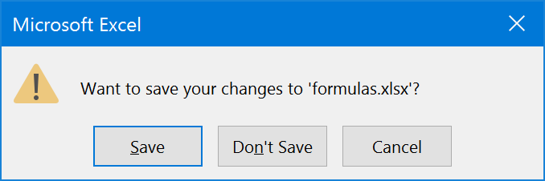

This will always happen when you save a file with formulas. We choose
this as the default mode because we can’t know which formulas your file
has, and while we support over 300 Excel functions, you might be using
something we don’t support, or some VBA macro function that you didn’t
re-implement in FlexCel, or some linked files without setting up FlexCel
to recalculate linked files. So the safest default is to leave Excel to
recalculate files on open, and this has the side effect of this dialog
popping up when you try to close the file.

If you know the formulas you are using are all supported, and you would
like to get rid of this dialog, you can tell FlexCel to identify the
file as having been saved by a specific Excel version.

So you can for example do:

[TExcelFile.RecalcVersion](~/api/FlexCel.Core/TExcelFile/RecalcVersion.md) = [TRecalcVersion](~/api/FlexCel.Core/TRecalcVersion.md).Excel2019;

or if using reports:

[TFlexCelReport.RecalcVersion](~/api/FlexCel.Report/TFlexCelReport/RecalcVersion.md) = [TRecalcVersion](~/api/FlexCel.Core/TRecalcVersion.md).Excel2019;

Once you do this, any Excel version equal to or older than Excel 2019 will
**not** recalculate the file on open, trusting the recalculation FlexCel did, and it won’t show the dialog on close.

Newer Excel versions will still recalculate and ask for save
on close.

> [!Note]
> 
> If you want to use the always use the latest version supported by FlexCel, you can specify [TRecalcVersion](~/api/FlexCel.Core/TRecalcVersion.md).LatestKnownExcelVersion.
> This value is set to the latest Excel version FlexCel knows about, so when you update FlexCel it will update automatically without you
> having to modify your code.
> 
> The other special value is [TRecalcVersion](~/api/FlexCel.Core/TRecalcVersion.md).SameAsInputFile. This value means to use the value in the file you are using as a template.
> Let's imagine that you have an old FlexCel version which supports up to Excel 2013, and you had a file saved in Excel 2016.
> With this value, FlexCel will identify the file as saved as Excel 2016, even if it doesn't know about it. It will just copy the value from the
> input file which was in Excel 2016.

## Closing Words

We hope that after reading this document you got a better idea on the
basic concepts of using the FlexCel API. Concepts mentioned
here (like XF format indexes) are basic to use FlexCel, so it is
important that you get them right.

And one last thing. Remember that FlexCel API's main strength is that it
**modifies** existing files; it doesn't use the traditional approach of
one API for reading the file and another for writing. In fact, FlexCel
doesn't even know how to create an empty file. When you call
[TExcelFile.NewFile](~/api/FlexCel.Core/TExcelFile/NewFile.md), you are really reading an empty xls file embedded as a
resource. **You are always modifying things**.

Take advantage of this. For example, let's say you want to save a macro
on your final file. There is no support on FlexCel for writing macros.
But you can create the macro on Excel and save it to a template file,
and then open the template with FlexCel instead of creating a new file
with [NewFile](~/api/FlexCel.Core/TExcelFile//NewFile.md).

Use Excel and not FlexCel to create the basic skeleton for your file.
Once you have all of this on place, modify it with FlexCel to add and
delete the things you need. This is what FlexCel does best. And of
course, remember that you can use [TFlexCelReport](~/api/FlexCel.Report/TFlexCelReport/index.md) for creating files,
designing your files in Excel in a visual way.
