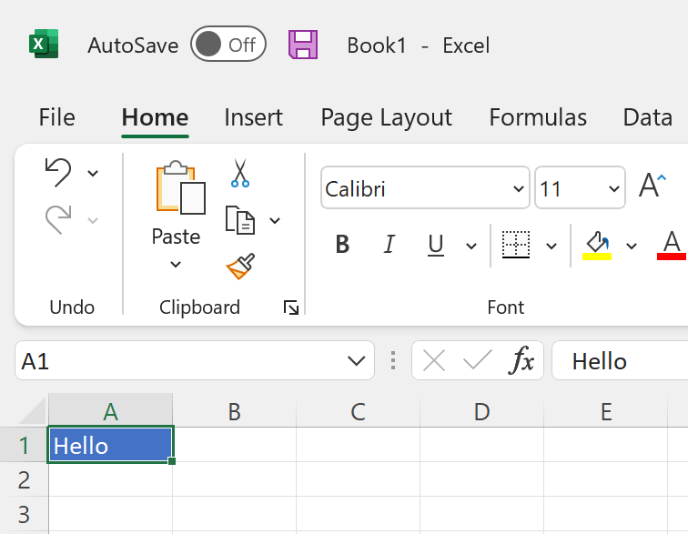
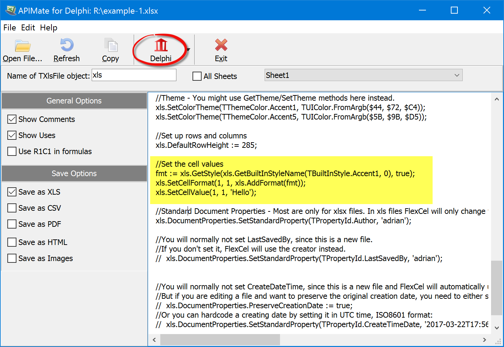

# Getting Started with FlexCel Studio for VCL and FireMonkey

## 0. Finding out which files you need to use

Before starting, it is good to know what functionality FlexCel has, and which units you need to use to access that functionality. Here is a list of the units you might need to use in FlexCel explaining what each unit does:

* **FlexCel.VCLSupport** / **FlexCel.FMXSupport** / **FlexCel.SKIASupport** / **FlexCel.LCLSupport**: You always need to use one of these units. Add the "VCL" version for VCL applications, the "FMX" version for Firemonkey, the "SKIA" version for Delphi Linux, and the "LCL" version for Lazarus. Add them to your main program, since they don't export any types and don't expose functionality. They just link the graphics engine to the framework you are using.

* **FlexCel.Core**: This includes the Core types used by all the other FlexCel units. You normally have to include this unit in every unit that uses FlexCel.

* **FlexCel.XlsAdapter**: This is the FlexCel xls/x engine. You need to use this unit if you are dealing with xls or xlsx files. There are very little cases where you won't need to use this unit, like when creating a pdf file by hand. But normally you will need to use it.

* **FlexCel.Render**: This is the FlexCel rendering engine, which renders the contents in an xls/x file into images, pdf, html or other similar file types. You need to use FlexCel.Render whenever you want to export an xls/x file to a different format. You also need to use this unit when autofitting rows or columns, since in order to measure how big a string in a cell is, FlexCel needs to render it to an internal image.

* **FlexCel.Pdf** This is the FlexCel Pdf Engine. Note that this is a generic pdf engine not tied to xls/x files. To convert an xls/x file to pdf, you still need to use FlexCel.Render, which is the engine that can "convert" and xls/x file into an image. You need to use FlexCel.Pdf if you are working directly with the pdf engine, or in general if you are dealing with pdf files. Even when not strictly necessary to convert an Excel file to pdf, it has enumerations and classes that might be needed to access the full pdf functionality when exporting.

*  **FlexCel.Report** This is the FlexCel reporting engine. You need to use this unit if you are doing Excel reports using the [TFlexCelReport](~/api/FlexCel.Report/TFlexCelReport/index.md) class.

## 1. Creating an Excel file with code

The simplest way to use FlexCel is to use the [TXlsFile](~/api/FlexCel.XlsAdapter/TXlsFile/index.md) class to manipulate files.

To get started, create an empty VCL application, add a button, and save it.

Now we need to add the FlexCel units to the "uses" clause. For this example we will add FlexCel.VCLSupport, [FlexCel.Core](xref:FlexCel.Core) and [FlexCel.XlsAdapter](xref:FlexCel.XlsAdapter). We will also be using System.IOUtils for the TPath object:

<pre class="shiki shiki-themes light-plus dark-plus" style="background-color:#FFFFFF;--shiki-dark-bg:#1E1E1E;color:#000000;--shiki-dark:#D4D4D4" tabindex="0"><code>uses
...
  System.IOUtils,
  FlexCel.VCLSupport, FlexCel.Core, FlexCel.XlsAdapter;
</code></pre>

Then drop a button into the form, double-click it, and add the following code:

<pre class="shiki shiki-themes light-plus dark-plus" style="background-color:#FFFFFF;--shiki-dark-bg:#1E1E1E;color:#000000;--shiki-dark:#D4D4D4" tabindex="0"><code>procedure CreateExcelFile;
var
  xls: TXlsFile;
begin
  //Create a new empty Excel file, with default formatting as if it was created by Excel 2019.
  //Different Excel versions can have different formatting when they create
  //an empty file, so for example
  //Excel 2003 will have a default font of Arial, and 2019 will use Calibri.
  //This format is anyway the starting format, you can change it all later.
  xls := TXlsFile.Create(1, TExcelFileFormat.v2019, true);
  try
    //Enters a string into A1
    xls.SetCellValue(1, 1, 'Hello from FlexCel!');

    //Enters a number into A2.
    //Note that xls.SetCellValue(2, 1, '7') would enter a string.
    xls.SetCellValue(2, 1, 7);

    //Enter another floating point number.
    //All numbers in Excel are floating point,
    //so even if you enter an integer, it will be stored as double.
    xls.SetCellValue(3, 1, 11.3);

    //Enters a formula into A4.
    xls.SetCellValue(4, 1, TFormula.Create('=Sum(A2:A3)'));

    //Saves the file to the "Documents" folder.
    xls.Save(TPath.Combine(TPath.GetDocumentsPath, 'test.xlsx'));

  finally
    xls.Free;
  end;
end;

procedure TForm1.Button1Click(Sender: TObject);
begin
  CreateExcelFile;
end;
</code></pre>

And that is it. You have just made an application that creates an Excel file. Of course we are just scratching the surface:
we will see more advanced uses later in this guide.

> [!Note]
> 
> This sample deduces the file format from the file name. If you saved as "test.**xls**", the file format would be **xls**, not xlsx.
> You can specify the file format in a parameter to the "Save" method if needed; for example when saving to streams.

## 2. Creating a more complex file with code
While creating a simple file is simple (as it should), the functionality in Excel is quite big, and it can be hard to find out the exact method to do something.
FlexCel comes with a tool that makes this simpler:

#### 2.1 Open APIMate
When you install FlexCel, it will install a tool named **APIMate**. You can access it by going to the Start Menu and searching for APIMate.

Or you can compile it from source (sources are included when you install FlexCel).

#### 2.2. Create a file in Excel with the functionality you want.
To get the best results, keep the file simple. Say you want to find out how to add an autofilter, create an empty file in FlexCel and add an autofilter. If you want to find out how to format a cell with a gradient, create a different file and format one cell with a gradient.

Using simple files will make it much easier to find the relevant code in APIMate

#### 2.3. Open the file with APIMate
APIMate will tell you the code you need to recreate the file you created in Excel with FlexCel. You can see the code as Delphi or C++.

You can keep the xls/x file open in both Excel and APIMate, modify the file in Excel, save, press "Refresh" in APIMate to see the changes.

Imagine you have this file, with a cell formatted in blue:

When you open it in apimate, you should see this code which is the code you need to write in FlexCel to generate the same file:

Note that there is a language button in the toolbar where you can choose which language you want the code to be.

## 3. Reading a file
There is a complete example on Reading files in the documentation. But for simple reading, you can do as follows:

Add a Memo component to the form in the app you created in 1. Then add a new Button, and the following code:

<pre class="shiki shiki-themes light-plus dark-plus" style="background-color:#FFFFFF;--shiki-dark-bg:#1E1E1E;color:#000000;--shiki-dark:#D4D4D4" tabindex="0"><code>procedure ReadExcelFile(const aMemo: TMemo);
var
  xls: TXlsFile;
  row, colIndex: integer;
  XF: integer;
  cell: TCellValue;
  addr: TCellAddress;
  s: string;
begin
  xls := TXlsFile.Create(TPath.Combine(TPath.GetDocumentsPath, 'test.xlsx'));
  try
    xls.ActiveSheetByName := 'Sheet1';  //we'll read sheet1. We could loop over the existing sheets by using xls.SheetCount and xls.ActiveSheet
    for row := 1 to xls.RowCount do
    begin
      for colIndex := 1 to xls.ColCountInRow(row) do //Don't use xls.ColCount as it is slow: See https://doc.tmssoftware.com/flexcel/vcl/guides/performance-guide.html#avoid-calling-colcount
      begin
        XF := -1;
        cell := xls.GetCellValueIndexed(row, colIndex, XF);

        addr := TCellAddress.Create(row, xls.ColFromIndex(row, colIndex));
        s := ('Cell ' + addr.CellRef + ' ');
        if (cell.IsEmpty) then s := s + 'is empty.'
        else if (cell.IsString) then  s := s + 'has a string: ' + cell.ToString
        else if (cell.IsNumber) then s := s + 'has a number: ' + FloatToStr(cell.AsNumber)
        else if (cell.IsBoolean) then s := s + 'has a boolean: ' + BoolToStr(cell.AsBoolean)
        else if (cell.IsError) then s := s + 'has an error: ' + cell.ToString
        else if (cell.IsFormula) then s := s + 'has a formula: ' + cell.AsFormula.Text
        else s := s + ('Error: Unknown cell type');
        aMemo.Lines.Add(s);
      end;
    end;
  finally
    xls.Free;
  end;
end;

procedure TForm1.Button2Click(Sender: TObject);
begin
  ReadExcelFile(Memo1);
end;
</code></pre>

## 4. Manipulating files

APIMate will tell you about a huge number of things, like how to paint a cell in red, or how to insert an autofilter.
But there are some methods that APIMate can't tell you about, and from those the most important are the manipulating methods:

* Use [TExcelFile.InsertAndCopyRange](~/api/FlexCel.Core/TExcelFile/InsertAndCopyRange.md) for inserting rows or column or ranges of cells. Also for copying ranges or cells or full rows or full columns.
Or for inserting and copying cells/columns/rows in one operation (like pressing "Copy/Insert copied cells" in Excel).
It can also copy the cells from one sheet to the same sheet, to another sheet, or to another sheet in another file.
InsertAndCopyRange is a heavily overloaded method, and it can do many things depending on the parameters you pass to it.

* Use [TExcelFile.DeleteRange](~/api/FlexCel.Core/TExcelFile/DeleteRange.md) to delete ranges of cells, full rows or full columns.

* Use [TExcelFile.MoveRange](~/api/FlexCel.Core/TExcelFile/MoveRange.md) to move a range, full rows or full columns from one place to another.

* Use [TExcelFile.InsertAndCopySheets](~/api/FlexCel.Core/TExcelFile/InsertAndCopySheets.md) to insert a sheet, to copy a sheet, or to insert and copy a sheet in the same operation.

* Use [TExcelFile.DeleteSheet](~/api/FlexCel.Core/TExcelFile/DeleteSheet.md) to delete a sheet.

## 5. Creating Reports

You can create Excel files with code as shown above, but FlexCel also includes a reporting engine which uses Excel as the report designer.
When using reports you create a template in Excel, write some tags on it, and run the report.
FlexCel will replace those tags by the values from a database or memory.

1. Create an empty file in Excel

2. In cell A1 of the first sheet, write <#Customer.Name>. In cell B1 write <#Customer.Address>

3. In the ribbon, go to "Formulas" tab, and press "Name manager" (In Excel for macOS or Excel 2003, go to Menu->Insert->Name->Define)

4. Create a name "__Customer__" that refers to "=Sheet1!$A$1".
The name is case insensitive, you can write it in any mix of upper and lower case letters.
It needs to start with two underscores ("\_") and end with two underscores too. We could use a single underscore for bands that don't take the full row or "I\_" or "I\_\_" for column reports instead, but this is for more advanced uses.

5. Save the file as "report.template.xlsx" in the "Documents" folder

6. Create a new Console app, save it as "CustomerReport", and paste the following code:

<pre class="shiki shiki-themes light-plus dark-plus" style="background-color:#FFFFFF;--shiki-dark-bg:#1E1E1E;color:#000000;--shiki-dark:#D4D4D4" tabindex="0"><code>program CustomerReport;
{$APPTYPE CONSOLE}
{$R *.res}

uses
  System.SysUtils, System.IOUtils,
  Generics.Collections, Generics.Defaults,
  FlexCel.VCLSupport, FlexCel.Core, FlexCel.XlsAdapter,
  FlexCel.Report;

type
 TCustomer = class
  private
    FAddress: string;
 public
   Name: string;
   property Address: string read FAddress write FAddress;

   constructor Create(const aName, aAddress: string);
 end;

constructor TCustomer.Create(const aName, aAddress: string);
begin
  Name := aName;
  FAddress := aAddress;
end;

procedure CreateReport;
var
  Customers: TObjectList&#x3C;TCustomer>;
  fr: TFlexCelReport;
begin
  Customers := TObjectList&#x3C;TCustomer>.Create;
  try
    Customers.Add(TCustomer.Create('Bill',  '555 demo line'));
    Customers.Add(TCustomer.Create('Joe', '556 demo line'));
    fr := TFlexCelReport.Create(true);
    try
      fr.AddTable&#x3C;TCustomer>('Customer', Customers);
      fr.Run(
        TPath.Combine(TPath.GetDocumentsPath, 'report.template.xlsx'),
                      TPath.Combine(TPath.GetDocumentsPath, 'result.xlsx')
      );

    finally
      fr.Free;
    end;

  finally
    Customers.Free;
  end;

end;

begin
  try
    CreateReport;
  except
    on E: Exception do
      Writeln(E.ClassName, ': ', E.Message);
  end;
end.
</code></pre>

> [!Note]
> 
> In this example, we used a TObjectList as a datasource for the report. You can also use arrays or TDataSets as sources, or even create your own datasources. Take a
> look at the bundled examples for more information.

## 6. Exporting a file to pdf

FlexCel offers a lot of options to export to pdf, like PDF/A, exporting font subsets, signing the generated pdf documents, etc. This is all shown in the examples and documentation. But for a simple conversion between xls/x and pdf you can use the following code:

<pre class="shiki shiki-themes light-plus dark-plus" style="background-color:#FFFFFF;--shiki-dark-bg:#1E1E1E;color:#000000;--shiki-dark:#D4D4D4" tabindex="0"><code>uses ..., FlexCel.Core, FlexCel.XlsAdapter, FlexCel.Render;
...
procedure ExportToPdf(const InFile, OutFile: string);
var
  xls: TXlsFile;
  pdf: TFlexCelPdfExport;
begin
  xls := TXlsFile.Create(InFile);
  try
    pdf := TFlexCelPdfExport.Create(xls, true);
    try
      pdf.Export(OutFile);
    finally
      pdf.Free;
    end;
  finally
    xls.Free;
  end;
end;

</code></pre>

## 7. Exporting a file to html

As usual, there are too many options when exporting to html to show here: Exporting as HTML 3.2, HTML 4 or HTML 5, embedding images or css, exporting each sheet as a tab and a big long list of etc. And as usual, you can find all the options in the documentation and examples.

For this getting started guide, we will show how to do an export with the default options of the active sheet.

<pre class="shiki shiki-themes light-plus dark-plus" style="background-color:#FFFFFF;--shiki-dark-bg:#1E1E1E;color:#000000;--shiki-dark:#D4D4D4" tabindex="0"><code>uses ..., FlexCel.Core, FlexCel.XlsAdapter, FlexCel.Render;
...
procedure ExportToHtml(const InFile, OutFile: string);
var
  xls: TXlsFile;
  html: TFlexCelHtmlExport;
begin
  xls := TXlsFile.Create(InFile);
  try
    html := TFlexCelHtmlExport.Create(xls, true);
    try
      html.Export(OutFile, '');
    finally
      html.Free;
    end;
  finally
    xls.Free;
  end;
end;
</code></pre>

## 8. Browsing through the Examples

FlexCel comes with more than 50 examples of how to do specific things. You can open each demo as a standalone project, but you can also use the included "Demo Browser" (this is MainDemo.dproj) to look at them all in a single place.

You can search for specific keywords at the top right of the main screen, to locate the demos that deal with specific features. So for example if you are looking for demos which show encryption, you will write "encrypt" in the search box:

## 9. This ends this small guide, but there is much more.
 Make sure to take a look at all the other documents available here. You can use the tabs at the top of this site to read the different sections.
