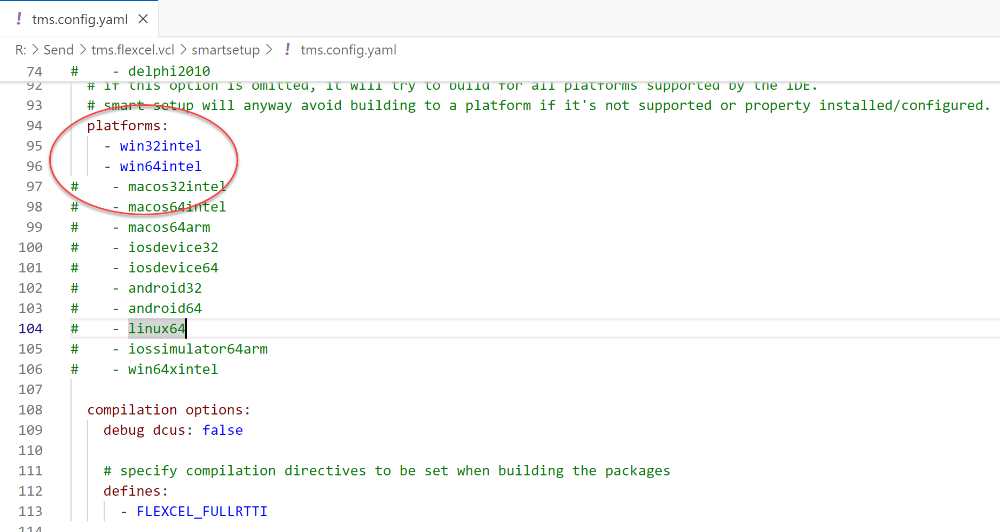
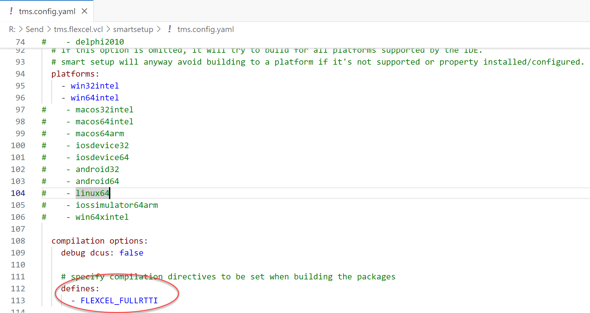
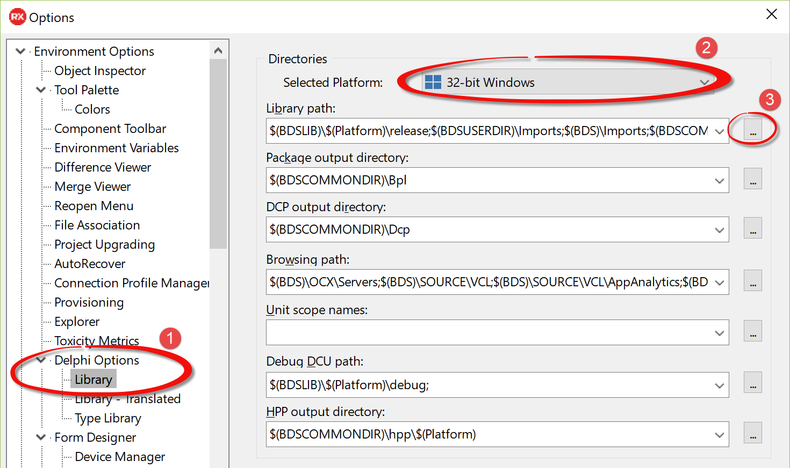
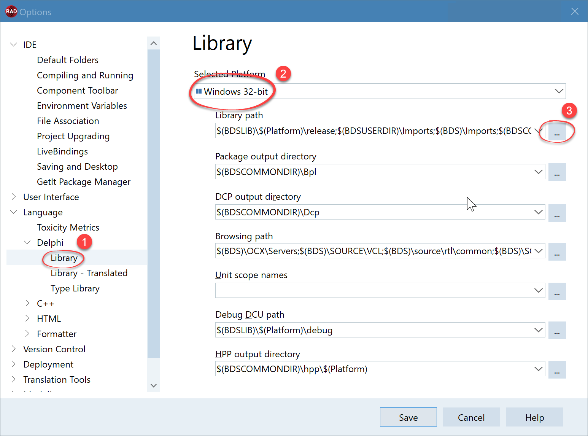
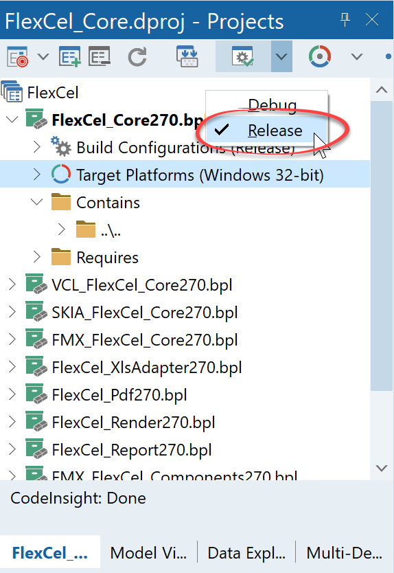
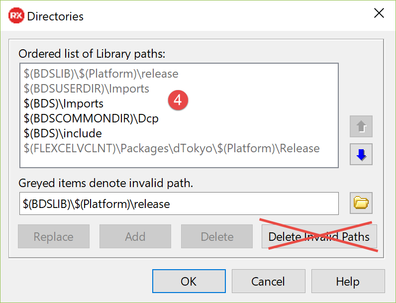
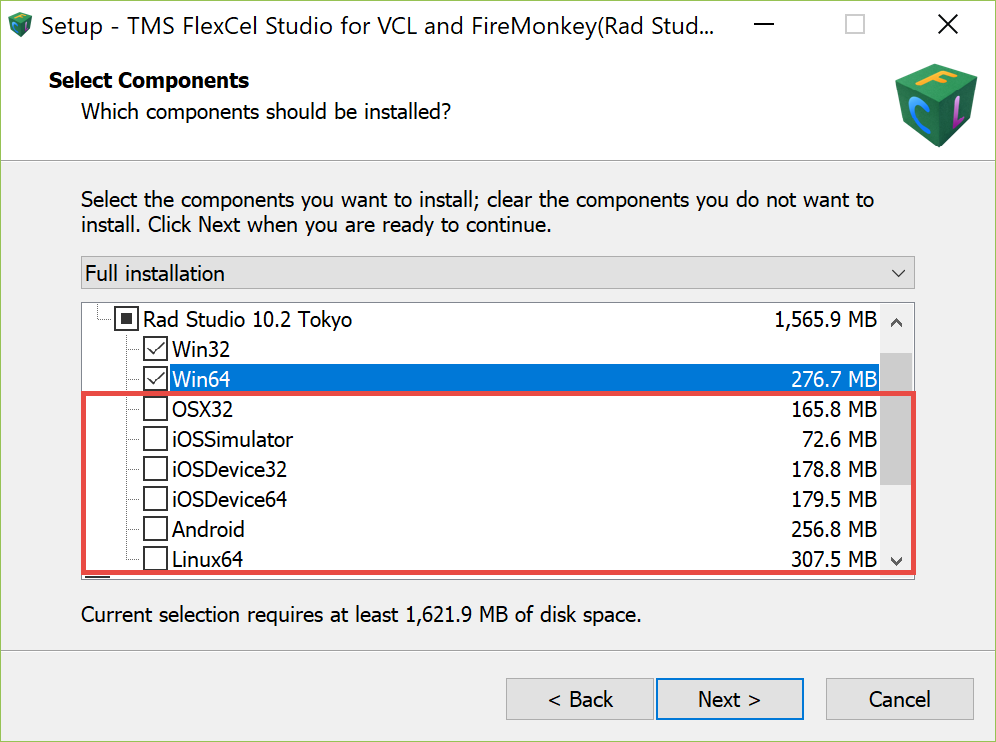
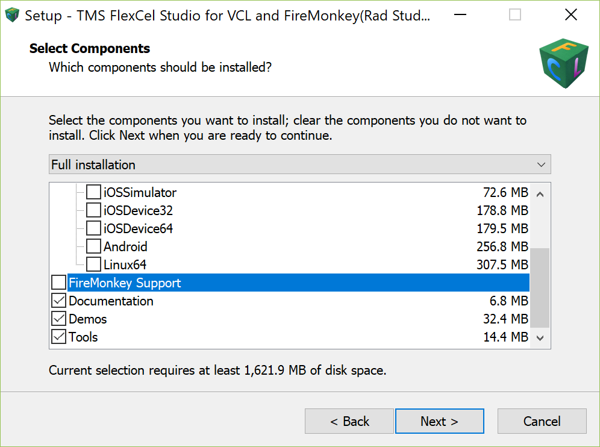

# FlexCel Installation Guide
## Automatic Installation

The preferred method to install FlexCel is using [TMS Smart Setup](https://doc.tmssoftware.com/smartsetup/)

Steps:

  1. If you don't already have it, download tms smart setup from https://doc.tmssoftware.com/smartsetup/download/index.html
  2. Create a folder where to install tms components. Try to use a short name like `e:\tms` since the longer names will cause longer library paths in Delphi, which can cause Delphi to slow down or even stop compiling. Also, try installing all tms products in the same folder.
  3. Click on tmsgui.exe, and configure and install FlexCel. Optionally, you can also type `tms install tms.flexcel.vcl` from the command line.

> [!Warning]
> 
> When installing for Linux, make sure to read the [Linux guide](xref:LinuxGuide#installing-flexcel-for-vcl-and-firemonkey-in-linux)
> for important information about the Linux install.

### Speeding up the installation

FlexCel is a complex suite of components that includes from a PDF engine to a chart rendering engine. It also runs on every platform supported by Rad Studio, which means that the setup process where we compile all the components for all the Delphi versions can be slow. There are a couple of ways to speed up the process and save some disk space while doing it.

#### Select only the platforms you want

The mobile Delphi compilers are slower than the standard Win32 compiler, so if you are not using Delphi on mobile, just unselect all the platforms you don't need when running the setup. You can always reinstall the missing platforms later.

To select the platforms to install, either type `tms config` from the command line in the folder where you installed FlexCel Studio, or press the "Configure" button in tmsgui. This will open an editor where you can comment and uncomment the platforms you want to install:

Unselecting unneeded platforms will not only speed up the install process a lot, but also require much less disk space.

#### Disable Debug DCUs if not needed
FlexCel will install **Release** and **Debug** dcus for all its classes by default.

Debug dcus allow you to step through FlexCel source code when the Project compiler option "Use debug .dcus" is selected.

And this can be helpful: When you want to step in the FlexCel source code with F7, and you want exceptions to break in FlexCel code, you set **"Use debug .dcus"** to true in your project options. When you want to focus on your code and see FlexCel as a black box, set **"Use debug .dcus"** to false.

But debug dcus come with a price: They double the setup time because each unit has to be compiled twice (with and without debug information). They also require **a lot more disk space** because all dcus are now repeated twice, and the debug information in debug dcus makes them bigger.

 So, if you don't care about stepping through the FlexCel code, you can unselect "Debug DCUs" when installing FlexCel:

You can disable debug dcus by opening the smart setup configuration file, searching for `debug dcus`, and ensuring it is false.

> [!Tip]
> 
>  Even if disabling debug dcus, you can still navigate in FlexCel source code by pressing ctrl-click in a FlexCel identifier. And, of course, you still have the complete source code to look at.
> 
>  The only thing disabled by disabling debug dcus is the debugger finding FlexCel symbols.
>  

#### Check your Antivirus
If you are experiencing very long compiling times, check with the task manager to see if your antivirus is not consuming most of that time. One would expect that in this age, an antivirus shouldn't cause problems, but from time to time, we get emails from people who have issues caused by them.

**We don't recommend turning off your antivirus**, especially considering you are installing a new product you got from the internet. But if you determine the antivirus is causing trouble, you might consider changing it to another brand.

Also, you might try installing FlexCel onto a [dev drive](https://learn.microsoft.com/en-us/windows/dev-drive/). Dev drives run the antivirus asynchronously instead of in real-time, which should speed things up. Using a dev drive, you still get virus protection, just delayed a little. 

### Enabling RTTI
By default, FlexCel disables [RTTI](https://docwiki.embarcadero.com/RADStudio/en/Working_with_RTTI) on its units. This is to make your executables smaller and is usually the best choice. But disabling RTTI also means you can't dynamically call FlexCel methods. It also means you can't call FlexCel from a product like TMS Scripter, which requires RTTI.

To enable RTTI, open the smart-setup configuration file (as explained in [Disable Debug DCUs if not needed](#disable-debug-dcus-if-not-needed)) and make sure that you add a `FLEXCEL_FULLRTTI` define:

  

## Manual Installation
If, for any reason, you can't install the packages automatically with the setup, below are the steps to do it manually

### Step-by-step manual installation

1. The first step is to get the sources. You can get them by unzipping the FlexCel smartsetup bundle. 
   
2. Modify the Windows Path. You need to add the folder:

   `<place where you installed FlexCel>\Products\tms.flexcel.vcl\Packages\<dVersion>\Win32\Release`
   to the Windows path.

   You need to replace **&lt;dVersion>** above with the actual folder for your Delphi version. (like, for example, dXE7 or dTokyo)

> [!Tip]
> 
>    In newer versions of Windows, there is a nice dialog to modify the Windows path. If you are in an older Windows version (or don't like the built-in dialog), you can use any of the tools mentioned here: https://superuser.com/questions/297947/is-there-a-convenient-way-to-edit-path-in-windows-7
>    

3. Edit the library path. How to modify the Path depends on the Delphi version you have.
   * If you are using Rad Studio 10.2 Tokyo or older, then open Delphi and go to  **Main Menu**->**Tools**->**Options**  , then select **Environment Options**->**Delphi Options**->**Library** in the treeview at the left:

   

   * If you are using Rad Studio 10.3 Rio or newer, then open Delphi and go to  **Main Menu**->**Tools**->**Options**  , then select **Language**->**Delphi**->**Library** in the treeview at the left:

   

   Press the "..." button at the right in "library path", and add the Path: `<place where you installed FlexCel>\Products\tms.flexcel.vcl\Packages\<dVersion>\Win32\Release`

   to the library path. Note that Delphi might complain that the Path doesn't exist yet (we are going to create it in the next step). Just ignore the warning.

4. In Delphi, open the project group:
   `<place where you installed FlexCel>\Products\tms.flexcel.vcl\Packages\<dVersion>\FlexCel.groupproj`

5. Make sure all the packages are in **Release** mode:

   

6. Right-click all the packages in order (from first to last) and select "install" for each one.

> [!Important]
> 
> Packages that end in "\_DESIGN" are design packages for the Delphi IDE. Those packages can only be compiled in 32-bit, since Delphi is a 32-bit app. **Don't compile packages ending with "\_DESIGN" in any platform other than Win32.**

> [!Note]
> 
> If you are using C++ Builder only and don't have a Delphi personality, you won't be able to do step 4. So to install into C++ Builder, follow steps 1 to 3, and then in the start menu, look for "Embarcadero RAD Studio \<version\>" and select "RAD Studio Command Prompt".
> There, write the following lines:
> 
> <pre class="shiki shiki-themes light-plus dark-plus" style="background-color:#FFFFFF;--shiki-dark-bg:#1E1E1E;color:#000000;--shiki-dark:#D4D4D4" tabindex="0"><code>msbuild "&#x3C;place where you installed FlexCel>\Products\tms.flexcel.vcl\Packages\&#x3C;dVersion>\FlexCel_Core.dproj"  "/p:config=Release" "/p:Platform=Win32"
> 
> msbuild "&#x3C;place where you installed FlexCel>\Products\tms.flexcel.vcl\Packages\&#x3C;dVersion>\VCL_FlexCel_Core.dproj"  "/p:config=Release" "/p:Platform=Win32"
> 
> msbuild "&#x3C;place where you installed FlexCel>\Products\tms.flexcel.vcl\Packages\&#x3C;dVersion>\FlexCel_XlsAdapter.dproj"  "/p:config=Release" "/p:Platform=Win32"
> 
> msbuild "&#x3C;place where you installed FlexCel>\Products\tms.flexcel.vcl\Packages\&#x3C;dVersion>\FlexCel_Pdf.dproj"  "/p:config=Release" "/p:Platform=Win32"
> 
> msbuild "&#x3C;place where you installed FlexCel>\Products\tms.flexcel.vcl\Packages\&#x3C;dVersion>\FlexCel_Render.dproj"  "/p:config=Release" "/p:Platform=Win32"
> 
> msbuild "&#x3C;place where you installed FlexCel>\Products\tms.flexcel.vcl\Packages\&#x3C;dVersion>\FlexCel_Report.dproj"  "/p:config=Release" "/p:Platform=Win32"
> 
> msbuild "&#x3C;place where you installed FlexCel>\Products\tms.flexcel.vcl\Packages\&#x3C;dVersion>\VCL_FlexCel_Components.dproj"  "/p:config=Release" "/p:Platform=Win32"
> 
> </code></pre>
> 
> 
> This is to install for win32 and VCL. For FMX you will also have to compile the FMX packages in the folder in the same way.

### Advanced manual installing

The steps above should have been enough to install FlexCel. But there are some concepts worth expanding on.

* In the steps above, we built the packages only for **Win32** and only for **Release** mode. You might also want to install other platforms, and install debug dcus.

* Debug dcus are explained in more detail in the section [Disable Debug DCUs if not needed](#disable-debug-dcus-if-not-needed). If you want to install the debug dcus, you should repeat steps 5 and 6 of the step-by-step guide, but selecting now "**Debug**" instead of "**Release**" on step 5.

* To install other platforms, press the button at the right of the button in the screenshot of step 5, select the platform and repeat step 6. You might repeat step 6 with debug configurations and release configurations again.

* In step 2 we added an entry to the Windows Path. This is not strictly necessary, the only thing that is
  necessary is that FlexCel .bpl files are reachable from Windows. The setup doesn't modify the Path,
  because the Windows Path can't be too big. Instead it creates symbolic links from the bpls to Delphi's
  bpl folder (which is already in the Path). You could create symbolic links too in the same way instead
  of modifying the Windows path. But the simplest solution is just to add the folder with FlexCel bpls to the Path.

* While in step 3 of the step-by-step section we only modified the library path, there are other paths that you can modify too, and which are set up when you install with the automatic setup.

  The paths that you can modify are:
  * **Library Path**: Write the Path to the FlexCel .dcu files here.
  * **Browsing Path**: This is the place where you put the folders that contain all .pas files in FlexCel. Setting a Browsing path will allow you to ctrl-click into FlexCel identifiers and navigate to their definitions, and also to F7 into FlexCel symbols when using debug dcus.
  * **Debug Path**: This Path is similar to the library path, but it is used when you select "Use debug .dcus" in your project options (see [Disable Debug DCUs if not needed](#disable-debug-dcus-if-not-needed)).

    Put the Path for the dcus compiled in debug mode in this entry.

> [!Note]
> 
> Packages ending in _DESIGN are design-type packages only used by Delphi itself. As Delphi is a 32-bit application, those packages must (and can only) be compiled in 32 bit. When compiling 64-bit or other platforms, don't compile the _DESIGN packages.

> [!Warning]
> 
> **Do not put FlexCel .pas units in the library path!**
> 
> The .pas units of FlexCel belong in the **Browsing Path**, not the Library path. If you put the .pas units in the Library path, they will be recompiled every time you recompile your project, making your build times much slower. It will also generate lots of repeated .dcus in your hard disk for every project using FlexCel.

## Troubleshooting
In this section, we cover some of the most common errors that might occur when you install FlexCel.

> [!Note]
> 
> The list of possible errors is too big to write every one here: If you can't find your error in this list, please send us an email to info@tmssoftware.com attaching the build log.

> [!Tip]
> 
> If you are getting strange errors, remember to check your antivirus log.
> 
> We have seen reports from customers where the antivirus silently deleted some files as FlexCel installed them. In other cases, the aantivirus might lock some files, and the setup might fail to replace them.

> [!Tip]
> 
> Also remember to check your hard disk for errors. While it is rare, hard drives do fail from time to time and you might get unexpected errors.

### FlexCel didn't report any errors while installing, but I can't find the components in the component palette.

If FlexCel didn't report any error when installing, then your installation is most likely fine.

The reason you don't see a ton of little tiny icons in Delphi's component palette is just that FlexCel since FlexCel 5 doesn't install non-visual components. It only will install visual components, and there are only 2 visual components in FlexCel: **TFlexCelPreviewer** and **TFlexCelDocExport** (the second one only if you install for iOS or Android). There should be nothing else in the component palette.

Take a look at [Getting Started](xref:GettingStarted) to find out how to start using FlexCel.

> [!Note]
> 
> If you are coming from FlexCel 3, make sure to read the [FlexCel migration Guide](xref:MigratingFromFlexCel3)

### E2202: Required package 'rtl' not found

If your build log ends with a line like the following:

<pre class="shiki shiki-themes light-plus dark-plus" style="background-color:#FFFFFF;--shiki-dark-bg:#1E1E1E;color:#000000;--shiki-dark:#D4D4D4" tabindex="0"><code>error E2202: Required package 'rtl' not found
</code></pre>

It normally means that the library path in your Delphi installation is wrong.

To fix it, follow the steps below:

1. Open Delphi and go to  **Main Menu**->**Tools**->**Options**, then select **Environment Options**->**Delphi Options**->**Library** in the treeview at the left:

   

2. Choose the platform where you got the error from the combobox. In the image above we choose Win32, but if you had the error when installing in a different platform, make sure to select the correct one.

3. Press the "ellipsis" button at the right of the **Library Path** edit box as shown in the image above.

4. Make sure that the first paths in your library are:
   * For **Win32**:
     * $(BDSLIB)\\$(Platform)\\release
     * $(BDSUSERDIR)\\Imports
     * $(BDS)\\Imports
     * $(BDSCOMMONDIR)\\Dcp
     * $(BDS)\\include
   as in the image below:

   

  * For **Win64** or **macOS**:
    * $(BDSLIB)\\$(Platform)\\release
    * $(BDSUSERDIR)\\Imports
    * $(BDS)\\Imports
    * $(BDSCOMMONDIR)\\Dcp\\$(Platform)
    * $(BDS)\\include

  * For **Android**, **iOS Device** or **iOS Simulator**:
    * $(BDSLIB)\\$(PLATFORM)\\Release

  * For **Linux64**:
    * $(BDSLIB)\\$(Platform)\\release
    * $(BDSUSERDIR)\\Imports
    * $(BDS)\\Imports
    * $(BDSCOMMONDIR)\\Dcp\\$(Platform)
    * $(BDS)\\include
    * $(BDS)\\redist\\$(Platform)
    * $(BDSCOMMONDIR)\\Bpl\\$(Platform)

Once you add those entries, quit Delphi and reinstall FlexCel. The error should be gone.

> [!Important]
> 
> Delphi has a bug where the entries that contain the $(Platform) macro appear grayed out as if they were invalid entries. **They are not!**
> 
> As you can see in the image above, for example `$(BDSLIB)\$(Platform)\release`
> is grayed out, but this is a vital path to be able to compile from the command line (and find the 'rtl' package)
> 
> It gets worse: If you look at the image above, there is a button "Delete Invalid Paths" which offers to remove the grayed out paths. **Never press that button**. If you do, Delphi will happily remove all paths with $(Platform) on them, and you will have to restore them manually.

### E2225 Never-build package "FlexCel_Core" must be recompiled

If your build log ends with a line like the following:

<pre class="shiki shiki-themes light-plus dark-plus" style="background-color:#FFFFFF;--shiki-dark-bg:#1E1E1E;color:#000000;--shiki-dark:#D4D4D4" tabindex="0"><code>E2225 Never-build package must be recompiled
</code></pre>

or

<pre class="shiki shiki-themes light-plus dark-plus" style="background-color:#FFFFFF;--shiki-dark-bg:#1E1E1E;color:#000000;--shiki-dark:#D4D4D4" tabindex="0"><code>[dcc32 Fatal Error] someunit.pas: F2051 Unit otherunit was compiled with a different version of someunit
</code></pre>

It normally means that you have multiple versions of FlexCel installed, and Delphi is mixing old and new FlexCel units.

To solve this issue, delete or rename all older FlexCel installations. You can use a tool like [Everything search engine](http://www.voidtools.com) to search for **FlexCel_Core.dcp**, and make sure that there is only one FlexCel_Core.dcp accessible to Delphi. You can also search for FlexCel*.dcu, but normally renaming the folder where the unrelated **dcp** s are is enough.

> [!Tip]
> 
> Make specially sure that you don't have .lib or .dcp or any FlexCel files in your DCP common folder: C:\\Users\\Public\\Documents\\Embarcadero\\Studio\\{version}\\DCP
> If you have anything FlexCel related there delete it.

> [!Note]
> 
> This error is virtually always caused by a repeated FlexCel dcu or dcp. We see it quite often in support emails, and it always ends up being a repeated dcu or dcp somewhere. Even if a repeated file doesn't seem to be the cause, make extra sure there are no other versions around.

### E2597: directory not found for option '-LC:\Program Files (x86)\Embarcadero\Studio\21.0\Redist\osx64'

If your build log ends up with either of the following lines:

<pre class="shiki shiki-themes light-plus dark-plus" style="background-color:#FFFFFF;--shiki-dark-bg:#1E1E1E;color:#000000;--shiki-dark:#D4D4D4" tabindex="0"><code>error E2597: ld: warning: directory not found for option '-LC:\Program Files (x86)\ Embarcadero\Studio\21.0\Redist\osx64' 
</code></pre>

or 

<pre class="shiki shiki-themes light-plus dark-plus" style="background-color:#FFFFFF;--shiki-dark-bg:#1E1E1E;color:#000000;--shiki-dark:#D4D4D4" tabindex="0"><code>error F2588: Linker error code: 1 ($00000001)
</code></pre>

This normally means that you haven't yet downloaded the OSX64 SDKs in Delphi. there are 2 alternatives here:
1. If you don't care about OSX64, just unselect it from the setup (and also unselect other platforms you don't care about):

2. If you want to install for OSX64, please first create a simple empty multiplatform app in Delphi, and deploy it to a mac. This will download the missing SDKs and you should be able to install FlexCel with OSX64 support.

### MSB6003: The specified task executable "dcc" could not be run

If your build log includes any of the following lines:
<pre class="shiki shiki-themes light-plus dark-plus" style="background-color:#FFFFFF;--shiki-dark-bg:#1E1E1E;color:#000000;--shiki-dark:#D4D4D4" tabindex="0"><code>warning MSB6002: The command-line
for the "DCC" task is too long. Command-lines longer than 32000 characters
are likely to fail. Try reducing the length of the command-line by breaking
down the call to "DCC" into multiple calls with fewer parameters per call.
</code></pre>

or
<pre class="shiki shiki-themes light-plus dark-plus" style="background-color:#FFFFFF;--shiki-dark-bg:#1E1E1E;color:#000000;--shiki-dark:#D4D4D4" tabindex="0"><code>MSB6003: The specified
task executable "dcc" could not be run. The filename or extension is too
long
</code></pre>

This means that you have too many entries in the library path. Please you check your **Library path** as explained [here](#e2202-required-package-rtl-not-found)

Try to remove the paths which aren't used anymore. Sadly there isn't much we can do from our side about this since it is a limitation of msbuild. **You need to shorten the library path**, not only for installing FlexCel, but just to be able to compile from the command line.

To remove the error we need a smaller command line, and to make the command line smaller the simplest way is to remove unused entries in the library path. But another way to reduce the command line could be to install all components to a shorter folder. so instead of installing to  `c:\my components\thirdparty\...\whatever` try installing them to something like `c:\dev`.

> [!Note]
> 
> The tip above applies to all the components you have installed before FlexCel, not just to FlexCel itself. This particular problem is not with FlexCel only, but with all the components you have installed. FlexCel just happened to be the straw that broke the camel's back.

> [!Important]
> 
> When cleaning the library path, **make sure not to press the "Delete invalid paths" button**, as explained [in this section](#e2202-required-package-rtl-not-found)
> 
> 
> 

### E2202 Required package 'fmx' not found
if you see any of this errors:
<pre class="shiki shiki-themes light-plus dark-plus" style="background-color:#FFFFFF;--shiki-dark-bg:#1E1E1E;color:#000000;--shiki-dark:#D4D4D4" tabindex="0"><code>E2202 Required package 'fmx' not found
</code></pre>

or

<pre class="shiki shiki-themes light-plus dark-plus" style="background-color:#FFFFFF;--shiki-dark-bg:#1E1E1E;color:#000000;--shiki-dark:#D4D4D4" tabindex="0"><code>MSB6004: The specified task executable location "C:\Program Files (x86)\Embarcadero\Studio\18.0\bin\dccosx.exe"
</code></pre>

or

<pre class="shiki shiki-themes light-plus dark-plus" style="background-color:#FFFFFF;--shiki-dark-bg:#1E1E1E;color:#000000;--shiki-dark:#D4D4D4" tabindex="0"><code>SB6004: The specified task executable location "C:\Program Files (x86)\Embarcadero\Studio\18.0\bin\dccios32.exe" is invalid.
</code></pre>

It normally means you don't have FireMonkey installed in Delphi and are trying to install FlexCel for FireMonkey. If that is the case, you should unselect FireMonkey when running the FlexCel setup:

### CreateProcess failed; code 2
If you see an error like this:

<pre class="shiki shiki-themes light-plus dark-plus" style="background-color:#FFFFFF;--shiki-dark-bg:#1E1E1E;color:#000000;--shiki-dark:#D4D4D4" tabindex="0"><code>EOSError: System Error.  Code: 2.
The system cannot find the file specified
</code></pre>

This is typically caused by running the setup without administrator rights. Currently the FlexCel setup requires administrator rights in order to create symbolic links to the bpls.

To fix it, please reinstall with administrator rights or try a [manual install](#manual-installation)

> [!Important]
> 
> As mentioned, FlexCel requires admin rights to create symbolic links for the bpls, and only for that. So, if you can't give the setup admin rights, and you are using windows 10 or newer, you might workaround it by allowing links to be created without admin rights:
>  
> https://stackoverflow.com/questions/58038683/allow-mklink-for-a-non-admin-user
> 
> If you set the symbolic links so they work with a non-admin user, the setup should work correctly even without admin rights.

### MSB4040: There is no target in the project.
If you see the text:
<pre class="shiki shiki-themes light-plus dark-plus" style="background-color:#FFFFFF;--shiki-dark-bg:#1E1E1E;color:#000000;--shiki-dark:#D4D4D4" tabindex="0"><code>MSB4040: There is no target in the project.
</code></pre>

or
<pre class="shiki shiki-themes light-plus dark-plus" style="background-color:#FFFFFF;--shiki-dark-bg:#1E1E1E;color:#000000;--shiki-dark:#D4D4D4" tabindex="0"><code>error MSB4057: The target "Make" does not exist in the project.
</code></pre>

This normally means that rsvars.bat in your installation doesn't have the correct paths. Search for **rsvars.bat** in the bin folder inside the folder where you installed Delphi, edit it and make sure that paths in that file are right.

In particular, make sure that the line in rsvars.bat that sets the BDS variable points to the right place. It should be something like:
<pre class="shiki shiki-themes light-plus dark-plus" style="background-color:#FFFFFF;--shiki-dark-bg:#1E1E1E;color:#000000;--shiki-dark:#D4D4D4" tabindex="0"><code>@SET BDS=C:\Program Files (x86)\Embarcadero\Studio\19.0
</code></pre>

And the Path should be the correct one.

### Linux: ld-linux.exe: error: cannot find -lz

If you see text like the following when installing in Linux:
<pre class="shiki shiki-themes light-plus dark-plus" style="background-color:#FFFFFF;--shiki-dark-bg:#1E1E1E;color:#000000;--shiki-dark:#D4D4D4" tabindex="0"><code>ld-linux.exe: error: cannot find -lz
</code></pre>

This means that you need to install the package zlib1g-dev in the Linux machine where you have PAServer and then refresh the Delphi Cache.

Look at the [Linux guide](xref:LinuxGuide#prerequisites) for detailed information on how to install zlib1g-dev

### Linux: ld-linux.exe: error: cannot find -lgcc_s or cannot find -lstdc++

If you see text like the following when installing in Linux:
<pre class="shiki shiki-themes light-plus dark-plus" style="background-color:#FFFFFF;--shiki-dark-bg:#1E1E1E;color:#000000;--shiki-dark:#D4D4D4" tabindex="0"><code>ld-linux.exe: error: cannot find -lgcc_s
</code></pre>

or
<pre class="shiki shiki-themes light-plus dark-plus" style="background-color:#FFFFFF;--shiki-dark-bg:#1E1E1E;color:#000000;--shiki-dark:#D4D4D4" tabindex="0"><code>ld-linux.exe: error: cannot find -lstdc++
</code></pre>

This means that you need to install the package build-essential in the Linux machine where you have PAServer and then refresh the Delphi Cache.

Look at the [Linux guide](xref:LinuxGuide#prerequisites) for detailed information on how to install build-essential
