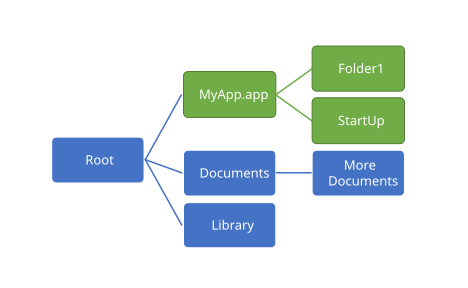

# FlexCel iOS Guide

## Introduction

The FlexCel code you have to write for iOS itself is very similar to normal FlexCel for Windows code.

This is for example the code needed to create a file in Windows:

<pre class="shiki shiki-themes light-plus dark-plus" style="background-color:#FFFFFF;--shiki-dark-bg:#1E1E1E;color:#000000;--shiki-dark:#D4D4D4" tabindex="0"><code>procedure CreateFile;
var
  xls: TXlsFile;
begin
  xls := TXlsFile.Create(1, true);
  try
    xls.SetCellValue(1, 1, 'FlexCel says hello!');
    xls.Save('result.xlsx');
  finally
    xls.Free;
  end;
end;
</code></pre>

And this is the code needed to create the same file in iOS:

<pre class="shiki shiki-themes light-plus dark-plus" style="background-color:#FFFFFF;--shiki-dark-bg:#1E1E1E;color:#000000;--shiki-dark:#D4D4D4" tabindex="0"><code>procedure CreateFile;
var
  xls: TXlsFile;
begin
  xls := TXlsFile.Create(1, true);
  try
    xls.SetCellValue(1, 1, 'FlexCel says hello!');
    xls.Save('result.xlsx');
  finally
    xls.Free;
  end;
end;
</code></pre>

> [!Note]
> 
> Up to Delphi 10.4, in iOS and [Android](xref:AndroidGuide) you had Automated Reference Counting (**ARC**), which means that you didn’t need to call Free on mobile.
> 
> The above code could have been simplified to remove the xls.Free line and the full try/except, but the original code for Windows will still work.
> 
> **For Delphi 10.4 or newer, mobile platforms don't have ARC anymore, so you need to call Free.**

There are really not many differences, and this applies to most FlexCel code you can write: It is exactly the same. So why are we covering iOS in a separate document? What else can we say that is not covered in the other documents?

Well, while most FlexCel code will be the same, there is a fundamental difference between iOS and Windows: **Files in iOS are in a sandbox**. You can’t just open a file in “My Documents” and save it in another place in the disk. Actually, you can’t access *any* file outside the folder where your application is installed. How to deal with the file sandbox is what we are going to cover on the rest of this file.

## The document Sandbox

When working in Windows, applications can access almost any file in the hard drive. Which is a nice thing from a usability point of view, but a complete nightmare from a security point of view. Imagine you download an application from  the internet, how do you prevent it from encrypting all the documents in your hard drive and then asking for some ransom money in order to decrypt them again?

For this reason, in iOS your application can only read and write to the folder where it is installed or its subfolders. This gives you the added advantage that when you uninstall the app it is gone completely, as it can’t leave garbage all over your hard disk. But on the other side, how do you work with a restriction like this? How do you create a file in Excel, open it with FlexCel, modify its values and give it back to Excel, if FlexCel and Excel can’t see each other at all?

The first way to share things is for special files: Apps can access certain other files such as address book data and photos, but only through APIs specifically designed for that purpose. But this isn’t a general solution, and while it might work for images, it won’t work for xls/x or PDF files.

The solution for more general files comes in 2 parts:

1. In order to do anything useful with the xls/x, pdf, or html files FlexCel can generate, you need to **Export** them to other apps.

2. To be able to read files from other apps like Dropbox or the email, you need to **Import** the files from the other apps.

With this Import/Export system, your application can’t open any file that wasn’t given to it. In order to open a file, the user needs to export it to your app.

### A look at some of the available folders for your application

Before we continue, and having established that you can’t write to any folder in the device, let’s look at the folders where you can read or write:

-   **&lt;Application\_Home&gt;/Documents/** This is where you normally will put your files. Backed up by iTunes.

-   **&lt;Application\_Home&gt;/Documents/Inbox** This is where other apps will put the files they want to share when exporting to your app. **Read only**. Backed up by iTunes.

-   **&lt;Application\_Home&gt;/Library/** This is for the files that ship with your app, but not for user files. You could for example put xls/x templates here.

-   **&lt;Application\_Home&gt;/tmp/** The files you write here might be deleted when your app is not running. Not backed up by iTunes.

Those are at a glance the most important folders you need to know about. You can get a more complete description of the available folders in the [Apple documentation]( https://developer.apple.com/library/content/documentation/FileManagement/Conceptual/FileSystemProgrammingGuide/FileSystemOverview/FileSystemOverview.html#//apple_ref/doc/uid/TP40010672-CH2-SW4).

### Importing files from other apps

#### Registering your app with iOS

In order to be able to interact with files from other applications, you need to register your application as a program that can handle the required file extensions. To do so, you need to modify the file Info.plist in your app bundle.

For handling xls or xlsx files, you would need to add the following to your Info.plist:

<pre class="shiki shiki-themes light-plus dark-plus" style="background-color:#FFFFFF;--shiki-dark-bg:#1E1E1E;color:#000000;--shiki-dark:#D4D4D4" tabindex="0"><code>&#x3C;?xml version="1.0" encoding="UTF-8"?>
&#x3C;!DOCTYPE plist PUBLIC "-//Apple//DTD PLIST 1.0//EN" "http://www.apple.com/DTDs/PropertyList-1.0.dtd">
&#x3C;plist version="1.0">
&#x3C;dict>
&#x3C;key>CFBundleDocumentTypes&#x3C;/key>
&#x3C;array>
    &#x3C;dict>
        &#x3C;key>CFBundleTypeName&#x3C;/key>
        &#x3C;string>Excel document&#x3C;/string>
        &#x3C;key>CFBundleTypeRole&#x3C;/key>
        &#x3C;string>Editor&#x3C;/string>
        &#x3C;key>LSHandlerRank&#x3C;/key>
        &#x3C;string>Owner&#x3C;/string>
        &#x3C;key>LSItemContentTypes&#x3C;/key>
        &#x3C;array>
            &#x3C;string>com.microsoft.excel.xls&#x3C;/string>
            &#x3C;string>com.tms.flexcel.xlsx&#x3C;/string>
			&#x3C;string>org.openxmlformats.spreadsheetml.sheet&#x3C;/string>
        &#x3C;/array>
    &#x3C;/dict>
&#x3C;/array>

&#x3C;key>UTExportedTypeDeclarations&#x3C;/key>
 &#x3C;array>
&#x3C;dict>
    &#x3C;key>UTTypeDescription&#x3C;/key>
    &#x3C;string>Excel xlsx document&#x3C;/string>
    &#x3C;key>UTTypeTagSpecification&#x3C;/key>
    &#x3C;dict>
        &#x3C;key>public.filename-extension&#x3C;/key>
        &#x3C;string>xlsx&#x3C;/string>
        &#x3C;key>public.mime-type&#x3C;/key>
        &#x3C;string>application/vnd.openxmlformats-officedocument.spreadsheetml.sheet&#x3C;/string>
    &#x3C;/dict>
    &#x3C;key>UTTypeConformsTo&#x3C;/key>
    &#x3C;array>
        &#x3C;string>public.data&#x3C;/string>
    &#x3C;/array>
    &#x3C;key>UTTypeIdentifier&#x3C;/key>
    &#x3C;string>com.tms.flexcel.xlsx&#x3C;/string>
&#x3C;/dict>
&#x3C;/array>
&#x3C;/dict>
&#x3C;/plist>
</code></pre>

The good news is that Delphi allows you to modify individual keys of Info.plist in the “Version info” section of the project preferences:

But the bad news is that it only allows you to add string keys, and we need to add dictionaries. So we can’t use the built-in system.

We want to keep the Info.plist generated by Delphi (it contains stuff like the version or the application name), but we also want to add our own keys. For that purpose, FlexCel comes with a handy little tool: **infoplist.exe**

Infoplist.exe is a simple program that will take two xml files as input, and output a file that contains the keys from both input files. You can execute it as a “post-build event” so it merges your info.plist with the one generated by Delphi every time. After you’ve generated the correct Info.plist, you just need to go to “Project->Deployment” and change the options so the other Info.plist are not deployed, and yours is.

You can find step-by-step information on how to register your app in the [iOS tutorial](xref:FlexViewTutorial).

When you configure everything, your app will appear in the “Open in” dialog from other applications on your phone:

#### Answering to an “Open in” event

Once you’ve registered your application as an app that can handle xls/x files, it will appear in the other application’s “Open in” dialogs. When the user clicks in your app icon, iOS will copy the file to &lt;Your app folder&gt;/Documents/Inbox (See “[A look at some of the available folders for your application](#a-look-at-some-of-the-available-folders-for-your-application)” above).

After that iOS will start your app, and send it an application:OpenUrl: message so you can actually open the file. So in order to do something useful, you will need to listen to application:OpenUrl: event.

In Delphi, you would listen to this event with the following commands:

**Initialization code**: (Put it in your form create event, or in the initialization of the project)

<pre class="shiki shiki-themes light-plus dark-plus" style="background-color:#FFFFFF;--shiki-dark-bg:#1E1E1E;color:#000000;--shiki-dark:#D4D4D4" tabindex="0"><code>IFmxApplicationEventService(TPlatformServices.Current.GetPlatformService(IFmxApplicationEventService)).SetApplicationEventHandler(AppHandler);
</code></pre>

**And then handle the event**:

<pre class="shiki shiki-themes light-plus dark-plus" style="background-color:#FFFFFF;--shiki-dark-bg:#1E1E1E;color:#000000;--shiki-dark:#D4D4D4" tabindex="0"><code>function TFormFlexView.AppHandler(AAppEvent: TApplicationEvent;
  AContext: TObject): Boolean;
begin
 Result := true;

 case AAppEvent of
  TApplicationEvent.aeOpenURL:
  begin
   Result := OpenURL((AContext as TiOSOpenApplicationContext).URL);
  end;
 end;
end;
</code></pre>

> [!Note]
> 
> OpenURL would get the URL of the file (something like “file://localhost/folder...”) instead of a filename. The [FlexCelView example](xref:iOS_FlexView-FireMonkey_Mobile) shows how to convert the URL into a path, and how to handle an OpenUrl event.

### Exporting files to other apps

Exporting files to other apps is the reverse of what we’ve seen in the previous section: Now we want to show a dialog where we show the user all the applications that can open the file we generated.

FlexCel comes with a component: **FlexCelDocExport**, which does all the work. To show the dialog, just call:

<pre class="shiki shiki-themes light-plus dark-plus" style="background-color:#FFFFFF;--shiki-dark-bg:#1E1E1E;color:#000000;--shiki-dark:#D4D4D4" tabindex="0"><code>FlexCelDocExport1.ExportFile(button, filename_where_you_stored_the_file_you_want_to_share);
</code></pre>

And the dialog will appear showing the corresponding applications.

## Printing from iOS

To print an xls or xlsx file created by FlexCel, you need to export it to PDF first (using [TFlexCelPdfExport](~/api/FlexCel.Render/TFlexCelPdfExport/index.md)). Once the file is in pdf format and saved in your hard drive, just export it to the user as in the sample above.

And the “Print” button will appear among the other options inside the share sheet.

## Backing up files

A note about the files you use with FlexCel. Not all of them might need to be backed up, and Apple considers it **a reason for App Store rejection** if your application is backing up static files (as this will increase backup times and sizes for all users).

If you are using xls or xlsx files as templates for your app, but they aren’t actual data and shouldn’t be backed up, you should use the NSURLIsExcludedFromBackupKey or kCFURLIsExcludedFromBackupKey properties to exclude them from backup.

You can find more information about this topic at: <https://developer.apple.com/library/ios/#qa/qa1719/_index.html>

## Other ways to share files

Besides exporting and importing files, there are two other ways in how you can get files from and to your application:

### iTunes file sharing

Your application can offer “Share in iTunes” functionality. To allow it, you need to add the key:

<pre class="shiki shiki-themes light-plus dark-plus" style="background-color:#FFFFFF;--shiki-dark-bg:#1E1E1E;color:#000000;--shiki-dark:#D4D4D4" tabindex="0"><code>&#x3C;key>UIFileSharingEnabled&#x3C;/key>
	&#x3C;true/>
</code></pre>

To your Info.plist file. Once you add this entry, your app will appear in iTunes and the user will be able to read and write documents from the “Documents” folder of it. The interface is kind of primitive, but it gets the work done.

> [!Note]
> 
> Again as in the case of registering the application to consume some file types, the Delphi IDE doesn’t allow you to do it directly. You need to add a Boolean key, and Delphi will only add string keys. So, again you will have to create a different Info.plist and merge it, as we did in “[Registering your app with iOS](#registering-your-app-with-ios)”. If you are already doing so to registering files to import, then you can use that same file to add this entry.

> [!Warning]
> 
> If you decide to enable iTunes sharing for your app, make sure that the documents in the “Documents” folder are actual documents the user cares about, and put the others somewhere else, like in “Library”. Failing to do so can result in a rejection from the App store. (as you can see here: <http://stackoverflow.com/questions/10767517/rejected-by-uifilesharingenabled-key-set-to-true> )

### Delphi’s Project -> Deployment
The last way to put files in your app is to use the “Menu->Project->Deployment” option in Delphi.

Note that you can only put files **inside** your app bundle, you can’t put a file directly in the “Documents” folder. Because you will not be uploading the Documents folder to the app store; you will upload only the app bundle.

If your application is called “MyApp” and the folders look something like this:

Then you can only put files in the green folders in the diagram. This is because “MyApp.app” is what will be distributed to the App store, and what your users will download when they download your app.

So, how do we put a file on the blue folders in our distribution package? The usual technique is iOS is to copy them to some folder inside MyApp.app, and on startup of your application, copy those files to “/Documents” or “/Library”

But Delphi has this functionality built it, so you don’t need to worry about writing the code to copy the files on startup. If you look at your project source (Right click your app in Delphi’s project explorer, then choose “View source”), you will see that the code is as follows:

<pre class="shiki shiki-themes light-plus dark-plus" style="background-color:#FFFFFF;--shiki-dark-bg:#1E1E1E;color:#000000;--shiki-dark:#D4D4D4" tabindex="0"><code>program IOSTest;

uses
  System.StartUpCopy,
  FMX.Forms,
  ...
</code></pre>

Where the first unit your project uses is named “**System.StartUpCopy**”. If you put the cursor on the line and press ctrl-enter to open it, you will see that this unit just looks for a folder in “YourApp.App/StartUp” and copies all files and folders to root.

So, if you want to deploy to “/Documents”, you should deploy to “StartUp/Documents” instead. To deploy to “/Library”, deploy to “StartUp/Library”, and so on. Those files will be copied inside your app bundle, and when your app starts, they will be copied to the root.

> [!Important]
> 
> On the device, filenames are Case Sensitive. So you must deploy exactly to “StartUp/Documents”. If you deploy for example to “Start**u**p/Documents” Then those files will be copied to YourApp.App/Start**u**p/Documents, but Delphi won’t copy them to /Documents when your app starts.

