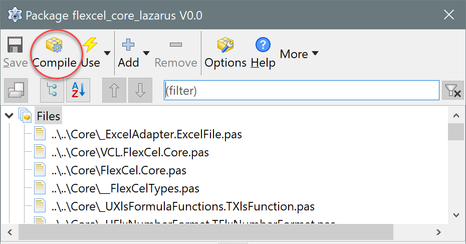
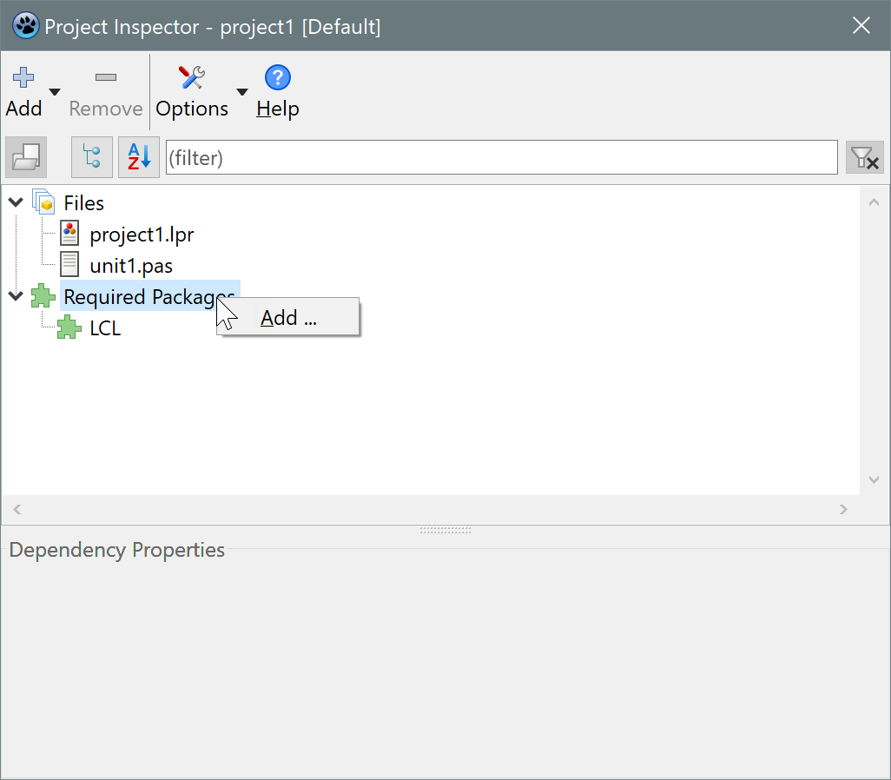
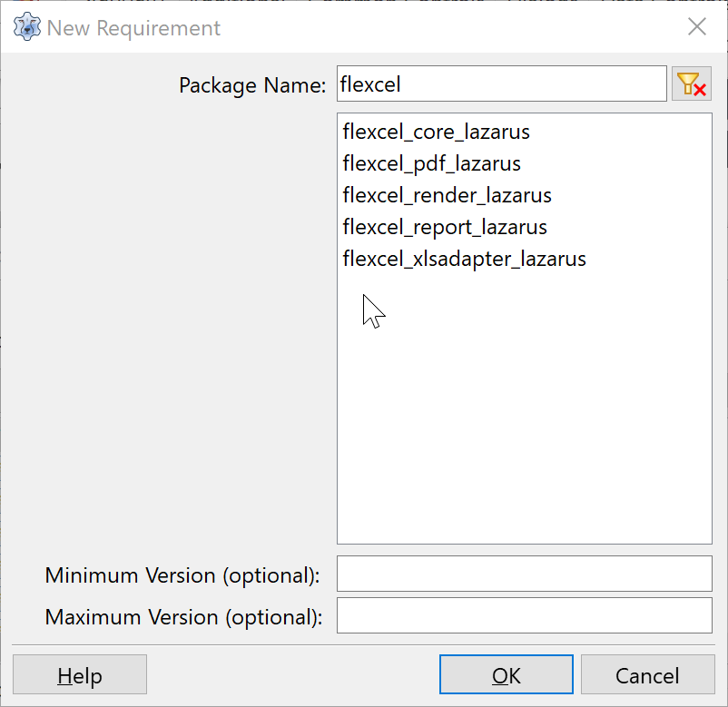
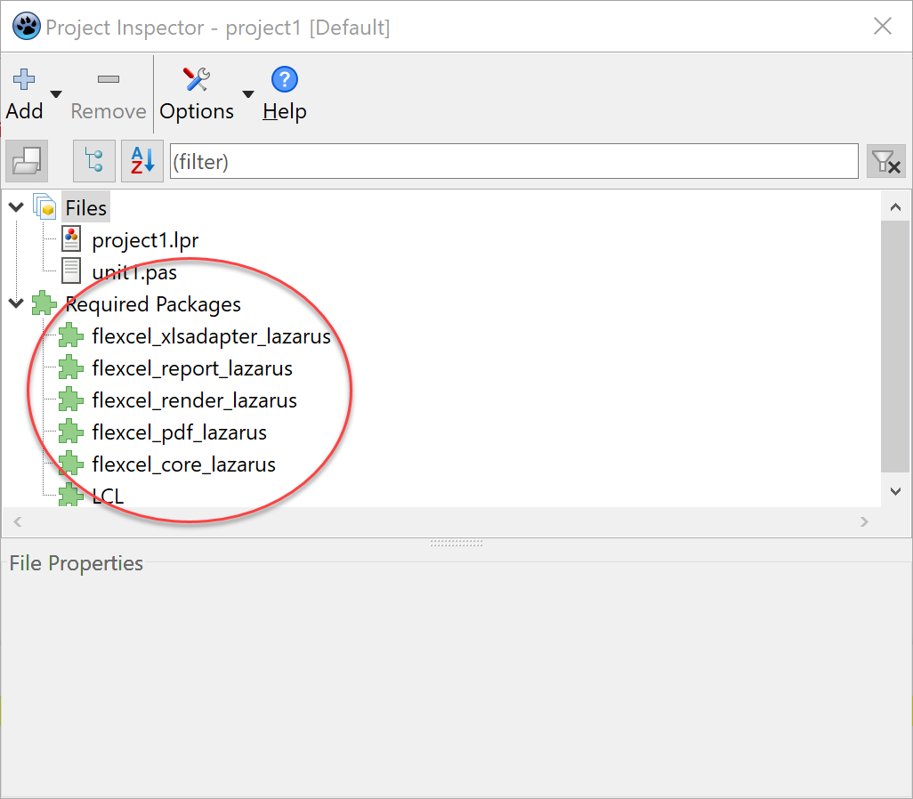
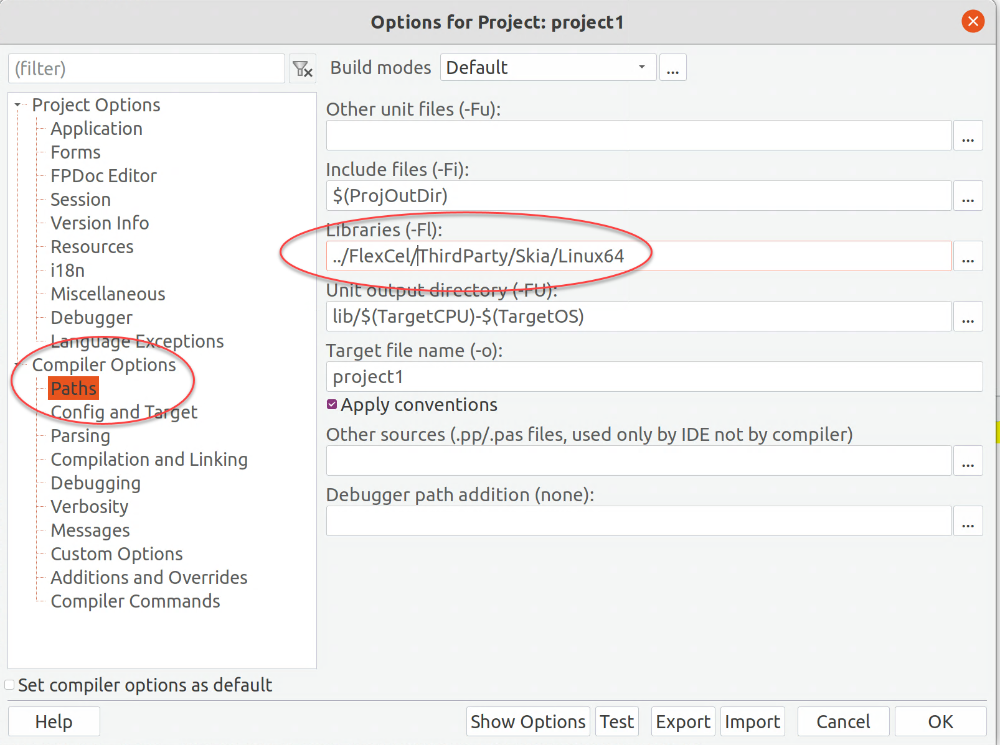
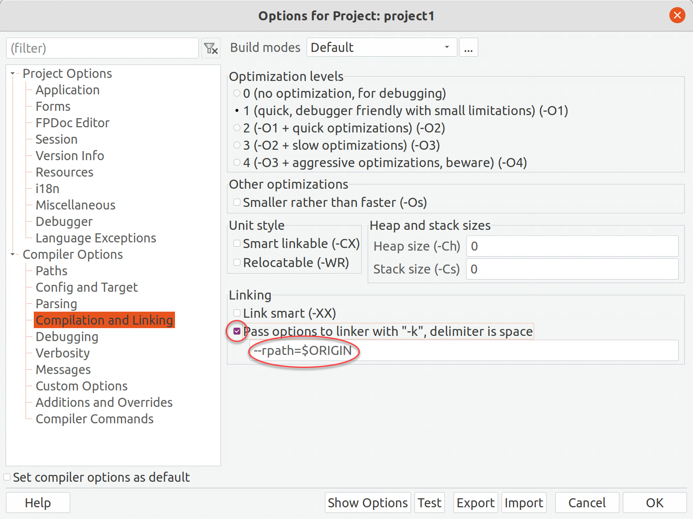

# FlexCel Lazarus Guide

> [!Important]
> 
> We have suspended Lazarus support until a stable Lazarus/FPC release supports anonymous methods. **FlexCel is not building with the Trunk release of Lazarus at the time we publish this FlexCel version** (there are internal compiler errors if you try it). A new future FPC Trunk version might be able to compile it again.
> You should be able to compile FlexCel using the specific trunk numbers below.

We started experimental Lazarus support back in 2022, when [support for anonymous methods was announced](https://www.tmssoftware.com/site/blog.asp?post=966). At that time, we required FPC trunk to compile, hoping this would be a temporary stop until we could release support for FPC stable. But sadly, the changes we need still haven't made it to Stable, and the Trunk is too unstable to be used for serious development. Supporting Trunk kept us constantly changing our code to support the release of the day, and in the end, it is just not feasible, as much as we would love to.

So, we have no other option right now than to stop supporting it. We are looking forward to FPC 3.4, which should support anonymous methods, and we plan to resume support then, if possible.

> [!Note]
> 
> We've tested this release with the following git hashes:  
>   * FPC: 7ecb19f906 
>   * Lazarus: 25c7f3c141
> 
> If you are having trouble with newer versions in the Trunk, you can try using these specific releases. If using fpcupdeluxe, you can click the "Setup+" button, and in the "Branch and revision" box at the top-right, specify the hashes above for FPC and Lazarus.

## Requisites and limitations

 * As mentioned above, FlexCel needs Lazarus Trunk. Unfortunately, we use anonymous methods, which aren't yet available at Lazarus Stable.
 * We support Windows (32 and 64 bits), macOS (intel 64 and arm 64), and Linux (intel 64 bits). There aren't plans for other platforms at the moment. FlexCel uses GDI+ in Windows, CoreGraphics in macOS, and SKIA in Linux  (it does not use LCL), and to support other platforms, we need to write a graphics adapter for it. 
 * Due to the limited RTTI in fpc, reports will only work from TDataSets, not from TList\<object>
 * Printing is currently not supported on any platform. 

We plan to move from experimental to stable once we conclude more in-depth testing and when Lazarus moves the functionality we need to their stable branch.

## Installing FlexCel in Lazarus

> [!Note]
> 
> If you have manually installed FlexCel in Lazarus before, make sure to uninstall it first.

To install FlexCel in Lazarus, you need to use [TMS Smart Setup](https://support.tmssoftware.com/t/tms-smart-setup-available/21723).

Download Smart Setup, open a command window, go to the folder where you want to install it, and type:

<pre class="shiki shiki-themes light-plus dark-plus" style="background-color:#FFFFFF;--shiki-dark-bg:#1E1E1E;color:#000000;--shiki-dark:#D4D4D4" tabindex="0"><code>tms credentials
</code></pre>

Then enter your registration data. After that type
<pre class="shiki shiki-themes light-plus dark-plus" style="background-color:#FFFFFF;--shiki-dark-bg:#1E1E1E;color:#000000;--shiki-dark:#D4D4D4" tabindex="0"><code>tms config
</code></pre>

And search for "compiler paths:". Make sure you specify the path to the fpc compiler.

Finally, type
<pre class="shiki shiki-themes light-plus dark-plus" style="background-color:#FFFFFF;--shiki-dark-bg:#1E1E1E;color:#000000;--shiki-dark:#D4D4D4" tabindex="0"><code>tms install tms.flexcel.vcl
</code></pre>

At the time of this writing, TMS Smart Setup is only available in Windows, so you need to install it manually for other OSs. To install manually, you can type 
<pre class="shiki shiki-themes light-plus dark-plus" style="background-color:#FFFFFF;--shiki-dark-bg:#1E1E1E;color:#000000;--shiki-dark:#D4D4D4" tabindex="0"><code>tms fetch tms.flexcel.vcl
</code></pre>

in a Windows command prompt, and then unzip the zip file that is downloaded to the "Downloads" folder on the machine you want.

Then, for each one of the packages below (and in that order):

 1. flexcel_core_lazarus.lpk
 2. flexcel_xlsadapter_lazarus.lpk
 3. flexcel_pdf_lazarus.lpk
 4. flexcel_render_lazarus.lpk
 5. flexcel_report_lazarus.lpk

You need to go to Menu->Package->Open Package File, and press the "Compile" button:

There is no need to add the packages to the IDE. 

## Creating a Lazarus app using FlexCel
Once you have compiled all packages, you must add them to your app. In the project inspector, right-click in "Required Packages" and click Add:

In the dialog that opens, select the FlexCel packages that you want:

And they should then show as required packages for your app:

Next step now is to add FlexCel to the uses.
The units to use are the same as the ones mentioned in [Getting started](getting-started.md):
 * FlexCel.LCLSupport (you might use FlexCel.VCLSupport or FlexCel.SKIASupport if you want a single codebase with Delphi)
 * FlexCel.Core
 * FlexCel.XlsAdapter
 * FlexCel.Report
 * FlexCel.Pdf
 * FlexCel.Render

The only difference with a regular Delphi app is that you must use FlexCel.LCLSupport once in your app.  

> [!Tip]
> 
> For Linux apps, you can also use **FlexCel.SKIASupport** and it will also work. For Windows apps, you can use **FlexCel.VCLSupport**. This way, you can keep more compatibility with a Delphi version of your app. But for macOS, you need **FlexCel.LCLSupport**

After that, you can write code as usual.

## Special considerations for different Operating Systems

### All OSs
The main issue is always fonts. The fonts that your document uses must be installed in the operating system. 
You can check the [PDF Exporting Guide](xref:PdfExportingGuide#font-management), and [Running FlexCel inside Docker containers](xref:RunningFlexCelInsideDockerContainers) for more information about fonts.

### Linux
Linux is a little more complex than the others. Because you need to deploy an SKIA shared library with your app, making sure it is available to the final users. Almost everything in our [Linux Guide](xref:LinuxGuide) also applies here, so we can recommend you take a quick look at it. 

> [!Important]
> 
> In particular, you must ensure **fontconfig** is installed in the machines where you will deploy your application.

#### Deploying SKIA

The first thing in order to compile is to let Lazarus know where the SKIA libraries are. FlexCel comes with 2 libraries which are located at `<FlexCel install dir>/ThirdParty/Skia/Linux64`:
  1. libflx_skia_draw.a : Proxy library to access SKIA from your app. This library will be linked with your app and doesn't have to be deployed with your   2. libflexskia.so.5 : Shared object (the equivalent of a dll in Windows) with SKIA itself. You need to have this .so in a place the app can find it.
app.

##### Accessing libflx_skia_draw.a

The simplest way to have Lazarus find libflx_skia_draw.a is to add it to the linker path. In Lazarus, go to "Project -> Project Options", then select "Compiler Options->Paths":

Then add the path `<FlexCel install dir>/ThirdParty/Skia/Linux64` in there.

##### Accessing libflexskia.so.5

With the previous step, your app should compile, but it will crash at start. For it to actually work, you need to make libflexskia.so.5 accessible to the application, at run time. There are two ways to do so:
1. You can deploy libflexskia.so.5 to a shared folder like `/usr/local/lib`
2. You can deploy libflexskia.so.5 in the same folder as your app (or in a subfolder). But it works differently from Windows, because Linux apps won't find a .so library in the same folder as the app automatically. For it to work, you need to modify the [RPATH](https://en.wikipedia.org/wiki/Rpath) of your app. You can modify it by going to "Project -> Project Options -> Compiler Options -> Compilation and Linking"

There, you can write "--rpath=$ORIGIN" in the box to have the app load the dll from its folder, or something like "--rpath=$ORIGIN/SharedObjects" to have the app load the so from a subfolder:

> [!Warning]
> 
> Don't forget to check the checkbox in the image above! Just writing the text isn't enough.

Once you do this, copy libflexskia.so.5 to the place where you set it, and the app should be able to run.
