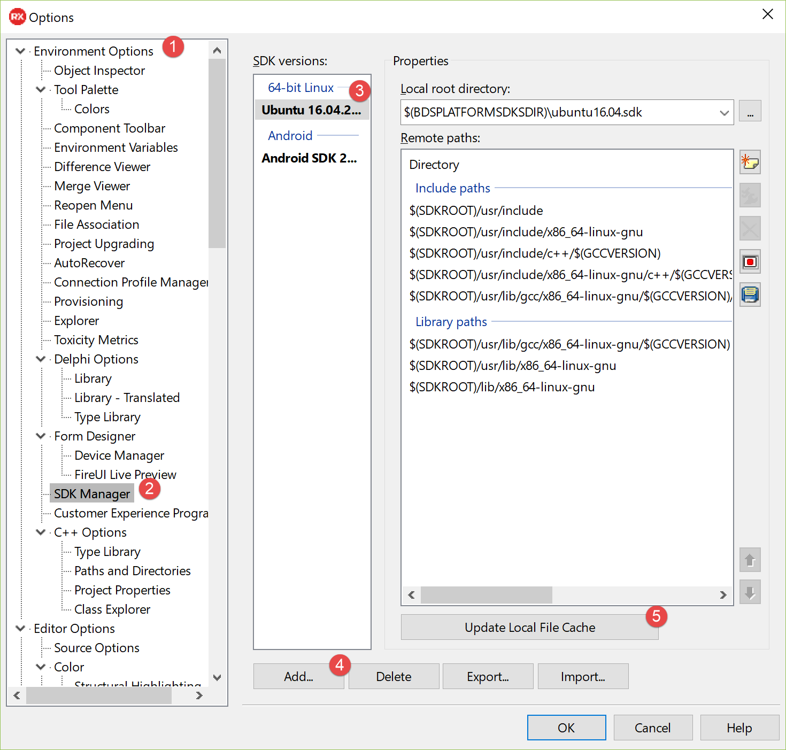
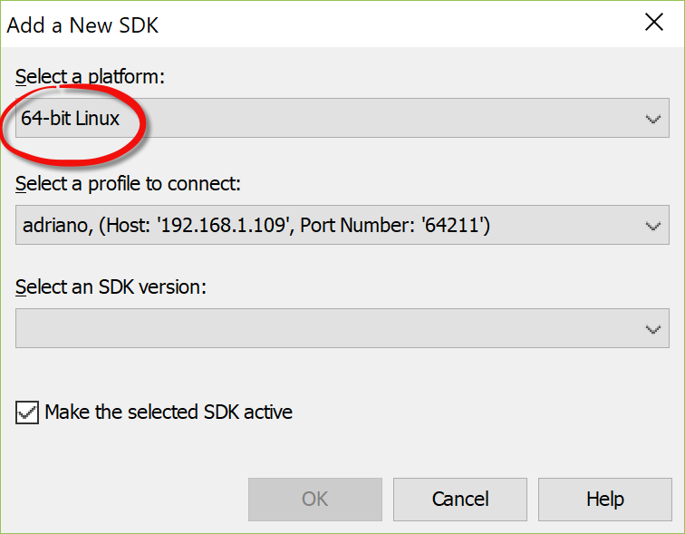
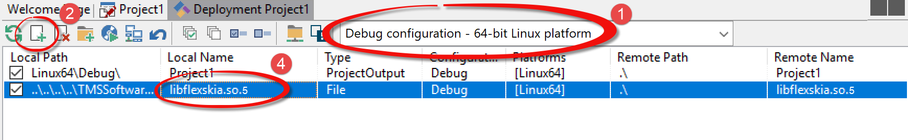
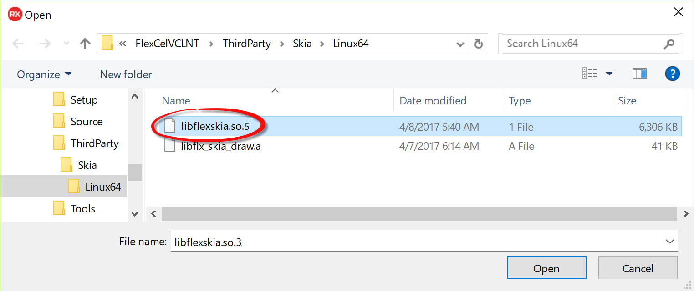

# FlexCel Linux Guide
Similar to the other platforms where FlexCel runs, most of the things you can do
with FlexCel in Linux are identical to what you do in FlexCel in Windows.

But also as in the other cases, there are differences too. We will cover them here.

## Installing FlexCel for VCL and FireMonkey in Linux
In order to install FlexCel in Linux, you need to have a Linux SDK installed in Rad Studio.

### Prerequisites
> [!Important]
> 
> If you are in **Ubuntu** and follow the official install instructions:
> http://docwiki.embarcadero.com/RADStudio/en/Linux_Application_Development#Installing_Linux_SDK
> Then there is nothing else you need to do. But the that might be overkill, since it takes about 2GB of hard disk and installs lots of stuff you don't really need.
> 
> If you want to do a more simple setup, the packages listed below are the only ones you need in order to install FlexCel.

Before installing the Linux SDKs, you need to ensure that you have the following installed in the Linux machine from where Delphi is reading the SDKs:

1. **Developer tools**
   * In Ubuntu: Open a terminal and write: `sudo apt-get install build-essential`
   * In Red Hat: Open a terminal and write: `yum groupinstall 'Development Tools'`

2. **zlib1g-dev**
   * In Ubuntu: Open a terminal and write: `sudo apt-get install zlib1g-dev`
   * In Red Hat: Open a terminal and write: `yum install zlib-devel`

> [!Note]
> 
> If you have already installed the SDK in Rad Studio, just installing zlib1g-dev or build-essential in Linux is not enough: **you need to update the SDK** after installing the packages. To update the SDK follow the steps 1 to 2 in the following section, then skip to step 5.

### Install or update the SDKs

You can see the installed SDKs in Rad Studio by following the steps:

1. In Rad Studio, open the Menu, select **Tools**, then **Options...**. Select **Environment Options** on the left treeview.
2. Select **SDK Manager** on the left treeview.
3. Review that you have a **64-bit Linux** SDK installed.
4. If there is no 64-bit Linux SDK installed, you can add one by pressing the "Add" button at the bottom:
   
5. If you already have the SDK installed, but are missing a library like **zlib-dev**, press "Update Local File Cache" at the bottom of the dialog. You will need to use this button every time you make changes to the installed libraries in your Linux Machine.

> [!Tip]
> 
> You can also add an SDK by creating an empty Linux console application and deploying it to the Linux machine.

## Using SKIA
You have 2 options to use FlexCel in Linux:

1. You can use FlexCel **without any graphics backend**. In this mode you will be able to read and write xls or xlsx files, calculate them, do reports, etc, but you won't be able to export them to pdf, html, svg, or anything that requires graphics support.

   To use FlexCel without graphics support, just use **FlexCel.Core** in all your units.

2. You can use FlexCel with **full graphics support**. This will enable you to export to pdf, html, etc, and virtually everything that the Windows version of FlexCel can do.

   When using FlexCel.SKIASupport, FlexCel will use the [Skia](https://skia.org) graphics library to get graphics support. Skia is the graphic library used in Google Chrome and Android.

   To use full graphics support, use **FlexCel.SKIASupport** once in your application. (Normally in the project source)

> [!Note]
> 
> Some things like autofitting rows and columns or getting the column width of a cell (but not the row height) require graphics support because we need to measure a text width or height. While those things are rare and most things work just fine without graphics support, **if you want to be safe that you can process any xls/x file, the simplest option is to just use SKIA.**

### Deploying libflexskia.so
If you decide to use **FlexCel.SKIASupport** then you need to deploy an additional .so file with your application. The file you need to deploy is **libflexskia.so.5** which is a shared object containing the Skia engine.

> [!Note]
> 
> This section **only** applies if you are using **SKIA**. If you are using FlexCel without a graphics backend then you don't need to deploy anything.

In order to deploy libflexskia with your project, you need to follow the steps below:

In Delphi, Go to the main menu, choose **Project** then **Deployment**.

Once in the Deployment Manager:

1. Make sure that the selected platform is "**Linux64**".

2. press the "+" button (marked with number 2 in the screenshot):

   

3. Select libflexskia.so.5 from the `<FlexCel install dir>\ThirdParty\Skia\Linux64` folder.

   

4. After you press Ok in the dialog, you should see the new file in the Deployment Manager.

> [!Note]
> 
> We use the standard system for versioning shared objects in Linux. This means, we link against libflexskia.so.**majorversion**.**minorversion** instead of just libflexskia.so. This is because you might want to use other libraries which also use libflexskia, but a different and incompatible version.
> 
> Also all versions with the same major number, like libflexskia.so.1.1 and libflexskia.so.1.2 are binary compatible and have the same [**soname**](https://en.wikipedia.org/wiki/Soname).
> 
> This means that if FlexCel comes with libflexskia.so.1.2 but you have libflexskia.so.1.3 you can just create a link from libflexskia.1.2.so to libflexskia.1.3 and FlexCel will use the latest .so.
> 
> **You can't do the same with different major versions of libflexskia, only with minor releases.**
> 
> 
> You can read more about it at [https://www.ibm.com/developerworks/linux/library/l-shlibs/index.html](https://www.ibm.com/developerworks/linux/library/l-shlibs/index.html)

### Installing required packages in Linux
**SKIA** requires some other libraries to be installed in Linux to work. Most of them are installed in the basic Linux distribution, like zlib, but you might need to install **fontconfig**.

* In Ubuntu: `sudo apt-get install fontconfig`
* In Red Hat: 'yum install fontconfig'

> [!Important]
> 
> **This is only required if you are using SKIA**. If you are using only FlexCel.Core, you don't need to deploy anything.

> [!Note]
> 
> **The libraries you need in the machine where you will run your app are different from the libraries you need to install in your development Linux machine**.
> 
> For example, as explained in [Prerequisites](#prerequisites): in the development machine (the one with PAServer) you need zlib1g-**dev**. This package is the developer version of zlib, and it is not installed by default in a Linux distribution, so you likely have to install it.
> 
> But in the machine where your users will use your app, you don't need **zlib1g-dev**, you just need **zlib** which is installed by default.
> 
> In the same way, **fontconfig** is required in the machine where you will deploy your app, but not in the development machine.
> 
> A short recap:
> *  **Development machine**: You need **zlib1g-dev** and **build-essential** (ubuntu) or "**Development Tools**" (Red Hat).
> *  **Machine where you will deploy**: You need fontconfig.

## Limitations
When using FlexCel with the supplied **SKIA** library, almost everything that is possible in the Windows version of FlexCel can also be done in Linux.

But there are some things that aren't supported.
1. Currently FlexCel doesn't support encrypted files in Linux.
2. There is no printing or print previewing.

# Installing in a Docker container

Besides the information in this guide, make sure to read [Running FlexCel inside Docker containers](xref:RunningFlexCelInsideDockerContainers)
