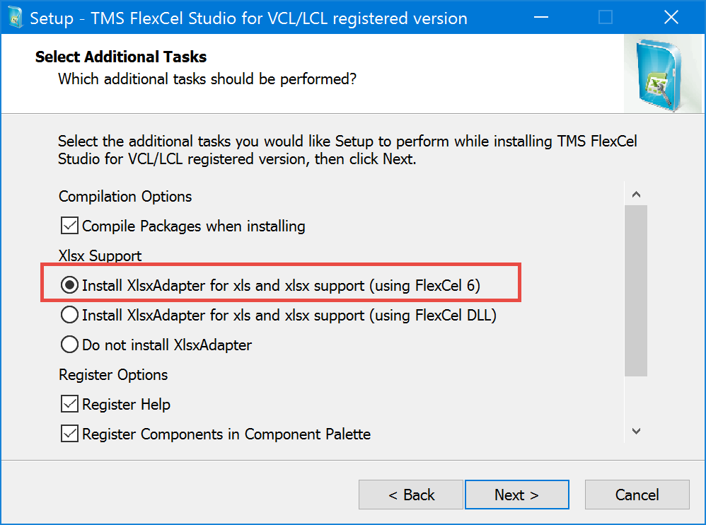
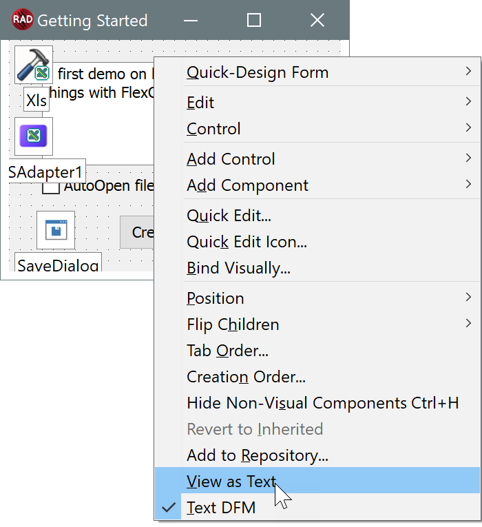
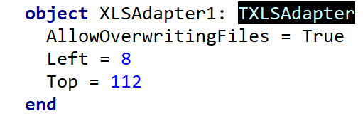
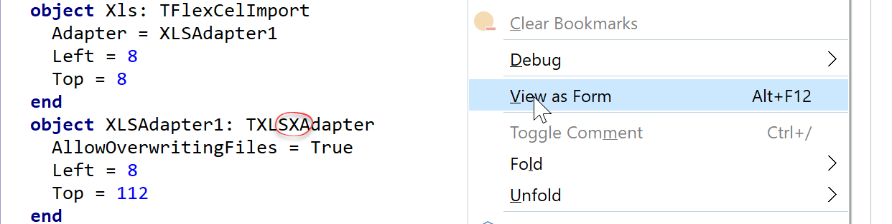
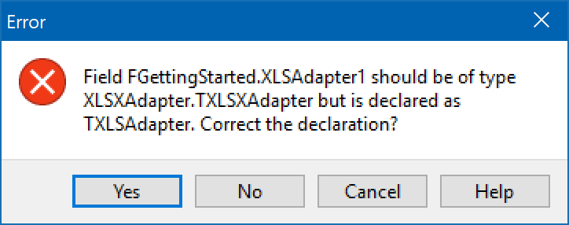
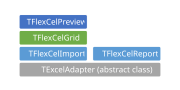
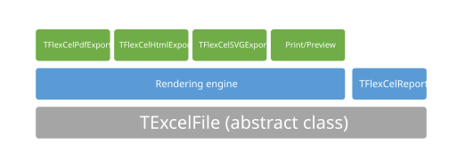
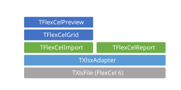
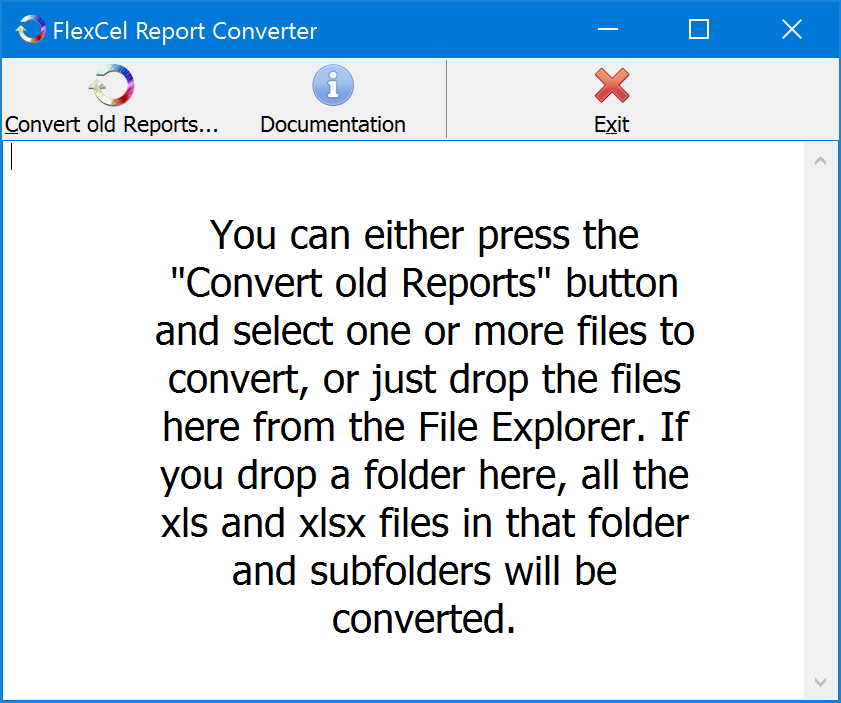

# Migrating From FlexCel 3

## Introduction

FlexCel 5 was a rewrite from scratch, with many changes and improvements over the old FlexCel 3 codebase. No code is shared with FlexCel 3, and with so many changes it might be a little difficult to migrate all the existing code. This document tries to help in the process.

## Installing FlexCel 3 and 7 in parallel

The first thing to notice is that we designed FlexCel 7 so that **you can install both FlexCel 3 and 7 in the same machine**. Unit names are different, component names are different, and there aren’t any conflicts installing both. We’ve made this by design, so **you can keep using FlexCel 3 while migrating to FlexCel 7**. What is better, you can use FlexCel 3 with the new FlexCel 7 xls/x classes, and get xlsx support in the FlexCel 3 components. There is no need to do all the conversion at once, you can mix both old and new code. And FlexCel 3 keeps being supported, with new versions released to fix existing bugs.

### Where to get the latest FlexCel 3?

The latest FlexCel 3 is available on demand, to avoid mistakes and people downloading the wrong version. If you know you need FlexCel 3, just write to info@tmssoftware.com attaching your registration email and code and we will send you the latest version. 

### Using FlexCel 3 with the FlexCel 7 engine

The latest FlexCel 3 releases include a new component, **TXlsxAdapter**, which uses FlexCel 7 or newer engine to read and write xls/x files and provides an interface that the old v3 components can use. The architecture based in Adapters in FlexCel 3 makes this possible, and the same way we used to have a TOLEAdapter in FlexCel 2 which would use OLE Automation to do its job, we now have a TXlsxAdapter which uses FlexCel 7 to do it.

In order to start the migration, you should follow the steps below:

1. Install FlexCel 7 or newer.

2. Get the latest FlexCel 3 from our site

3. Install the latest FlexCel 3 **after** you installed FlexCel 7.

4. When installing FlexCel 3, it will offer to install **TXlsxAdapter**:

   

   Install it.

5. Once both have been installed, replace all the TXlsAdapter components in your forms/datamodules by TXlsxAdapters. There is no need to keep using the v3 TXlsAdapter, as TXlsxAdapter is faster, uses less memory, supports both xls and xlsx and has a lot of newer features like encrypted files support or recalculation.

Once you completed those steps, your application should keep working as before, but using the new FlexCel 7 engine. Now you can focus in moving the code to use FlexCel 7 and stop using the FlexCel 3 components, but with no hurry: you can do it at your own peace. By replacing the TXlsAdapters in your app by TXls**x**Adapters, your app got access to most of the features in FlexCel 7.

### Replacing XlsAdapter by XlsxAdapter

In the last section, we told you to replace the TXlsAdapters by TXlsxAdapters, but we didn't tell you how. The first idea that comes to mind is to just delete the TXlsAdapters in your forms, then drop new TXlsxAdapters instead. But the problem with this approach is that you will lose all properties you had in your TXlsAdapters and you will have to set them again in the new TXlsxAdapters, and you will also have to reconnect all components like FlexCelReport or FlexCelImport to the new TXlsxAdapters.

There are third party solutions like [GExperts](http://www.gexperts.org) which can do replace the components in place without losing the properties, but you can also do it from Delphi itself without needing to install anything. The steps are as follows:

1. Right click on the form where the TXlsAdapter is, and select "View as Text":

2. In the form text, search for TXlsAdapter

3. Add an x so it converts into TXls**x**Adapter

4. Right click on the code, and now select "View as Form"

5. Now Save the project. Don't try to correct the code, just press save. Delphi will realize that you changed the TXlsAdapter into a TXlsxAdapter and will pop up this dialog:

6. Click on "Yes". Your app has now been migrated to use TXlsxAdapters.

## Architectural changes

If we focus in the main components (forgetting helper components like TTemplateStore or TFlxMemTable), the original v3 FlexCel architecture looked something like the following:

TExcelAdapter was an abstract class that provided an interface between an actual Excel file and the components doing the work. We originally provided two different implementations of TExcelAdapter: **TXlsAdapter** (native interface) and **TOleAdapter** (interface using OLE Automation). Then you could plug TFlexCelReport into a TXlsAdapter and have a report generated natively, or plug it to an OLE Adapter and have the report generated by OLE Automation.

This was a nice abstraction and it worked fine at the beginning (when we only had a FlexCelReport component), but with the introduction of FlexCelImport (a component that was originally designed to only read xls files as its name implies, but later was expanded to also write files) things got a little too complex.

As you can see in the diagram, you have an "Adapter" and a "FlexCelImport" class that do mostly the same. So most of the methods (but not all) in FlexCelImport, just call the same method in the ExcelAdapter engine. This meant not only a lot of redundant code (and redundancy is one of the main things that we want to avoid), but also a lot of confusion in users who didn't know what to use, if ExcelAdapter or FlexCelImport. We explained in the documentation that you should use FlexCelImport and not ExcelAdapter, but people kept using ExcelAdapter. And when people keeps doing the "wrong" thing despite what the docs say, this normally means not a problem in the docs or the users, but a deeper problem in the conceptual design of the code. This wasn't as intuitive as it could be.

The last problem with this architecture was that FlexCelImport was at the same level as FlexCelReport, so they couldn't "see" each other. The design was top-down, and the components at the top can only know about the components at the bottom. So in the events where FlexCelReport allowed hand-optimization of the code, it had to expose an Adapter component (the only thing it knew about) and not a FlexCelImport component.

But you were supposed to use FlexCelImport to do manual modifications in the file, not the Adapters.

If we sit back and take a look from the distance, all the problems came from the fact that FlexCelImport was added as a separate layer over the Adapter components, and it didn't had to be that way. So, in v7 we only have one class to read and write Excel files, and it is at the bottom where everybody else can use them, as it should be. There is no more FlexCelImport in v7, and the scheme looks something like this:

Now the 3 main components (The API, the Reports and the Rendering engine) are organized in a cleaner way. FlexCelReport can use TExcelFile, and so can the rendering engine. There is no need for the rendering engine to use the reports or vice versa, so those are fine being at the same level.

The new TXlsxAdapter bridge between FlexCel 3 and 7 would work the following way:

In this way, TXlsxAdapter uses the TXlsFile class in FlexCel 7 to read and write Excel files, and provides a TExcelAdapter interface to the old FlexCel 3 components that they can use.

## Where have my components gone?

The first thing that you will notice when you install FlexCel 7 is that there are only a couple of components installed in the toolbar. All the older components aren’t installed, and won’t be available unless you install FlexCel 3 together with FlexCel 7.

This is by design, as **we have changed all non visual components to classes**. The main reason for the change was that Delphi doesn’t allow you to install two components with the same name in the palette, so if we kept the old components, we would have to rename them all in order to allow you to install both FlexCel 3 and 7 in parallel. In the case of FlexCelPreview, we had to rename it to “FlexCelPreviewer” in order to allow you to install both. But FlexCelPreviewer is a visual component, so there is value in having it registered. For non visual components like FlexCelReport, there is no real advantage of having them as components, and we didn’t want to rename them all to “TFlexCelReporter”, etc just to have them installed. For non visual stuff components only add complexity and no real benefits.

This means that now, instead of dropping a TFlexCelImport into a form, you would write the following code: (note that TFlexCelImport changed to [TXlsFile](~/api/FlexCel.XlsAdapter/TXlsFile/index.md), see the "FlexCelImport" section below)

<pre class="shiki shiki-themes light-plus dark-plus" style="background-color:#FFFFFF;--shiki-dark-bg:#1E1E1E;color:#000000;--shiki-dark:#D4D4D4" tabindex="0"><code>var
  xls: TXlsFile;
begin
  xls := TXlsFile.Create(true);
  try
    DoSomething(xls);
  finally
    xls.Free;
  end;
end;
</code></pre>

In the following sections we will discuss each one of the FlexCel 3 components and their replacement in FlexCel 7.

### TXlsAdapter

As discussed in the “Architectural changes” section above, this new version doesn’t use Adapters. There is no need for it anymore.

### TFlexCelImport

TFlexCelImport is now [TXlsFile](~/api/FlexCel.XlsAdapter/TXlsFile/index.md). TFlexCelImport was an old name from version 2.0 where it appeared. At that time, FlexCelImport could only be used to read, so the name made sense. But soon after that it got the ability to create files, and in fact the main use of FlexCelImport was to “Export”, which made the name kind of confusing. As we were doing spring cleaning with FlexCel 5, we renamed it to something that made more sense.

> [!Note]
> 
> TFlexCelImport-&gt;TXlsFile renaming happened in FlexCel 3 for .NET back in 2003, before xlsx existed. After xlsx was released TXlsFile is name is also a little confusing because it can be an xlsx file besides xls, but we didn’t want to rename it again. We prefer to have the same name classes as in FlexCel .NET whenever technically possible.

Most of the methods in [TXlsFile](~/api/FlexCel.XlsAdapter/TXlsFile/index.md) are similar to those in TFlexCelImport, but there is a visible difference: In TXlsFile we don’t use indexed properties.

While in FlexCel 3 we would use FlexCelImport.CellValue\[row, col\] := value, now we use xls.SetCellValue(row, col, value);

All indexed properties have been changed to Get/Set methods. The reason for this was that C++ builder has a lot of issues supporting indexed properties, and we got too many Access Violations due to bugs in the way C++ builder handled them. If we add the fact that they aren’t supported in C\# and we wanted to keep as much code compatibility between FlexCel.NET and FlexCel for Delphi, the syntactic sugar of indexed properties wasn’t worth the trouble.

Another difference is that there is no more InsertAndCopyRows/Columns. Now there is a single [TXlsFile.InsertAndCopyRange](~/api/FlexCel.XlsAdapter/TXlsFile/InsertAndCopyRange.md) method that can insert, copy or insert\_and\_copy a range of cells, or full rows, or full columns.

Once you get used with the changes, migrating code from FlexCelImport to XlsFile is very simple and straightforward. All methods in FlexCelImport have a direct equivalent in XlsFile.

> [!Note]
> 
> FlexCel 7 comes with a tool, [APIMate](xref:GettingStarted#2-creating-a-more-complex-file-with-code), which is available in the Start menu-&gt;TMS FlexCel-&gt;Tools. APIMate will convert an xls/x file to FlexCel 7 code (both Delphi or C++ builder). So if you are in doubt on how to translate a particular call in FlexCelImport to XlsFile, you can just create a file with FlexCelImport, open it with APIMate, and see the code in TXlsFile.

### TFlexCelReport

TFlexCelReport has changed a lot from FlexCel 3 to 7. As always changes go back to the redesign we made for FlexCel.NET in 2003, and makes uses of tens of years of experience with the old FlexCelReport to avoid the drawbacks in the original component.

Let’s begin by remembering how the old FlexCelReport used to work. We could identify 3 layers, which could be loosely mapped to the Model, Controller and View in an MVC app:

The idea was to do all the work where it belongs. So, we made all the data manipulation at the data layer (sorting, grouping, etc) while the presentation (colors, fonts, etc) was made directly on Excel. We tried to keep the Interface layer as small as possible, almost reduced to a call to “FlexCelReport.Run”

This is an elegant and very powerful approach, and FlexCel 7 keeps it mostly this way. But, one of the nicest features of FlexCel is the ability your final users get to customize their reports, on a report designer that they already know, Excel. And as we like this feature so much, FlexCel 7 is targeted to allow your users to customize more things.

So now lot of the stuff that was done at the data layer in FlexCel 3 can be now done at the presentation layer in FlexCel 7, while of course it can still be done at the data layer. But doing the data manipulation in the Excel template allows to modify it without recompiling the application. In fact, using the new [DirectSQL](xref:Direct_SQL-Delphi) commands, you can even do the queries directly from the template, leaving the logic in the data layer almost empty. How much logic you keep in the data layer and how much you move to the presentation layer is up to you, depending on your needs.

Following are some features that expand the Excel layer and let the users do more directly in the template:

-   **New syntax for all tags**. The original syntax of \#\#table\#\#field dates back to the first internal FlexCel version in 1996, and has the problem that FlexCel can’t know where the tag ends. Now the tag is delimited by angular brackets, like &lt;\#table.Field&gt;. This allows us to put more than one tag in the same cell, like “&lt;\#employee.lastname&gt;, &lt;\#employee.firstname&gt;”. Also the tags with 3 dots like “...delete row...” proved problematic, because since Excel 2002 the 3 dots (...) are converted to an ellipsis (…) automatically when you enter them in a cell. While they look similar to the eye, they are different characters and source for lots of frustration. So now all the tag syntax is unified to &lt;\#tag(parameters)&gt;, and ...delete row... is now &lt;\#delete row&gt;

-   **&lt;\#config&gt; sheet**: In this new reserved sheet you can do a lot of data manipulation that before could be done only at the data layer. You can even write SQL queries to be sent to the server in this sheet.

-   **&lt;\#include&gt; command**: This tag allows for modular reports. You can insert a report inside another report, so for example all of them could insert the same shared header.

-   **&lt;\#if&gt; command**: This allows you to take different actions depending in some condition. So for example the tag: “&lt;\#IF(&lt;\#Data&gt;="";&lt;\#Data&gt;;&lt;\#delete row&gt;)&gt;” would insert the report variable data if it isn’t null, or delete the row otherwise. If expressions make use of the full Excel recalculation engine in FlexCel, so you can create conditions as complex as any Excel formula.

-   **&lt;\#evaluate&gt; command**: Allows simple expression evaluation on cells. For example: &lt;\#Evaluate(&lt;\#tax&gt;\*0.32)&gt; will return the report variable tax multiplied by 0.32.

-   **Report expressions:** Now you can define expressions in the config sheet that will be reused in the report. So in the &lt;\#evaluate&gt; example above, you can define a new report expression named TAXCorrected which is assigned to &lt;\#Evaluate(&lt;\#tax&gt;\*0.32)&gt; and use &lt;\#TAXCorrected&gt; instead of &lt;\#Evaluate(&lt;\#tax&gt;\*0.32)&gt; in the report. This allows a lot of flexibility, and if tomorrow you need to change 0.32 to 0.33, you just need to change the report expression.

-   **Columnar and range reports:** Now in addition to the exiting “\_\_Range\_\_” ranges you can define ranges that grow horizontally or in a range of cells instead of full rows. The ranges available now are:

    -   **\_\_ :** Inserts full rows as before

    -   **\_ :** Inserts only the cells in the range down, not the full rows. This allows you to run parallel reports in columns.

    -   **II\_ :** Same as \_\_ ranges, but the range grows to the left instead of down.

    -   **I\_ :** Same as \_ ranges, but it grows to the left instead of down.

-   **Relationships:** Now you can create master detail relationships in the config sheet between tables, allowing to do master-detail reports on the flight.

-   **Multiple sheet reports defined in the sheets:** Now you name a sheet like &lt;\#db.field&gt; in order to make a report that creates a new sheet for every record in db, and names the sheet with the value in db.field.

-   **Intelligent Page Breaks:** Now you can select ranges of cells that FlexCel will try to “keep together” when running the report, so it will automatically insert page breaks before the range if needed to avoid half of the range appearing in one page and half in the next.

This is just a basic list of the changes you might expect, the list is too big to mention it all, and you can find out more with the reports documentation. But in order to convert a report from 3 to 7, you normally need to:

-   Remove the \_\_MAIN\_\_ ranges. Those aren’t needed anymore, even if keeping them will do no harm.

-   The \_\_datatable\_\_ names need no conversion, they are the same

-   \#\#db\#\#fields tags need to be changed to &lt;\#db.field&gt;

FlexCel comes with a utility: **ReportConverter**, which will do the above for you. **This isn’t a fully automated converter and some manually work might remain to be done after running it**, but it will take care of most of the grunt work.

This is how the interface for the converter looks like:

Just drop the files you want to convert on it, and it will create the new reports.

### TFlexCelTemplateStore

In FlexCel 3, we had a TemplateStore component that could be used to store templates in the exe. This component was needed because of two reasons:

1.  The original FlexCel 2 couldn’t read an xls file from a stream. So it needed the TemplateStore component to have that stream already parsed. The need for this was removed in FlexCel 3 when we introduced our own “OLE Document” parser which could read OLE documents (such as an xls file) directly from a stream. Before we used Windows APIs to open the xls envelope, and those didn’t support streams well.

2.  Older Delphi versions didn’t had a good interface to embed resources. Since FlexCel 7 supports only Delphi XE or newer, which already has the ability to embed resources, this isn’t a limitation either.

So, in order to embed a template in the exe you would:

1. In Rad Studio, go to the Menu-&gt;Project-&gt;Resources and Images:

   

2. In the dialog that appears, add the xls/x files you need. For every file, give it a meaningful resource identifier at the right:

   

3.  Now, to open the file from your code use a TResourceStream:

<pre class="shiki shiki-themes light-plus dark-plus" style="background-color:#FFFFFF;--shiki-dark-bg:#1E1E1E;color:#000000;--shiki-dark:#D4D4D4" tabindex="0"><code>var
  TemplateStream: TResourceStream;
...
  TemplateStream := TResourceStream.Create(hinstance, 'TemplatesInTheExe', RT_RCDATA);
  try
    FlexCelReport.Run(TemplateStream, OutStream);
  finally
    TemplateStream.Free;
  end;
</code></pre>

The main advantage of the new approach is that **there is no need to refresh the templatestore anymore.** Now, every time you recompile your app, all the latest versions of the templates will be included. When using TemplateStore, there was a risk that you forgot to refresh the store and you wouldn’t deploy the newest versions. Also TemplateStore saved the templates in the dfm, making them big and difficult to work with version management tools like git or subversion.

You can see an example of embedding templates at the [Templates in the exe demo](xref:Templates_In_The_Exe-Delphi)

### TFlxMemTable

TFlxMemTable was two components in one:

1.  An in memory dataset that you could use to fill data and feed FlexCelReport. So if you had for example a TList&lt;Employee&gt;, you could fill the data in a TFlxMemTable and use that to run the report. As FlexCelReport 7 now can run reports directly from TList&lt;T&gt;, this isn’t needed anymore. If your data is in a TList, just use that directly instead of filling a TFlxMemTable. If it isn’t, you can fill a TList and run the report from there. If there is some special case where you really need an in memory datatable, there are many third party ones which are more optimized to their work than what TFlxMemTable could be.

2.  As a “Virtual dataset” which would provide an interface for TFlexCelReport from your data. You would need to define some events like the record count and what the value was for a row and a column, and it would map that to something FlexCelReport could use. Again, this was mostly used to do reports on TLists, which now FlexCelReport supports natively. But if you need this virtual functionality, you can do it by creating classes that descend from “TVirtualDataTable” and “TVirtualDataTableState” and overriding the corresponding methods. Note that because FlexCel 7 allows much more things to be done with the data (like sorting and filtering), you would need to define that too in your classes or they won’t support those features.

### TFlexCelGrid

FlexCelGrid isn’t currently supported in FlexCel 7, so if you need it you will have to keep using the grid in FlexCel 3 with a TXlsxAdapter. We do provide a TFlexCelPreviewer component (see entry below) which can be used to print and preview Excel files, but not a spreadsheet component. There aren’t current plans to add a spreadsheet component, but this could of course change in the future.

### TFlexCelPreview

Use TFlexCelPreviewer. TFlexCelPreviewer is much more featured than the old TFlexCelPreview, and it provides a much better rendering of an Excel spreadsheet.
