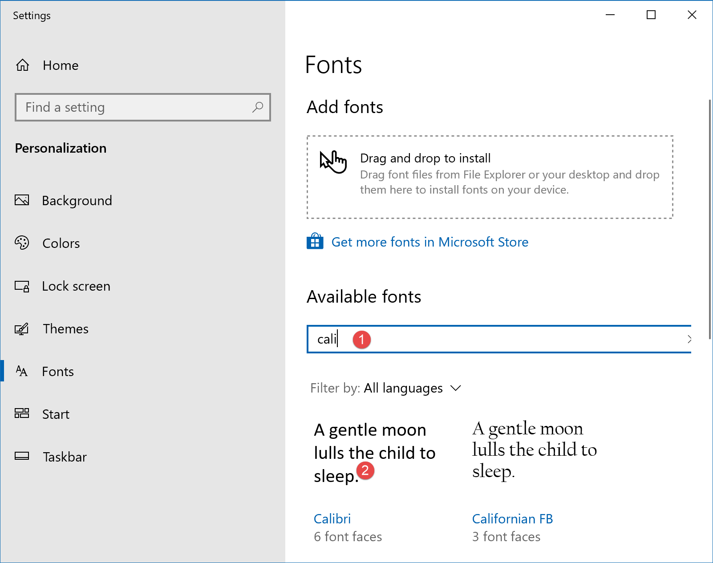
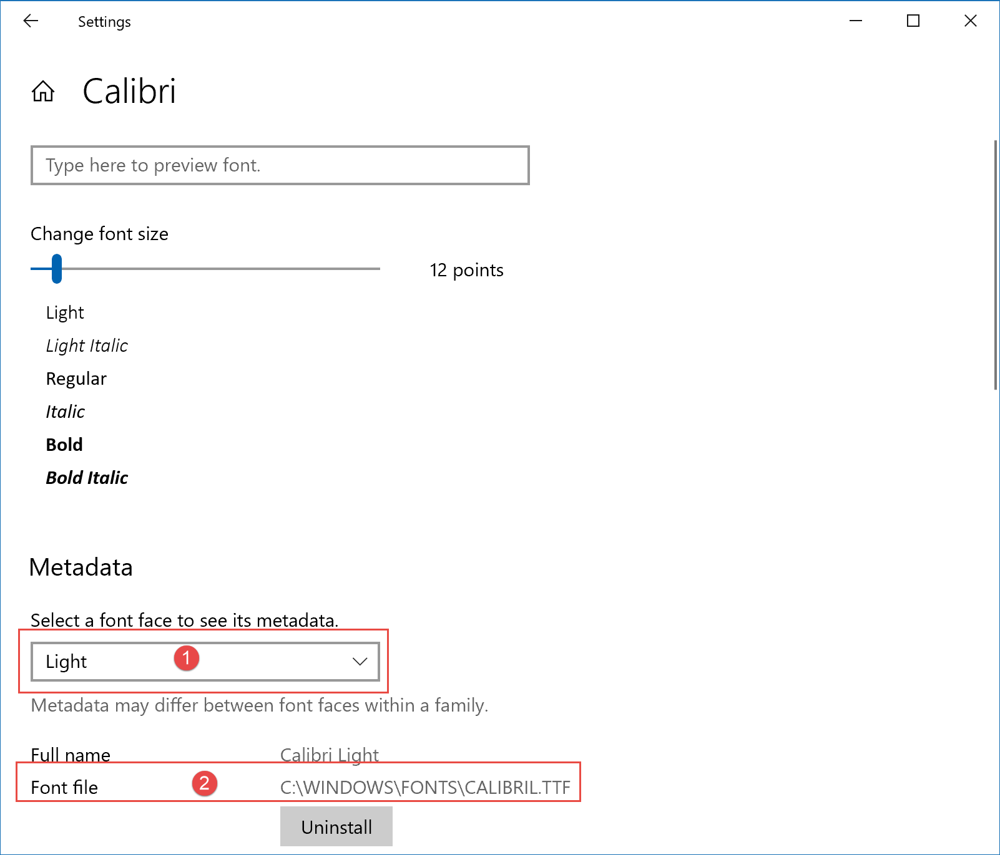
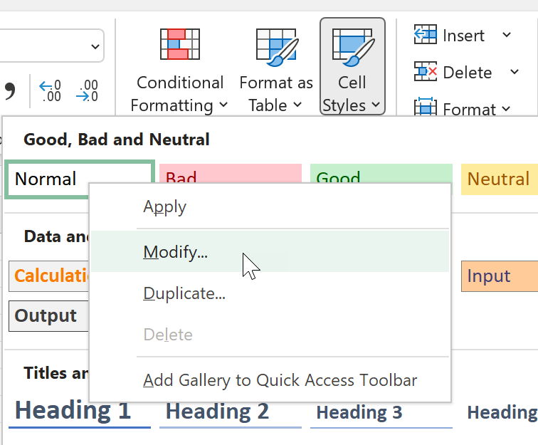
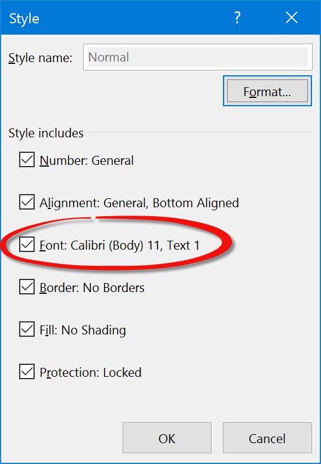
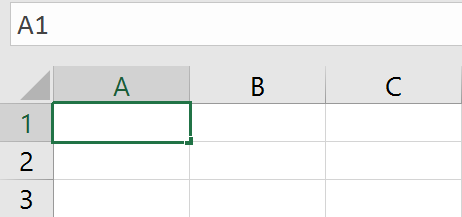
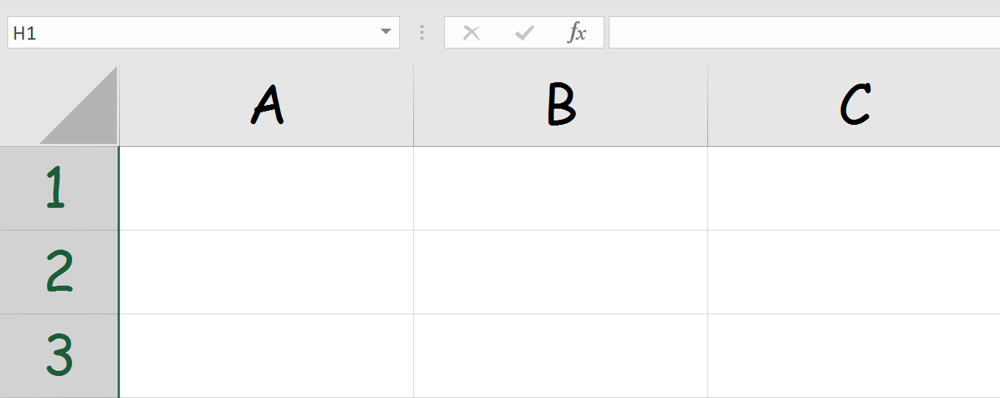
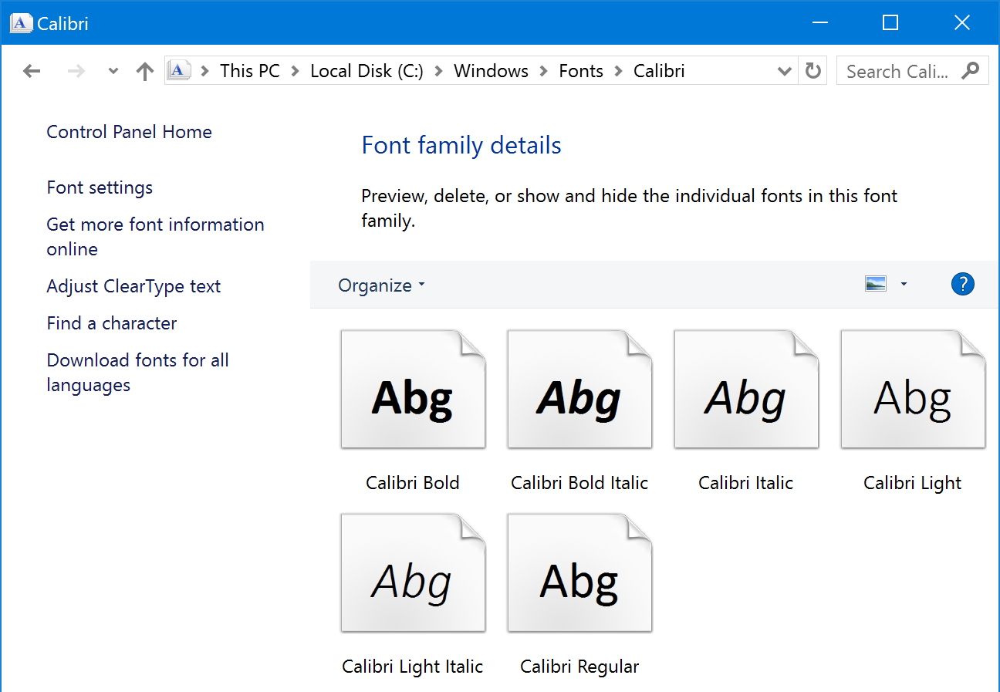
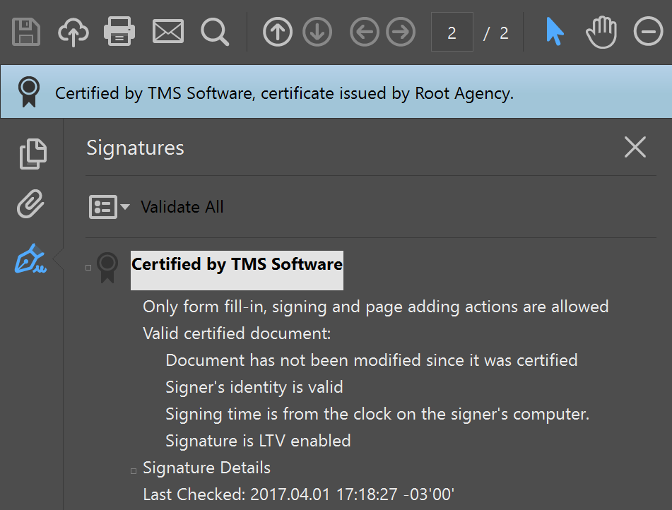

# FlexCel PDF Exporting Guide

## Introduction

FlexCel comes with a full PDF writer that allows you to natively export Excel files to PDF, without needing to have Acrobat or Excel installed. While the output will not be exactly the same as Excel, a lot of effort has been done to make it as similar as possible.

## Creating PDF files

FlexCel provides two ways to create a PDF file. At a higher level, you can use **[TFlexCelPdfExport](~/api/FlexCel.Render/TFlexCelPdfExport/index.md)** component to convert an Excel file into a PDF file. At the lower level, you have the **[TPdfWriter](~/api/FlexCel.Pdf/TPdfWriter/index.md)** class, that provides a primitive API to create PDF files.

### Using PdfWriter

[TPdfWriter](~/api/FlexCel.Pdf/TPdfWriter/index.md) is a lower level option, and it was really not designed to be used directly, but to provide the methods [TFlexCelPdfExport](~/api/FlexCel.Render/TFlexCelPdfExport/index.md) needs to do its job.

But it can be used standalone to create a PDF file for scratch, or most likely to **modify the output from TFlexCelPdfExport using one of the [TFlexCelPdfExport.BeforeGeneratePage](~/api/FlexCel.Render/TFlexCelPdfExport/BeforeGeneratePage.md) or [TFlexCelPdfExport.AfterGeneratePage](~/api/FlexCel.Render/TFlexCelPdfExport/AfterGeneratePage.md) events**.

We will not cover it in detail here since methods are documented in [TPdfWriter](~/api/FlexCel.Pdf/TPdfWriter/index.md), but it is worth mentioning that there is also an example to get you started in the [API Demos](xref:Creating_Pdf_Files_With_PDF_API-Delphi).

### Using FlexCelPdfExport

This is a higher level option, and the one you would normally use.
The simplest skeleton to export a file to pdf would be:

<pre class="shiki shiki-themes light-plus dark-plus" style="background-color:#FFFFFF;--shiki-dark-bg:#1E1E1E;color:#000000;--shiki-dark:#D4D4D4" tabindex="0"><code>var
  pdf: TFlexCelPdfExport;
...
  pdf := TFlexCelPdfExport.Create(xls, true);
  try
    pdf.Export('result.pdf');
  finally
    pdf.Free;
  end;
</code></pre>

While the above snippet of code should be enough in many cases, you can add to it in the following ways:

1.  You can set the [TFlexCelPdfExport](~/api/FlexCel.Render/TFlexCelPdfExport/index.md) properties. You will find there are not a lot of properties (things like margins, printing gridlines or not, etc) and this is because all this information is read from the Excel file. If you need to change them, change the associated properties on the attached [TXlsFile](~/api/FlexCel.XlsAdapter/TXlsFile/index.md) object.

For example, to change the page margins you can use the [TExcelFile.SetPrintMargins](~/api/FlexCel.Core/TExcelFile/SetPrintMargins.md) method.

> [!Tip]
> 
> As always, you can use **[ApiMate](xref:GettingStarted#2-creating-a-more-complex-file-with-code)** to find out how to change the printer settings in the TXlsFile object.

But while all the document-specific settings are stored in the [TXlsFile](~/api/FlexCel.XlsAdapter/TXlsFile/index.md) object, that doesn't mean there aren't properties specific to the PDF output. You can change things like the [PdfType](~/api/FlexCel.Render/TFlexCelPdfExport//PdfType.md) or [Kerning](~/api/FlexCel.Render/TFlexCelPdfExport//Kerning.md) used in the PDF export.
Make sure to take a look at the available properties in the documentation for [TFlexCelPdfExport](~/api/FlexCel.Render/TFlexCelPdfExport/index.md)

2. You can export multiple Excel files to the same PDF file. To do that, you use [TFlexCelPdfExport.BeginExport](~/api/FlexCel.Render/TFlexCelPdfExport/BeginExport.md), then [TFlexCelPdfExport.ExportSheet](~/api/FlexCel.Render/TFlexCelPdfExport/ExportSheet.md)  or [TFlexCelPdfExport.ExportAllVisibleSheets](~/api/FlexCel.Render/TFlexCelPdfExport/ExportAllVisibleSheets.md), and finish the exporting by calling [TFlexCelPdfExport.EndExport](~/api/FlexCel.Render/TFlexCelPdfExport/EndExport.md)

An example of multiple files would be:

<pre class="shiki shiki-themes light-plus dark-plus" style="background-color:#FFFFFF;--shiki-dark-bg:#1E1E1E;color:#000000;--shiki-dark:#D4D4D4" tabindex="0"><code>  pdf := TFlexCelPdfExport.Create;
  try
    pdf.AllowOverwritingFiles := true;
    pdfstream := TFileStream.Create('result.pdf', fmCreate);
    try
      pdf.BeginExport(pdfstream);
      pdf.Workbook := xls1;
      pdf.ExportAllVisibleSheets(false, 'First file');
      pdf.Workbook := xls2;
      pdf.ExportAllVisibleSheets(false, 'Second file');
      pdf.EndExport;
    finally
      pdfstream.Free;
    end;
  finally
    pdf.Free;
  end;
</code></pre>

## Font Management

The font handling when creating pdf files can be problematic, so here we discuss some concepts related to them.

### Selecting which fonts to use

First of all, you need to know that there are two different kinds of fonts supported by FlexCel's TPdfWriter.

1. **PDF internal fonts**. PDF defines 14 standard fonts that must be available to any PDF viewer, so you don't need to embed the fonts on the PDF document. They will always be supported by the PDF viewer.

   Those fonts include a **Serif** (Times New Roman-like), a **Monospace** (Courier-like) and a **Sans Serif** (Arial-like) alternatives, on four variants each (regular, bold, italic and bold italic) and two Symbol fonts.

   What those fonts **don't** include is Unicode characters outside the ASCII range, so if you are using those, you can't use internal fonts.
   **FlexCel will automatically change the fonts to be true type if your document contains characters outside the ASCII range**.

2. **True Type fonts**. Those are standard Windows fonts.

When exporting to PDF, you can choose between three different ways to handle fonts, depending on the value you set on the [TFlexCelPdfExport.FontMapping](~/api/FlexCel.Render/TFlexCelPdfExport/FontMapping.md) or [TPdfWriter.FontMapping](~/api/FlexCel.Pdf/TPdfWriter/FontMapping.md) property:

1.  **ReplaceAllFonts**. This will replace all fonts on the xls file to the most similar ones on the 14 standard fonts. This way you get the minimum file size and the maximum portability, but the exported PDF file might not look exactly the same, as you will lose all fancy fonts.

2.  **ReplaceStandardFonts**. This is a compromise solution. It will only replace Arial, Times New Roman and Courier for the standard fonts, and use True type for all the others. You will get a bigger PDF file (if you embed the true type fonts), but it will look the same as the Excel file.

3.  **DoNotReplaceFonts**. This will only use true type fonts. It will be the one that better matches the xls file, but it will be a lot larger (if you embed the true type fonts) or might not look good when the user does not have the fonts you used installed (if you don't embed them)

> [!Note]
> 
> Besides choosing how the fonts will be replaced when creating the PDF, you can also choose whether to embed the True Type fonts or not. If you embed them, the file will be bigger, but also will render well when the user does not have the fonts on his machine. To avoid issues, it is normally recommended that you embed all fonts.

> [!Important]
> 
> **If you use Unicode characters, the fonts will always be embedded no matter which embed option you choose**. This is needed to ensure that the Unicode mapping will remain correct.

> [!Note]
> 
> With the rise of **Android** and **iOS** devices you can't just assume that the final user will have any fonts (not even Arial) installed on the device where he is reading the file.
> 
> If you add the fact that the size increase by embedding the fonts isn't that much given the size of even a small webpage, **we can only recommend you that you just embed all fonts**.
> 
> FlexCel used to default to not embedding fonts, but since version 6.5 it defaults to embedding all fonts.

### Font Subsetting

When embedding fonts you can choose if to embed the full font, or just the characters that were actually used in the document. You can control this with the property [TFlexCelPdfExport.FontSubset](~/api/FlexCel.Render/TFlexCelPdfExport/FontSubset.md)

If you embed just the subset of characters used, the file will be as you might expect smaller. For big fonts with thousands of characters the subsetting can make a big difference in size.

But on the other hand, if you embed only the subsets, the final users might not be able to edit the PDF document to add text, since the characters they might want to add might not be in the embedded subset.

You might see the issue that users won't be able to so easily edit the PDF documents as a feature, since PDF files are not normally generated for editing. And this is the reason FlexCel defaults to subsetting all fonts.

But if you care about the users being able to edit the PDF files you create, remember to set [TFlexCelPdfExport.FontSubset](~/api/FlexCel.Render/TFlexCelPdfExport/FontSubset.md) := true.

### Accessing True Type data.

In order to embed fonts and get many font metrics that we need to create the pdf file, FlexCel needs to access the raw *.ttf files directly. FlexCel uses different ways to access the font data depending on the platform you are using (Windows, iOS, Android, etc):

1. On Linux , iOS and macOS FlexCel asks the operating system for the font data directly, and there is nothing that you need to do.
2. On the rest of platforms (Windows  and Android) FlexCel looks for the font folder, and reads the files directly from there.

When reading the ttf files from disk, FlexCel will try to locate the files in the following folders:

- **OS default font folders**.

- if the folder above doesn't exist, FlexCel will search on “**&lt;folder where your application is&gt;/Fonts**”.

- If still failing to find the font folder, FlexCel provides a **[TFlexCelPdfExport.GetFontFolder](~/api/FlexCel.Render/TFlexCelPdfExport/GetFontFolder.md)** event that allows you to specify where fonts are stored on your system. Here you can tell FlexCel where the fonts are.

> [!Note]
> 
> Avoid using the GetFontFolder event if you can, since when you use it your code will not transparently run on different platforms. A Symbolic link from the FlexCel installation folder to the fonts should be a more elegant solution.

- Finally, if you have your true type fonts not available as files, but maybe as resources or entries in a database, you can use the **[TFlexCelPdfExport.GetFontData](~/api/FlexCel.Render/TFlexCelPdfExport/GetFontData.md)** event to provide the font data directly instead of a folder where FlexCel will look for the files.

### Fonts in Windows

Since Windows 10 version 1809, Windows has two different default font folders. The classic "c:\Windows\Fonts" (or similar) for all users, and a new folder for the current user only, located at %localappdata%\Microsoft\Windows\Fonts

FlexCel 7.6 or newer will search in both folders by default. If you are in an older FlexCel version, you might want to use the [TFlexCelPdfExport.GetFontData](~/api/FlexCel.Render/TFlexCelPdfExport/GetFontData.md) event to specify both folders. You will need to check if the %localappdata%\Microsoft\Windows\Fonts folder exists (because FlexCel versions older than 7.6 will raise an exception if any of the folders you pass to the GetFontFolder event don't exist). If the folder exists, you will need to pass both the global-font-folder and the user-font-folder to the event, separating them with a semicolon (;)

> [!Note]
> 
> Newer versions of Office 365 have [Cloud Fonts](https://support.microsoft.com/en-ie/office/cloud-fonts-in-office-f7b009fe-037f-45ed-a556-b5fe6ede6adb?ui=en-us&rs=en-ie&ad=ie) which are fonts that are not available to Windows, only to Office.
> 
> Those fonts are installed in a private folder (which at the time of writing seems to be %localappdata%\Microsoft\FontCache\4\CloudFonts in Windows and ~/Library/Group Containers/UBF8T346G9.Office/FontCache/4/CloudFonts in macOS, but those folders might change)
> 
> FlexCel (and Windows itself) won't see those fonts, unless you add them to the Fonts search folder using the [TFlexCelPdfExport.GetFontData](~/api/FlexCel.Render/TFlexCelPdfExport/GetFontData.md) event. If you want to use those fonts in your document and with FlexCel, we would recommend that you install them in the Windows Fonts folder. But always check the font license to see if you are allowed to do so.
> 
> See also [this Cloud Fonts tip](xref:CloudFonts)

> [!Important]
> 
> It is strongly recommended that you install the fonts in the operating system itself. If you just change the font path with the [TFlexCelPdfExport.GetFontData](~/api/FlexCel.Render/TFlexCelPdfExport/GetFontData.md) event, FlexCel will be able to find the font, but the OS itself will not. FlexCel uses OS functionality for example to measure the fonts, so if the OS can't see the fonts, it will likely report invalid data, unless there is a very similar substitute font.

#### Finding where a font is installed

As explained above, a font might be installed in different folders, and new "default" font folders might appear in the future. If you see a font installed in Windows and want to know where the font actually is, you can follow the steps below:

1. In the start menu, search for "Font Settings"

2. In the font dialog, search for the font you want, and double-click it. 
   

3. Once in the font, click in "Metadata" (1) and select the variant you want. Note that different font variants might be installed in different files, and even in different folders. Once selected, you should see the filename of the actual font file below (2)
   

### Fonts in iOS and macOS

On iOS and macOS, FlexCel can access the true type directly from the Cocoa framework, so exporting to pdf should work without issues and without any extra step in those platforms. Note that in any case, the fonts available might be different from the fonts available in a Windows machine. You can get a list of fonts available in macOS here: <http://en.wikipedia.org/wiki/List_of_typefaces_included_with_Mac_OS_X> and in iOS here: <http://iosfonts.com>

### Fonts in Android

At the time of this writing, in Android there are only 4 predefined fonts available for every app (Droid Sans, Droid Serif, Droid Mono and Roboto). This means that unless you want to use the internal pdf fonts, your application will have to provide its own fonts.

As in Android you will normally deploy your fonts as assets, FlexCel comes with prebuilt functionality for handling Assets. You can read more about it at [the Fonts section of the Android Guide](xref:AndroidGuide#fonts)

### Fonts in Excel 2007 and newer

Excel 2007 changed the default font in a new file to be “Calibri” instead of “Arial”. This might bring you problems if you develop in a machine that has Excel 2007 installed, but you deploy in a server that doesn't. There are two solutions to this:

1.  You can **copy the Excel 2007 fonts to the server**, and make sure you **embed the fonts in the PDF file**. Note that if you do not embed the fonts, any user who does not have office installed might not be able to see your PDF file correctly.

2.  If you want maximum portability, make sure you change all fonts to Arial or Times New Roman in your template before exporting.

### Setting the “Normal” font

Especially important when changing the fonts is to make sure the “Normal” format uses a known font. You can see/change the normal font this way:

1. In **Excel 97-2003**: Go to “Menu-&gt;Format-&gt;Style...”

2. In **Excel 2007 or newer**: In the home tab in the Ribbon, select **Cell Styles**, right click in “**Normal**” and choose "**Modify**". *Note that depending on your screen resolution, “Cell Styles” might show as a button or just display the “Normal” box directly in the ribbon*.

  

In both cases you should get a dialog similar to this:

Make sure the normal style uses a font you have in your server.

The “Normal” style is used not only for empty cells, but to set the column widths. For example, this is how an empty sheet looks with “Normal” style using **Calibri** with 11 points:

And this is how it looks using everybody's favorite font, **Comic Sans** with 28 points:

As you can see, the font used in the “Normal” style is used to draw the headings “A”, “B”, “1”, etc., and even more important, it is used to calculate the column width. Column with is measured as a percentage of the “0” character width in the normal font. If you change the normal font, column widths will change.

If you do not have the “Normal” font installed in your server, Windows will replace it with a substitute, and it will probably have a different width for the “0” character, leading to a wrong column width. **So it is important that you have the normal font installed in your server**.

### Dealing with missing fonts and glyphs

There are three main font-related problems you might find when converting an Excel file to PDF, and we are going to cover them in this section. The errors are non-fatal, and that means that the file will be generated anyway, but it will not look as good as it could.

You can control what to do when any of these errors happen by hooking an event to the **[TFlexCelTrace](~/api/FlexCel.Core/TFlexCelTrace/index.md)** static class. From this event, you could write to a log file when any of these errors happen, warn the user, or just raise an exception if you want to abort file generation.

#### Problem 1: Missing fonts

This is normally the easiest one to solve, and normally happens when deploying an application to a server. As explained in the section above, this often happens with “**Calibri**” font that gets installed by Excel, and probably will not be installed in the server. As FlexCel needs the font to be present in order to create the pdf file, it will substitute it with a “similar” font, normally Arial or Microsoft sans serif.

This might not be an issue if there are any fonts in the system that are similar to the one being replaced, but it can be a big issue with Calibri, since that font has very different metrics from the font it gets replaced (Arial). As an example, here you can see an Excel file using Calibri exported to PDF in a machine that has Calibri installed an in other that doesn't:

With Calibri installed in the fonts folder:

Without Calibri installed (Replaced by Arial):

As you can see in the images, Calibri is much narrower than Arial, so the text in cell B2 “This Text is in Calibri” is cut in the second screenshot. If you are seeing lots of cut text in the server while the files are exported fine in your development machines, this is probably the cause.

> [!Tip]
> 
> You can get a Calibri clone in Linux by installing the [Carlito](https://fontlibrary.org/en/font/carlito) font:
> <pre class="shiki shiki-themes light-plus dark-plus" style="background-color:#FFFFFF;--shiki-dark-bg:#1E1E1E;color:#000000;--shiki-dark:#D4D4D4" tabindex="0"><code>sudo apt-get install fonts-crosextra-carlito
> </code></pre>
> 
> You can also get a Cambria substitute:
> <pre class="shiki shiki-themes light-plus dark-plus" style="background-color:#FFFFFF;--shiki-dark-bg:#1E1E1E;color:#000000;--shiki-dark:#D4D4D4" tabindex="0"><code>sudo apt-get install fonts-crosextra-caladea
> </code></pre>
> 
> And to get the "classic" fonts like Arial or Times New Roman, you can either use the [Google Crosscore fonts](https://en.wikipedia.org/wiki/Croscore_fonts), the [Liberation fonts](https://en.wikipedia.org/wiki/Liberation_fonts) or install the [Microsoft core fonts for the web.](https://en.wikipedia.org/wiki/Core_fonts_for_the_Web):
> 
> <pre class="shiki shiki-themes light-plus dark-plus" style="background-color:#FFFFFF;--shiki-dark-bg:#1E1E1E;color:#000000;--shiki-dark:#D4D4D4" tabindex="0"><code>sudo apt-get install ttf-mscorefonts-installer
> </code></pre>
> 
> 

The solution to this problem is easy; make sure you have all the fonts you use installed in your system. If you want to get notified whenever this automatic font replacement happens, you can catch the **[TFlexCelError](~/api/FlexCel.Core/TFlexCelError.md).PdfFontNotFound** errors in [TFlexCelTrace](~/api/FlexCel.Core/TFlexCelTrace/index.md), and use it to notify the user he should install the missing fonts.

> [!Note]
> 
> To change all fonts of a given type to a different type in the Excel file instead of the pdf, take a look at [Replacing a font by another in an Excel file](xref:ReplacingAFontByAnotherInAnExcelFile). 

#### Problem 2: Missing Glyphs

This problem happens when you are using a font that doesn't contain the character you want to display. If you for example write

“日本 に行きたい。”

inside a cell and keep the font “Arial”, you will see the correct characters in Excel, but when exporting you might see blank squares like this:

&#9633;&#9633; &#9633;&#9633;&#9633;&#9633;&#9633;&#9633;

The reason for this is that “Arial” doesn't actually contain Japanese characters, and Excel is “under the hood” using another font (normally MS Mincho) to display the characters. To emulate this behavior, FlexCel provides a **[TFlexCelPdfExport.FallbackFonts](~/api/FlexCel.Render/TFlexCelPdfExport/FallbackFonts.md)** property, where you can enter a list of fonts to try if the font that was supposed to be used doesn't have the character. If no font in the FallbackFont chain contains the glyph, you will see a blank square.

The solution in this case is to use fonts that actually have the characters you want to display, or ensure that some fonts in the FallbackFonts properties have them. By default FlexCel uses “Arial Unicode MS;Segoe UI Symbol;Yu Mincho;Yu Gothic;Ms Mincho;Ms Gothic” as fallback fonts, but you can add as many others as you need.

> [!Tip]
> 
> Windows 10 changed which fonts are available in a default Windows installation. So for example while in Windows 8 or older Arial Unicode would be a font installed by default, in Windows 10 it isn't.
> 
> It also replaced "Ms Mincho" by "Yu Mincho" and "Ms Gothic" by "Yu gothic".
> 
> This is the reason the default Fallback fonts in FlexCel include so many fonts: We can't know in which OS you are going to run it, so we try both the default fonts for Windows 10 and for older.

> [!Tip]
> 
> Usually setting the fallback font is enough to deal with missing glyphs. But some fonts, especially for non-Latin characters, might not come with bold or italic variants. So when the fallback font is used, the bold or italics won't show, or show as faux-bold/faux-italics (See Problem 3 below).
> 
> As always, the best solution here is to use fallback fonts that have italics and bold variants. But if you can't find a font that has them, you might need to specify different fallbacks for bold or italics.
> 
> Let's see a little example: Imagine that you have Font1 which has only non-bold characters, and Font2 which only has bold.
> If you set the FallbackFonts to Font1, then FlexCel won't use Font2 for the bold, and if you set Font2 in the fallbacks, then FlexCel will use the bold font even for non-bold characters.
> 
> To deal with this, you can use the properties [TFlexCelPdfExport.FallbackFontsBold](~/api/FlexCel.Render/TFlexCelPdfExport/FallbackFontsBold.md), [TFlexCelPdfExport.FallbackFontsItalic](~/api/FlexCel.Render/TFlexCelPdfExport/FallbackFontsItalic.md) and [TFlexCelPdfExport.FallbackFontsBoldItalic](~/api/FlexCel.Render/TFlexCelPdfExport/FallbackFontsBoldItalic.md) to specify different fallback fonts for bold, italics or bold and italics variants. So you can set Font1 ad the main FallbacksFont, but specify Font2 as FallbackFontsBold. When a font is bold, FlexCel will first look at FallbackFontsBold, and only if it can't find a suitable font there, then go and search for the default FallbackFonts. 

If you want to get notified when a fallback font replacement happens so you can warn the user to change the fonts, you can catch the **[TFlexCelError](~/api/FlexCel.Core/TFlexCelError.md).PdfGlyphNotInFont** and **[TFlexCelError](~/api/FlexCel.Core/TFlexCelError.md).PdfUsedFallbackFont** errors in [TFlexCelTrace](~/api/FlexCel.Core/TFlexCelTrace/index.md).

#### Problem 3: Faux Italics and Bolds

The last problem is related to fonts that don't have a specific “Italic” or “Bold” variant. Normally, a quality font comes with at least four files including four more common variants of the font: Bold, Italic and BoldItalic. And they can include even more variants. If you look in your font folder, you will see things like this:

That is, a different file for each font variant. If the font comes with only one “Normal” file, the italics can be faked by the system by slanting the characters, and bold can be faked by adding some weight to the characters. But of course this leads to low-quality results, and should be avoided whenever possible.

The solution to this problem is to use fonts that include the variants you need.

Normally this is not a problem, since all quality fonts designed to be used with Italics and Bold already come with files for those variants. 

> [!Note]
> 
> There is a property named [TFlexCelPdfExport.UseFauxStyles](~/api/FlexCel.Render/TFlexCelPdfExport/UseFauxStyles.md) which you can set to false if you don't want FlexCel trying to simulate bolds or italics for the fonts that don't have those styles.

To be notified whenever FlexCel finds a “fake” style, you can use the **[TFlexCelError](~/api/FlexCel.Core/TFlexCelError.md).PdfFauxBoldOrItalics** notifications in [TFlexCelTrace](~/api/FlexCel.Core/TFlexCelTrace/index.md).

## Accessibility of the generated files

### Setting a natural language

It is important to set a natural language for the document if you know what language the document is written in. This way a screen reader or a text-to-speech engine will be able to correctly read the text out loud.

To set up the language in FlexCel to for example Spanish, use code like this:

pdf.[Properties](~/api/FlexCel.Render/TFlexCelPdfExport//Properties.md).[Language](~/api/FlexCel.Pdf/TPdfProperties//Language.md) := "es-ES";

### Tagging the files

FlexCel allows to create Tagged PDFs, which contain extra information about the document structure (like for example what are the cells in the table). This information allows a screen reader to know the correct order to read the text.

As it is an important accessibility feature, since FlexCel 6.5 files are tagged by default. You must explicitly turn tagging off with [TFlexCelPdfExport.TagMode](~/api/FlexCel.Render/TFlexCelPdfExport/TagMode.md) in order to get untagged pdfs.

> [!Important]
> 
> Tagged pdfs can be much bigger than normal ones, so this might be a reason to turn tagging off. If your files are big, try saving with and without tagging to compare the sizes; then decide if tagging is worth. For small documents, tagging should be kept on.

## Creating PDF/A files

PDF/A files are files designed specifically for archiving. FlexCel has full support for the variations of the standard: **PDF/A1a**, **PDF/A1b**, **PDF/A2a**, **PDF/A2b**, **PDF/A3a** and **PDF/A3b**.

If you need to choose a version, we would recommend PDF/A2 or PDF/A3. PDF/A1 is a little too restrictive, and lacks some features that FlexCel could use to generate better files: It doesn’t support transparency and it doesn’t allow compressing the tags in the document. Due to the lack of transparency, if you have any transparent image in your file it might look wrong. Due to the lack of tag compression, files will be much bigger than PDF/A2.

In order to create PDFA files, you need to set PdfWriter or FlexCelPdfExport property **[TFlexCelPdfExport.PdfType](~/api/FlexCel.Render/TFlexCelPdfExport/PdfType.md)** to the correct version. For example:

pdf.[PdfType](~/api/FlexCel.Render/TFlexCelPdfExport//PdfType.md) := [TPdfType](~/api/FlexCel.Pdf/TPdfType.md).PDFA1

Then you need to choose if you want to generate “a” (PDF/A1**a**, PDF/A2**a**, PDF/A3**a**) or “b” (PDF/A1**b**, PDF/A2**b**, PDF/A3**b**) files. “a” files are the most complete, and they require you to tag the file. "b" files don't require tagging, so they can be smaller if the documents have a lot of pages.

When using FlexCelPdfExport, you would just set the correct option by changing the **[TFlexCelPdfExport.TagMode](~/api/FlexCel.Render/TFlexCelPdfExport/TagMode.md)** property:

pdf.[TagMode](~/api/FlexCel.Render/TFlexCelPdfExport//TagMode.md) := [TTagMode](~/api/FlexCel.Pdf/TTagMode.md).None; //Generates “b” files

As the TagMode is Full by default, FlexCel by default generates “a” files.

When using [TPdfWriter](~/api/FlexCel.Pdf/TPdfWriter/index.md), you need to manually tag the files, as FlexCel can’t know the structure from the drawing commands. You need to use the methods [TPdfWriter.TagContentBegin](~/api/FlexCel.Pdf/TPdfWriter/TagContentBegin.md) and [TPdfWriter.TagContentEnd](~/api/FlexCel.Pdf/TPdfWriter/TagContentEnd.md) to specify the blocks of text you want to tag, and then set the TagActions property to specify how that tagged content relates to the structure of the file. Tagging in PdfWriter is an advanced topic outside the scope of this document. Due to the way PdfWriter is designed, it won’t keep tags in memory and you need to write them directly to the file as you are creating it.

## Signing PDF Files

FlexCel allows you to sign your PDF files with a certificate, so any change to the file will invalidate it. This is how a signature looks like in Acrobat DC:

> [!Important]
> 
> FlexCel signing algorithm is supported only in Acrobat 7 or newer, it will not work in Acrobat 6 or 5 since those versions do not have the required support. Furthermore, SHA512 is only supported in Acrobat 8 or newer, and SHA1 is known to have vulnerabilities and it is not recommended to use. Because of these reasons, the header in the generated PDF file will automatically switch to say that the file is “Adobe 8 or newer” compatible when you include a signature in your files. If there are no signatures, the default header specifies the file is “Acrobat 5 or newer” compatible.

It is also worth noting that users will still be able to see the generated files in Acrobat 5, 6 or 7, but they will get a warning when opening them and the signature will not validate.

Concepts of signing are outside the scope of this document, but you can find a lot of information in signing in the Acrobat documentation or just in Internet. A good place to start might be:

[http://msdn.microsoft.com/msdnmag/issues/07/03/NETSecurity](http://msdn.microsoft.com/msdnmag/issues/07/03/NETSecurity/)

And you can look at the [Signing Pdfs](xref:Signing_Pdfs-Delphi) example to see how to sign a PDF with FlexCel.

### Customizing the Signing Engine

FlexCel comes with a built-in signing implementation, but it allows you to change it by your own in case you have a better signer implementation. 

If you decide to create your own Signer class, you need to implement two simple abstract classes:

#### 1. [TPdfSigner](~/api/FlexCel.Pdf/TPdfSigner/index.md)

This is the class that implements the signing. You need to override three methods:

**[TPdfSigner.Write](~/api/FlexCel.Pdf/TPdfSigner/Write.md)**, **[TPdfSigner.GetSignature](~/api/FlexCel.Pdf/TPdfSigner/GetSignature.md)** and **[TPdfSigner.EstimateLength](~/api/FlexCel.Pdf/TPdfSigner/EstimateLength.md)**. The first method is called each time some bytes are written to the file. You should use them to calculate a PKCS7 signature with them. If you can't calculate the signature incrementally you will need to buffer them and calculate it when GetSignature is called. The second method, GetSignature, is called only once at the end of the pdf file and it should return the PKCS encoded signature as an array of bytes. The third method must return the length of the byte array that will be returned by GetSignature or a bigger number, but never smaller. Note that this third method will be called before the signature is computed so you might need to estimate the length.

#### 2. [TPdfSignerFactory](~/api/FlexCel.Pdf/TPdfSignerFactory/index.md)

This class is really simple, and it just should return an instance of the particular [TPdfSigner](~/api/FlexCel.Pdf/TPdfSigner/index.md) child you created in 1).

## Export to PDF and FlexCel recalculation

When you create a report with FlexCel most formulas are recalculated, but some are not. This is not an issue when opening the file with Excel, as Excel will recalculate the whole file again, but will be an issue when exporting the Excel file directly to PDF.

FlexCel implements over [300 Excel functions](xref:SupportedExcelFunctions), and most used formulas are there so you should not experience big issues. But you need to make sure you do not use any not implemented function to get a properly recalculated sheet.

Other reason why recalculation might now work is because you are using [User defined functions](xref:ApiDeveloperGuide#using-excels-user-defined-functions-udf) and you haven't defined those functions in FlexCel.

And the last common cause why FlexCel could fail to recalculate is if you have [linked files](xref:ApiDeveloperGuide#recalculating-linked-files) and you haven't set a [TWorkspace](~/api/FlexCel.Core/TWorkspace/index.md) object to calculate those links.

FlexCel comes with a little utility, the demo “**[Validate Recalc](xref:Validate_Recalc-Delphi)**” that will allow you to check if all the formulas on an Excel file are ok to use. And of course you can use the code on this demo inside your own application to tell your users when they use a not supported formula.
