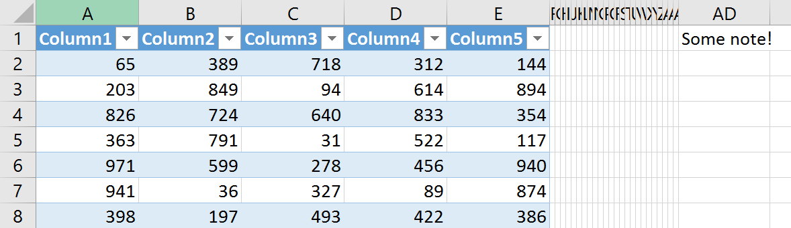

# FlexCel Performance Guide

## Introduction

Performance is a complex but very important characteristic of any application. One of our design goals with FlexCel is to be as fast as possible, and we are always finding ways to improve a little the performance from version to version. The idea is that for most of the cases, FlexCel should be “fast enough” and you shouldn’t have to care about performance when using it, as we took care of it for you. But for cases where you need the absolute maximum of performance, you can help FlexCel perform better by writing code that uses it in an optimal way. To know how to code for maximum performance, you need to understand how FlexCel works from a performance viewpoint, and that’s what this document is about.

> [!Warning]
> 
> Before doing anything else, let us make this clear: **Don’t over optimize**. In many cases code clarity and performance are not compatible goals and the more performing the code, the more difficult it is to maintain, change, or adapt. In most cases FlexCel is incredibly fast, and you shouldn’t have to depend on dirty tricks to create or read files instantly.

## Memory

If there is one thing that can make your applications slower, that thing is using too much memory and starting paging to disk. And sadly, because of the way Excel files are created, and also because of how a spreadsheet works, FlexCel needs to keep the full spreadsheet loaded in memory.

Even when in many cases we use Excel files as databases they aren’t. It is impossible to randomly read or write cells from an xls/xlsx file, and due to the way formulas work, a single change in a cell might affect the full file. For example, imagine that we have a spreadsheet with cell A1 = 1, and in the second sheet, Sheet2!E4 has the formula “=Sheet1!A1 + 1” When we change the value at cell A1 from 1 to 2 we need to change the formula result in Sheet2!E4 from 2 to 3. Also, if we insert a row before A1, we will need to change the cell Sheet2!E4 from “= Sheet1!A1 + 1” to “=Sheet1!A2 + 1”. This makes it very difficult to work with just a part of the file in memory, and neither we nor Excel do it. We both load the full file into memory and do all of our work there.

The main issue with running out of memory is that performance degradation is not linear. That is, you might use 1 second to write a million cells, but 1 minute to write 2 million, and 1 hour to write 3 million. This is one of the reasons we don’t normally quote silly benchmark numbers like “n cells written per second”; they are meaningless. If you take n seconds to write m cells, it doesn’t mean that to write 2\*m cells you will need 2\*n seconds. Performance degrades exponentially when you run out of memory.

So we make a lot of effort to try to not use too much memory, for example, repeated strings in cells will be stored only once in memory, or cell styles will be shared between many cells. But no matter what, if you have lots of cells you will use lots of memory.

There are 2 ways you can get around the memory problem: using FlexCel in “Virtual Mode”, or going to 64-bits. We will expand on this in the sections below.

> [!Warning]
> 
> Before continuing, we would like to give one last warning about memory.
> 
> Measuring memory consumption can be very complex. You need to distinguish between private and public bytes, and you need a memory measurement tool. Task manager isn’t such tool.

### Virtual Mode

Sometimes you don’t really need all the complexity that a spreadsheet allows; you just want to read values from cells or dump a big database into a file. In those cases, it might not make sense to have the full file into memory, you could read a cell value, load it in your application, and discard the value as the file is being loaded. There is no need to wait until the entire file has been read to discard all the cells.

For this, FlexCel provides what we know as “Virtual Mode”, a special mode where cells are read on demand. Not all features are supported in this mode, but normally for the huge files where Virtual mode makes sense, those features aren’t needed either.

The normal way you open a file is as follows:

You call [TExcelFile.Open](~/api/FlexCel.Core/TExcelFile/Open.md), and FlexCel reads the file and loads it into memory.

In virtual mode, it works as follows:

You call [TExcelFile.Open](~/api/FlexCel.Core/TExcelFile/Open.md), and the file is read. But for every cell read, the [VirtualCellRead](~/api/FlexCel.Core/TExcelFile//VirtualCellRead.md) event is called, and the cell is not loaded into the memory model. You will end up with an ExcelFile object that has no cells (but has charts, drawings, comments, etc.).Cells can be used by your application as they are being read. You can get the rest of the things (comments, merged cells, etc.) from the memory model after the file has been opened.

There is a simple example on how to use virtual mode in the [TExcelFile.VirtualMode](~/api/FlexCel.Core/TExcelFile/VirtualMode.md) documentation. A more complete example is at the [Virtual Mode](xref:Virtual_Mode-Delphi) api demo.

### 64-bits

Sometimes, if you have a memory problem and the application runs server-side, the cheapest solution might be to install more memory in the server. But in 32-bit mode, no matter how much memory you have, FlexCel will never use more than 2 Gb.

If you want to use more memory than that you should use FlexCel in 64-bit mode. Note that you need Delphi XE2 or newer to compile in 64-bits.

But we should go into warning mode again:

> [!Warning]
> 
>  **Going 64-bits might not only not improve performance, it might decrease it**. In our tests in a 4Gb machine, 64-bit version is consistently slower than the 32-bit one (both versions running in a 64-bit Operating System).

It kind of makes sense, since by going 64-bits now every pointer is 8 bytes instead of 4, so there is a lot of memory used in those bigger pointers, that are mostly 0 anyway. For 64-bit to improve things, you need a lot of memory installed.

By the way, 64-bit apps are also slower in .NET, so this isn’t a problem of the Delphi 64-bit compiler. It is just that all pointers are bigger.

## Server side

One of the most common uses for FlexCel is server-side. You install an app using FlexCel on a server, preferably with lots of cores, and people access it through a web page or web service.

If your CPU has 32 cores and life was perfect, opening 32 files in 32 parallel threads would take the same time as opening one file. But, life isn't perfect, and you might see noticeable performance degradation when opening many files in parallel.

FlexCel itself doesn't have any locks or shared memory when opening files, so all threads should be independent in theory. But still, you will see the degradation as the number of threads increases. There are multiple reasons for this: One is that the server might have 32 cores, but it still has one memory and one SSD, and all threads have to compete for memory. Also, the CPU might throttle the speed when using too many cores to keep it thermally safe.

But once again, the main problem is memory. Or, more precisely, memory allocations. The problem is worse when opening files because, in that stage, FlexCel allocates a lot of memory as it reads and creates an in-memory model of the file. 

When multiple threads are fighting for allocating memory, you will see a lot of contention, and that will slow the entire server down. 
And the built-in Delphi memory manager -FASTMM4- while a great single-thread manager, doesn't scale well when running with many threads. It will create locks, and all the threads will have to wait until the single thread with the lock finishes and releases it.

So if you are thinking of going server-side, make sure to install a better memory manager, one that works well in a multithreaded environment. You can try [FastMM5](https://github.com/pleriche/FastMM5), [Nexus Memory Manager](https://www.nexusdb.com/support/index.php?q=node/523&s=96f9abe8b0724c731a423544deebf5cd), or maybe [Big Brain Memory manager](https://digitaltundra.com). There are many others to try. The difference they will make in heavily multithreaded applications is big.

> [!Note]
> 
> Another way to attack the multithreading problems is to use multiple processes, one per user, instead of multiple threads. If you chose this option, then the stock FastMM4 memory manager should work fine.

## Loops

### Don’t fear loops

From time to time we get emails from people migrating from OLE Automation solutions, asking us for a way to load all values into an array, and then write the full array into FlexCel in one single method call.

This is because in OLE Automation, one of the “performance tips” is to do exactly that. Set the cell values into an array, and then copy that array into Excel. But this is because **in OLE Automation** **method calls are very expensive**.

And this concept is worth expanding: Excel itself isn’t slow; it is coded in optimized C/C++ by some of the best coders in the world. So how is it possible that third-party libraries written in high-level languages like FlexCel can be so much faster? This is in part because Excel is optimized for interactive use, but more important, because while Excel itself is fast, calling Excel from OLE Automation is not.

So any good OLE Automation programmer knows that to maximize the speed, he needs to minimize the Excel calls. The more you can do in a single call the better, and if you can set a thousand cells in one call that is much better than doing a thousand calls setting each value individually.

But **FlexCel is not OLE Automation and the rules that apply are different.** In our case, if you were to fill an array with values so you can pass them to FlexCel, it would actually be slower. You would use the double of memory since you need to have the cells both in the array and in FlexCel, you would lose time filling the array, and when you finally call the imaginary “ExcelFile.SetRangeOfValues(array)” method it would loop over all the array and cells to copy them from the Array to FlexCel since that is the only way to do it.

So just lopping and filling in FlexCel directly is faster; filling an array before setting the values only would add overhead.

### Beware of the ending condition in “for” loops in C++

When you are coding in C++, you need to be aware that the ending condition of the loops is called for every iteration. So in the code:

<pre class="shiki shiki-themes light-plus dark-plus" style="background-color:#FFFFFF;--shiki-dark-bg:#1E1E1E;color:#000000;--shiki-dark:#D4D4D4" tabindex="0"><code>for (int i = 0; i &#x3C; VeryExpensiveFunction(); i++)
{
    DoSomething();
}
</code></pre>

**VeryExpensiveFunction() is called for every time DoSomething() is called**.

This can be from a non-issue when VeryExpensiveFunction isn’t too expensive (for example it is List.Count) to a disaster if VeryExpensiveFunction is actually expensive and the iteration runs for millions of times (as it can be the case when using “[TExcelFile.ColCount](~/api/FlexCel.Core/TExcelFile/ColCount.md)”).

The solutions to this problem normally can be:

1. Cache the value of VeryExpensiveFunction before entering the loop:

<pre class="shiki shiki-themes light-plus dark-plus" style="background-color:#FFFFFF;--shiki-dark-bg:#1E1E1E;color:#000000;--shiki-dark:#D4D4D4" tabindex="0"><code>int Count = VeryExpensiveFunction();
for (int i = 0; i &#x3C; Count; i++)
{
    DoSomething();
}
</code></pre>

2. If the order in which the loop executes doesn’t matter, you might simply reverse the loop:

<pre class="shiki shiki-themes light-plus dark-plus" style="background-color:#FFFFFF;--shiki-dark-bg:#1E1E1E;color:#000000;--shiki-dark:#D4D4D4" tabindex="0"><code>for (int i = VeryExpensiveFunction() - 1; i >= 0; i--)
{
    DoSomething();
}
</code></pre>

This way VeryExpensiveFunction will be called only once at the start, and the comparison is against “ i &gt;= 0” which is very fast.

### Avoid calling ColCount

[TExcelFile.ColCount](~/api/FlexCel.Core/TExcelFile/ColCount.md) is a very slow method in FlexCel, and it is mostly useless. To find out how many columns there are in the whole sheet, FlexCel needs to loop over all rows and find which row has the biggest column. You normally just need to know the columns in the row you are working in, not the maximum column count in the whole sheet.

> [!Note]
> 
> **Note that RowCount is very fast, the issue is with ColCount, because FlexCel stores cells in row collections.**

### Loop only over existing cells

A spreadsheet can have many empty cells in it, and normally you don’t care about them. FlexCel offers methods to retrieve only the cells with some kind of data in them (be it actual values or formats), and ignore cells that have never been modified. Use those methods whenever possible. Look at the example below to see how this can be done.

### Evil loop Example

Here we will show an innocent looking example of all the problems studied in this “Loops” section. Even when it might look harmless, it can bring the performance of your application to its knees.

> [!Note]
> 
> To show the ending condition problem, the code is in also in C++, for C++ Builder users. 
> Delphi doesn't suffer this problem (a for loop ending condition in Delphi is
> evaluated only once at the start of the loop), but Delphi suffers too from
> the other issues.

<pre class="shiki shiki-themes light-plus dark-plus" style="background-color:#FFFFFF;--shiki-dark-bg:#1E1E1E;color:#000000;--shiki-dark:#D4D4D4" tabindex="0"><code>TXlsFile xls = new TXlsFile("somefile.xls");
for (int row = 1; row &#x3C;= xls.RowCount; row++)
{
    for (int col = 1; col &#x3C;= xls.ColCount; col++)
    {
        DoSomething(row, col, xls.GetCellValue(row, col));
    }
}
</code></pre>

<pre class="shiki shiki-themes light-plus dark-plus" style="background-color:#FFFFFF;--shiki-dark-bg:#1E1E1E;color:#000000;--shiki-dark:#D4D4D4" tabindex="0"><code>TXlsFile xls = TXlsFile.Create('somefile.xls');
for row := 1 to xls.RowCount do
begin
    for (col := 1 to xls.ColCount do
    begin
        DoSomething(row, col, xls.GetCellValue(row, col));
    end;
end;
</code></pre>

Let’s study this by our rules. First of all, let’s see the ending conditions of the loops. As explained, xls.RowCount and xls.ColCount are called for every iteration in the loop. This is not too bad for RowCount since RowCount is fast and it is the outer loop, but it is a huge problem for Xls.ColCount, which is not only slow as mentioned earlier, but also runs in the inner loop.

So if the file has 50,000 rows and the maximum used column is column 30, you are iterating 50,000 x 30 = 1,500,000 times. xls.RowCount is called 50,000 times (since it is in the outer loop) and xls.ColCount is called 1,500,000 times. And every time ColCount is called, FlexCel needs to loop over all the 50,000 rows to find out which row has the biggest column.

 **Using this example is the surest way to kill performance**.

So, how do we improve it? The first way could be, as explained, to cache the results of RowCount and ColCount:

<pre class="shiki shiki-themes light-plus dark-plus" style="background-color:#FFFFFF;--shiki-dark-bg:#1E1E1E;color:#000000;--shiki-dark:#D4D4D4" tabindex="0"><code>TXlsFile xls = new TXlsFile("somefile.xls");
int RowCount = xls.RowCount;

for (int row = 1; row &#x3C;= RowCount; row++)
{
    int ColCount = xls.ColCount;
    for (int col = 1; col &#x3C;= ColCount; col++)
    {
        DoSomething(row, col, xls.GetCellValue(row, col));
    }
}
</code></pre>

> [!Note]
> 
> For Delphi this step isn't necessary, because there is no need to cache the ending loop conditions, so the code can stay the same as before.

But while this was a huge improvement, it is not enough. By our second rule, xls.ColCount is slow, and we are calling it 50,000 times anyway. This is better than calling it 1,500,000 times, but still 50,000 times worse than what it could be. The column count is not going to change while we loop, so we can cache it outside the row loop:

<pre class="shiki shiki-themes light-plus dark-plus" style="background-color:#FFFFFF;--shiki-dark-bg:#1E1E1E;color:#000000;--shiki-dark:#D4D4D4" tabindex="0"><code>TXlsFile xls = new TXlsFile("somefile.xls");
int RowCount = xls.RowCount;
int ColCount = xls.ColCount;

for (int row = 1; row &#x3C;= RowCount; row++)
{
    for (int col = 1; col &#x3C;= ColCount; col++)
    {
        DoSomething(row, col, xls.GetCellValue(row, col));
    }
}
</code></pre>

In delphi it would be:

<pre class="shiki shiki-themes light-plus dark-plus" style="background-color:#FFFFFF;--shiki-dark-bg:#1E1E1E;color:#000000;--shiki-dark:#D4D4D4" tabindex="0"><code>var
  RowCount: Int32;
  ColCount: Int32;
  row: Int32;
  col: Int32;
...
  RowCount := xls.RowCount;
  ColCount := xls.ColCount;
  for row := 1 to RowCount do
  begin
    for col := 1 to ColCount do  //It would be faster to use ColCountInRow. See https://doc.tmssoftware.com/flexcel/vcl/guides/performance-guide.html#avoid-calling-colcount
    begin
      DoSomething(row, col);
    end;
  end;
</code></pre>

So, for now we have fixed this code to rules 1) and 2). We cache the end conditions in the loop, and we avoid calling ColCount much. (A single call to ColCount isn’t a problem). But still, this code can be incredibly inefficient, and this is where rule 3) comes to play.

In this example, where our spreadsheet has 50,000 rows and 30 columns, we are looping 1,500,000 times. But do we really have 1,500,000 cells? In most cases, we don’t. Remember that **ColCount returns the maximum used column in the sheet.** So, if we have 5 columns, but we also have some helper cells in column 30 (AD), ColCount will return 30:

But the loop will run as if every row had 30 columns, looping through millions of empty cells. If as in this example we only have 5 columns except for row 1, then we have 5\*50,000 + 1 cells = 250,001 cells. But we are looping 1,500,000 times. Whenever you use ColCount for the limits of the loop, you are doing a square with all the rows multiplied by all the used columns, and this will include a lot of empty cells.

We can do much better:

<pre class="shiki shiki-themes light-plus dark-plus" style="background-color:#FFFFFF;--shiki-dark-bg:#1E1E1E;color:#000000;--shiki-dark:#D4D4D4" tabindex="0"><code>XlsFile xls = new TXlsFile("somefile.xls");

int RowCount = xls.RowCount;
for (int row = 1; row &#x3C;= RowCount; row++)
{
    int ColCountInRow = xls.ColCountInRow(row);
    for (int cIndex = 1; cIndex &#x3C;= ColCountInRow; cIndex++)
    {
        int col = xls.ColFromIndex(row, cIndex);
        DoSomething(row, col, xls.GetCellValue(row, col));
    }
}
</code></pre>

In delphi it would be:

<pre class="shiki shiki-themes light-plus dark-plus" style="background-color:#FFFFFF;--shiki-dark-bg:#1E1E1E;color:#000000;--shiki-dark:#D4D4D4" tabindex="0"><code>var
  RowCount: Int32;
  row: Int32;
  ColCountInRow: Int32;
  colIndex: Int32;
...
  RowCount := xls.RowCount;
  for row := 1 to RowCount do
  begin
    ColCountInRow := xls.ColCountInRow(row);
    for colIndex := 1 to ColCountInRow do
    begin
      DoSomething(row, xls.ColFromIndex(row, colIndex));
    end;
    
  end;
</code></pre>

Note that even when ColCountInRow(r) is fast, we still cache it in the ColCountInRowVariable, as it doesn’t make sense to call it in every column loop just because. And as the used columns in every row will be different, we need to call it inside the row loop.

This last version will run millions of ways faster than the first, naïve version.

> [!Note]
> 
> If you want to read a range of cells, not the full file, you could use this code:
> 
> <pre class="shiki shiki-themes light-plus dark-plus" style="background-color:#FFFFFF;--shiki-dark-bg:#1E1E1E;color:#000000;--shiki-dark:#D4D4D4" tabindex="0"><code>var
>   LastCIndex: Int32;
>   XF: Int32;
>   cIndex: Int32;
>   LastUsedRow: Int32;
> ...
>   // Loop at most until the last used row in the sheet.
>   // If LastRow is for example 1.000.000, but there are only
>   // 3 used rows, it makes no sense to loop over all the empty rows after row 3.
>   LastUsedRow := Math.Min(LastRow, xls.RowCount);
>   
>   for row := FirstRow to LastUsedRow do
>   begin
>     LastCIndex := xls.ColToIndex(row, LastColumn);
>     LastColFromIndex := xls.ColFromIndex(row, LastCIndex);
>     if (LastColFromIndex > LastColumn) or (LastColFromIndex = 0) then  // LastColumn does not exist.
>     begin
>       Dec(LastCIndex);
>     end;
>     
>     if LastCIndex = 0 then  // This row is empty. Move to the next row.
>       continue;
>     
>     XF := -1;
>     for cIndex := xls.ColToIndex(row, FirstColumn) to LastCIndex do
>     begin
>       DoSomething(row, xls.ColFromIndex(row, cIndex), xls.GetCellValueIndexed(row, cIndex, XF));
>     end;
>     
>   end;
> </code></pre>
> 
> 
> Or, if you prefer a one-liner, just call [TExcelFile.LoopOverUsedRange](~/api/FlexCel.Core/TExcelFile/LoopOverUsedRange.md) which will do the same as what is in the code above.

## Reading Files

### Ignore formula texts if possible

By default, when you are reading a cell with “[TExcelFile.GetCellValue](~/api/FlexCel.Core/TExcelFile/GetCellValue.md)” and the cell contains a formula, FlexCel returns a [TFormula](~/api/FlexCel.Core/TFormula/index.md) record that includes the formula value and text. But returning the formula text isn’t too fast, because FlexCel needs to convert the internal representation into text for each cell.

If you don’t care about the formula texts (“=A1 + 5”), but only about the formula results (“7”), and you are reading huge files with thousands of formulas, setting:

[TExcelFile.IgnoreFormulaText](~/api/FlexCel.Core/TExcelFile/IgnoreFormulaText.md) := true

before starting to read the file can improve the performance a little.

> [!Note]
> 
> This particular tip won’t improve performance a lot, and it can make the things more complex if you ever start needing the formula texts. Make sure that the speed increase you get from it is worth it.

## Reading CSV files

When reading a CSV (comma separated values) file, FlexCel needs to parse each cell and figure out if it is a number, a date, a boolean, a formula, or maybe just a plain string. If you have millions of cells, this can be a very time-consuming process.

Here we will see some tips to make FlexCel's job easier.

### Import the full file as text.
If you don't care about converting strings, you can import everything as text. Importing everything as text is the **fastest way to read a CSV file**, and it might be a good option even if you care about some cell values, but not all of them. You can always read the full file as text and manually convert the cells you care about.

The code needed to import the full file is as follows:

<pre class="shiki shiki-themes light-plus dark-plus" style="background-color:#FFFFFF;--shiki-dark-bg:#1E1E1E;color:#000000;--shiki-dark:#D4D4D4" tabindex="0"><code>var
  ColTypes: TArray&#x3C;TColumnImportType>;
  i: Int32;
  xls: TExcelFile;
begin
  SetLength(ColTypes, TFlxConsts.MaxColCount);
  for i := 0 to Length(ColTypes) - 1 do
  begin
    ColTypes[i] := TColumnImportType.Text;
  end;

  xls := TXlsFile.Create(true);  //Create a new file.
  try
    xls.Open('csv.csv', TFileFormats.Text, ',', 1, 1, ColTypes, TEncoding.UTF8, false);  //Import the csv text.
    Process(xls);
  finally
    xls.Free;
  end;
</code></pre>

And if you later need to convert some cell values to whatever they represent, you can use the code:

<pre class="shiki shiki-themes light-plus dark-plus" style="background-color:#FFFFFF;--shiki-dark-bg:#1E1E1E;color:#000000;--shiki-dark:#D4D4D4" tabindex="0"><code>var
  XF: Int32;
  cellValue: TRichString;
  value: TCellValue;
  xls: TExcelFile;
</code></pre>

> [!Note]
> 
> If you want every cell string converted to the corresponding value, don't use this method! It will be slower than just opening the file normally. You should import everything as plain text only if you don't care about the values being all strings, or care only about some cells.

### Explicitly define which date formats your file uses.

One of the slowest parts of CSV parsing is figuring out dates. Dates (and times) can be written in many ways and combinations. So, for example, you might have "08/09/1972" in one cell, and you might have "1972-09-08" in another and maybe "08/09/1972 10:00" in a third. This is not a typical case, and you usually will use a single date format, max two, in a file.  But FlexCel still has to check, for every cell it reads, if it is a date, and what date that particular cell it is.

So if you know in advance the date and times formats used in the file, passing those to FlexCel will speed up the process significantly.
You can use code as below:

<pre class="shiki shiki-themes light-plus dark-plus" style="background-color:#FFFFFF;--shiki-dark-bg:#1E1E1E;color:#000000;--shiki-dark:#D4D4D4" tabindex="0"><code>var
  dateFormats: TArray&#x3C;string>;
  xls: TExcelFile;
begin
   //File formats used in the file:
  dateFormats := TArray&#x3C;string>.Create('yyyy-MM-dd', 'yyyy-MM-dd hh:mm', 'hh:mm');
  xls := TXlsFile.Create(true);  //Create a new file.
  try
    xls.Open('csv.csv', TFileFormats.Text, ',', 1, 1, nil, dateFormats, TEncoding.UTF8, false);  //Import the csv text.
    Process(xls);
  finally
    xls.Free;
  end;
</code></pre>

 
## Reports

Reports are by design a little slower than the API, because they must read a template before, parse it and compile before filling the cells. So if you need ultimate performance, don’t use reports, use the API directly. But remember; this advice is similar to “If you need absolute performance use assembler and not Delphi”. Yes, you will get the most performance in assembler or the API than in Delphi or Reports. But it might not be worth what you lose in flexibility and ease of use.

### Avoid too many master-detail levels

In most cases, the [TFlexCelReport](~/api/FlexCel.Report/TFlexCelReport/index.md) overhead is virtually zero, as the code in FlexCel was designed from the start to be very efficient when running reports. But there is a case where you can see visible performance degradation and that is when you have many nested master-detail reports.

The problem here is that FlexCel works by inserting ranges of cells. If you have a template with a single range, it will insert the rows needed for every record in the database at the beginning, and then fill those rows. A single insert of n rows, this is very fast.

But if you have a master-detail report, it will first insert all the rows needed for the master, and then, for every record in the master, it will insert all the rows needed for the corresponding detail. If that detail itself has other detail then the inserts grow a lot.

Normally, for more than 3 levels of master-detail, you shouldn’t have very big reports. Most of the times this is ok, since when you have huge reports they are normally just the records of a database. Those will be used for analyzing the data because nobody is going to print or read a million row report anyway. Complex reports designed to be printed or read normally are smaller, and for small reports you don’t really need to care about performance.

### Prefer snapshot transactions to serializable transactions

When reading the data for a report, there are two transaction levels that can be used to avoid inconsistent data: **snapshot** or **serializable**. While both will provide consistent data, “serializable” provides it by locking the rows that are being used, therefore blocking other applications to modify the data while the report is running. “Snapshot” transactions on the other side operate in a copy of the data, allowing the other applications to continue working in the data while the report is running.

If your database supports snapshot transactions, and your reports take a while to run, and other users might want to modify the data while the report is running, snapshot transactions are a better choice.
