# FlexCel Reports Designer Guide

## Introduction

This document has two different target audiences, developers using
FlexCel and final power users that want to customize their reports. It
covers how to design an Excel template, but not the code parts needed to
run a report. Read the [Reports Developer Guide](xref:ReportsDeveloperGuide) for the code part.

## Report Elements

There are three concepts you should understand to create or modify a
report: **Tags**, **Named ranges** and the **Configuration sheet**.
We will be covering all of them in the sections below.

## Tags

A tag is text that you write in a cell and that will be replaced by a
different value on the generated report. All tags are on the form
**&lt;\#TagName&gt;** when they don't have any parameters, and
**&lt;\#TagName(param1;param2...)&gt;** when they have parameters.

> [!Note]
> 
> Notice that the parameter separator is **“;”** not **“,”** as it is on
> expressions. This was done so it is simpler to mix formulas in tags.

Tags are case insensitive, so you can write **&lt;\#tag&gt;,**
**&lt;\#TAG&gt;** or **&lt;\#Tag&gt;** as you prefer. The convention we
usually use is all lowercase, but it is up to you.

You can write multiple tags on the same place, and the result will be
the concatenated string. You may also apply different formats to
different tags. For example, writing “**&lt;\#value1&gt;** *and*
__&lt;\#value2&gt;__” inside a cell will be replaced by something similar
to “**1** *and* __2__”

Tags will be replaced on Cells, Comments, Sheet names, Images,
Hyperlinks, AutoShapes, Headers and Footers.

### Tag Reference

The complete list of tags you can use and their descriptions is on the [Reports Tag Reference](xref:ReportsTagReference).

### Evaluating Expressions

Expressions can be used inside **&lt;\#If&gt;** and
**&lt;\#Evaluate&gt;** tags. They behave like standard Excel formulas,
and you can use any formula that FlexCel can calculate. But, different
from formulas, you can also enter tags inside expressions.

For example, you could write:

<pre class="shiki shiki-themes light-plus dark-plus" style="background-color:#FFFFFF;--shiki-dark-bg:#1E1E1E;color:#000000;--shiki-dark:#D4D4D4" tabindex="0"><code>&#x3C;#Evaluate(A1 + Min(A2, &#x3C;#Value>))>
</code></pre>

> [!Note]
> 
> As you might recall from the previous note, the parameter separator inside tags is ";".
> **But**, the parameter separator in Expressions is “,” , not “;”
> This is to keep the expressions syntactically compatible with Excel, and also
> to allow you to mix tag parameters with expression parameters without issues.

The supported list of things you can write inside an expression is
detailed on the following table:

| Element | Syntax |  Description | Example |
|------------|--------|--------------|---------|
|**Tag**    | &lt;\#Tag&gt; |  You can enter any tag inside an expression, and it will be evaluated. The tag might contain nested expressions too. | **1+&lt;\#Value&gt;**; will return the report variable “**Value**” plus **1**. |
|**References** |  **A1**, **$A1**, **Sheet1!A2**, **A1:A2**, **Sheet1:Sheet2!A1:B20**, etc | Standard Excel cell references. You can use relative and absolute references too. | A1 + A2 will return the sum of what is on cell A1 and A2. As the references are not absolute, when copied down this expression will refer to A3, A4, etc. |
|Parenthesis | \(\) | Changes operator precedence. Standard operator precedence on expressions is the same as in Excel, that is “**1 + 2 \* 3**” = **1 + (2 \* 3) = 7** and not **(1 + 2) \* 3 = 9** | **(1 + 2) \* 3 \^2** will be evaluated different than **1 + 2 \* 3 \^2** |
|Arithmetic Operators| +, -, \*, /, %, \^ (power) | Standard arithmetic operators. | **1 + 2 \*3 \^2** will evaluate to 19.   **5%** will evaluate to **0.05** |
|Equality Operators | &lt;, &gt;, =, &gt;=, &lt;=, &lt;&gt;|Standard equality operators.|**1&gt;=2** will evaluate to false.|
|Functions | function(parameters) | You can use any formula function that FlexCel can recalculate inside an expression. For a list of supported functions, take a look at the list of [supported Excel functions](xref:SupportedExcelFunctions)|

## Named Ranges

While Tags allow you to replace complex expressions inside a sheet, with
them alone we can only create “Fill in the blanks” type reports. That
is, reports that are static, like a form, and where cells with tags will
be replaced with their corresponding values.

Now we are going to introduce the concept of “**Band**” A Band is just a
range of cells that is repeated for each record of a table. Imagine that
you define a Band on the cell range A2:C2, and associate it with the
table “Customer”. Then, on cells A2:C2 you will have the first customer,
on cells A3:C3 the second and so on. All cells that were previously on
A3:C3 will be moved down after the last record of the dataset.

If table customer has six registers, and you have a template as follows:

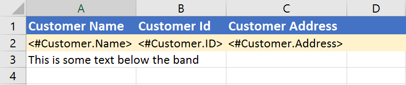

After running the report you will get something like this:

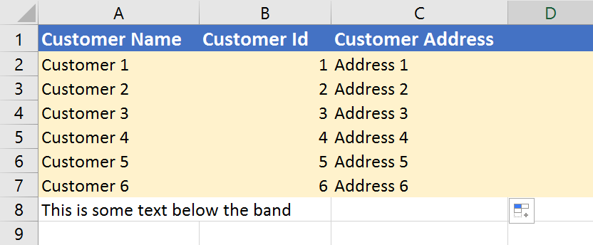

On FlexCel we use **Named Ranges** to indicate the bands. If you are not
used to Excel Named Ranges, take some time to familiarize with them, as
they are one of the things that can be a little confusing when starting with
FlexCel. Different from tags, that you can immediately see when you open
a workbook, named ranges are a little more hidden.

To create a Band on A1:C1, we would go to the “Formulas” tab, then
choose “Name Manager”:

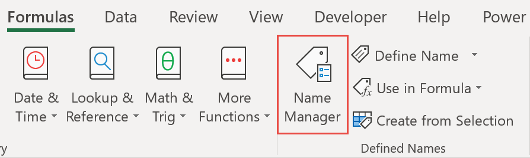

Once there, we can define a Band **\_\_Customer\_\_** on cells **A1:C1**. And
once the name is defined, we can easily see it on the Names combo:

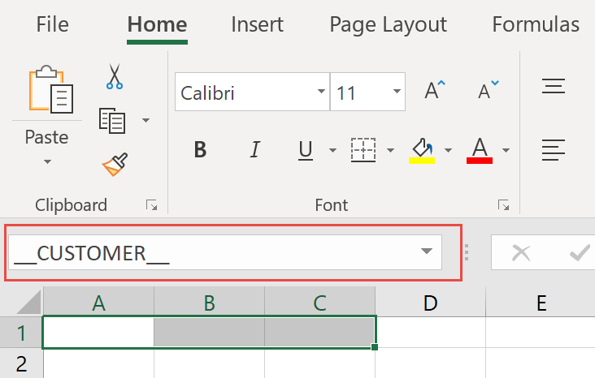

Note the “\_\_” at the beginning and at the end of the range name. We
use this to indicate FlexCel that this is a horizontal range that
inserts full rows down.

The rest of the name (**Customer**) should be the name of an existing
data source (table, array of data, etc), or a custom table defined on the config sheet.

### Range Types

You can define four different kinds of bands on FlexCel:

-   **“\_\_” Range**: This range moves down and inserts full rows. For
    example, to define a band that inserts full rows down for each
    record of the dataset “Customer” you would use a name
    \_\_Customer\_\_

-   **“\_” Range**: This range is similar to “\_\_” but cells outside of the
    range won't move down. To define a band that inserts only a range of
    cells down for each record of the dataset “Customer” you would use a
    name \_Customer\_

-   **“II\_” Range**: This range moves to the right and inserts full
    columns. Note that the first character is the letter i, not a pipe
    (|). To define a band that inserts full columns for each record of
    the dataset “Customer” you would use a name II\_Customer\_II

-   “**I\_” Range**: This range is similar to “II\_” but cells outside of
    the range won't move right. To define a band that inserts cells to
    the right for each record of the dataset “Customer” you would use a
    name I\_Customer\_I

A “\_\_” range is the same as a “\_” range defined on the full rows, and
the same is valid for “II\_” and “I\_” ranges for columns.

On the following example, if you name A1:D7 as “\_Customer\_” Cell E8
won't move when inserting down. If you name it as “\_\_Customer\_\_”
Cell E8 will move to the last inserted cell, because a
“\_\_Customer\_\_” range is equivalent to a “\_Customer\_” range on
A1:XFD7.

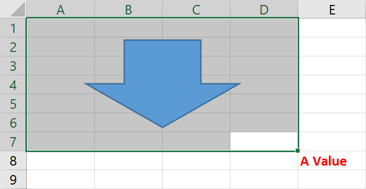

### Master-detail

Named ranges can be placed inside others, and a master-detail
relationship will be automatically created. For example, if you define a
range “\_\_Customer\_\_” and inside it a range “\_\_Orders\_\_” and
there is a relationship created on the application between “Customer”
and “Order” tables, it will automatically group your orders by customer.

On the following example, the yellow cells are the range
“\_\_Customer\_\_” and the blue ones are the range “\_\_Orders\_\_”

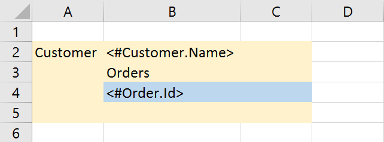

After running this report, you will get something similar to:

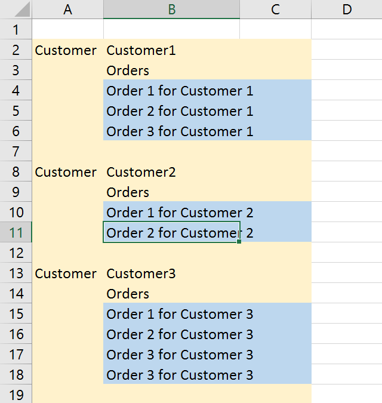

As you can see, Orders are filtered for each customer, based on the
[Data Relationships](xref:ReportsDeveloperGuide#data-relationships) defined on the application, and on the nesting on
the ranges. In general, any range that is inside another is filtered by
all of its parents. You can have as many levels of master-detail
relationships as you wish, and each master band filters all of its
children.

For example, if we wanted to group the customers by country we could
define a \_\_Countries\_\_ named range on A1:F6, and it would
automatically filter the data on its child and grandchild. (Customer
and Order)

#### Multiple-sheet Master-detail

There is a special Table that if present filters all the others on the
sheet, acting as a parent of all the named ranges on the sheet. This is
the table that you define on the name of the sheet, when doing a
multiple sheet report. 

You can see the [Multiple sheet report](xref:Multiple_sheet_report-Delphi) demo for
an example: On it every table on each sheet is filtered by
category.

### Ignoring Ranges

Sometimes, you might want to ignore processing in a range of cells or sheets. So for example if you have a sheet with <#tags> but which aren't real FlexCel tags, you might want to exclude that sheet from the report.

* To exclude full sheets, start the name of the sheet with a dot ("."): The dot will be removed in the final report. So for example if you name a sheet ".Totals", that sheet won't be used in the report, just left "as-is". In the final result, the sheet will be renamed to "Totals".  

* To exclude just some cells from a sheet, you can create a band and name it starting with a dot ".". Ranges starting with a dot ("_.", "__.", "I_." and "II_.") are ignored by FlexCel, so you could define a name "_.ignore._" and it won't be processed.

You can see an example of ignoring ranges of cells in the [Pivot Tables](xref:Pivot_Tables-Delphi) demo.

### Bidirectional Bands

As a general rule, bands in FlexCel can’t intersect. You can have
separated bands:

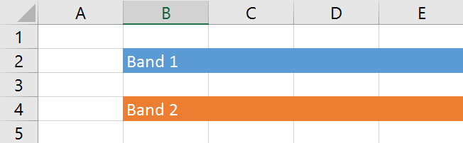

And they will each expand separately. You can also have one band
completely inside another:

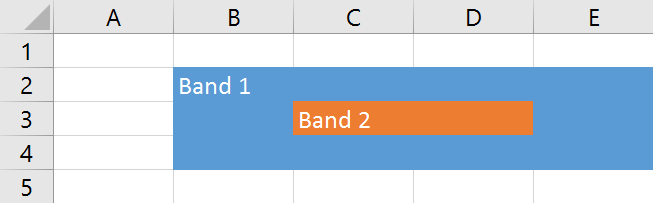

And the inside band will be a detail of the outside band. But if the
bands intersect:

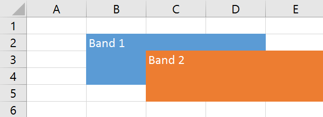

It is not really possible to do a report with this data. There is no
master and no detail here, and if we run those two bands separately, one
band would overwrite the results of the other. It is not possible to
know if cell C3 should have data from Band 1 or Band 2.

So in general, FlexCel will raise an error if you try to do a report
with bands that intersect: This is most likely a mistake in the
template.

But there is one special case where FlexCel allows you to have two bands
that intersect: If the bands form a cross, and the vertical leg of the
cross is a column range, while the horizontal leg is a row range:

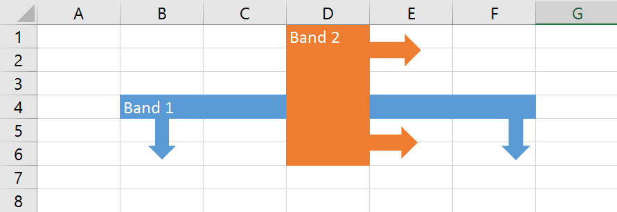

This will create a bidirectional band, that grows both to the right and
to the bottom at the same time. The conditions for creating a
bidirectional band are:

1.  One band must grow horizontally and the other vertically.

2.  The bands must form a cross. This means that the top of Band 2 must
    be smaller or equal than the top of Band 1, the bottom of Band 2 must be
    bigger or equal than the bottom of Band 1, the left of Band 1 must be smaller
    or equal than the left of Band 2, and the right of Band 1 must be bigger or equal than
    the right of Band 2. You will normally make Band 1 a full row range
    and Band 2 a full column range.

If both conditions are met, FlexCel will create a master-detail report
where Band 1 is the master and Band 2 the detail. For bidirectional
bands, **FlexCel will always make the horizontal band the master and the
vertical band the detail.**

As the vertical band is the detail, you can have multiple vertical bands
for the same horizontal band master. That is, you can have something
like this:

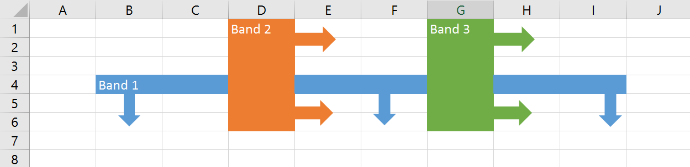

And both Band 2 and Band 3 will be details of the master Band 1.

What you can’t currently have is two row bands intersecting the same
column band:

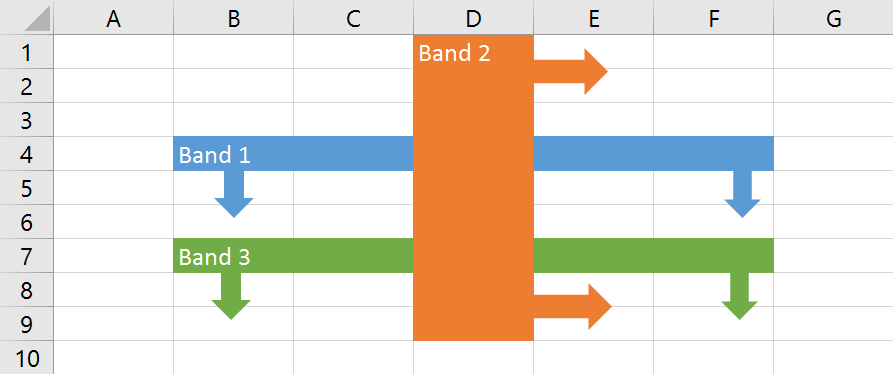

In this case, as FlexCel will always make the vertical bands the detail,
Band 2 should be the detail of both Band 1 and Band 3. And while a
master band can have many details, a detail band can have only one
master.

A workaround if you really need such a thing would be to use
&lt;\#Includes&gt;. You could have two subreports: one with Band2 and
Band1, and the other with Band3 and Band2. Then in your master report,
you &lt;\#Include&gt; both subreports one below the other. The effect
will be as if you had run multiple horizontal bands with Band2, but
there won’t be multiple masters.

For more information on Bidirectional Reports, you can look at the
[Bidirectional Reports](xref:Bidirectional_Reports-Delphi) example.

### X ranges

One issue that might appear when defining named ranges is how formulas
on other ranges change when inserting the new cells.

Let's imagine we want to make a simple report on a list of items and
their prices.

So, we create a new template, define a title row, and insert a named
range on A2:B2 to propagate the data. But we also want to know all the
total cost of all items, so we add a formula on B3:

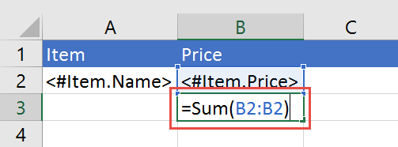

When you run this report, rows will be inserted between row 2 and 3, but
the formula Sum(B2:B2) won't change. Nothing has been inserted between
B2 and B2, so the sum range will remain constant.

So, we need to have a Sum range that can expand. We will define:

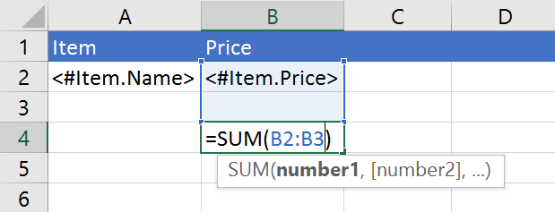

Now, when rows are inserted between row 2 and 3, the formula will be
updated to reflect the new rows.

In this particular case, this solution might be enough. Just leave an
empty row after the range so formulas expand, and then you can hide the
extra row or just leave it there.

But, if we were for example creating a chart, this extra row will be on
the chart too. If you are an old FlexCel VCL user, you know about the
“...delete row...” thing just to avoid those cases.

Well, delete row does not work anymore on FlexCel 5.0 and up, because
the row would be deleted before the range is expanded, and the formula
will then point to B2:B2 again.

This is why we introduced the **“X” ranges**. X ranges are normal named
ranges with an “X” at the end. On this case, instead of “**\_\_Item\_\_**”,
we would call the range “**\_\_Item\_\_X**” It will behave exactly the same
as a normal range, but once it is expanded it will erase the row immediately after the range
(or column if it is a column range). So if we try the last example with
“\_\_Item\_\_X”, row 5 on the last screenshot will be deleted, and the
formula would be “=SUM(B2:B4)”. Just what we were looking for. See the
[Charts](xref:Charts-Delphi) demo for more information on using X ranges.

> [!Important]
> 
> **Don't include the row you want to delete inside the range you are creating!**
> 
> The row (or column) deleted will be the one **after** the range, not the last row in the range.
> So if you define a range "\_\_MyBand\_\_X" in rows 2 and 3:
> 
> 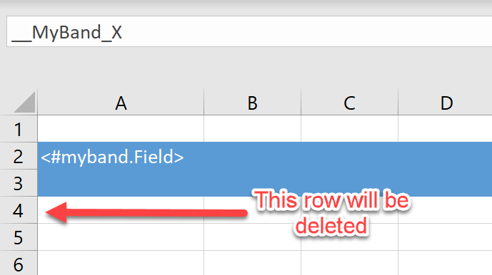
> 
> FlexCel will repeat the 2-row range for each record, and then delete the row after the range, as seen below:
> 
> 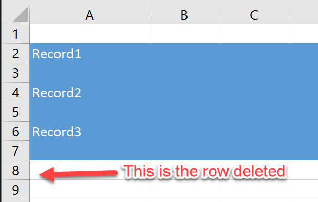
> 
> This is not likely what you want. To have one row per record, the \_\_MyBand\_\_X name must have one row only, and then the row **after** the band will be deleted.
> 

### Fixed Bands

By default, FlexCel will always insert cells when expanding ranges, and
this is what you would normally want. If you have a template:

<pre class="shiki shiki-themes light-plus dark-plus" style="background-color:#FFFFFF;--shiki-dark-bg:#1E1E1E;color:#000000;--shiki-dark:#D4D4D4" tabindex="0"><code>A1:Title

A2:&#x3C;#data>

A3:Footer
</code></pre>

You would expect that the generated report will have the Footer for
example on cell A33 (if we had 30 data records), but not on A3.

But there is a situation where this is not what you expect, and this is
on Fixed Form reports. Let's imagine that you want to fill out a form
with FlexCel. Most fields will be just simple expressions, not related
to datasets, but we might have a table too:

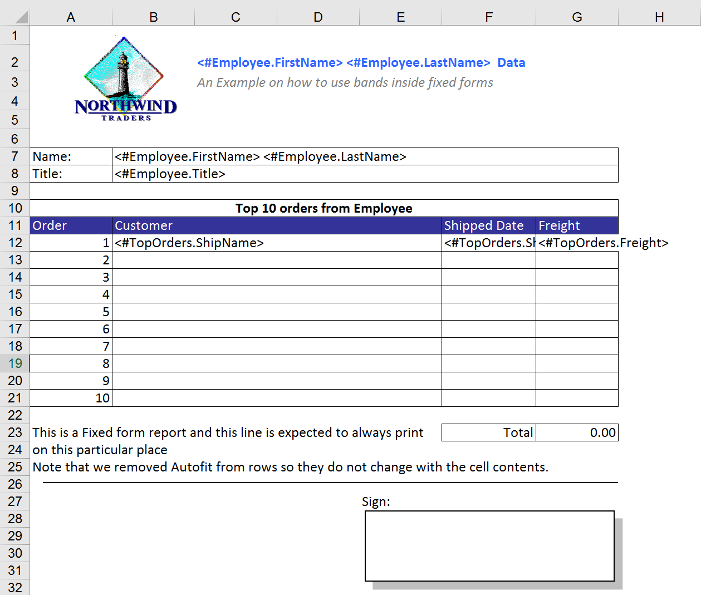

Here, no matter if the dataset has 1 record, two or 10 (it should not
have more than 10) you want the “Total” line to be at row 23. You cannot
do this with normal ranges, since you would be inserting rows. For this
you can define a “\_\_TopOrders\_\_**FIXED**” named range, which will not
insert any records. 

FlexCel will treat any range that ends with the word "FIXED" as a fixed range, as long as the characters before the range mean the end of a range. That is, II\_Range\_IIFIXED will be a fixed range, since "\_II" is the end of a vertical range. But \_\_OrdersFixed\_\_ is not a fixed range.

> [!Note]
> 
> The word "FIXED", as most stuff in Excel, is case insensitive. Both \_\_Range\_\_FIXED and \_\_Range\_\_fixed are ok. But in our docs and own templates, we use UPPERCASE modifiers so they stand out and are easier to spot.

> [!Warning]
> 
> You can't use FIXED bands in master-detail reports. The problem is that master-detail works by inserting the rows of the details between rows of the master. As FIXED bands don't insert rows, you will end up with the master overwriting cells of the details or vice-versa.
> 
> To do a fixed master-detail report, you can just run the report with normal (not FIXED) names in a separate subreport, and then <#include> that subreport into the main report using a FIXED include so it doesn't insert rows or columns.  

See the [Fixed Forms With Datasets](xref:Fixed_Forms_With_Datasets-Delphi) demo for more
information.

### Fixed N Bands

Sometimes, you might want the records to overwrite the first n cells
(like in a “fixed” band), but after those rows are overwritten, insert
the rest of the records (like in a normal report).

You can get this by using a “FixedN” range, where “N” is the number of
rows or columns you want fixed. For example “\_\_data\_\_**FIXED2**”
will overwrite the first 2 rows, and insert (data.RecordCount – 2) rows
for the rest.

You can see an example of FixedN bands at the [Balanced Columns](xref:Balanced_Columns-Delphi) demo.

### Alias Bands

In some rare cases, you might want to use the same dataset twice in the same sheet. One way to do it is to define an alias in the config sheet, so you have, for example:

  * DataSet1
  * NewDataSet1 -> Alias to DataSet1

And then, in the report, you define a __DataSet1__ and a __NewDataSet1__ range. 

But in some cases, like, for example, when you are creating a report from a list of objects and there are nested objects, you can't rename those nested objects. If a **Customer** object has a **Orders** nested object, then you can't rename **Orders** in the config sheet. You would need to define two __Orders__ names, but only one is allowed by Excel.

To solve this, you can use the **..Alias..** postfix. Just write the word ..ALIAS.. (case insensitive) after the name, and then write whatever you want. 

You could define the names as __Orders__..ALIAS..First and __Orders__..ALIAS.._Second.

<b>Alias are always defined at the end, and everything after the ..ALIAS.. word is ignored</b>. So if you want to define say a fixed name, it would be defined as __Orders__FIXED..ALIAS..MyOrders, and not as __Orders__..ALIAS..MyOrdersFIXED.

> [!Note]
> 
> Alias just allow you to define different named ranges in Excel pointing to the same dataset by writing arbitrary text after the name. They don't change the name of the dataset, and in the example above, you would still write <#Orders.Name> in the template, not <#First.Name>.

> [!Note]
> 
> When this feature was introduced in FlexCel 7.1, it used a different syntax: You would write something like "__MyOrders__Alias_MyAlias". The problem with this syntax is that you couldn't define something like __MyOrders__XAlias_MyAlias, since the "X" wouldn't be separated from the "Alias" definition. 
> 
> To make it simpler, we changed the alias to use 2 dots (..) before and after the name. The old syntax still works for simple cases, but it is deprecated. We encourage you to use the new syntax for new developments.

### Excel-Table Bands

Besides using names for the bands, FlexCel also allows the use of Excel tables as bands. To use an Excel table as a band, you need to follow the steps in this image:

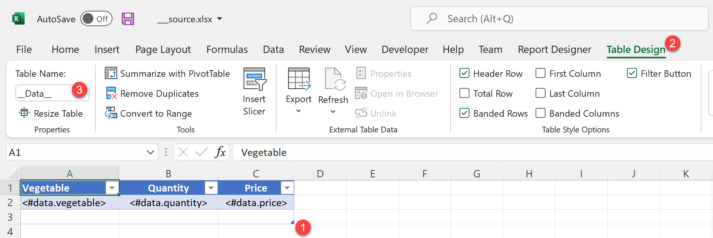

1. Insert a table with two data rows. **You need an extra empty row after the row with the data** so when the report runs the table will grow with the inserted records. Bands defined from tables behave like [X Ranges](#x-ranges) and they erase the empty row after the report is completed.

2. With the cursor inside a cell of the table, go to the "Design" tab to edit the name of the table.

3. Name the table "\_\_Data\_\_" as you would with any other "\_\_" name. You can also name it as "\_Data\_" and FlexCel will not copy the full rows, just as it does with "\_Names\_". "I_" and "II_" names are allowed too but make no sense in tables, since tables are always organized to have the data in rows and the columns to hold different fields. You might also name the table "\_\_Data\_\_X" but as explained in point 1. table datasources are always "X" so there is no need to write the extra "X" at the end.

Excel-Table bands are exactly the same as an "X" named-range band defined over the data part of the table, so everything you can do with name bands you can do also with table bands. You can for example store a table inside a name to create a master-detail report, or anything you can do with normal name bands. 

#### Customizing Excel-Table Bands

There are two configuration options that apply to Excel-Table bands:

1. To make FlexCel completely ignore table bands, you can set the property [TFlexCelReport.UseExcelTablesAsBands](~/api/FlexCel.Report/TFlexCelReport/UseExcelTablesAsBands.md) to false. If you turn off this property you won't lose any functionality, but you will have to design the report with \_\_Named_Ranges\_\_ instead.

2. Table bands will normally rename themselves by removing the "\_\_" part of the name. If your template table is named "\_\_Customer\_\_" the table in the result file will be named "Customer". To avoid this behavior you can change the property [TFlexCelReport.RenameExcelTablesUsedAsBands](~/api/FlexCel.Report/TFlexCelReport/RenameExcelTablesUsedAsBands.md) to false

There is a working example on reports using tables at the demo [Tables As Datasources](xref:Tables_As_Datasources-Delphi)

### Balanced Columns

Sometimes you might want to create a report that once generated looks
like the following:

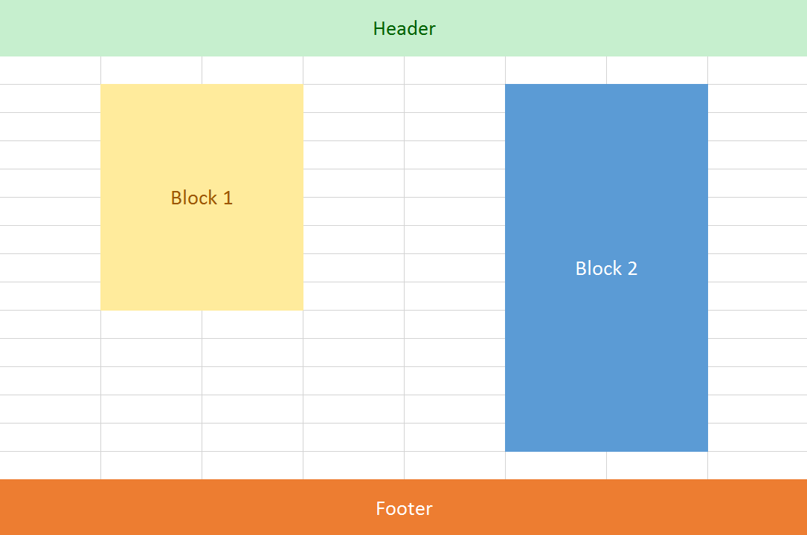

But if you try to do this by creating a \_Block1\_ and \_Block2\_
parallel ranges, you will actually end up with something like this:

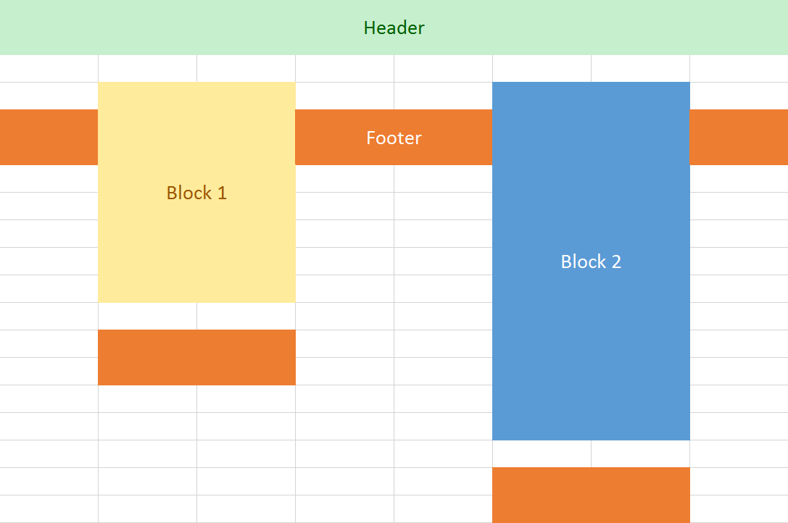

Because when \_Block1\_ and \_Block2\_ grow down, the cells are inserted
only in the columns that are used by those ranges.

But there is a case where FlexCel doesn’t work this way, and that is in
master-detail. When you are doing a detail, cells are inserted in all
the columns so they end at the same place, and the next master record
won’t be broken. So the solution in this case is to create a dummy
“master” dataset with a single row, and use it as a master for both
\_Block1\_ and \_Block2\_ ranges.

The last cell in every column of the “master” dataset will be copied
down so all columns inside the master insert the same number of cells.

You can use the “ROWS” function in the config sheet to create a single
row datasource.

Please take a look at the [Balanced Columns](xref:Balanced_Columns-Delphi) demo for more information
on how this is done.

### Intelligent Page Breaks

Other kinds of ranges you might want to create are “KeepTogether” ranges.

FlexCel will try to keep rows or columns on those ranges together when
printing by inserting page breaks at the needed places.

To create a “Row” KeepTogether range, you need to name it:

**KEEPROWS\_&lt;Level&gt;\_&lt;Whatever&gt;**

Where **&lt;Level&gt;** is the level of “keep together” of the group, and
“**Whatever**” is anything, you can use it to have more than one
“keeptogether” range in the same sheet.

For example, you might have the ranges:

**KeepRows\_1\_customers**

and

**KeepRows\_1\_orders**

in the same sheet, to tell FlexCel to group the rows in both ranges
together when printing. You might also have different levels of “Keep
together”, and you will normally use higher levels for details in
master-detail reports.

Once you have created the ranges, you need to write an [&lt;\#auto page
breaks&gt;](xref:ReportsTagReference#automatic-page-breaks) tag somewhere in the sheet, and FlexCel will add page
breaks when it ends the report trying to keep those ranges together. You
can customize the **&lt;\#auto page breaks&gt;** to influence the way page
breaks are created.

We are not covering in detail Intelligent page breaks here, since they
are described in the [API guide](xref:ApiDeveloperGuide#intelligent-page-breaks), and it makes no sense to repeat that
information here. We only cover here what is different for reports, and
this is the “KeepTogether” ranges.

Make sure you read the section [Preparing for Printing](xref:ApiDeveloperGuide#preparing-for-printing) in
the API guide, since most of the concepts apply also to reports. And of
course take a look at the [Intelligent Page Breaks in Reports](xref:Intelligent_Page_Breaks_In_Reports-Delphi) demo.

#### Intelligent Page Breaks in Included Reports

You can use intelligent page breaks inside an **&lt;\#included&gt;** report,
but you must be aware of some differences.

The most important difference is that the final pagination must be done
in the master report, not in the included one. Let's look at an example:

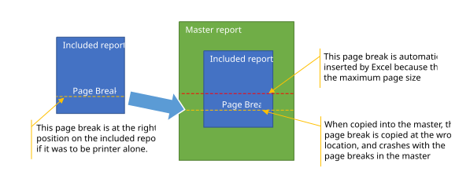

In this example, we can have “KeepRows\_” and “KeepColumns\_” ranges in
the included report, but we should not create the actual page breaks in
it. If we did it, those page breaks would be in the wrong position when
inserted in the master. (unless the report is included at cell A1). As
you can see in the drawing, the included report is copied into the
master at a lower location. So if the report goes down, the page breaks
will go down too, ending up in the wrong places. Excel needs to insert
its own page break (marked with a red dotted line) in order to have the
master page no bigger than the paper size, and the old page break will
create a small page that we don't want.

So, in order to have intelligent page breaks in the included report, you
must follow the next simple rules:

-   Create the “KeepRows\_” and “KeepColumns\_” ranges in the included
    report, as you would normally do it.

-   **Do not write an &lt;\#auto page breaks&gt; tag in the included
    report**. This will ensure FlexCel does not add the page breaks in
    the included report before copying it to the master.

-   Make sure you include full rows (by using “\_\_” or “II\_” as
    parameter in the include tag). This way, the KeepRows and
    KeepColumns ranges will be copied to the master.

-   Write an &lt;auto page breaks&gt; tag into the master. This way,
    when the master report is finished, FlexCel will paginate the
    master, keeping together the rows you marked in the included report.
    **Pagination must be done on the master, never in the included
    report.**

## Creating charts with dynamic series

#### Series and data points

When dealing with charts, a rule of thumb is that you want as few series as possible. That's what Excel does when you select a range of cells and create a chart from it. So, for example, if we have the following table with four rows and two columns, Excel will use the columns to define the series.

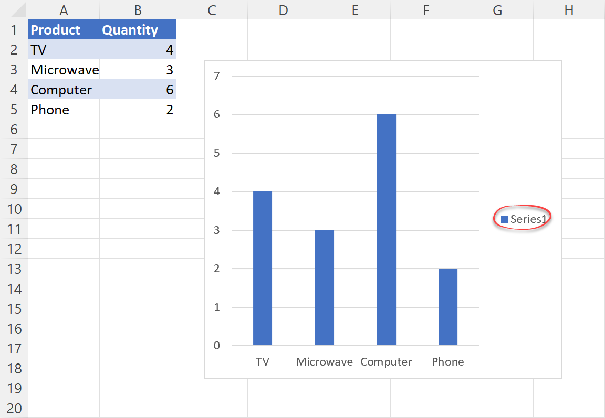

As you can see in the image, only one series was created, which goes from B2 to B5. If we added 100 extra rows to this table, the chart would still be a single series going from B2 to B105.

That makes sense, and you usually want the smaller dimension to have the series. So, for example, if the report had more columns than rows, you would like to have the series by rows, not by columns. But that's not always the case, and Excel provides a handy button: "Switch Row/Column" that you can use to decide if you want the series using the rows or the columns.

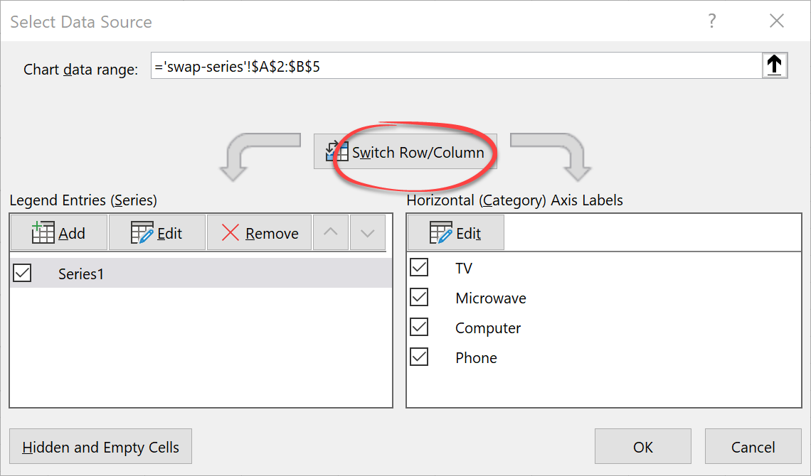

If you press that button, you will get the following:

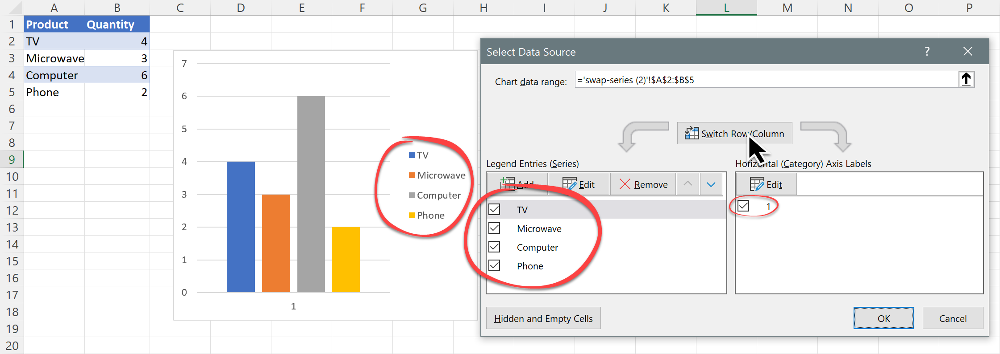

Now you have four series and one data point instead of one series and four data points.

#### Series in reports
When doing a report that has charts, the typical case works just fine. Your series are in columns, like in the first image, and data points grow down as you insert records. So, for example, if the chart in your template had two series with two data points, and you insert 100 records, you will end up with two series and 102 data points.

But what if you wanted the series in rows? You should end up with 100 series and 2 data points. But that's not how inserting rows work in Excel. When you insert rows in the  chart, and you have each series in a row, you will end up with a series at the first row, then a lot of ignored rows, then series at the end:

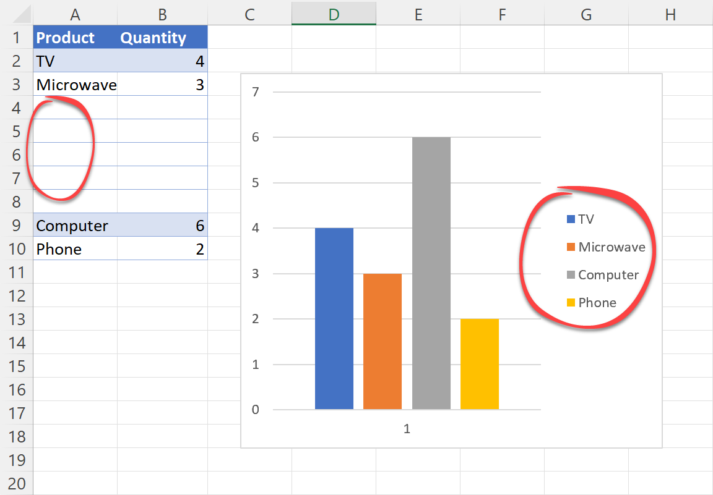

Here, you can see that even as we inserted rows between "Microwave" and "Computer", we still have only four series. And we can check it out by looking at the ranges:

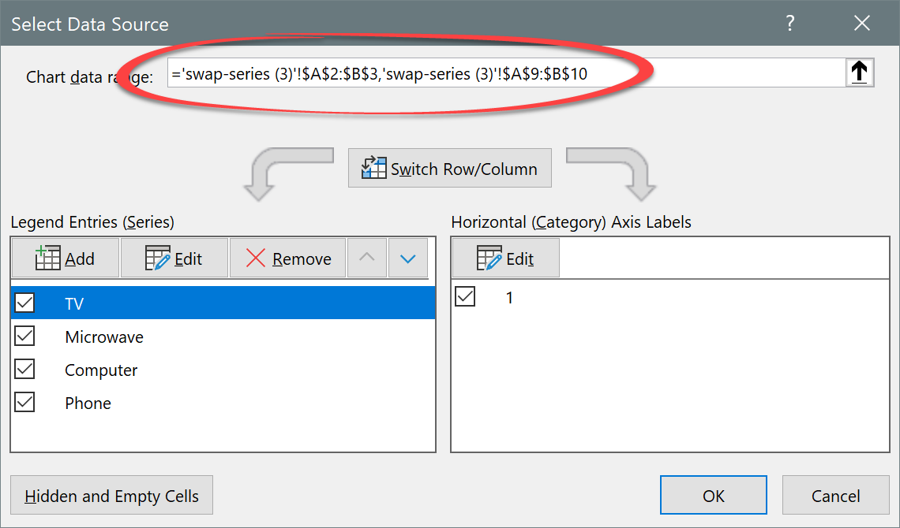

As you can see at the top, the single range was split in two: One taking $A$2:$B$3 and the other taking A$9:$B$10. So we still have four series, and this is not what we wanted. We wanted to have nine series now.

As reports work by inserting rows, you will have the same problem here if you try to do one. So how do we create a report where each inserted row is a new series? 

#### The <#swap series> tag
The "swap series" tag behaves a little like the "Switch Row/Column" button at the top of this section. It will run after the full report is completed, and if your chart has the series in columns, it will swap them to be in rows. If they are in rows, they will switch to columns.

> [!Important]
> 
> **Usually, you don't want to use the "swap series" tag.** We provide them for the **exceptional cases** where you want the series in rows instead of in columns as it would be expected.
> 
> **Also, note that the maximum number of series in a chart is 255, so you can't do a chart with many rows and one series per row.**
> 
> We provide this long explanation for a tag you will likely never use just because the topic is complex, and we want it to be well documented in case you need it. But don't assume that because the functionality exists, you have to use it!
> 

To create a chart that has one series per row, you need to follow the steps: 

Create a chart that has one series per column.
If it is a chart sheet, name the sheet with some name, and append <#swap series> string at the end of the sheet name. If it is an embedded chart, name the chart as you wish, and append <#swap series> at the end of the chart name.
> [!Note]
> 
> To name a chart object, select it, then type its name in the "Name box":
> 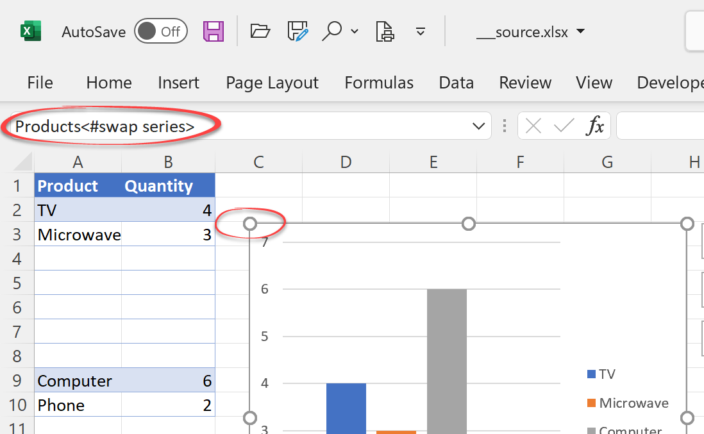

When the report runs, it will create a "standard" chart with series in columns, but after it ends, the tag will recreate the series using one row per series. If this was a range expanding to the right instead of down, everything applies but reversed: You would create a standard chart with series in rows, and then "swap series" would swap the series to be in columns.

See the example [Charts With Dynamic Series](xref:Charts_With_Dynamic_Series-Delphi) to see how it works.

#### A deeper explanation of <#Swap series> 

The <#Swap series> concept is simple: If you have your series in columns (which you need so the ranges expand down when inserting rows), it will switch them to rows. But in this section, we will dig deeper into what that really means.

When you select a range and create a chart, Excel decides where to apply the range parts depending on your data.
If the range has more rows than columns, it will put the series in the columns. Otherwise, it will use the rows.

For a chart with series in rows, if the first row has strings, but the other rows have numbers, it will use that first row for the x-axis. The other rows will have one series each. If the chart is X-Y scatter, it will use the first row for the x-axis, and each of the remaining rows will hold a series. 

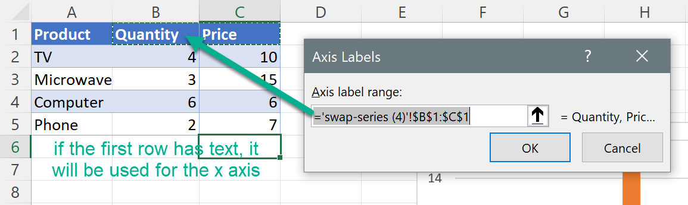

Again for a chart with series in rows, if the first column has strings, it will use it for the series name.

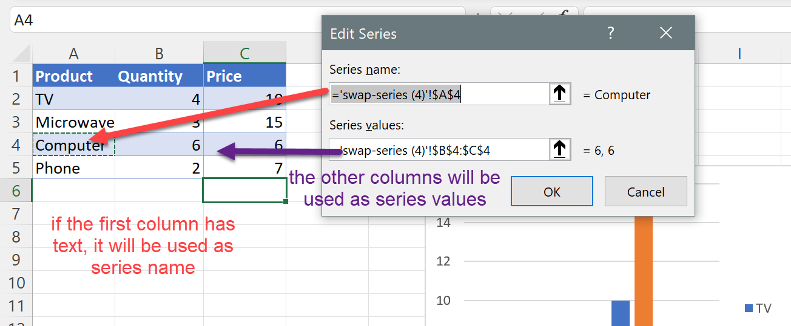

Everything applies mirrored for a chart with series in columns.

Putting it all together, you have the following:

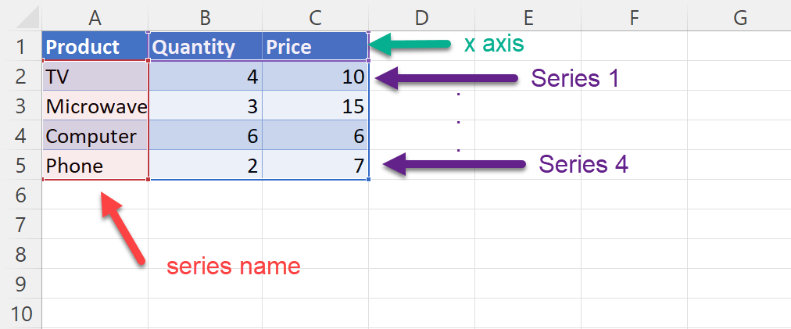

Note that whether you have strings or numbers in the first row and column determines if there is a series name or an x-axis. If all the cells had numbers, the series name and x-axis would be empty, and the full range would be used for the series values.

The exact algorithm used by Excel can vary and could change in new Excel releases. So the algorithm FlexCel uses in <#swap series> is simpler: **Swap series won't try to guess how to use the range from the data at all**. Instead, it will use whatever you used in the original chart. 

So, if you want to use the chart range only to fill the series, leave the x-axis and series name empty in the original chart in the template. FlexCel will then use the full range for the data points. If you set any value in the x-axis, FlexCel will use the first row for the x-axis. If you set the series name in the template, FlexCel will use the first column for the series name. FlexCel will never try to guess what to do depending on the data types of the first row or column.

> [!Note]
> 
> Remember that when setting the data for a <#Swap series> chart, you will set the series in columns, so if there is an x-axis, it will be the first column. But when <#swap series> changes the series to be in rows, it will use the first row for the x-axis. 
> 
> Don't worry about the switch between rows and columns: If you want an x-axis, you need to set a column for the x-axis in the template, even if it will be a row in the final result. The same applies to the series name but reversing rows and columns.

## Configuration Sheet

The configuration sheet is a repository where you can configure
different things on your report, define commonly used expressions and so
on. It is not required, you can create a report without a configuration
sheet, but it is recommended that you have one except for very simple
reports.

Once the report is run, the configuration sheet will be deleted.

> [!Note]
> 
> If there are any macros assigned to the configuration sheet,
> FlexCel will be unable to delete it and will just clear and “Very hide”
> the sheet. (Very hidden sheets are similar to hidden sheets but the user
> needs to write a macro to see them, they are not listed when you select
> to unhide a sheet from Excel). If you get a macro by mistake on the
> config sheet and you are unable to delete it in Excel, use the
> “MacroCleaner” tool included in the “Tools” folder.

The layout of the config sheet is free as long as you keep the
positions, you can write the captions you want or change any format you
need. Just one advice: keep it simple. The config sheet will be deleted
from the final report, so the final user won't see it. And deleting a
sheet with comments, images formulas and so on is slower than deleting a
simple sheet.

An example of a config sheet is shown here:

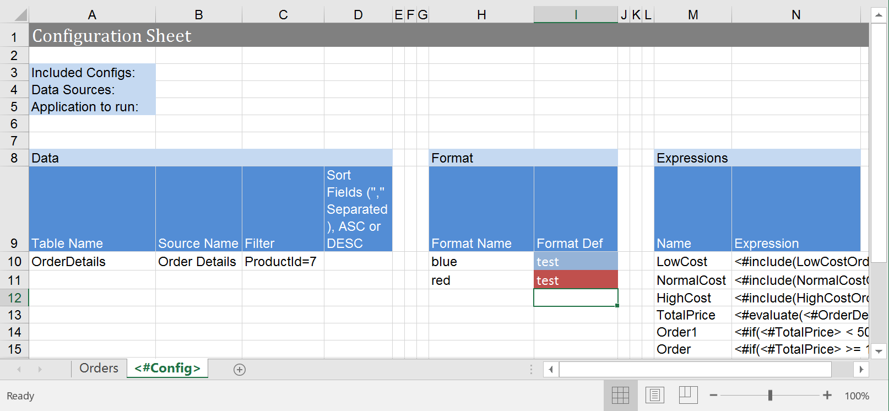

We can note that:

1.  For a sheet to be the configuration sheet it must be named
    “**&lt;\#Config&gt;**” or any expression that evaluates to the
    string “&lt;\#Config&gt;”. You could conditionally make a sheet the
    configuration sheet depending on some parameter.

3.  Cells A10 to C10 and all rows below (A11:C11... etc) are used to
    define new custom tables. You use a master table defined by the
    application (B10), and define a new name for it (A10). Then you can
    write a filter (Look at the “[Filtering Data](#filtering-data)”
    section in this document). And also sort the table by some columns.
    Different search columns are separated by “,”, and you can also
    define an “**ASC**(ending)” or “**DESC**(ending)” order. For
    example: “State, ZipCode DESC” Again, any Sort expression valid for
    a DataView is valid here. In some places you can use tags. For
    example, if you write on C10 “&lt;\#mytag&gt;” instead of
    “ProductId=7” the value of mytag will be used as a filter.

4.  You can leave empty rows. For example, you can define a new table on
    row 10 and another on row 12 without writing anything on row 11.
    This allows you to better separate your tables.

5.  On columns H and I you define custom formats. The name of the format
    goes on column H, and the definition on column I. Then you can use
    those cell formats on &lt;\#format&gt; tags.

6.  You can write whatever you want on column I, the text is not
    important and you can use it to know how the format will look like.

7.  Column K is used to list the report variables. It is not used at all
    by FlexCel and you don't really need to fill it, but it is used by
    FlexCel designer to list the available report variables. If you do
    not write them here, FlexCel designer will not show them.

8.  Columns M and N are probably the most important on the config sheet
    and are used to create reusable expressions.

### About Expressions

It is recommended that whenever you have complex chains of tags, instead
of writing them directly on the cell, you create an expression and then
refer to it.

On the screenshot, we defined a **&lt;\#order&gt;** tag that itself calls
other report expressions to calculate its value. Then, if you want to
write the result of order on cell A1, instead of writing the full chain
of tags, you just write **&lt;\#order&gt;** On some places, like for example
the name of the sheet or an image name this might be the only choice, as
the name length is limited to 32 characters. You can use also parameters
on Expressions, and for Example define &lt;\#order(row)&gt; For more
details on how to do this, see the [Expression parameters](xref:Expression_Parameters-Delphi) demo.

### Defining Custom Formats

Custom formats are normally straightforward to use.

For example, you might format I10 with a blue background, name it “Header”
in cell H10, and then use the format inside a &lt;\#format
cell(Header)&gt; in the template. But this will apply the **full**
format in cell H10 to the new cell. This means that besides the blue
background, all other properties will be copied too. The new cell will
also have the same font, same alignment, same numeric format than H10.

Now let's imagine we have a full row that we want to be blue if some
condition applies. If we write &lt;\#format row(header)&gt; in a cell on
the template, then all other attributes besides the background will be
applied to the row. This might mean that all the cells will be aligned
to the left (if cell I10 was aligned to the left), and this is not what
we want. We want to apply only the background color on I10, keeping
everything else as it is defined on the template.

To do this, you can define **partial formats**. You define a partial
format by adding one or more attributes to the name of the format. For
example, if you name the format **Header(background;font.color)** only
the font color and the background color of cell I10 will be applied, not the full format.

You can add as many properties as you want to be applied for the format
separating them by semicolons (“;”). Also, you can use **negative**
properties by preceding them with a “-” sign. For example, the following
definition: Header**(All; -Border; -Font)** will apply all attributes in
cell I10 except the border and the font.

The list of properties you can write in a cell is the following:
| Name               | Description       |
|--------------------|-------------------|
| **All**                | Applies the all the formats in the cell. Defining a format named “header” is the same as defining one named “**header(All)**”. <br/ >  You will normally use the All format when excluding formats. For example, “**header(All, -Border)**” will apply all the formats except the border. <br/ >  “**header(-Border)**” would not apply any format. |
| **Border**             | Applies the four borders. “**header(Border)**” is the same as “**header(Border.Left;Border.Right;Border.Top;Border.Bottom)**” |
| **Border.Left**        | Applies the left border.|
| **Border.Right**       | Applies the Right border.|
| **Border.Top**         | Applies the Top border.|
| **Border.Bottom**      | Applies the Bottom border. |
| **Border.Exterior**    | This is a special setting, used to apply the borders only on the outer bounds of the range. For example, if fmt is defined as “**fmt(border; border.exterior)**”, and you write **<#format range(a1:c5;fmt)>** then the top row of the range (row 1) will be formatted with the top border format of the cell, the left column or the range (column a) will be formatted with the left border format of the cell, and so on. Inner cells in the a1:a5 range will not have any border applied. <br/ >  This tag alone has no effect; you always need to use it together with other border tags. For example “**fmt(border.exterior)**” will not do anything, you need to write “**fmt(border; border.exterior)**”, “**fmt(border.top; border.bottom; border.exterior)**” or something similar.     Other properties (like background) are not affected by border.exterior, they will still apply to the whole range.    Note that this tag only applies to the <#format range> tag. It makes no sense in <#format cell>, and you cannot use it in <#format row/column> since format for columns and rows does not support this. |
| **Font**               | Applies all the font properties. “**header(Font)**” is the same as “**header(Font.Family;Font.Size;Font.Color;Font.Style;Font.Underline)**” |
| **Font.Family**        | Applies the font name.|
| **Font.Size**          | Applies the font size.|
| **Font.Color**         | Applies the font color.|
| **Font.Style**         | Applies the font style (**bold** and _italics_) Underline is not included in Font.Style.|
| **Font.Underline**     | Applies the underline.|
| **NumericFormat**      | Applies the numeric format of the cell.|
| **Background**         | Applies the background color of the cell. “**header(Background)**” is the same as “**header(Background.Pattern;Background.Color)**” |
| **Background.Pattern** | Applies the fill pattern for the cell.|
| **Background.Color**   | Applies the fill color for the cell.|
| **TextAlign**          | Applies the horizontal and vertical alignment in the cell. “**header(TextAlign)**” is the same as “**header(TextAlign.Horiz;TextAlign.Vert)**” |
| **TextAlign.Horiz**    | Applies the horizontal alignment in the cell. |
| **TextAlign.Vert**     | Applies the vertical alignment in the cell. |
| **Locked**             | Applies the “Locked” attribute in the cell. |
| **Hidden**             | Applies the “Hidden” attribute in the cell. |
| **TextWrap**           | Applies the Word Wrap setting for the cell. |
| **ShrinkToFit**        | Applies the Shrink to fit setting. |
| **Rotation**           | Applies the Rotation. |
| **TextIndent**         | Applies the indent.|

> [!Important]
> 
> You need to specify what the format applies to in
> the format definition, but not when calling the format. You might define
> a format as header(border), but you need to call it with &lt;\#Format
> Cell(header)&gt;, not &lt;\#Format Cell(header(border))&gt; The second
> way will not work.

With partial formats you can apply the different formats as “layers” in
your document, one independent from the other. You can apply as many
&lt;\#format cell&gt; and &lt;\#format range&gt; tags as you want in a
cell, as long as the applied formats are different all of them will be
applied.

> [!Warning]
> 
> **A last word of caution:** As powerful as custom formats are, remember
> that they are only useful if you want to conditionally format cells. If
> the format is static, just format the cell as you want it. We have seen
> too many customers “over-engineering” reports with lots of format cell
> tags, when the simplest solution would be to format the cells directly
> in the template with Excel and not use any tag.
> 
> Also remember that you can
> use Excel's **conditional formatting** in almost every case you could need custom formats. But Excel's conditional formats
> are much simpler to use an maintain. So for example, if you wanted to paint a cell red when it is bigger than 100,
> you could define a custom format Warning(Background) and then use a &lt;#if(&lt;#cell> > 100;&lt;#format cell(Warning)>)>
> or you could just set a conditional format in the cell in the template making it red when it is bigger than 100.
> 
> FlexCel fully supports Excel conditional formatting, and you should always prefer to use that if possible.

You can see an example of how to use custom formats to have alternating
rows in the [Multiple Sheet Report](xref:Multiple_sheet_report-Delphi) demo.

> [!Note]
> 
> As an alternative to defining the formats in the config sheet, you could also define them
> as **User Defined Formats** and add them with [TFlexCelReport.SetUserFormat](~/api/FlexCel.Report/TFlexCelReport/SetUserFormat.md).
> For an example of using user defined formats, look at the [User Defined Formats](xref:User_Defined_Formats-Delphi) demo.

### Filtering Data

You can filter the data you are going to use directly in the template by
writing a filter in the config sheet:

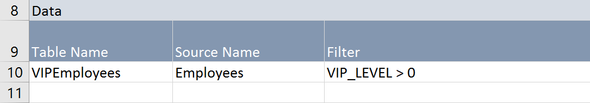

Here you must be aware that generally **filtering is done locally**: that is, we
fetch the full table from the database, and then apply the filter to
discard the unwanted data. This makes Filters inefficient except for
small tables. In general, you will want to filter in the SQL, not in the
config filter column as a way to avoid fetching all records from the
database. But sometimes when you can’t modify the data, and there aren’t
too many rows, filtering in the config sheet can be an option.

#### Filter Syntax

FlexCel uses a built-in parser to analyze the filtering expression. The
supported syntax is as follows:

The filter expression consists of **operators**, **tokens** and **functions**.

-  The operators you can use in a simple filter are, by order of
   precedence (lower to greater):

   -   “**AND**”, “**OR**”: As in “Field &gt; 1 AND Field &lt; 2”

   -   “**&lt;**”, “**&gt;**”, “**&lt;=**”, “**&gt;=**”, “**&lt;&gt;**”, “**=**”: As in “Field = 1”

   -   “**NOT**”: As in “NOT (Field = 3)”

   -   “**+**” , “**-**”: As in “Field1 + 1 = Field2 – 1”

   -   “**&#42;**”, “**/**”: As in “Field1 / 2 = Field2 \* 2”

   -   “**(**”, “**)**”: As in “(Field1 + 1) \* 2 = 4”

-  The allowed Tokens are:

   -   **FieldName, or \[Field Name\]:** Use the square brackets when there
       are spaces in the name.

   -   ‘**Strings’:** Use single quotes for strings. To enter a single
       quote inside the string, repeat it twice, as in “Field1 = 'I''am
       me'”

   -   **Numbers:** You should use “.” for floating point numbers, no
       matter what your locale is. For example: “Field1 &gt;= 1.5”

   -   **SQL92 Date Literals:** You can use either DATE 'yyyy-MM-dd', TIME
       'HH:mm:ss', TIMESTAMP 'yyyy-MM-dd HH:mm:ss'. For example, Birthday =
       DATE '1972-09-08'

   -   **OLE Date Literals:** Ole date literals use the syntax: {d
       'yyyy-MM-dd'}, {t 'HH:mm:ss'}, {ts 'yyyy-MM-dd HH:mm:ss'}. For
       example, Birthday = {d '1972-09-08'}

   -   **Booleans:** You can use the constants “true” and “false”, as in
       “Married = true”

   -   **null:** This is used for null values, and it uses the Delphi or C++ Builder
       definition of a null (where null == null), not the SQL definition
       (where null &lt;&gt; null). This means that different from SQL, you
       can use this filter: “Field &lt;&gt; null” and it will work as
       expected.

-  The allowed Functions are:

   -   **ISNULL:** Returns true if a field is null, and in this
       implementation it is similar to comparing the field to null.
       IsNull(field1) is the same as field1 = null

   -   **YEAR:** Returns the year of a date. For example you could have a
       filter: Year(field1) = 1999

   -   **MONTH:** Month from a date.

   -   **DAY:** Day from a date.

   -   **STREQUALS:** Syntax is StrEquals(str1, str2, ignorecase) or
       StrEquals(str1, str2, samecase). Returns true if both str1 and str2
       are the same.

### Relating Tables in the Template

[Data Relationships](xref:ReportsDeveloperGuide#data-relationships) are typically defined in code, but FlexCel also allows to define them in the template. You use the filter section of the config sheet to do that:

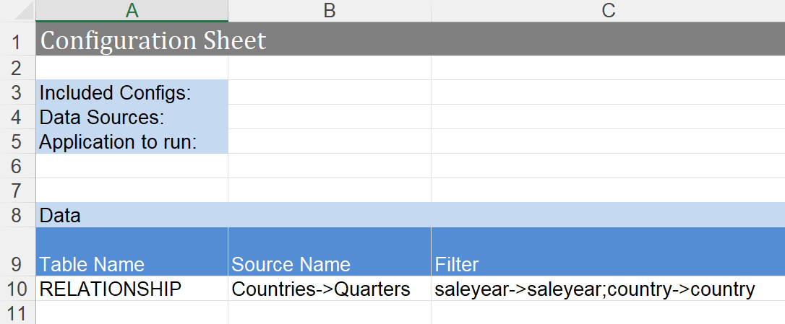

* In column A (Table Name), you have to write the word "RELATIONSHIP". The case is unimportant, but we use a convention of all upper-case.

* In column B (Source Name), you write the Master and the Detail tables that form the relationship, separating them with an arrow. The Master goes first, then the arrow, and finally the Detail: ** Master -> Detail**.

* In column C (Filter), you write the fields in the Master that relate to the fields in the Detail. If there is a single field that relates the Master and the Detail (the most common case), you would just write **MasterField->DetailField**. If there are multiple fields in the relation, you  separate each with a semicolon: **MasterField1->DetailField1;MasterField2->DetailField2**

The example [Master detail on one table](xref:Master_Detail_on_one_Table-Delphi).

### Grouping Tables

Sometimes you might have the data for a master-detail report into one
table, and you want to create two different tables based on the value of
a key field.

You can use the **DISTINCT** filter on the config sheet together with the
[RELATIONSHIP](xref:ReportsDesignerGuide#relating-tables-in-the-template) tag to get this effect. Look at the [Master detail on one table](xref:Master_Detail_on_one_Table-Delphi) demo for more information on how this is done.

> [!Note]
> 
> Whenever possible, do not use this grouping as the normal way
> to get data. While it simplifies the data layer, it also fetches a lot
> of repeated information from the database.

For example: If you

<pre class="shiki shiki-themes light-plus dark-plus" style="background-color:#FFFFFF;--shiki-dark-bg:#1E1E1E;color:#000000;--shiki-dark:#D4D4D4" tabindex="0"><code>select * from table1 join table2 on (table1.key = table2.key)
</code></pre>

you will get results like this:

| key | field-from-table1 | field-from-table2 | field-from-table2 |
|---------------|---------------|---------------|---------------|
| **table1.value1** | **table1.value2** | table2.value1 | table2.value2 |
| **table1.value1** | **table1.value2** | table2.value3 | table2.value4 |
| **table1.value1** | **table1.value2** | table2.value5 | table2.value6 |

In this simple case, you fetched 12 values from the database. If you had
made 2 different selects, you would have fetched only 8 values
(table1.value1 and table1.value2 for the first table, and table2.value*N*
for the second). Depending on the amount of data, there might be a lot
of repeated fields on the join.

### Splitting Tables

The same way sometimes you might want to group tables, other times you
might want to split them into groups of n records. For example, you might
want to create a 5 column report, and you need to split the master
dataset into groups of 5 records in order to fill the columns.

This is where the **Split(source, number of records)** tag can be
useful. In short, you write this tag on the “Source Name” column in the
config sheet, specifying the table to split on the “**source**”
parameter, and how many records you want on each group on the “**number
of records**” parameter. This will create a new table that you will name
on the “Table Name” column of the config sheet. You can then use this
new table as the master on a master-detail relationship with the original
table. The generated master has no columns, but you can use the
pseudocolumns (\#RowPos or \#RowCount) just fine. Each record of the
master is related to “number of records” records on the detail.

Note that the generated master table is a “pseudo table” n the sense
that it has no columns or data, but it has (DetailRecords.Count – 1) /
NumberOfRecords + 1 rows. Also the relationship between the master and
the detail is not on real columns, since there are no columns on the
master. This creates a limitation on how you can use those tables, and
it is that the master should have the detail as a direct child. You
cannot have other \_\_ range\_\_ between them, or FlexCel will complain.

Take a look at the [Split Datasets](xref:Split_Datasets-Delphi) demo for more information.

### Retrieving TOP N Records from a table

You normally should filter the data when retrieving it from the database
(for example with the SQL “Select top 10 \* from customers”). But if
this is not possible, you can use the **Top(source; number of records)**
tag to filter this from the template.

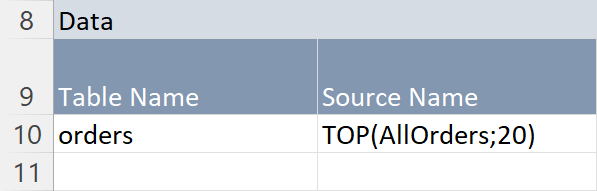

> [!Warning]
> 
> **Be careful with this tag**. If
> your table has 10,000 records and you only need 10, fetching them all
> from the db in order to use only 10 is not a smart idea. Take a look at
> the [Fixed Forms With Datasets](xref:Fixed_Forms_With_Datasets-Delphi) demo for more information.

### Ensuring a table has at least N records.

Sometimes you want to ensure that at least one record of a table exists,
and if it doesn’t, provide a default value for the missing fields.

You might do this with the **AtLeast(source; minimum number of records;
\[default value\]; \[multiple of\])** tag. In a way, this is the opposite of the
[**TOP(…)** tag](#retrieving-top-n-records-from-a-table) discussed above.

For example, you might define the following in the config sheet:

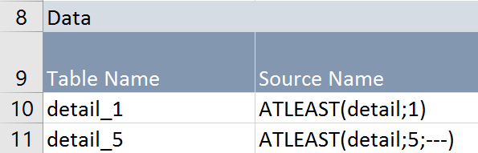

In this example, the table detail_1 will have at least 1 record. If
detail is empty, as we didn’t specify a default value, it will return a
record with all null values. The table detail_5 will have at least 5
records, and if detail has less, all records after the detail record
count will return "---" in all their fields.

> [!Note]
> 
> You can’t specify
> a default value for every field; it will be the same for all of them.
> But you can use some &lt;\#if(detail_5.field="---";something;else)&gt;
> tag in the template to provide different values.

#### Ensuring the record count in a table is a multiple of a value.

There might be cases where you want to ensure that a dataset has for example 20 records, or 40 or 60, etc. This way, you can ensure that all pages in a master-detail report have the same number of rows. You can achieve this using the **AtLeast(source; minimum number of records;
\[default value\]; \[multiple of\])** tag, and specifying the number in the "multiple of" parameter.

There is an example of this use at the [Fixed Footer](xref:Fixed_Footer-Delphi) demo

### Creating empty datasets with N rows.

Sometimes you might need a simple table with no columns and one or more
rows to use as datasource of the report. For example, if you want to
repeat a range n times, you could create an empty dataset with 3 rows,
and put the range inside a \_\_dataset\_\_ name. You can do that
directly from the config sheet, by defining a datasource to be
**ROWS(N).** A dataset with a single row could be defined in the config
sheet as Dual = Rows(1). For an example on how this is done, please look
at the [Balanced Columns](xref:Balanced_Columns-Delphi) demo, the table “master” in the config sheet.

### Joining Tables

When you have a “full row” report like the one in the image below, we
insert a row for each record in the table.

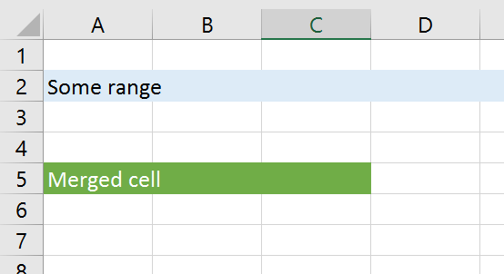

As you would expect, if you have a merged cell (in green) below the
range being inserted (in blue), the merged cell will move down too:

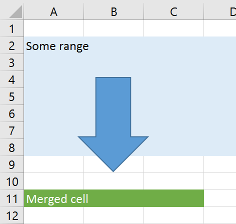

And the same will happens with ranges of cells like Print\_Area or
others. We are inserting full rows, so everything moves down.

But now, let’s imagine we have 2 independent ranges we want to grow in
parallel. We can do it with “-“ ranges instead of “\_\_” ranges:

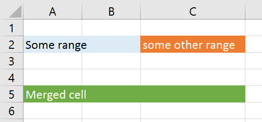

In this case, when the blue range runs, the cells will only be inserted
in columns A and B.

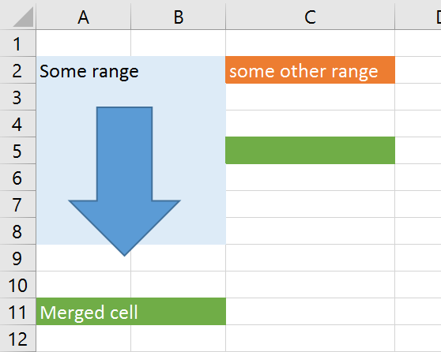

But as a side effect of this, the merged cell will be broken (as you can
see in the image above). After the blue range runs, the orange range
will run and the cells will move down in column C too:

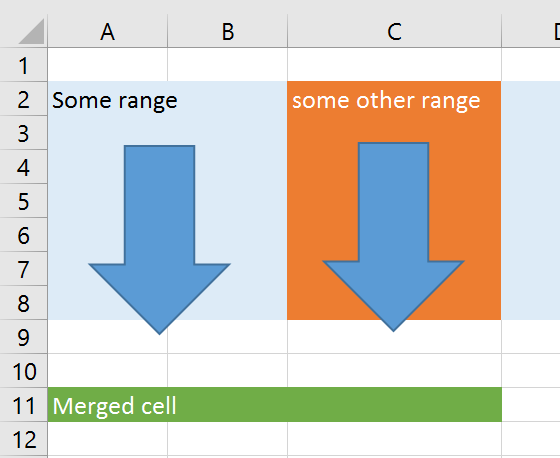

And now the merged cell is all green again (as expected), but it isn’t a
full merged cell anymore: It is a merged cell in A:B and a different
cell in C. Something similar happens with names, when the blue band
grows it can’t grow a name which goes from column A to C, because not
all cells in that range have moved. And when the orange range grows, the
name can’t grow either since now columns A and B aren’t moving.

There is no real solution to this: Due to the order the bands run,
having two parallel \_ ranges isn’t the same of one big \_\_ range.
Merged cells might break and ranges might not update if they span over
the two \_ ranges running.

One solution is of course not to put any merged cell below the \_ ranges
which are not fully inside the columns of one of the \_ ranges. And do
the same with names.

But there is another solution, which is to “Join” the datasets inside
“some range” and “some other range” so they form a bigger dataset with
the columns of both, and then run a single full row report in the bigger
range.

Say for example that you want to run two parallel reports on the tables:

**Customer**

|Name|CustomerID|
|----|----------|
|  ...  |   ...       |

And

**Employee**

|Name|EmployeeID|
|----|----------|
|  ...  |   ...       |

In the config sheet, you could define a new table “**CustomerAndEmployee**”
as **JOIN(Customer;Employee)**

This will define a new table with 4 columns:

CustomerAndEmployee

|Customer.Name|Customer.CustomerID | Employee.Name | Employee.EmployeeID|
|----|----------|----|----------|
|  ...  |    ...      |  ...  |    ...      |

And you can use this new **CustomerAndEmployee** table to run the report.

**Things to note:**

1. The table “CustomerAndEmployee” has as many rows as the maximum of
“Customer” and “Employee”. Say for example that you have 3 customers and
5 employees, then CustomerAndEmployee will have 5 records. The last 2
records of CustomerAndEmployee will have Customer.Name and
Customer.CustomerID null.

2. If “Customer” and “Employee” have columns with the same name, you will
need to prefix them with the table name in order to show them. In our
example, both Customer and Employee have a “Name” column. So you can’t
just write “&lt;\#CustomerAndEmployee.Name&gt; inside a cell, because
you wouldn’t know which Name it is referring to (Customer.Name or
Employee.Name). For this case, you need to write
&lt;\#CustomerAndEmployee.**Customer**.Name&gt; and
&lt;\#CustomerAndEmployee.**Employee**.Name&gt;

3. Even if the prefix is only necessary for the case when there are
repeated columns, it might be good practice to always prefix the table
names in joined tables. This way you know you are always accessing the
right column at the right table.

4. JOIN joins unrelated tables adding the columns of each one after the
other, but it doesn’t do any master-detail or relationships. It will
just show record1 or table1 together with record1 of table2, and record2
of table1 with record2 of table2 and so on. When one of the tables runs
out of records, the next records for the columns in that table will be
null.

5. While this command doesn’t use any extra memory (joined tables aren’t
copied in memory) and has no performance penalty, if you are doing SQL
it will be simpler to just use SQL to construct the joined table.

### Union of Tables

While “JOIN” in the section above creates a table with the columns of a
list of datasets, UNION creates a table with the rows of a list of
datasets. It works in a similar way as the union command in SQL.

In general union is not really needed: You could just write the 2 ranges
one after the other for the two tables. But conceptually, sometimes it
feels better to join the data of similar tables into a big one and have
a single named range for that table.

> [!Note]
> 
> The “Union” table will have all the columns of all the tables used to
> create it. Normally you will use tables with the same columns, but if a
> column is present in one table but not in another, union will show the
> values of the column for the table that has it, and null for the other.

You can look at the “Join and Union” example for an example on how to
use JOIN and UNION tags.

### Direct SQL in templates

Depending on your needs, you might want to write SQL commands directly
on the templates and avoid having a Data module on your code. This allows the
users to modify the data they need by modifying the xls file, and
without recompiling the executable.

> [!Important]
> 
> Be aware that allowing your users to
> directly write the SQL commands can mean a big **security risk**.
> 
> For example, a user could use the connection you give him to execute the
> SQL: “drop table users” instead of a normal select. While FlexCel does a
> little validation on the SQL written by the user (for example, it cannot
> contain “;” or “--”, it has to start with “Select” etc) SQL is a very
> powerful language and there can always be a way to execute a command on
> the server. And, even if the user does not manage to execute a command,
> he might always do a “Select user, password from users” or similar
> command, and get dbadmin access to the database.

**You must supply a readonly connection, and with rights limited to
the tables you want the user to see.**

The steps for allowing Direct SQL on the templates are:

1.  Provide a connection to the report, by using
    FlexCelReport.AddConnection()

2.  On the config sheet, “Source Name” column, add a string like
    “**SQL**(Select \* from clients”). Give this table a name, and you can
    use it as any other table on the report.

Note that also for security reasons, you can't replace expressions
inside the SQL string. For example, you can't write “SQL(select \* from
customers where cust\_id = &lt;\#custId&gt;)” This would open another
security hole and allow for SQL injection attacks.

#### SQL Parameters

You need to specify database parameters to be able to actually pass
information to the SQL.

Normally Delphi uses “:” as a parameter prefix, but it might use “@” or
“?” too depending in the db data access. As we want to keep the template
database independent (so you can replace the db backend without changing
templates), and we also want to have the templates compatible with
FlexCel.NET which uses “@” as prefix, **all parameters on the template
are named with a preceding “@”** (“@name”).
The SQL will be
automatically converted by FlexCel into “:name” parameters before
sending it to the db.

If you are using a db that needs something different from “:”, you need
to let FlexCel know which kind of parameters your db needs.

For this you
use the **[SqlParameterReplace](~/api/FlexCel.Report/TFlexCelReport//SqlParameterReplace.md)** and **[SqlParametersType](~/api/FlexCel.Report/TFlexCelReport//SqlParametersType.md)** properties on
[TFlexCelReport](~/api/FlexCel.Report/TFlexCelReport/index.md).

You can see a demo on how to do it on the [Direct SQL](xref:Direct_SQL-Delphi) example; more
information is also available there.

### User Tables defined on the Template

Sometimes Direct SQL is not an option, because you have your own data
layer that you want to use, or because it is too big a security risk to
let your users run arbitrary SQL commands. But you would like the
advantages of Direct SQL. That is, to specify the data directly on the
template, so everything is self-contained on the template file and you can
change your reports without recompiling the application.

You can use the **USER TABLE**(Params) tag to achieve this.

User table(Params) is a very simple tag, but it allows a lot of things.
You write it on the Source Table column in the config sheet, and you can
add an additional parameter on the Table Name column. You can leave the
“Sort” and “Filter” columns empty or with values, their values do not
matter.

For every “User Table(Params)” on the template, the **event UserTable**
will be called on the report. Anything you write in “Params” will be
passed as arguments to the event, without any further processing by
FlexCel. Also, the value you write on the Table Name column will be
passed to the event. You will normally want to use this second parameter
to tell FlexCel how you want to name the table you are creating. Note
that the name you write on the “Table name” column is not guaranteed to
be created; this all depends on what you write on the event handler.
Also, note that you **must** write something on the tablename column
even if you will not use it on the event, or the row will be ignored.

So, how do you use it? Imagine you write a tag: User Table(CUSTOMER),
and define the event UserTable so each time it gets the parameter
“Customer” it loads the customer table from the database and adds it to
the report. This way you are actually telling FlexCel which tables it
needs to use on the template, allowing you to add new ones (from a list
of available tables on the application) or remove existing tables
without changing the code.

Another way to use this tag could be if you have your own API to access
the database, with your defined commands, permissions and validations.
You could pass the API command as a parameter on the &lt;\#User Table&gt;
tag, and use this parameter inside the event to execute the API and add
the generated table to the report. You would write something like
&lt;\#User Table(get table customer on customerId &lt; 100)&gt; on the
template, and on the UserTable event on the report, execute the
parameter against your API, and add the resulting dataset.

> [!Warning]
> 
> When using the “User table” tag to pass arbitrary API commands to
> the application, please remember to validate permissions on the
> UserTable event to see if the user is allowed or not to run the query.
> Forgetting to do so could generate a big security hole on your
> application, the same way as the SQL tag could.

For more information on this tag, see the [User Tables](xref:User_Tables-Delphi) demo.

## Debugging Reports

### Introduction

Whenever you hit enough complexity in your reports, you will get
expressions that do not behave as you expect, and you will need tools to
investigate what is really happening under the hood. This chapter speaks
about those tools.

FlexCel Reports are declarative instead of imperative. This means you
describe what you want using report tags, but you do not write code to
tell the computer how to do it. In a way, FlexCel Reports are similar to
SQL, and different from normal code.

An “imperative” report could be done with XlsFile, with some code like
this:

<pre class="shiki shiki-themes light-plus dark-plus" style="background-color:#FFFFFF;--shiki-dark-bg:#1E1E1E;color:#000000;--shiki-dark:#D4D4D4" tabindex="0"><code>  xls := TXlsFile.Create;
  try
    xls.NewFile;
    xls.SetCellValue(1, 1, 'Table');
    if Table['field'] = '' then
  begin
      xls.SetCellValue(1, 1, 'error');
  end else
  begin
      xls.SetCellValue(1, 1, Table['field']);
  end;
  finally
    xls.Free;
  end;
</code></pre>

A “declarative” report would be a template with the text “Table” in cell
A1 and the tag

<pre class="shiki shiki-themes light-plus dark-plus" style="background-color:#FFFFFF;--shiki-dark-bg:#1E1E1E;color:#000000;--shiki-dark:#D4D4D4" tabindex="0"><code>&#x3C;#if(Table.field =;error;&#x3C;#Table.field>)>
</code></pre>

in cell A2.

Declarative reports can sometimes be more “resistant” to bugs because they
are simpler and so it is easier to see what is wrong. But on the other
hand, they are also more difficult to debug when there is a bug, because
there is no code you can step into with a debugger.

In the TXlsFile example above, you could set a breakpoint in the last
line and evaluate the values of the variables before execution. In the
FlexCel Report there is no way to set a breakpoint, since there is no
code to execute. But you can still find out what is going on, and this
is what we will explain here.

There are two main causes of errors in FlexCel reports; syntax errors
and logical errors. They are covered below.

### Dealing with Syntax Errors

Those are the easiest to deal with. The same way a “Code” report will
not compile if there is a syntax error, a FlexCel report will raise an
Exception when “compiling” the template if it finds anything it cannot
understand. The error message will normally tell you what is happening
and where, and there should be no big problem in fixing it.

If for example you write “&lt;\#tag” in a cell, you will get an error
telling you that there is a closing tag “&gt;” marker missing.

> [!Note]
> 
> When dealing with syntax errors, FlexCel leans over the "pedantic" side.
> This means that it will not let pass anything that is ambiguous or not syntactically correct and report every little error.
> 
> We believe that by checking the errors when compiling the templates as much as possible, we minimize the runtime errors that are harder to catch and can have worse consequences.
> 
> We also made a big effort to try to have all error messages as helpful as possible: For example instead of a generic **invalid parameter** error, you should get a longer sentence indicating what parameter is invalid and why.
> 
> But this is not always possible. Sometimes FlexCel just forwards the error of a lower layer, and if the lower layer doesn't provide more information, neither can FlexCel. In this particular example, some ADO database providers might return **invalid parameter** when they fail to establish a connection, and in this case FlexCel will just forward that exception to you.

Now, in some situations it might be useful to see all syntax errors at
once, and for this FlexCel offers a “**ErrorsInResultFile**” mode. In
this mode, all errors related to tags will be written to the cell where
the tag is, instead of raising exceptions, and the report will continue
to generate. Errors will have a yellow background and red text.

So if you have the template:

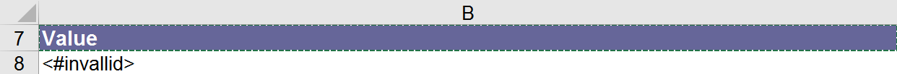

And "Invallid" is not defined, then instead of an exception when running the report it will complete successfully. In the result file you will see:

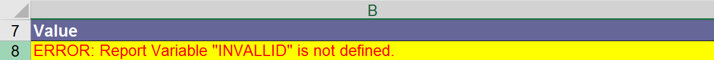

This mode does not cover all errors (for example a named range for a non-existing 
table will still raise an error), but it covers the most common
issues. The others still need to raise an exception, since if for
example you have a range named “\_\_table\_\_” and no “Table” in the
report, there is no place where FlexCel could write this error inside
the xls file. The error must be in a cell for this mode to work.

There are two ways to enter **ErrorsInResultFile** mode. The first one is to
change it in the code before running the report, by changing the
[TFlexCelReport.ErrorsInResultFile](~/api/FlexCel.Report/TFlexCelReport/ErrorsInResultFile.md) property in FlexCelReport.

For example:

<pre class="shiki shiki-themes light-plus dark-plus" style="background-color:#FFFFFF;--shiki-dark-bg:#1E1E1E;color:#000000;--shiki-dark:#D4D4D4" tabindex="0"><code>var
  report: TFlexCelReport;
begin
  report := TFlexCelReport.Create;
  try
    report.ErrorsInResultFile := true;
    report.Run('template_file.xlsx', 'result_file.xlsx');
  finally
    report.Free;
  end;
</code></pre>

The second way is to write it directly in the template, inside the
config sheet.

For example:

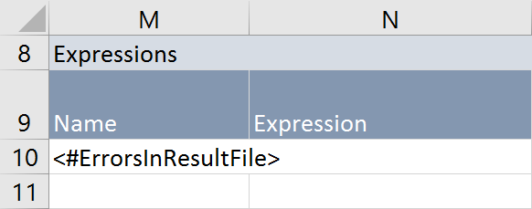

The &lt;\#ErrorsInResultFile&gt; tag can be anywhere in the Expressions
column, and you do not need to write anything in the Expression
definition.

This second way to enter ErrorsInResultFile mode is better when you are
editing a template and want to do a debug without modifying the code,
while the first way is better if you are automating testing and do not
want to modify the templates.

> [!Warning]
> 
> Remember that this mode is a **debugging** mode, and you should
> turn it off for production. You do not want to ship a file containing
> error messages in cells to your customers.

### Dealing with Logical Errors:

These kinds of errors are harder to deal with, are more subtle, and can
pass without notice since they do not raise any error on FlexCel side.

For example, imagine that you have this expression:

<pre class="shiki shiki-themes light-plus dark-plus" style="background-color:#FFFFFF;--shiki-dark-bg:#1E1E1E;color:#000000;--shiki-dark:#D4D4D4" tabindex="0"><code>&#x3C;#if(&#x3C;#tagval>=&#x3C;#refval>;OK;Error)>
</code></pre>

This is a valid tag, and the report will compile and run without issues.
Let's imagine now that tagval is the number 1, and refval is “l” (lowercase L). So,
when tagval is 1, the condition will evaluate to false, and you will get
the “Error” label instead of “OK”.

With this font in particular this can be a hard to spot problem, because
as we said before, you cannot really put a breakpoint in the expression
and see what is inside tagval or refval.

Here is where the “**Debug**” mode can help.

As with the “**ErrorsInResultFile**” mode, there are two ways to
activate debug mode. The first is by code, by setting the
“**[TFlexCelReport.DebugExpressions](~/api/FlexCel.Report/TFlexCelReport/DebugExpressions.md)**” property in the FlexCelReport to true. Again,
setting it in code is useful when automating tests because you do not
have to change the template.

And the second way is to write “**&lt;\#Debug&gt;**” in the
configuration sheet, the same way as in ErrorsInResultFile. This second
way is preferred in most cases, f.i. if you do not want to modify the
code, for example when testing a template.

The same remarks mentioned for the &lt;\#ErrorsInResultFile&gt; apply to
the &lt;\#Debug&gt; tag.

In this mode, tags will not write their value to the cell, but they will
rather write the whole chain of calculations made to arrive to the
value.

For example, for our problematic expression:

<pre class="shiki shiki-themes light-plus dark-plus" style="background-color:#FFFFFF;--shiki-dark-bg:#1E1E1E;color:#000000;--shiki-dark:#D4D4D4" tabindex="0"><code>&#x3C;#if(&#x3C;#tagval>=&#x3C;#refval>;OK;Error)>
</code></pre>

We will get this result in the cell:

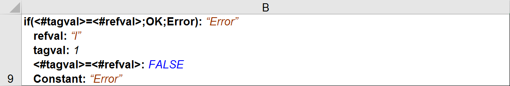

The format of the lines is as follows:

Each line has an **expression** in bold and a *value* in italics. Under
that line and indented to the right we find the subexpressions used in
the main expression and their values.

In this case, we can easily see that &lt;\#tagval&gt; is “1”,
&lt;\#refval&gt; is “1”, and &lt;\#tagval&gt; = &lt;\#refval&gt;
evaluates to false, so there is something wrong in the test. Having the
full stack and all the intermediate values used to compute the main
expression can be a valuable tool to find out what is going wrong, by
allowing us to easily locate the exact point where the expression is not
evaluating as it should.

> [!Note]
> 
> In order to correctly visualize the stack in the cell, you
> will have to set “Wrap Text” to true in the cell properties. If Wrap
> text is false, all lines will show in one line and it will be more
> difficult to read.
> 
> 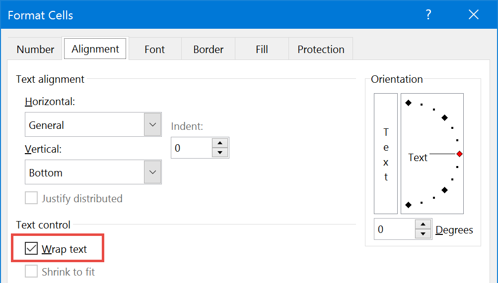
> 

Understanding the stack can be a little difficult at the first time, but
once you get used to it, it can be a great help. To end up this chapter,
we will present a more complex expression and its corresponding stack
explained. You can see it yourself at the [Debugging Reports](xref:Debugging_Reports-Delphi) demo.

The original expression is this:

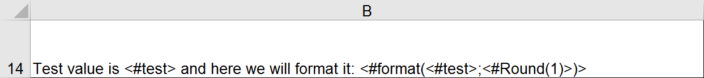

And the result we get when running this template in “debug” mode is:

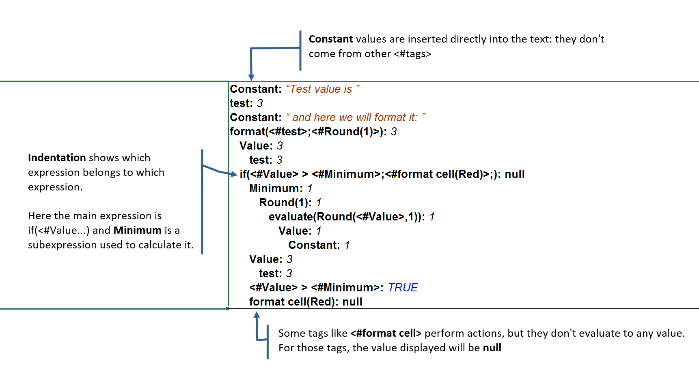

You can see we have 4 main expressions here (they show without
indentation). The first one is the constant text “**Test value is**”,
the second is the tag “**&lt;\#test&gt;**” that evaluates to 3, the
third is other constant text “**and here we will format it:** ” and the
fourth is an expression “**Format(&lt;\#test&gt;;&lt;\#round(1)&gt;)**”
that evaluates to 3. So the result in “normal” mode of this cell will be
“Test value is 3 and here we will format it: 3”. As there is a “format
cell(red)” tag in the evaluation stack, the result will be formatted in
red format.

All tags shown below the “format” line are subexpressions used to
compute it.

### Debugging Intelligent Page Breaks
Sometimes intelligent page breaks won't give the results you expect, and you might need to debug them.
You can enter intelligent page breaks debug mode similar to Report Debug mode and Errors in result file mode:

1. You can set [TFlexCelReport.DebugIntelligentPageBreaks](~/api/FlexCel.Report/TFlexCelReport/DebugIntelligentPageBreaks.md) to true in the code.
2. You can write a tag &lt;\#Debug Intelligent Page Breaks&gt; anywhere in the Expressions
column of the config sheet.

The details on how to debug are explained in the [Debugging Intelligent Page Breaks section of the API Guide](xref:ApiDeveloperGuide#debugging-intelligent-page-breaks)

