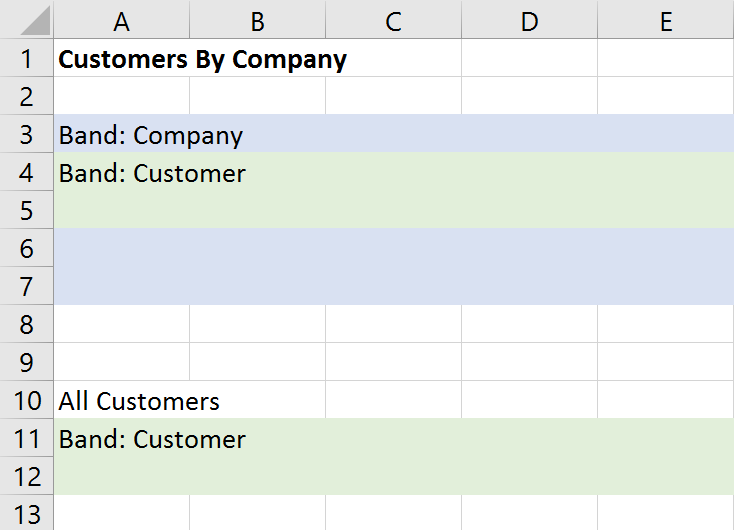

# FlexCel Reports Developer Guide

## Introduction

This document is a part of a 2-part description on how to create Excel
files by “reporting” instead of with code. In this part we will look at
how to set up the coded needed to create the files, and in the next part
[FlexCel Reports Designer Guide](xref:ReportsDesignerGuide) we will look at how to modify the Excel file used as a template to create the reports.

## About Excel Reporting

FlexCel gives you two ways to create an Excel file:
* With the [API](xref:ApiDeveloperGuide) using the class [TXlsFile](~/api/FlexCel.XlsAdapter/TXlsFile/index.md)
* With a templating system using  the class [TFlexCelReport](~/api/FlexCel.Report/TFlexCelReport/index.md) .

Each method has its good and bad things, and it is good to know the
advantages and drawbacks of each.

Creating a report using TXlsFile is a low-level approach.
As with most lower level approaches, it will be very fast to run (if coded right!),
and you will have access to the entire API, so you can do
whatever you can do with TFlexCelReport and more. After all,
TFlexCelReport uses TXlsFile internally to work its magic.

Whatever you can do in TFlexCelReport, you can do it with the API.

But you need to take a lot of care when coding directly in the API: TXlsFile reports can be a nightmare to
maintain if not coded correctly. When you reach enough number of lines like:

<pre class="shiki shiki-themes light-plus dark-plus" style="background-color:#FFFFFF;--shiki-dark-bg:#1E1E1E;color:#000000;--shiki-dark:#D4D4D4" tabindex="0"><code>  xls := TXlsFile.Create(1, true);
  xls.SetCellValue(3, 4, 'Title');
  fmt := xls.GetFormat(xls.GetCellFormat(3, 4));
  fmt.Font.Name := 'Helvetica';
  fmt.Font.Size20 := 14 * 20;
  XF := xls.AddFormat(fmt);
  xls.SetCellFormat(3, 4, XF);
</code></pre>

changing the report can become quite difficult. Imagine the user wants
to insert a column with the expenses (and don't ask why, users always
want to insert a column).

Now you should change the line:

<pre class="shiki shiki-themes light-plus dark-plus" style="background-color:#FFFFFF;--shiki-dark-bg:#1E1E1E;color:#000000;--shiki-dark:#D4D4D4" tabindex="0"><code>  xls.SetCellFormat(3, 4, XF);
</code></pre>

to

<pre class="shiki shiki-themes light-plus dark-plus" style="background-color:#FFFFFF;--shiki-dark-bg:#1E1E1E;color:#000000;--shiki-dark:#D4D4D4" tabindex="0"><code>  xls.SetCellFormat(3, 5, XF);
</code></pre>

But wait! You need to change also all references to column 5 to 6, from
6 to 7... If the report is complex enough, (for example you have a
master-detail) this will be no fun at all.

But there is something much worse with using TXlsFile directly. And this is that only the author can change the report.
If your user wants to change the logo to a new one, or maybe make column C a little wider, he needs to call
you and you need to recompile the application and send him a new
executable.

TFlexCelReport is a higher level approach. The design is cleanly
separated on three different layers, data layer, interface layer and
presentation layer, and most of the work is done on the presentation
layer, with Excel. You design the report visually on Excel, and you mess
as little as possible with the data layer. If the user wants to change
the logo, he can just open the template and change the logo. If he wants
to insert a column, he can just open the template and insert a column.
And the application does not even need to be recompiled.

As with any higher level approach, it is slower than using the API
directly, and there are some things where it is more limited. But all in
all, reports are really fast too and the things you cannot do are in many cases not worth doing anyway.

So, the option is yours. 

## Organization of a FlexCel Report

A FlexCel report can be seen as three different modules working together
to create the Excel file. Different from a “Coded” report where there is not a clear separation between
data access and presentation, here each part has its own place, and can
be developed separately by different people with different skills.

### Data Layer

This is the layer that contains the data model of the information we want to send out. The data might be stored at a database, or in lists of objects in memory.

### Interface Layer

This layer works as the glue between the data and the presentation layers. It has to prepare the data in a way that the presentation layer can easily consume.

### Presentation Layer
This is the most complex and changing layer of the three. Here is where
you design all the visual aspects of the report, like data position,
fonts, colors, etc.

The big advantage of this “layering” is that they are somehow
independent, so you can work on them at the same time. Also, Data and
Interface layers are small and do not change much on the lifetime of the
application. Presentation does change a lot, but it is done completely
in Excel, so there is no need to recompile the application each time a
cell color or a position changes.

> [!Note]
> 
> The data flow goes **from** the Presentation layer to the
> Data layer and back. It is the presentation that asks FlexCel for the
> data it needs, and FlexCel that in turn asks for the data. It is not the
> application that tells FlexCel the data it needs (As in SetCellValue(xx) ),
> but FlexCel that will ask for the data to the application when it needs
> it.

On this document we are going to speak about **Data** and **Interface**
layers. The Presentation layer is discussed on a different document,
[FlexCel Reports Designer Guide](xref:ReportsDesignerGuide) because it is complex enough to deserve
it, and because it might be changed by someone who only understands
Excel, not Delphi or C++ Builder. And we don't want to force him to read this document
too.

## Data Layer

The objective of the data Layer is to have all the data ready for the report
when it needs it. Currently, there are six ways to provide the data:

1.  **Via Report Variables**. Report variables are added to FlexCel by
    using [TFlexCelReport.SetValue](~/api/FlexCel.Report/TFlexCelReport/SetValue.md)”. You can define as many as you want,
    and they are useful for passing constant data to the report, like
    the date, etc. On the presentation side you will write
    &lt;\#ReportVarName&gt; each time you want to access a report
    variable.

2.  **Via User defined functions**: User defined functions are classes
    you define on your code that allow for specific needs on the
    presentation layer that it can't handle alone. For example, you
    might define a user function named “NumberToString(number: integer) that
    will return “One” when number=1, “Two” when number =2 and so on. On
    the presentation layer you would write &lt;\#NumberToString(2)&gt;
    to obtain the string “Two”

3.  **Via TDataSets:** You can use Delphi’s TDataSets to provide data to the report. If you have a DataSet named “mydb” with a column named “myfield”, then you can write &lt;#mydb.myfield> in the template to get the value.

4.  **Via TList&lt;T> and TArray&lt;T>**: If you have business objects stored in TList<T> or TArray<T>, you can use them directly with FlexCel. Just call [TFlexCelReport.AddTable](~/api/FlexCel.Report/TFlexCelReport/AddTable.md)&lt;TYourType>(“name”, YourCollectionOfType) and you are ready to go

5.  **Via Direct SQL in the template**. For maximum flexibility, you can
    set up the data layer on the template too. In this case, you need to
    add a database connection to FlexCel, and all the rest is done on
    the template. This allows the users to completely edit the reports,
    even the data layer from the template, but also it allows users to
    do things they might not be intended to. Use it with care.

6.  **Via Virtual Datasets**: If your business objects aren’t in TLists or TArrays, and the overhead of copying your existing objects to
    lists is too much, you can implement your own wrapper objects to
    provide this data to FlexCel without copying it. But please take
    this option with care, as it might be simpler and more performing to
    just dump your objects into a List and use that. FlexCel has an optimized implementation of a virtual dataset for Lists, and if you create your own virtual datasets you
    will have to implement a similar level of performance (and functionality). Please read
    the Appendix II for a more detailed description of virtual datasets.

### TList&lt;T&gt; and TArray&lt;T&gt; based DataSources

With FlexCel you can use any object that is stored in a list or array as a datasource for a report. Internally, FlexCel will use RTTI to query the objects and read the results.

To use this kind of datasources, you just need a collection of objects. For every object in the collection, you can use all the public properties, fields and functions taking no parameters as tags in the report. The collection might store records or classes, but due to limitations with RTTI in records, you can’t use public properties on records, only public fields. And from XE2 you can also use public methods in records. Classes support all properties, fields and methods.

So if for example you have the following class:

<pre class="shiki shiki-themes light-plus dark-plus" style="background-color:#FFFFFF;--shiki-dark-bg:#1E1E1E;color:#000000;--shiki-dark:#D4D4D4" tabindex="0"><code>  TMyObject = class
  private
    FFirstName: String;
    FLastName: String;

  public
    property FirstName: String read FFirstName;
    property LastName: String read FLastName;
  end;
</code></pre>

And the list of TMyObject:

<pre class="shiki shiki-themes light-plus dark-plus" style="background-color:#FFFFFF;--shiki-dark-bg:#1E1E1E;color:#000000;--shiki-dark:#D4D4D4" tabindex="0"><code>  MyObjectList := TList&#x3C;TMyObject>.Create;
</code></pre>

You can add this collection as a datasource for the report with the
line:
[TFlexCelReport.AddTable](~/api/FlexCel.Report/TFlexCelReport/AddTable.md)&lt;TMyObject>('MyName', Objs)

And then in the template write &lt;\#MyName.FirstName&gt; and &lt;
\#MyName.LastName&gt;inside a “\_\_MyName\_\_” range to export the
collection.

### TList&lt;IInterface&gt; DataSources

FlexCel also allows you to run a report from a TList&lt;T&gt; which contains interfaces. In general it works the same way as a TList&lt;T&gt; where T are objects or records, but you need to take into account the following points:

1. FlexCel uses RTTI to get the columns available in the interface. But by default, Delphi doesn’t generate RTTI for interfaces, so no fields will be available. In order to use interfaces, they must be compiled with **{$M+}** as in the example:

<pre class="shiki shiki-themes light-plus dark-plus" style="background-color:#FFFFFF;--shiki-dark-bg:#1E1E1E;color:#000000;--shiki-dark:#D4D4D4" tabindex="0"><code>{$M+}
MyInterface = Interface
  function GetName: string;
  property Name: string read GetName;
end;
{$M-}
</code></pre>

2. Of course, interfaces don’t have fields, so you can’t use them (even if the object implementing the interface has fields). But you **can’t use properties** either, since Delphi doesn’t generate RTTI for properties in interfaces. In the example above, the property “Name” doesn’t exist, and you would have to use &lt;\#data.GetName&gt; in the template (but see point 3).

3. As a way to make it simpler to switch between reports based in TList&lt;TObject&gt; and TList&lt;IInterface&gt;, FlexCel will automatically add the functions that start with **“Get”** or **“Get\_”** both as they are and without the “Get” prefix if it doesn’t conflict with another existing method. So in the example above, you can actually use &lt;\#data.Name&gt;, but you won’t be calling the property “Name”: You will be calling the method “GetName” instead. Note that “Get” and “Get\_” are case-insensitive, so “getname” would work as a name too.

### Dataset based DataSources

Besides TList&lt;T&gt; and TArray&lt;T&gt;, FlexCel can use Delphi’s TDataSet to fill a report from a database.

To use a DataSet in a report, just add the dataset or the tables with:

[TFlexCelReport.AddTable](~/api/FlexCel.Report/TFlexCelReport/AddTable.md)('name\_in\_template', DataSet);

Or any of the similar AddTable overloads. You might also add a full datamodule with AddTable, and all datasets
in the datamodule will be added.

#### About Record Count in DataSets

Not all Delphi SQL data access components return the correct record count for their records. Some return -1, some return the correct number, and some return the number of records fetched from the database at the moment. There is no way for FlexCelReport to know if a “25” returned by RecordCount means that the query will have exactly 25 results, or that the component has just fetched 25 records from the database.

FlexCelReport works by inserting rows into a template, and so it needs to know beforehand how many records it has to insert. While counting records in a database is kind of an expensive operation (and that’s why many components don’t return the correct RecordCount), inserting rows in a sheet is a more expensive operation. Inserting a row means fixing all the formulas in all the sheets to reference the new ranges, and also to fix the chart ranges, pivot table ranges, image positions and so on. While FlexCel is quite optimized for inserting rows, it is still an expensive operation and we try to minimize the number of times that we do it.

For this reason, **FlexCelReport needs to know the correct RecordCount before running**. There are many ways you can use to provide the correct record count to FlexCel:

-   If your component set returns the correct record count, then you don’t need to do anything. ADO with a client cursor and TClientDataset are two examples of components that return the correct record count.

-   Some other components have a property that allows them to return the real record count. For example FireDAC has a property **[RecordCountMode](http://docwiki.embarcadero.com/RADStudio/en/Fetching_and_Populating_Questions_%28FireDAC%29)** which you can set to cmTotal to get the real record count.

-   Especially if your datasets are unidirectional, you might load them into a TClientDataSet and use the TClientDataSet as source for FlexCel. While FlexCelReports will work with unidirectional datasets, to get full functionality (like filtering and sorting in the config sheet) you need bidirectional Datasets. So using an in-memory dataset like TClientDataset might be an option for complex reports.

-   Another way to provide the record count is to provide a field named **\_\_FLEXCELCOUNT** in your query that returns the recordcount. You might do a query like this: “Select (select count(\*) from employees) as \_\_FlexCelCount, employee, name from employees” and FlexCel will pick up the column and use it for the record count. If this field exists in the table, FlexCel will use it over the RecordCount reported by the component.

-   A last way to provide the record count is to set the parameter **RecordCountMode** to [TRecordCountMode](~/api/FlexCel.Report/TRecordCountMode.md).SlowCount when calling [TFlexCelReport.AddTable](~/api/FlexCel.Report/TFlexCelReport/AddTable.md)). When this parameter is SlowCount, FlexCel will iterate over all the records and count them, insert the rows, and then iterate again over all records to fill the values in the inserted rows. This might be the slowest solution, but it will work fine for middle-sized datasets. Note that if you set this parameter to SlowCount but also provide a \_\_FLEXCELCOUNT field, the value in \_\_FLEXCELCOUNT will be used.

> [!Note]
> 
> When you use Sorting or Filtering in the Config sheet, or use explicit relationships between tables (See [Data Relationships](#data-relationships), FlexCel will have to load all the records anyway, and so it will count them itself. For those datasets there is no need to provide a record count.

> [!Note]
> 
> For TDataSets that return -1 as record count, FlexCel will automatically do a slow count if no \_\_FlexCelCount field is present.
> The main problem is with TDataSets which return a bogus number like 25, because FlexCel can't know if that number is the actual record count or not.

### Data Relationships

FlexCel supports Master-Detail reports, where you have a “master”
datasource and a “detail” datasource where for every master record you
have different detail records. You could have an “employee” table and
for every employee, the orders they sold.

For these kinds of reports, you must tell FlexCel which is the master and
which is the detail. Also, you must tell FlexCel how those two tables
are related; for example, both tables could be related by an
“EmployeeId” field that is used to know which orders correspond to which
employee.

You can specify those relationships in two ways:

#### Implicit Relationships

When the individual objects inside a collection of objects contain a
public property that is itself a collection of objects, the second
collection is implicitly a detail of the first. For example, if you have
the class:

<pre class="shiki shiki-themes light-plus dark-plus" style="background-color:#FFFFFF;--shiki-dark-bg:#1E1E1E;color:#000000;--shiki-dark:#D4D4D4" tabindex="0"><code>  TEmployee = class
  strict private
    FFirstName: String;
    FLastName: String;
    FOrders: TList&#x3C;TOrder>;
  public
    property FirstName: String read FFirstName write FFirstName;
    property LastName: String read FLastName write FLastName;
    property Orders: TList&#x3C;TOrder> read FOrders write FOrders;
  end;
</code></pre>

Then “Orders” is an implicit detail of “Employee” and when you create a
Master-Detail report, FlexCel will output the correct orders for every
employee.

Implicit relationships are used in 
TList<T> and TArray<T>,  and are a simple
way to provide master-detail relationships if you have your objects
organized this way.

#### Explicit Relationships

Sometimes  you don’t have implicit
relationships in your data. You might have two different Lists of
objects:

<pre class="shiki shiki-themes light-plus dark-plus" style="background-color:#FFFFFF;--shiki-dark-bg:#1E1E1E;color:#000000;--shiki-dark:#D4D4D4" tabindex="0"><code>  Employees: TList&#x3C;TEmployee2>;
  Orders: TList&#x3C;TOrder2>;
</code></pre>

Where the objects are defined as:

<pre class="shiki shiki-themes light-plus dark-plus" style="background-color:#FFFFFF;--shiki-dark-bg:#1E1E1E;color:#000000;--shiki-dark:#D4D4D4" tabindex="0"><code>  TEmployee2 = class
  strict private
    FEmployeeId: Integer;
    FFirstName: String;
    FLastName: String;

  public
    property EmployeeId: Integer read FEmployeeId write FEmployeeId;
    property FirstName: String read FFirstName write FFirstName;
    property LastName: String read FLastName write FLastName;
  end;

  TOrder2 = class
  strict private
    FEmployeeId: Integer;
    FOrderId: Integer;
    FOrderName: String;

  public
    property EmployeeId: Integer read FEmployeeId write FEmployeeId;
    property OrderId: Int32 read FOrderId write FOrderId;
    property OrderName: String read FOrderName write FOrderName;
  end;
</code></pre>

And related by an Id (in this case EmployeeId). If you were to create a
report out of those two lists, you would get the full list of orders for
every Employee. You need to tell FlexCel that the “Employees” collection
is related to the “Orders” collection by the EmployeeId.

You can add explicit relationships with

[TFlexCelReport.AddRelationship](~/api/FlexCel.Report/TFlexCelReport/AddRelationship.md)(...)

But you will almost never need to do so. FlexCel uses the existing master-detail relationships
between TDataSets defined by standard methods, so if your datasets are already in a master-detail relationship,
you don't need to do anything in the FlexCel side.

For other objects different from datasets you will probably want to use
implicit relationships. But there might be cases where you need explicit
ones. Explicit relationships are more powerful than implicit, in the
sense that you can have the same tables related in different ways. For
example, The “Orders” collection could have also an explicit
relationship with a “Date” table. If you run the report “Orders by Date”
then that relationship will be used. If you run the report “Orders by
Employee” then the employee relation will be used. If you had implicit
relationships, then both “Date” and “Employee” collections would need an
“Orders” field, and that could lead to repeated data.

Explicit data relationships can be defined with any objects, even
between DataSets and TList<T> and  collections. Whenever FlexCel finds an
explicit Data Relationship, it will filter the detail table to show the
correct records for the master.

> [!Tip]
> 
> You might also define the relationships [directly in the
> template](xref:ReportsDesignerGuide#relating-tables-in-the-template) instead of by code. This is useful when using [Direct SQL](xref:ReportsDesignerGuide#direct-sql-in-templates), since
> the tables are defined directly in the Excel template and you can’t set
> up the relationships in code. Also, you can add
> custom relationships not related to datasets, when using [virtual datasets](#appendix-virtual-datasets).

## Interface Layer

This is the simplest of the three, as all work is done internally. To
set up the interface layer, you only need to tell FlexCel which datasets,
tables and user functions it has available from the data layer. For
this, you use “SetValue”, “SetUserFunction”, “AddTable” and
“AddConnection” methods on FlexCelReport. Once you have told FlexCel
what it can use, just call [TFlexCelReport.Run](~/api/FlexCel.Report/TFlexCelReport/Run.md) and this is all.

> [!Note]
> 
> It is worth spending some time thinking about
> what tables, functions and variables from the data layer you want to
> make available for the final user. Limiting it too much might mean
> cutting the power of the user to customize his report. And just adding
> everything might be too inefficient, since you are loading thousands of
> rows the user is not going to use, and might also have some security
> issues, as the user might get access to tables he is not expected to.
> You can also use SQL on the templates to allow maximum flexibility, but
> then you need to be extra careful about security.

## Appendix: Virtual DataSets

This is an advanced topic, targeted to experienced developers with really specific needs.

As explained earlier, the easiest way to provide data to FlexCel is via
TList<T>, TArray<T>  or DataSets. Both methods are fast, optimized,
with lots of added functionality, like data relationships, filtering or
sorting, and if you are experiencing issues with them, you are
probably better using them.

But you might want to use your own objects directly, and they might not be stored in any of those containers.

You can do this by writing wrapper objects around your data,
implementing the abstract classes **[TVirtualDataTable](~/api/FlexCel.Report/TVirtualDataTable/index.md)** and
**[TVirtualDataTableState](~/api/FlexCel.Report/TVirtualDataTableState/index.md)**. In fact, standard TList<T>, TArray<T>  and
Datasets also interoperate with FlexCel by implementing those classes.

> [!Note]
> 
> 
> 
> 
> If you are curious and have FlexCel source code, you can look at the units \_\_UVirtualArrayProvider.pas
> and \_\_UVirtualTDatasetProvider to see how FlexCel implements support for TDataSet and List&amp;T>
> using VirtualDataTables.
> 

We have two classes to implement:

1.  On one side we have [TVirtualDataTable](~/api/FlexCel.Report/TVirtualDataTable/index.md). It is a “stateless”
    container, much like an array. Each virtual dataset corresponds
    with a table on the data layer that you would add with
    “[TFlexCelReport.AddTable](~/api/FlexCel.Report/TFlexCelReport/AddTable.md)”, or create by filtering existing datasets
    on the config sheet.

2.  On the other side we have [TVirtualDataTableState](~/api/FlexCel.Report/TVirtualDataTableState/index.md). Each
    VirtualDataTableState corresponds with a band on the presentation
    layer, and if 2 bands share the same data source they will have 2 different VirtualDataTableState objects associated (but a single shared VirtualDataTable).

This is probably easier to visualize with an example. Let's imagine we
have the following report:

And this code:

<pre class="shiki shiki-themes light-plus dark-plus" style="background-color:#FFFFFF;--shiki-dark-bg:#1E1E1E;color:#000000;--shiki-dark:#D4D4D4" tabindex="0"><code>FlexCelReport.AddTable(Customers);
FlexCelReport.AddTable(Company);
FlexCelReport.Run();
</code></pre>

There are two VirtualDataTables here (Company and Customers), and three
VirtualDataTableStates (One for the Company Band, one for the first
Customers Band and one for the second Customers Band)

> [!Warning]
> 
> Take note that the same VirtualDataTable is used by two different
> VirtualDataTableStates, and might be used by other
> VirtualDataTableStates in other threads.
> 
> This is why you cannot save any
> “state” information on the VirtualDataTable, and if you write to any
> private variable inside of it (for example to keep a cache) you should
> use locks to avoid threading issues.
> 
> **Always assume that some other class might be reading your data.**

VirtualDataTableState on the other hand is a simple class that will not
be accessed by more than one class at the time, and you can do whatever
you want inside it without worries of other threads trying to access it.

### Creating a VirtualDataTable descendant

The first step into creating our own data access is to create a VirtualDataTable descendant and override its methods.
You do not need to
implement every method to make it work, just the ones that provide the
functionality you want to give to your end users.

#### VirtualDataTable Required Methods:

On every DataTable you define, you need to implement at least the
following methods:

* **GetColumn**, **GetColumnCaption**, **GetColumnName** and
**ColumnCount**:

   Those methods define the “columns” of your dataset, and the fields you
can write on the &lt;\#dataset.field&gt; tags on the template.

* **CreateState**: It allows FlexCel to create VirtualDataTableState
instances of this DataTable for each band. You will not create
VirtualDataTableState instances directly on your user code, FlexCel will
create them using this method.

#### VirtualDataTable Optional Methods:

Now, depending on the functionality you want to provide to the end user,
you might want to implement the following methods:

* **FilterData**: Will return a new VirtualDataTable with the filtered
data.

   You need to implement this method if you want to provide the user with the
ability to create new datasets by filtering existing ones on the config
sheet. If you do not implement it, any attempt to create a filtered
dataset on the config sheet will raise an exception.

   Also when FlexCel needs to create a dataset that is a copy of the
existing one (for example for sorting it) it will call FilterData with
rowFilter null. So even if you don’t implement filtering, it is normally
a good idea to at least implement the case for “rowFilter” = null and
return a clone of the datatable.

   Note that this only applies to standard filters. For
&lt;\#Distinct()&gt; or &lt;\#Split&gt; filters you do not need to
implement this.

* **GetDistinct**: Will return a new VirtualDataTable with only unique
records.

   Implement this method if you want to let your user write
&lt;\#Distinct()&gt; filters on the config sheet.

* **LookUp**: Will look for a record on the dataset, and return the
corresponding value. This method allows the user to use
&lt;\#Lookup()&gt; tags on their reports.

* **GetRelationWith:** Use this method to return implicit relationships
between your data tables. For example the VirtualDataTable
implementation of Datasets uses this method to return the ADO.NET
DataRelations between datasets. The Linq implementation returns as
related any nested dataset.

### Creating a VirtualDataTableState descendant:

Again, you do not need to implement every method in this class, and the
methods you don't implement will just reduce functionality.

### VirtualDataTableState Required Methods:

* **RowCount**: Here you will tell FlexCel how many records this dataset
has on its current state. Remember that this might not be the total
record count. If for example you are on a master-detail relationship,
and the master is on record 'A', you need to return the count of records
that correspond with 'A'*. Make sure this method is fast, since it is
called a lot of times*.

* **GetValue**: Here you will finally tell FlexCel what is the value of
the data at a given row and column. You can know the row by reading the
“Position” property, and the column is a parameter to the method.

   As with RowCount, this method should return the records on a specific
state, not all the records on the datatable. If you are in a
master-detail relationship and only two records of detail correspond the
master position, GetValue(position = 0) should return the first record,
and GetValue(Position = 1) should return the second. It doesn't matter
if the total number of records is 5000.

### VirtualDataTableState Optional Methods:

* **MoveMasterRecord**: This method is called each time the master changes
its position when you are on a master-detail relationship. You should
use it to “filter” the data and cache the records that you will need to
return on RowCount and GetValue. For example, when the master table
moves to record “B”, you should find out here all the records that apply
to “B”, and cache them somewhere where RowCount and GetValue can read
them.

   You should probably create indexes on the data on the constructor of
this class, so MoveMasterRecord can be fast finding the information it
needs.

   You do not need to implement this method if the VirtualDataTable is not
going to be used on Master-Detail relationships or Split relationships.

* **FilteredRowCount**: This method returns the total count of records for
the current state (similar to RowCount), but, without considering Split
conditions.

   If the dataset has 200 records, of which only 20 apply for the current
master record, and you have a Split of 5 records, RowCount will return 5
and FilteredRowCount will return 20.

   This method is used by the Master Split table to know how much records
it should have. In the last example, with a FilteredRowCount of 20 and a
split every 5 records, you need 4 master records. You do not need to
implement this method if you do not want to provide “Split”
functionality.

* **MoveFirst**/**MoveNext**: Implement these methods if you want to do
something in your data when FlexCel moves the active record. 

**EOF:** Return true if the dataset is at the last record. If you don’t
implement this method, the default implementation is to check Position
== RecordCount. But RecordCount might be expensive to calculate, and in
this case, if you explicitly implement this method, it will work faster.

### Finally

When you have defined both classes, you need to create instances of your
VirtualDataTable, and add them to FlexCel with [TFlexCelReport.AddTable](~/api/FlexCel.Report/TFlexCelReport/AddTable.md).

