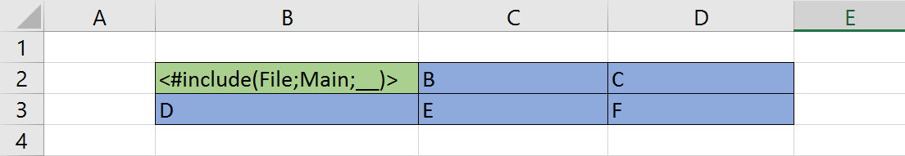
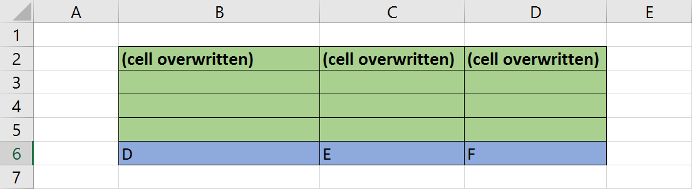
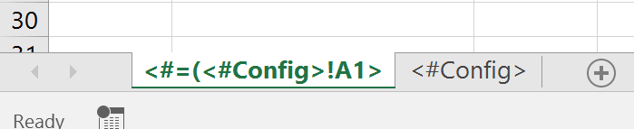
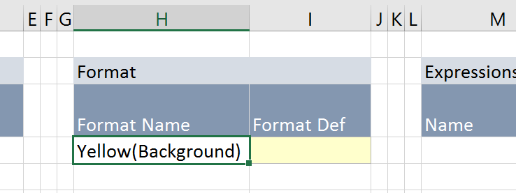
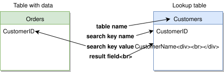

# FlexCel Reports Tag Reference.

This document lists all the built-in tags in the report engine.
You can use any of the tags included here, or define your own.

## Tag syntax
Tags are special commands that go inside <#...> delimiter. Those will be replaced by FlexCel when running the report.

Tags cannot be escaped, but you can always insert literal <# or ; characters by defining report expressions an values. Say for example that you wanted to enter the following formula:

<pre class="shiki shiki-themes light-plus dark-plus" style="background-color:#FFFFFF;--shiki-dark-bg:#1E1E1E;color:#000000;--shiki-dark:#D4D4D4" tabindex="0"><code>&#x3C;#if(&#x3C;#tag2>="";&#x3C;#tag1>;&#x3C;#tag1>;&#x3C;#tag2>)>
</code></pre>

In the following expression, if tag 2 is empty you will just output tag1, else you will output tag1;tag2. The problem with the formula above is that the ";" between <#tag1> and <#tag2> will be interpreted as a parameter separator, and the formula isn't valid. For this particular case, you can write the full string inside double quotes ("). <#tag1> and <#tag2> will still be replaced inside the double quotes, but FlexCel won't be misled into thinking the ; is a parameter separator. This formula will work fine:

<pre class="shiki shiki-themes light-plus dark-plus" style="background-color:#FFFFFF;--shiki-dark-bg:#1E1E1E;color:#000000;--shiki-dark:#D4D4D4" tabindex="0"><code>&#x3C;#if(&#x3C;#tag2>="";&#x3C;#tag1>;"&#x3C;#tag1>;&#x3C;#tag2>")>
</code></pre>

As a more general approach for other cases (including if you want to enter a literal "<#"" into a formula) the solution is just to define report expressions or report variables with the text. So in the example above we could define a report expression:

Semicolon = ";"

and then write:

<pre class="shiki shiki-themes light-plus dark-plus" style="background-color:#FFFFFF;--shiki-dark-bg:#1E1E1E;color:#000000;--shiki-dark:#D4D4D4" tabindex="0"><code>&#x3C;#if(&#x3C;#tag2>="";&#x3C;#tag1>;&#x3C;#tag1>&#x3C;#semicolon>&#x3C;#tag2>)>
</code></pre>

Using expressions or variables you can escape any text you might need to, and it is the more general solution.

## Constant
#### Syntax
Any text

#### Description

Any text that is not inside **<#... >** symbols.

#### Example

On the string “<#tag1>**Hello**<#tag2>” “Hello” is a constant.

## Report Variable

#### Syntax

1. <#Value>
2. <#Value;default>

#### Description

A variable set in code before running the report. You can specify a default value (second syntax) that will be used if the variable does not exist. If no default value is provided and the variable does not exist, an exception will be raised.

#### Example
If you have a line of code [TFlexCelReport.SetValue](~/api/FlexCel.Report/TFlexCelReport/SetValue.md)('Date', Now) before [TFlexCelReport.Run](~/api/FlexCel.Report/TFlexCelReport/Run.md), the tag **<#Date>** will be replaced by the current date. If you have **<#Date>** in the template but do not do the [SetValue](~/api/FlexCel.Report/TFlexCelReport//SetValue.md) command, a runtime error will happen.
If you write **<#Date;No date supplied>** in the template, this tag will be replaced with the date if you set it on code with SetValue, or with the string **"No date supplied"** if not. There will never be a runtime error.

> [!Note]
> 
> Report Variables, User-defined Expressions and User-defined Functions use the same syntax, so it is impossible to differentiate between them. If you define a Report Variable with the same name as a User-defined Expression and/or User-defined function, they will be used on the following order: 1) User-defined Expression. 2) Report Variable. 3)User-defined function.

## User-Defined Expression
#### Syntax

1. <#Expr>
2. <#Expr(param1;param2...)>

#### Description
Text on the Column “User defined Expressions” on the config sheet. When using parameters, you can use the **<#param1>** name inside the expression definition.

#### Example

If you define an Expression **CompleteName** = <#LastName>, <#FirstName> on the config sheet, the tag **<#CompleteName>** will be replaced by the expression.

> [!Note]
> 
> Report Variables, User-defined Expressions and User-defined Functions use the same syntax, so it is impossible to differentiate between them. If you define a Report Variable with the same name as a User-defined Expression and/or User-defined function, they will be used on the following order: 1) User-defined Expression. 2) Report Variable. 3)User-defined function.

## User-Defined Function
#### Syntax

1. <#UDF>
2. <#UDF(param1;param2;...)>

#### Description
A user-defined function on the code. See the [User Defined Functions](xref:User_Defined_Functions-Delphi) demo for details.

#### Example
If you define a function **Proper(name)** on the report code, **<#Proper(test)>** on the template will be replaced by the results of the function.

> [!Note]
> 
> Report Variables, User-defined Expressions and User-defined Functions use the same syntax, so it is impossible to differentiate between them. If you define a Report Variable with the same name as a User-defined Expression and/or User-defined function, they will be used on the following order: 1) User-defined Expression. 2) Report Variable. 3)User-defined function.

## Dataset
#### Syntax
1. <#TDataSet.Field>
2. <#TDataSet.Field;default>

#### Description
The value of **Field** on the current row of **TDataset**. If a default value is provided, it will be used when the field does not exist in the table or the table does not exist. You will normally want to provide default values when using metatemplates, together with the defined and preprocess tag. If you do not provide a default value and the field does not exist, a runtime error will happen.

There are two defined “pseudocolumns” that you can use on any dataset:

1. **<#DataSet.#RowCount>** will return the number of rows on a dataset.
2. **<#DataSet.#RowPos>** will return the current position on the dataset (the first record is 0).

> [!Note]
> 
> Normally you can write any character in the column name, including a column named similar to **"Data(Max)"**. But in some cases, like when for example there is a simple parenthesis, or if you have the character ">" inside the column name, you might need to quote the name. For example, if your column name is **"a("** you will have to write the tag as **<#"DataSet.a(">**. When quoting a name, you can include a quote inside by writing 2 quotes. For example, the column **a"b** can be written as **<#"DataSet.a""b">**

> [!Note]
> 
> FlexCel always searches for the first dot in the string to separate the table name from the field name. So if you have for example <#one.two.three>, FlexCel will understand that the table is "one" and the field is "two.three". If you wanted the table name to be "one.two" and the field to be three, you would have to use square brackets to keep together the table name: **<#[one.two].three>**
> 
> You can see square brackets in action in the  [Advanced Reports From Lists](xref:Advanced_Reports_From_Lists-Delphi) demo.

#### Examples

If you have a table "Customers" with a column named "LastName", **<#Customers.LastName>** will replace the value on the report.

**<#if(<#Customers.#RowCount> = 0;<#delete row>;)>** will delete a row if the dataset has no records. You can use it to delete the detail captions on master-detail reports when the master has no details.

**<#Customers.LastName;No customer>** will enter the value of the field LastName if such field exists in the database, or the string "No customer" otherwise.

**<#Customers.LastName;>** will enter an empty value if the field LastName does not exist.

**<#Customers.ByName.LastName>** will refer to the table "Customers" and the field "ByName.LastName". On the other hand, **<#[Customers.ByName].LastName>** will refer to the table "Customers.ByName" and the field "LastName"

## Full Dataset
#### Syntax
<#Dataset.\*>
#### Description
The whole current row of the dataset. Cells to the right will be overwritten.
You can write other **<#Dataset.\*>** and **<#Dataset.\*\*>** tags inside the same cell, and they will have the value of the first one.

> [!Note]
> 
> It is recommended that you don't use **<#column width(autofit)>** in a <#Dataset.\*> tag, since the <#autofit> tag will be copied to every row and applied for every one. If you want to use it, it is best to put the autofit tag in the Full dataset captions tag (<#Dataset.\*\*>)

#### Example
If the cell A1=”<#DataSet.\*>, after the report column A will have the first column of the dataset, Column B the second column, etc. Any text previously on Column B will be overwritten.
If you write **"&lt;#DataSet.\*> &lt;#if(<#DataSet.\*\*>="Date";<#Format Cell(blue)>;>)** in a cell, all columns written will have autofit, and when the column is named "Date" it will be formatted in blue

## Full Dataset Captions
#### Syntax
<#DataSet.\*\*>
#### Description
The whole row of column captions for a dataset. You normally use this tag before a <#dataset.\*> and outside any named range.
#### Example
If you write **<#Dataset.\*\*>** on cell A1, cell A1 will have the first column name on the dataset, B1, the second, etc. Text previously on B1 will be overwritten.
If you write **"<#Dataset.\*\*> <#ColumnWidth(autofit)>"**  in a cell, it will autofit all the columns in the range

## DbValue

#### Syntax

1. <#dbvalue(table;row expression; column expression)>
2. <#dbvalue(table;row expression; column expression; default value)>

#### Parameters

* **table**: Datatable with the data, without quotes
* **row expression**: An Excel expression (any valid Excel formula that can include other <#tags>) that must return a number or be empty. If empty, the record number will the current record. If a number, then that number is the record you want to retrieve. (starting at record 0)
* **column expression**: An Excel expression (any valid Excel formula that can include other <#tags>) that must return a number or a string. If a number, this means the position of the column in the datatable (with the first column being column 0). If a string, this is the name of a column in the table.

> [!Note]
> 
> As this is an expression, not a string, if you want to enter a constant string here (like "customer") it must be between double quotes. The expression ="customer" with quotes evaluates to customer (without quotes). If you write just customer, it will be an invalid expression.

* **default value**: A default value that will be used if the row or column doesn't exist. If you don't specify a default value and try to access an invalid row or column, an exception will be thrown.

#### Description

Returns any value of a table, letting you specify the record and column for the value. Note: This is an advanced tag, and you most likely don't want to use it. The most common application for it is when you want to do something depending on the value of the previous record (For example merge the cell if the value is the same as previous). Don't use it as a general tool. <#db.field> tags, ranges and aggregates should be enough for most needs, and they are a much cleaner and "functional" abstraction.

#### Examples

**<#dbvalue(customers;<#customers.#rowpos> - 1;"customerId";)>** will return the value of the previous value in customers.customerid.  Note that "CustomerId" is in quotes as it should be an expression that returns a string, not a string. Also note that we defined an empty default value, so no exception is thrown when we are at the beginning of the table.

**<#if(<#dbvalue(customers;<#customers.#rowpos> - 1;"customerId";)> = <#dbvalue(customers;<#customers.#rowpos>;"customerId";)>;<#Merge range(a3:a4)>;<#customers.name>)>**  will merge the cell if the value is the same as the previous one, or write the new value is values are the same.

## Aggregate
#### Syntax
1. <#aggregate(agg function; dataset name and column)>
2. <#aggregate(agg function; dataset name; agg expression; filter)>

#### Parameters

* **agg function**: It might be SUM for adding the values, COUNT for counting the values, AVG for finding the average, MAX to find the maximum value and MIN to find the minimum value.

* **dataset name (and column)**: Name of the dataset in which we want to aggregate the values. Note that this dataset doesn't need to be inside any named range, since we will use all of its records anyway. If "agg expression" is present, you don't need to include the column name, as the columns to aggregate will be taken from the expression. If not present, you need to include the column in which you want to aggregate.

* **agg expression**: This parameter is optional. An expression that will be applied to every record in the dataset.(any Excel function is valid here, and you can use any combination of Excel functions) Null values will be ignored, but will count to the total records when calculating the average. If not present, the values of the column specified in "dataset name and column" will be used. Note that when aggregating on COUNT, this parameter is ignored.

* **filter**: This parameter is optional. If present, it should be an expression that returns true or false. Again, any Excel formula is valid here. Only those records where the filter value is true will be used in the aggregate. When calculating the average, filtered records will not be used in the count.

#### Description

Aggregates a dataset and returns a unique value for all its records. You can use this tag to find for example the sum on a column in a dataset. Note that this tag can have a bad performance, as you need to load all data in memory in order to calculate the aggregate. If possible, it is preferred to do the aggregate directly in the database, for example using a "Group by" clause in the select SQL. This tag can be of use when you can't modify the datasets and you already have the data loaded, so you need to do the aggregation from the template.

#### Examples

**<#Aggregate(sum;orders.orderid)>** will sum all the values in the column order id of the table orders

**<#Aggregate(avg;orders;<#orders.quantity>*<#orders.orderprice>)>** will calculate the average of the quantity multiplied by the order price in table orders

**<#Aggregate(min;orders;<#orders.tag>;<#orders.tag>> 0)>** will calculate the minimum tag in orders that is bigger than 0

## List
#### Syntax
1. <#List(dataset name and column)>
2. <#List(dataset name; list separator; agg expression; filter)>

#### Parameters

* **dataset name (and column)**: Name of the dataset in which we want to get the values as a list. Note that this dataset doesn't need to be inside any named range, since we will use all of its records anyway. If "agg expression" is present, you don't need to include the column name, as the columns to aggregate will be taken from the expression. If not present, you need to include the column in which you want to aggregate.
* **list separator**: This parameter is optional. If not present it will default to a single space. This is the character that will separate the elements in the list. Note that if you want to use a semicolon here (;) you will have to write it in quotes (";") so it is not considered a parameter separator
* **agg expression**: This parameter is optional. An expression that will be applied to every record in the dataset.(any Excel function is valid here, and you can use any combination of Excel functions) Null values will be ignored and not added to the list. If not present, the values of the column specified in "dataset name and column" will be used
* **filter**: This parameter is optional. If present, it should be an expression that returns true or false. Again, any Excel formula is valid here. Only those records where the filter value is true will be used in the aggregate.

#### Description
Returns a string with all the values of a table one after the other, and separated by a delimiter. If the table has only one record, you can use **<#List(table.field)>** to get the value of the only record without having to define any **\_\_table\_\_** named range.

#### Examples
**<#List(Employees.Lastname)>** will return a string like "Smith Brown Perez", when the dataset has 3 records with the lastnames of Simth, Brown and Perez.  As we didn't specify a separator, a single space will be used. In cases where you know Employees has only one record, you could have used this to avoid defining a **\_\_employees\_\_** named range.

**<#list(employees.lastname;, )>** will return a string like "Smith, Brown, Perez".

**<#list(employees;"; "; <#employees.firstname> & " " & <#employees.lastname>)>** will return a string like "John Smith; Carl Brown; Jorge Perez".  Note that as we wanted to use ";" as the list separator, we had to write it inside quotes.

## If

#### Syntax
<#if(Condition; IfTrue; IfFalse)>

#### Description
A conditional statement. When “condition” is true, “IfTrue” expression will be evaluated, if not “IfFalse” will. For a description of the “Condition” format, see [Evaluating Expressions in the Reports Designer Guide](xref:ReportsDesignerGuide#evaluating-expressions)

#### Example
**&lt;if(<#value>=1;One;Not One)>** will write “One” if the report variable “Value” is 1, and “Not One” if not.

## Ifs

#### Syntax
<#ifs(Condition1; value1; Condition2; value2...)>

#### Description
An "if-chain" of different conditions. If condition1 is true then this tag will return value1, if it is false it will evaluate condition2 and if condition3 is true return value2, and so on.
If no condition evaluates to true, then this tag will return #N/A!. If you want to provide a default condition, make sure that the last condition is the value "true"

> [!Note]
> 
> If the condition always compares against the same value, you might use <#switch> instead. The examples below are simpler using <#switch>

#### Examples
**<#ifs(<#value>=1;One;<#value>=2;Two)>** will write “One” if the report variable “Value” is 1, "Two" if value is 2, and  #N/A! if the value isn't 1 or 2

**<#ifs(<#value>=1;One;<#value>=2;Two;true;Something else)>** will write “One” if the report variable “Value” is 1, "Two" if value is 2, and  "Something else" if the value isn't 1 or 2

## Switch

#### Syntax
<#switch(SwitchValue; value1; result1; value2; result2...[default])>

#### Description
This tag will compare "SwitchValue" against value1, value2, etc in order. If SwitchValue is equal to any of the value_n, then result_n will be returned.
You can provide a default value as the last parameter. If no value matches SwitchValue and you have a default parameter, then the default will be returned.
The default is inferred from the number of arguments: When the number of arguments is odd (3, 5, 7...) there is no default value. If the number of arguments is even, then the last parameter is the default.

#### Examples
**<#switch(<#value>;1;One;2;Two)>** will write “One” if the report variable “Value” is 1, "Two" if value is 2, and  #N/A! if the value isn't 1 or 2

**&lt;switch(<#value>;1;One;2;Two;Something else)>** will write “One” if the report variable “Value” is 1, "Two" if value is 2, and  "Something else" if the value isn't 1 or 2

## Evaluate

#### Syntax
1. <#evaluate(expression)>
2. <#evaluate(expression;loop count)>

#### Parameters
expression: An expression to evaluate. For a list of possible expressions, see [Evaluating Expressions in the Reports Designer Guide](xref:ReportsDesignerGuide#evaluating-expressions).
loop count: How many times to evaluate expression. If this parameter is not used, expression will be evaluated one time.

#### Description
This tag will evaluate an expression and output the final result. You can see it as a “static” formula. Different than <#=()> tag, expression will be evaluated each time a value is needed, so you can have relative addresses.

A loop count bigger than 1 is useful if you store tags in the database itself. For example, if you have a field in the database "db" named "Expression" with value "<#other tag>", then <#evaluate(<#db.expression>;2>)> will evaluate first the value of expression, find out it is <#other tag>, then evaluate again <#other tag> and write the value of other tag in the cell.


#### Example
**<#evaluate(A1+$A$2\*2 &amp; left(a3,2))>** will output a string consisting on A1+A2\*2 concatenated with the 2 first characters of a3.

If a report variable customer has the value "<#FirstName> & <#LastName>", then **evaluate(<#customer>;2)** will first evaluate <#customer> and return the string "<#FirstName> & <#LastName>". Then, as loop count is 2, it will evaluate the string "<#FirstName> & <#LastName>" and return the first and last name concatenated.

## Equal
#### Syntax
<#=(“Cell”)>

#### Description
Replaces the tag with the referred cell content. “Cell” might be a reference to another sheet.
Note that “Cell” will be evaluated at compile time, so it won't change when you copy the range. (It always behaves like an absolute reference, on the style $A$1). If you want to have a cell reference that is dynamically evaluated at fill time, use **&lt;evaluate(“Cell”)>** tag.
Note: Almost the only place where this tag makes sense is on sheet names. For other expressions it is better to define an expression on the config sheet and use it instead of a cell reference. When using a sheet name you can not always know which one is the config sheet, so it is not safe to use expressions, and you need the “=” tag.

#### Example
If you name a sheet **<#=(Sheet2!A1)>** the sheet name will be replaced by whatever you write on cell A1 on Sheet2. On cells, define a named expression on the config sheet and use it instead of this tag.

## Include

#### Syntax
1. &lt;include(file; named range; shift type)>
2. &lt;include(file; named range; shift type;static/dynamic)>
3. &lt;include(file; named range; shift type;static/dynamic;CopyRowsOrCols)>

#### Parameters

* **file**: Filename to include. The path is relative to where the current template is. If you are inserting from a stream (for example from a database) you need to assign the GetInclude event. See [Templates In The Exe](xref:Templates_In_The_Exe-CPlusPlus) demo for more info.

* **named range**: Named range on the included file that determines which cells will be included. If you leave this parameter empty, the full used range in the active sheet will be included.

* **shift type**: How the existing cells will be shifted to insert the new ones. There are five possibilities: “\_\_”, “\_”, “I\_”, “II\_” and “FIXED”, to move existing cells the full row down, only down, full column right, only right or not insert anything respectively.

* **static/dynamic**: This can be the string "Dynamic" or "Static" (without quotes), or omitted, in which case it is assumed to be "Dynamic".  Dynamic includes will run inside the main report when inserted; this is the normal behavior. Static includes will just insert the child file inside the main report without running it. Static can be used if you want to include a previously generated report, to make sure FlexCel does not try to run it again.

* **CopyRowsOrCols**: this parameter can be "R", "C" or "RC" (without quotes). By default, included reports will get the column widths and row heights of the parent report (unless you are inserting a full column or row). If you specify "R" here, row heights and format from the included report will be copied to the parent, modifying the parent rows. If you specify "C", column widths will be copied, modifying the parent columns. If you specify "RC", both columns and rows will be copied.

#### Description
Includes a subreport inside the current one. An included file can include other files itself. The subreport is precompiled and runs on its own sandbox, so it cannot access cells on the parent. For example, a <#delete range> tag will never erase something outside the include.
The subreport does have access to all report variables, expressions and user-defined functions of the parents, as it has to the parent databases.

#### Example
On the following include, cells will be moved the whole row down.

The generated file will be:

Note how cells C2 and D2 are overwritten on the final report. As a general rule, do not write anything at the right of the file being included, except if you know for sure the include won't overwrite the cells. When inserting columns (II_ and I_ ), cells on the same column as the include will be overwritten.

## Configuration Sheet

#### Syntax
<#config>

#### Description
This tag will identify the current sheet as the configuration sheet. It will only have an effect when written on a sheet name.

#### Example
Just name the sheet <#config>

You can also conditionally define a sheet as the configuration sheet. If you write **<#if(<#value>=1;<#delete sheet>;<#config>)>** as the name of one sheet and **<#if(<#value>&lt;>1;<#delete sheet>;<#config>)>** as the name of another, the configuration sheet will be the first or the second one depending on the value of <#value>.

## Delete Range

#### Syntax
<#delete range(range address; shift type>

#### Parameters

* **range address**: The range of the cells to delete. This might be a string like "A1:B5" or a named range like "myrange"

> [!Note]
> 
>  Whenever possible, use named ranges instead of strings in the range definitions. If you define a named range "myrange" in cells A2:A3 and use it as a parameter for this tag, when you insert a row in A1 the range will move to A3:A4. If you had written the string "A2:A3" as the parameter for this tag, it would still point to A2:A3 after inserting the row.

* **shift type**: How the existing cells will be shifted when deleting. There are four possibilities: “\_\_”, “\_”, “I\_” and “II\_”, to move existing cells the full row up, only up, full column left and only left respectively.

#### Description
Use it to delete a range of cells. The range will be deleted after all the cells on the band have been replaced.

#### Example
**<#if(<#value>=1;<#delete range(a1:a5;\_\_)>;)>** will delete the first five rows on the band when **<#value>**=1 and shift rows up.

**<#if(<#value>=1;<#delete range(myrange;I\_\_)>;)>** will delete the named range **myrange** when <#value>=1 and shift columns ot the left.

## Delete Row

#### Syntax
1. <#delete row>
2. <#delete row(full)>
2. <#delete row(relative)>

#### Parameters

* **no parameters**: When called with no parameters, the full row will be deleted.

* **full**: This is the same as calling it without parameters, the full row will be deleted

* **relative**: Only the cells inside the range being processed will be deleted, not the full row. Use this call if for example you have 2 side by side reports, and wish to delete the row in one of the reports but not in the other. Older FlexCel versions used this mode by default

#### Description
Use it to delete the current row. If you are a FlexCel 2.x user, note that <#delete row> behaves differently from the old ...delete row... Now <#delete row> is processed at the same time as the ranges, so you can't use it to expand ranges. Use “X” ranges instead.

#### Example
**<#if(&lt;#value>=””;&lt;#delete row>;)>** will delete the current row when value is empty.

## Delete Column

#### Syntax
<#delete column>

#### Parameters
* **no parameters**: When called with no parameters, the full column will be deleted.

* **full**: This is the same as calling it without parameters, the full column will be deleted

* **relative**: Only the cells inside the range being processed will be deleted, not the full column. Use this call if for example you have 2 reports one above the other, and wish to delete the column in one of the reports but not in the other. Older FlexCel versions used this mode by default

#### Description
Use it to delete the current column.

#### Example

**<#if(<#value>=””;<#delete column>;)>** will delete the current column when value is empty.

## Delete Sheet
#### Syntax
<#delete sheet>

#### Description
This tag will delete the current sheet. It will only have an effect when written on a sheet name.

#### Example
If you write **<#if(<#value>=1;<#delete sheet>;Food)>** as the name of a sheet, this sheet will have the name **Food** when the report variable **value** is not one, and will be deleted when **value**=1

> [!Note]
> 
> As the maximum sheet name size is 31 characters, you will probably need to write the expression including the **<#delete sheet>** tag on the config sheet, and name the sheet as **<#=(<#Config>!A1)>** or similar, as shown in the picture:
> 
> 

## Sheet Visible
#### Syntax

1. <#sheet visible(show)>
2. <#sheet visible(hide)>
3. <#sheet visible(very hide)>

#### Description
This tag will hide or show the current sheet. It can be written in any cell. The very hide option corresponds with [Excel's very hidden](https://docs.microsoft.com/en-us/office/troubleshoot/excel/hide-sheet-and-use-xlveryhidden) sheets.
 
#### Example
If you write in a cell **<#if(<#value>=1;<#sheet visible(very hide>)>** then the sheet will be hidden when value is 1.

> [!Note]
> 
> If you have multiple <#sheet visible> tags in a file, then it is not determined which one will be last used and have the final effect. It depends on the order of evaluation of the cells inside the sheet. Try to have a single tag per sheet, and not inside any range that could be copied.

## Format Cell
#### Syntax
<#format cell(format name; [user format parameter 1; user format parameter 2;...])>

#### Parameters
* **format name**: The name of a format defined on the config sheet, or a User-defined Format defined with [TFlexCelReport.SetUserFormat](~/api/FlexCel.Report/TFlexCelReport/SetUserFormat.md).
* **user format parameters**: This is a list of **optional** parameters and they are only used if *format name* is a User-defined format. It is a list of parameters
that will be passed to the user-defined format function.

#### Description

Use it to format a cell with a defined format. You define all format settings (fonts, borders, patterns, etc) on the config sheet, and then you can freely use them. Note that you can define "partial formats" that will only apply part of the format. (for example the cell background, but keeping the font of the destination cell). Look at the [Reports Designer Guide](xref:ReportsDesignerGuide#defining-custom-formats) for more information on partial formats

#### Examples
<#if(mod(row(a1),2)=0;<#format cell(Yellow)>;)> will format the cell as yellow for odd rows.

You need to define a “Yellow” format on the config sheet:

> [!Note]
> 
> In this example we defined a **Yellow(Background)** partial format, so it only applies the background color of the cell
> and not other attributes like the font size or color.

You could also use a User-defined Format added with [TFlexCelReport.SetUserFormat](~/api/FlexCel.Report/TFlexCelReport/SetUserFormat.md). For example:
  <#format cell(MyUserFunction;<#category.color>)> will call a function registered as MyUserFunction with [TFlexCelReport.SetUserFormat](~/api/FlexCel.Report/TFlexCelReport/SetUserFormat.md) and pass the value of <#category.color> to the function. The function
  will return the format for the cell.

## Format Row

#### Syntax
<#format row(format name; [user format parameter 1; user format parameter 2;...])>

#### Parameters
* **format name**: The name of a format defined on the config sheet, or a User-defined Format defined with [TFlexCelReport.SetUserFormat](~/api/FlexCel.Report/TFlexCelReport/SetUserFormat.md).
* **user format parameters**: This is a list of **optional** parameters and they are only used if *format name* is a User-defined format. It is a list of parameters
that will be passed to the user-defined format function.

#### Description

Use format row to format the current row with a defined format. Note that the order on that the <#format> tags will be applied is:
1. format row / format col
2. format range
3. format cells

So, if you format row 1 as “Red”, and cell A1 as “Blue”, the cell format will have priority over the row format and A1 will be Blue. B1:XFD1 will be Red.

#### Example
**<#format row(blue)>** will format the current row with the user-defined format “blue”.

## Format Column

#### Syntax
<#format column(format name; [user format parameter 1; user format parameter 2;...])>

#### Parameters

* **format name**: The name of a format defined on the config sheet, or a User-defined format defined with [TFlexCelReport.SetUserFormat](~/api/FlexCel.Report/TFlexCelReport/SetUserFormat.md).
* **user format parameters**: This is a list of **optional** parameters and they are only used if *format name* is a User-defined format. It is a list of parameters
that will be passed to the user-defined format function.

#### Description

Use format column to format the current column with a defined format. Note that the order on that the <#format> tags will be applied is:
1. format row / format column
2. format range
3. format cells

So, if you format column A as “Red”, and cell A1 as “Blue”, the cell format will have priority over the column format and A1 will be Blue. A2:A1048576 will be Red.

#### Example
<#format column(blue)> will format the current column with the user-defined format “blue”.

## Format Range
#### Syntax
<#format range(range address; format name; [user format parameter 1; user format parameter 2;...])>

#### Parameters

* **range address**: The range of the cells to format. This might be a string like "A1:B5" or a named range like "myrange"
> [!Note]
> 
> Whenever possible, use named ranges instead of strings in the range definitions. If you define a named range "myrange" in cells A2:A3 and use it as a parameter for this tag, when you insert a row in A1 the range will move to A3:A4. If you had written the string "A2:A3" as the parameter for this tag, it would still point to A2:A3 after inserting the row.

* **format name**: The name of a format defined on the config sheet, or a User-defined format defined with [TFlexCelReport.SetUserFormat](~/api/FlexCel.Report/TFlexCelReport/SetUserFormat.md).
* **user format parameters**: This is a list of **optional** parameters and they are only used if *format name* is a User-defined format. It is a list of parameters
that will be passed to the user-defined format function.

#### Description

Use format range to format a range of cells with a defined format. Note that the order on that the <#format> tags will be applied is:
1. format row / format col
2. format range
3. format cells

So, if you format range A1:B2 as “Red”, and cell A1 as “Blue”, the cell format will have priority over the range format and A1 will be Blue. All other cells on A1:B2 will be Red.

#### Example
**<#format range(a1:b2;blue)>** will format the range a1:b2 with the user-defined format “blue”.

**<#format range(myrange;blue)>** will format the named range "myrange" with the user-defined format “blue”.

## Merge Range
#### Syntax
<#merge range(range address)>

#### Parameters

* **range address**: The range of the cells to merge. This might be a string like "A1:B5" or a named range like "myrange"

> [!Note]
> 
> Whenever possible, use named ranges instead of strings in the range definitions. If you define a named range "myrange" in cells A2:A3 and use it as a parameter for this tag, when you insert a row in A1 the range will move to A3:A4. If you had written the string "A2:A3" as the parameter for this tag, it would still point to A2:A3 after inserting the row.

#### Description
Use merge range to dynamically merge a range of cells when generating the report. The range will grow/shrink when copying the tag, depending on the count of records on the current band.

> [!Important]
> 
> This tag is only for when you need to merge cells depending on a condition. For normal merged cells, just merge them in the template.

#### Example

**<#merge range(a1:a2)>** when written inside a band on A1:Z2 will merge the cells on column A once per band.

## Row Page Break

#### Syntax
<#page break>

#### Description
**<#page break>** tags are useful for inserting page breaks on the report. “Normal” page breaks are fixed, they won't be copied each time a band is expanded. So you need to add this tag to get a page break for each value of the band.
Note that manual page breaks on a sheet have a maximum of 1026, so any page break above this will not be inserted and will be silently ignored. There is a property [TFlexCelReport.ErrorActions](~/api/FlexCel.Report/TFlexCelReport/ErrorActions.md) that you can set to throw an exception instead on ignoring them when the limit is reached.

#### Example
**<#page break>** will insert a page break on the current row.

## Column Page Break

#### Syntax
<#column page break>

#### Description

<#column page break> tags are useful for inserting page breaks on the report. “Normal” page breaks are fixed, they won't be copied each time a band is expanded. So you need to add this tag to get a page break for each value of the band.
Note that manual page breaks on a sheet have a maximum of 1026, so any page break above this limit will not be inserted and will be silently ignored. There is a property [TFlexCelReport.ErrorActions](~/api/FlexCel.Report/TFlexCelReport/ErrorActions.md) that you can set to throw an exception instead on ignoring them when the limit is reached.
#### Example
**<#column page break>** will insert a page break on the current column.

## Automatic Page Breaks
#### Syntax
1. <#auto page breaks>
2. <#auto page breaks(PercentOfPageUsed; PageScale)>

#### Parameters

* **PercentOfPageUsed**: This value must be between 0 and 100 and specifies the minimum percent of the sheet that can be empty when adding the page breaks.
* **PageScale**: This parameter must be between 50 and 100, and it specifies how smaller to consider the sheet when calculating the page break, in order to avoid rounding errors.

Calling this tag without parameters is equivalent to calling **<#auto page breaks(20;95)>**

#### Description

When you write an **<#auto page breaks>** tag in a sheet, FlexCel will try to keep together all named ranges starting with "keeprows_" and "keepcolumns_". For an in-depth explanation on how this works, take a look at the [Reports Designer Guide](xref:ReportsDesignerGuide#intelligent-page-breaks) and [API Developer Guide](xref:ApiDeveloperGuide#intelligent-page-breaks)

#### Example
**<#auto page breaks>** will tell FlexCel to add manual page breaks in all the sheet so all "keep..." ranges are kept together.

## Row Height
#### Syntax

1. <#Row Height(Value)>
2. <#Row Height(show)>
3. <#Row Height(hide)>
4. <#Row Height(autofit; Adjustment;AdjustmentFixed;MinHeight;MaxHeight)>

#### Parameters

* **Value**: If it is a number, it means the height of the row. If it is “show” or “hide” means to show or hide the row. If it is “autofit”, it means to autofit the row to the cell contents.

* **Adjustment**: This value is optional and only has meaning if “value” is autofit. It is a percent to make the row higher.

* **AdjustmentFixed**: This value is optional and only has meaning if "value" is autofit. It is a fixed amount to make the row bigger than the calculated value. The final height of the row might be calculated as: FinalHeight = CalculatedHeight * Adjustment + AdjustmentFixed

* **MinHeight**: This value is optional and only has meaning if **value** is autofit. It might be:

  * Dont Shrink: Means autofit, but never make the row smaller than the original size.

  * Dont Grow: Means autofit, but never make the row bigger than the original size.

  * A number: Specifies the minimum size of the row.

* **MaxHeight**: This value is optional and only has meaning if **value** is autofit. It might be:

  * Dont Shrink: Means autofit, but never make the row smaller than the original size.

  * Dont Grow: Means autofit, but never make the row bigger than the original size.

  * A number: Specifies the maximum size of the row.

#### Description

Use this tag to change the heights of rows. See the [Autofit](xref:Autofit-Delphi) demo for more information.

#### Example

**<#Row Height(30)>** will set the row height to 30.

**<#Row Height(hide)>** will hide the row.

**<#Row Height(Autofit)>**
will mark the row to be autofitted by FlexCel.

**<#Row Height(Autofit;100;0;dont shrink)>**
will mark the row to be autofitted by FlexCel, with standard adjustment, and with a row size of at least the original row size.

## Column Width
#### Syntax
1. <#Column Width(Value)>
2. <#Column Width(show)>
3. <#Column Width(hide)>
4. <#Column Width(autofit; Adjustment;AdjustmentFixed;MinWidth;MaxWidth)>

#### Parameters

* **Value**: If it is a number, it means the width of the column. If it is “show” or “hide” means to show or hide the column. If it is “autofit”, it means to autofit the column to the cell contents.

* **Adjustment**: This value is optional and only has meaning if “value” is autofit. It is a percent to make the column wider.

* **AdjustmentFixed**: This value is optional and only has meaning if "value" is autofit. It is a fixed amount to make the column bigger than the calculated value. The final width of the column will be calculated as: FinalWidth = CalculatedWidth * Adjustment + AdjustmentFixed

* **MinWidth**: This value is optional and only has meaning if **value** is autofit. It might be:

  * Dont Shrink: Means autofit, but never make the column smaller than the original size.

  * Dont Grow: Means autofit, but never make the column bigger than the original size.

  * A number: Specifies the minimum size of the column.

* **MaxWidth**: This value is optional and only has meaning if **value** is autofit. It might be:

  * Dont Shrink: Means autofit, but never make the column smaller than the original size.

  * Dont Grow: Means autofit, but never make the column bigger than the original size.

  * A number: Specifies the maximum size of the column.

#### Description
Use this tag to change the widths of columns. See the [Autofit](xref:Autofit-Delphi) demo for more information.

#### Example

**<#Column Width(Autofit)>**
will mark the column to be autofitted by FlexCel.

## Autofit Settings

#### Syntax
<#Autofit Settings(Global; KeepAutofit; Adjustment; AdjustmentFixed; MergedCellsMode)>

#### Parameters

* **Global**: It can be either the string **All** or **Selected** (without quotes). **All** means automatically autofit every row on the workbook, regardless of if the row has been marked for autofit (with **<#row height(autofit)>**) or not. **Selected** means only autofit rows that are marked.
The default is **Selected** and we recommend this setting, since autofitting all the rows on the sheet could change heights of rows you do not want to change. If you want to use **All**, make sure you make rows that you do not want to change of fixed height on the Excel template.

* **KeepAutofit**: Might be **keep** or **fixed**. If **keep**, rows that were marked as autofit on the original template will be kept autofit. This means when you open the file in Excel it will recalculate the row heights and they might change a little, but you will never get cropped text. The default is true. If this setting is **fixed**, row height will be fixed at the size calculated by FlexCel, and Excel will not recalculate them. While this will make both Excel and FlexCel look the same, when seeing the file in Excel it might crop some text. If you want to use this option, we recommend you ser **Adjustment** of about 150 to avoid text crop.

* **Adjustment**: It is a percent to make the columns wider or rows higher on all the sheets. The default is 100, but you can enter a bigger number here. Also, you can override global adjustments with the <#row height(autofit, localadjustment)> and &lt;column width(autofit, localadjustment)>.  If you do not specify localadjustment on those tags, the value specified here will be used.

* **AdjustmentFixed**: It is a fixed amount to make the columns wider or rows higher on all the sheets. The default is 0, but you can enter a bigger number here.

* **MergedCellsMode**: Sets how to fit a cell that spans over multiple rows when autofitting rows, or a cell that spans multiple columns when autofitting a column. The possible values for this parameter are **None**, **First**, **Last** and **Balanced** (without quotes).

If you omit this parameter, **Last** will be assumed.

  * **None** means that the cell will be ignored when autofitting.

  * **First** means that the first row/column of the merged cell will be changed to autofit the full cell.

  * **Last** means that it will change the last row/column of the cell.

  * **Balanced** means that it will increase the height of all the rows in the merged cell by the same amount.

  **First** might be followed by a "+" and a number between 0 and 4. For example, "First+1" means use the second row of the merged cell to do the autofit. Similarly, "Last" might be followed by a "-" and a number between 0 and 4. For example "Last-2" means use the row that is 2 rows before the last.

#### Description
This tag commands the autofit settings on a sheet. You need to have only one of those tags in each sheet, and it will affect the autofit of all rows and columns.
If you do not specify this tag on a sheet, the default used is **<#Autofit Settings(Selected;keep;100;0)>**

#### Example

**<#Autofit Settings(All, keep, 100)>**
will autofit all non-fixed rows on the sheet, and you will not need to specify individual rows to autofit with <#row height> tag.

**<#Autofit Settings(Selected; Fixed; ; ;Last-1)>**
will autofit only rows that have an autofit tag, and keep the size fixed. The adjustments are left to the default, and in case of merged cells, the row or column before the last in the merged cell will be used. Note that when autofitting merged cells, you might want to keep autofit "Fixed", because Excel doesn't autofit merged cells, so when you open the file, it will revert to a single line.

## Comment
#### Syntax
<#//(...)>

#### Description
Everything inside a // tag will be ignored. You can use it to temporarily disable tags.

#### Example
**<#//(This is a comment)>** will not do anything and is equivalent to an empty string.

## Image Size
#### Syntax
1. <#imgsize>
2. <#imgsize(zoom; aspect ratio)>

#### Parameters

When called with no parameters, this tag will resize the image to "Best Fit" inside the original image template rectangle maintaining the aspect ratio. That is, if the image in the template is 50px wide x 40px tall, the new image will be resized to be either 40 px tall or 50 px wide, in a way the aspect ratio is maintained and the new image is no bigger than the image in the template.

* **zoom**: Percent of zoom to resize the image. 0 means leave size untouched.

* **aspect ratio**: Aspect ratio of the image. 0 means "leave size untouched". Negative values mean "keep height fixed and resize the width to match", and positive values mean "keep width fixed and resize the height to match".

#### Description
This tag will only work when written on the name of an image. You shouldn't use both parameters at the same time, always leave zoom = 0 or aspect ratio = 0.

#### Example
The most common way to use this tag is just to name an image **&lt;#Data>&lt;#imgsize>**. If you do so, the inserted image will be as big as possible without being bigger than the original, and maintaining the aspect ratio.
If you name an image **&lt;#Data>&lt;#imgsize(0;-1)>** the image will retain its designed height and resize its width so it is not distorted. You can see a lot of different uses of this tag on the [Images](xref:Images-Delphi) demo.

## Image Position

#### Syntax
<#imgpos(RowAlign;ColAlign;RowOffset;ColOffset)>

#### Parameters

All parameters are optional.

* **RowAlign**: It might be "Top", "Center" "Bottom" or omitted. If omitted vertical image position won't change.

* **ColAlign**: It might be "Left", "Center" or "Right" or omitted. If omitted the horizontal image position won't change.

* **RowOffset**: It is a number specifying how many pixels from the calculated position the image will be moved down. If negative, image will be moved up from the calculated position. If omitted it is assumed to be 0.

* **ColOffset**: It is a number specifying how many pixels from the calculated position the image will be moved right. If negative, image will be moved left from the calculated position. If omitted it is assumed to be 0.

#### Description
This tag must be written as part of an image name, not in a cell. Use this tag to dynamically move an image. You will normally need to use it when dealing with images of different sizes.

#### Example
If you name an image **&lt;#Data>&lt;#imgpos(center;center;-10)>** the image will be centered in the column, and 10 pixels to the right of being centered in the row.

## Image Fit

#### Syntax
<#imgfit(FitInRows;FitInCols;RowMargin;ColMargin)>

#### Parameters
All parameters are optional.

* **FitInRows**: It might be "**InRow**", "**Dont Shrink**", "**Dont Grow**" (all without quotes) or omitted.
If omitted the row will not change. If you use **InRow**, the row size will always change to fit the image. **Dont Shrink** and **Dont Grow** work the same as **InRow**, but row size will only change if the new height is larger/smaller than the current size.

* **FitInCols**: It might be "**InColumn**", "**Dont Shrink**", "**Dont Grow**" or omitted.
If omitted the column will not change. If you use **InCol**, the column size will always change to fit the image. **Dont Shrink** and **Dont Grow** work the same as InColumn, but column size will only change if the new width is larger/smaller than the current size.

* **RowMargin**: It is a number specifying how many pixels to add to the row as a margin around the image.

* **ColMargin**: It is a number specifying how many pixels to add to the column as a margin around the image.

#### Description

This tag must be written as part of an image name, not in a cell. Use this tag to resize a row or a column so they are big enough to hold an image. You will typically want to use this tag when image size changes dynamically, so the images fit inside their cells.

#### Example

If you name an image **&lt;#Data>&lt;#imgfit(inrow;;-10)>** the row will be made as big as the image plus 10 pixels.

## Image Delete
#### Syntax
<#imgdelete>

#### Description

This tag must be written as part of an image name, not in a cell. Use this tag to delete an image.

#### Example
If you name an image **&lt;#Data>&lt;#if(&lt;#Data="";&lt;#imgdelete>;)>** image will be deleted when there is no data.

## Lookup
#### Syntax
<#lookup(table name; search key names; search key values ;result field)>

#### Parameters

* **table name**: Master table where we will look for the value.

* **search key names**: A list of columns containing the search key on the master table. It will normally be just one column, but if you need to search by more than one, you can separate column names with a comma (“,”)

* **search key values**: A list of values containing the search values on the master table. The number of search key values should match the number of search key names. If you have more than one search key value, you need to use an **&lt;#array>** tag.

* **result field**: the field of “Table name” you want to display.

#### Description
Use <#lookup> to search for a field description on another table.

#### Example

If you keep an CustomerId on table Orders and the Customer data on a table Customers, to output the real customer name for an order you can use:

**&lt;#lookup(Customers;CustomerId;&lt;#Orders.CustomerId>;CustomerName)>**

For more examples on the use of lookup, see the [Lookups](xref:Lookups-Delphi) demo.

## Array
#### Syntax
<#array(value_1; value_2;.... ;value_n)>

#### Description

Use **<#array>** to output an array of values. Currently, the only use of <#array> tag is to provide an array of search keys for the **<#lookup>** tag, but it could have more independent uses on the future.

#### Example
To lookup a field by two different keys, you should use:

**<#lookup(Table;Column1,Column2;<#array(value1;value2)>;result column)>**

## Regular Expressions
#### Syntax
<#regex(IgnoreCase; Expression; Match; [Replace])>

#### Parameters

* **IgnoreCase**: 0 to do a case-sensitive search, 1 to do a case-insensitive search.

* **Expression**: Regular Expression we want to evaluate.

* **Match**: String where we will apply the regular expression.

* **Replace**: This is an optional parameter, and if present, it is the string that we will replace into the matching parts of Match.

#### Description
There are 2 ways to use this tag, depending if you include the **Replace** parameter or not. If you don't include it, this function will return the parts of the string **Match** that match the regular expression. When you specify a Replace parameter, this function will return the original “Match” string with the parts that match the expression replaced by the **Replace** parameter.

#### Examples

**<#regex(0;x.\*e;flexcel)>** will return xce

**<#regex(0;x.\*e;flexcel;\*\*\*)>** will return fle\*\*\*l

**<#regex(0;x\*.e;flexcel;o)>** will return fool

**<#regex(0;x\*.e;flexcel;)>** will return fl

## Formula

#### Syntax
<#Formula>

#### Description

You can use this tag to make FlexCel enter the text on the cell as a formula instead of a string. Note that the text on the cell must be a valid formula, and start with an “=” sign. If the expression is not a valid Excel formula, an Exception will be raised. You only need to enter this tag once in a cell, generally at the beginning. Note that for entering cell references, you will need to use the <#ref> tag.

#### Example
If you enter on a cell:

<pre class="shiki shiki-themes light-plus dark-plus" style="background-color:#FFFFFF;--shiki-dark-bg:#1E1E1E;color:#000000;--shiki-dark:#D4D4D4" tabindex="0"><code>B5: &#x3C;#Formula>= &#x3C;#ref(0;-1)> + &#x3C;#Db.Field>
</code></pre>

when the report is generated, on the cell you will have formulas like:

<pre class="shiki shiki-themes light-plus dark-plus" style="background-color:#FFFFFF;--shiki-dark-bg:#1E1E1E;color:#000000;--shiki-dark:#D4D4D4" tabindex="0"><code>B5: “=A5 + 4”
B6: “=A6 + 3”
etc.
</code></pre>

We used the **<#ref>** tag here to make the reference “A5” grow down when the cell is copied. Also, using <#ref> instead of writing the cell reference directly, allows you to insert for example a row at the beginning of the template, and not break the report.

> [!Warning]
> 
> In the real world, there is little use for the **<#formula>** tag, to the point that is difficult to find examples where it can be useful. Of course those cases exist, but if you are thinking about using this tag, first think if a simple Excel formula without any tags wouldn't be better.
> 
> In the example above, you could write **<#Db.Field>** in column C, and have a simple `= A5 + C5` formula in B5. Whenever possible, prefer simple Excel formulas instead of using this tag.

## Ref
#### Syntax
1. <#Ref(NamedRange)>
2. <#Ref(RowOffset; ColOffset)>
3. <#Ref(NamedRange; RowAbsolute; ColAbsolute)>

#### Parameters

* **NamedRange**: The name of a named range with the cell address you want to use.

* **RowOffset**: How many rows below or above this cell is the reference. Use negative values to indicate rows above the cell.

* **ColOffset**: How many  columns at the left or the right of this cell is the reference. Use negative values to indicate rows at the left of the cells.

* **RowAbsolute**: If true, the row will not move down when copying. This is analog to a A$1 reference.

* **ColAbsolute**: If true, the column will not move to the right when copying. This is analog to a $A1 reference.

#### Description

This tag will normally be used together with a <#formula> tag, in order to add relative references to a hand-written formula. Even if the values are absolute, it is a good idea to always use <#ref> tags on formulas, since if you don't, whenever you insert rows on the sheet the references will not be updated

#### Example

**<#ref(-1;-2)>** means the cell that is 1 row above and 2 columns to the left

**<#ref(Potatoes;true;true)>** means a reference to the name "potatoes" on the sheet that will not move when copying cells.

## HTML
#### Syntax
<#HTML(Enable)>

#### Parameters
* **Enable**: Enable can be “TRUE” or “FALSE”. When true, the text on the cell will be entered as HTML, when false it will be entered as normal text. For more information about HTML tags supported, see the [TFlexCelReport.HtmlMode](~/api/FlexCel.Report/TFlexCelReport/HtmlMode.md) property.

#### Description
This tag overrides the global property [TFlexCelReport.HtmlMode](~/api/FlexCel.Report/TFlexCelReport/HtmlMode.md) on a cell by cell basis. If you set [HtmlMode](~/api/FlexCel.Report/TFlexCelReport//HtmlMode.md) = true on a report, you can exclude individual cells of being HTML formatted with the tag **<#HTML(false)>**. Similarly, when [HtmlMode](~/api/FlexCel.Report/TFlexCelReport//HtmlMode.md) = false, you can make individual cells HTML formatted with the tag **<#HTML(true)>**. You only need to write one HTML tag into a cell, and its position does not matter.

#### Example

**<#HTML(true)><#Text>**
will enter the value of <#Text> as an Html string when HtmlMode = false.

## Preprocess
#### Syntax
<#Preprocess>

#### Description
The preprocess tag enters a "preprocessor" mode where you can modify the template before actually running the report. You only need to write one Preprocess tag into a cell, and its position does not matter.

When this tag is present in any cell of the template, FlexCel will make 2 passes on it. On the first pass, FlexCel will process all the cells with "Preprocess" tag, and in the second it will load the modified template. You can use the first pass to delete rows and columns, and customize the final template before the report.

You can get dynamic templates this way, that are customized depending on the data.

#### Example
**&lt;#Preprocess><#if(&lt;#defined(customer.date)>;;&lt;#delete column>)>**
will delete the column from the template before running the report when **customer.date** is no defined.

**&lt;#Preprocess><#if(&lt;#includecustomer>)>;;&lt;#delete column>)>**
will delete the column if the variable **includecustomer** is false

## Defined
#### Syntax
1. <#defined(field_or_variable)>
2. <#defined(field_or_variable;global>
3. <#defined(field_or_variable;local>

#### Parameters

* **field_or_variable**: Field we want to find out if it is defined. "Defined" will return if the variable or database field exists in a global scope.

* **global**: This is the same as calling it with just 1 parameter.

* **local**: When the second parameter is the string "local", "defined" will return true only if the field is accessible to the current range. For example, if you had a master range \_\_master\_\_ and included inside a detail range \_\_detail\_\_; defined(detail.field;local) would return true only if the cell was inside the \_\_detail\_\_ range, but not if it was inside the \_\_master\_\_ range. defined(detail.field;global) or simply defined(detail.field) will return true no matter the cell where the expression is in.

#### Description

Use this tag to know if a field variable is defined or not. This is normally useful when doing metatemplates (see [meta templates](xref:Meta_Templates-Delphi) demo) together with the Preprocess tag. This way you can have dynamic SQLs, and delete columns from the report if those columns were not selected in the SQL.

#### Example

**&lt;#Preprocess>&lt;#if(&lt;#defined(customer.date)>;;&lt;#delete column>)>**
will delete the column from the template if the field "date" does not exist in the table customers

> [!Note]
> 
> When using the "defined" tag, you will probably need to use default values in the database fields too. For example, the expression "**<#if(<#defined(db.field)>;<#db.field>;no data)>**" will raise an error if db.field does not exits. This is because FlexCel precompiles the whole expression before evaluating it, and it can't compile it if <#db.field> does not exist. The defined tag will be evaluated later, (many times, this is why FlexCel precompiles the expression), but at precompile time this expression will raise an error.
> 
> The correct expression in this case is "**<#if(<#defined(db.field)>;<#db.field;no data>;no data)>**", or more simple just "**<#db.field;no data>**"
> 
> In general, when using fields that might be defined or not, you should always specify a default value for them.

## Defined Format
#### Syntax
<#defined format(expression)>
#### Parameters

* **expression**: An expression that should resolve to a string

#### Description
Use this tag to know if a custom format is defined in the config sheet.

#### Example
**&lt;#if(<#defined format(&lt;#fmt>)>;&lt;#format cell(&lt;#fmt>)>;)>**
will format the cell with the style specified by the variable **&lt;#fmt>** if it is defined, or do nothing otherwise.

## Swap Series
#### Syntax
<#Swap Series>

#### Description

The Swap Series tag has no parameters and has only effect in two places:
 * If you write it as a part of the name of a chart.
 * If you write it as a part of the sheet name in a chart sheet.

In both cases you can write the tag anywhere, the position doesn't matter.

This tag allows you to swap the column and rows in a chart, allowing you to create charts that have a series for each row of data. This tag runs after all the report has been generated. See [Creating charts with dynamic series](xref:ReportsDesignerGuide#creating-charts-with-dynamic-series) for more information on how the tag works.

#### Example
If you name a chart sheet as **"Product Chart<#swap series>"** then the chart sheet will swap rows and columns after the report is generated. Same applies if you name a chart object **"Product Chart<#swap series>"**.  Note that the final name of the object or the chart sheet will be "Product Chart" as the <#swap series> part will be removed from the name.

