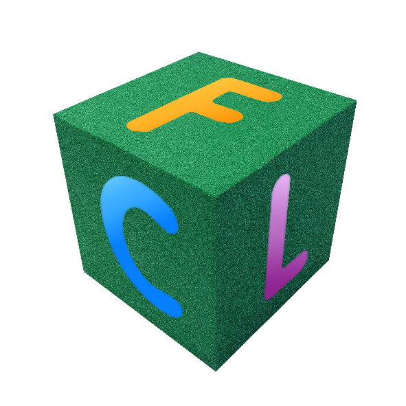

# FlexCel Studio for VCL and FireMonkey documentation.

**Please click one of the buttons on the top bar** to access the different parts of this documentation.

This full site is also available as Microsoft Compiled HTML Help (chm) at [FlexCelVCLFM.chm](~/FlexCelVCLFM.chm)

The guides without the api reference are also available as PDF at [flexcel-conceptual-docs-vcl.pdf](~/flexcel-conceptual-docs-vcl.pdf)

Both files are available too at *&lt;install folder&gt;/Documentation* when you install FlexCel.

