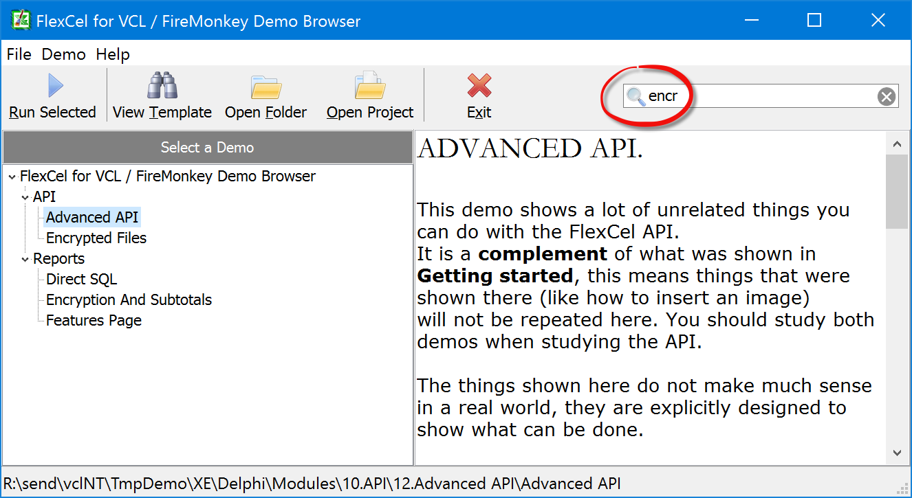

# Examples

This section contains the code listing for all the examples available
in the FlexCel distribution. 

You can open the actual examples at the locations shown in each one of the code listings.

Remember that you can also browse through all the examples by opening the Demo Browser (MainDemo.dproj) included in FlexCel:

## In this section:

* [Examples for C++](cpp/index.md)
* [Examples for Delphi](delphi/index.md)
* [Examples for FireMonkey Desktop](firemonkey-desktop/index.md)
* [Examples for FireMonkey Mobile](firemonkey-mobile/index.md)

