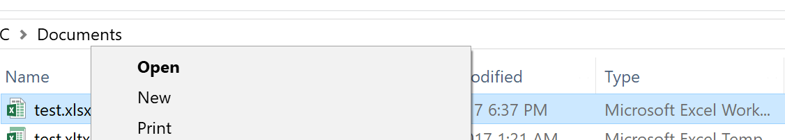
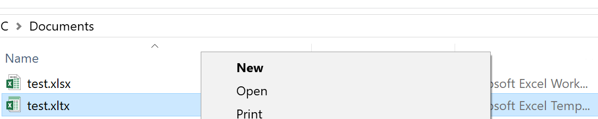

# Automatically open generated Excel files.

In the FlexCel demos we follow a common pattern: When we generate a file we ask the user where he wants to save it, and then, we offer to open the generated file in Excel.

The code is something similar to this:

<pre class="shiki shiki-themes light-plus dark-plus" style="background-color:#FFFFFF;--shiki-dark-bg:#1E1E1E;color:#000000;--shiki-dark:#D4D4D4" tabindex="0"><code>  if not SaveDialog.Execute then exit;
  Xls.Save(SaveDialog.FileName);

  if MessageDlg('Do you want to open the generated file?', mtConfirmation, [mbYes, mbNo], 0) = mrYes then
  begin
    ShellExecute(0, 'open', PCHAR(SaveDialog.FileName), nil, nil, SW_SHOWNORMAL);
  end;
</code></pre>

Now, if you have used OLE Automation before FlexCel, you are probably used to a different pattern: In OLE you can launch Excel, fill it with data using Automation, and then leave the file open without saving it. And while I personally think saving the file first is nicer, there might be cases where you want to emulate this behavior of just opening the file without asking the user to save it first.

The bad news is that it is not technically possible to create a file in FlexCel and have it open in Excel without saving it somewhere first. On the other side, the good news is that you can reasonably emulate the behavior and make it look to the user as if the file wasn't saved on disk first.

This trick uses [Excel templates](https://support.office.com/en-us/article/Save-a-workbook-as-a-template-58c6625a-2c0b-4446-9689-ad8baec39e1e), which have an extension **xlt** in Excel 2003 or older (equivalent to xls) and **xltx** in Excel 2007 or newer. An Excel template is similar to an xls/xlsx file, but it has two different characteristics:

1. When you open an xltx file in Excel, Excel makes a copy in memory of it, and doesn't lock the original file. This means that you can remove the template once Excel has opened it without worrying that Excel will be using it.

2. When a user presses "Save" in Excel, Excel won't save the template but show the "Save As..." dialog and let the user choose a filename for saving.

So what we are going to do is to create a temporary xltx file instead of a regular xlsx file, open it in Excel, then wait a little to make sure Excel finished loading it, and then remove the temporary file. To do so, we can use code like this:

<pre class="shiki shiki-themes light-plus dark-plus" style="background-color:#FFFFFF;--shiki-dark-bg:#1E1E1E;color:#000000;--shiki-dark:#D4D4D4" tabindex="0"><code>uses ... IOUtils, Windows, ShellAPI, Threading, ...
...
var
  tmpFileName: String;
...
  tmpFileName := TPath.GetTempPath + GuidToString(TGuid.NewGuid) + '.xltx';
  xls.Save(tmpFileName);

  //The verb to open a Xltx template is "New", not "Open".
  //The second parameter of ShellExecute here is empty,
  //and this will use the default verb, which is also "New".
  ShellExecute(0, '', PCHAR(tmpFileName), '', '', SW_SHOW);

  TTask.Run(procedure begin
    //Wait 30 seconds to delete the file, so Excel has time to open it.
    Sleep(30000);
    TFile.Delete(tmpFileName);
  end);
</code></pre>

> [!Note]
> 
> Once you use ShellExecute to open the file, you have to wait until Excel finished loading it. In the code above we wait for 30 seconds before deleting the file, but if your files are huge or the machines where Excel is installed are too slow, you might want to increase the time before you try to delete the file.

> [!Note]
> 
> When saving a file to disk, FlexCel automatically detects from the extension that it should be saved as a template, so you don't need to do any extra work. Just save the file with an xlt/x extension and it will be saved as a template. But in other cases like when saving to a stream, FlexCel can't figure out that you want to save as a template, and you will have to explicitly say so. You can tell FlexCel that the file is a template by setting the property [TExcelFile.IsXltTemplate](~/api/FlexCel.Core/TExcelFile/IsXltTemplate.md) to true.

> [!Note]
> 
> When starting the process to open the file, remember that the action needed to open the template in "template mode" is **New**, not **Open** as it is the default in most cases. For example, when you right-click in an xlsx file, "Open" is the default action:
> 
> 
> 
> But when you right click in an xltx file, "New" is the default action:
> 
> 
> 
> If you opened a template with "Open" instead of "New", it would behave like a normal xlsx file, being locked by Excel while in use.
> So in the code above, we used the default action instead of the default "Open" action. Had we called:
> 
> <pre class="shiki shiki-themes light-plus dark-plus" style="background-color:#FFFFFF;--shiki-dark-bg:#1E1E1E;color:#000000;--shiki-dark:#D4D4D4" tabindex="0"><code>  ShellExecute(0, 'open', PCHAR(tmpFileName), '', '', SW_SHOW);
> </code></pre>
> 
> 
> Then the trick wouldn't work.

