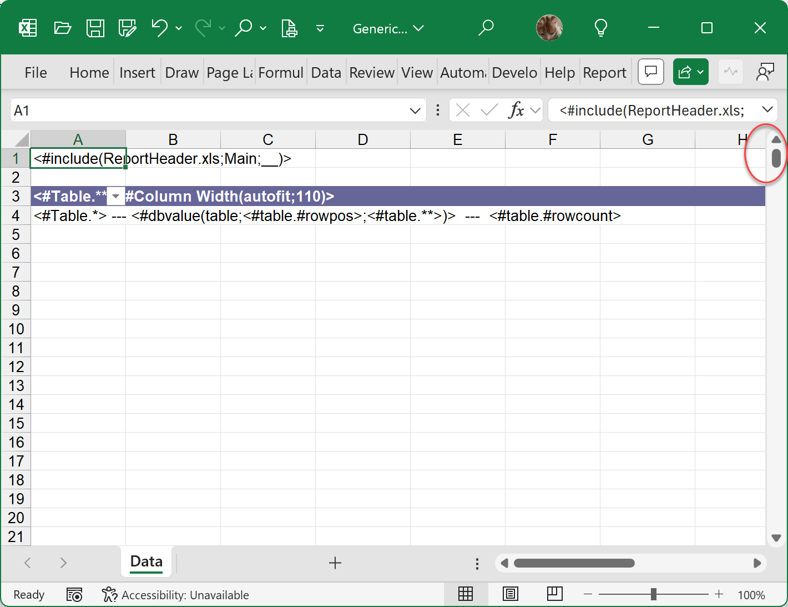
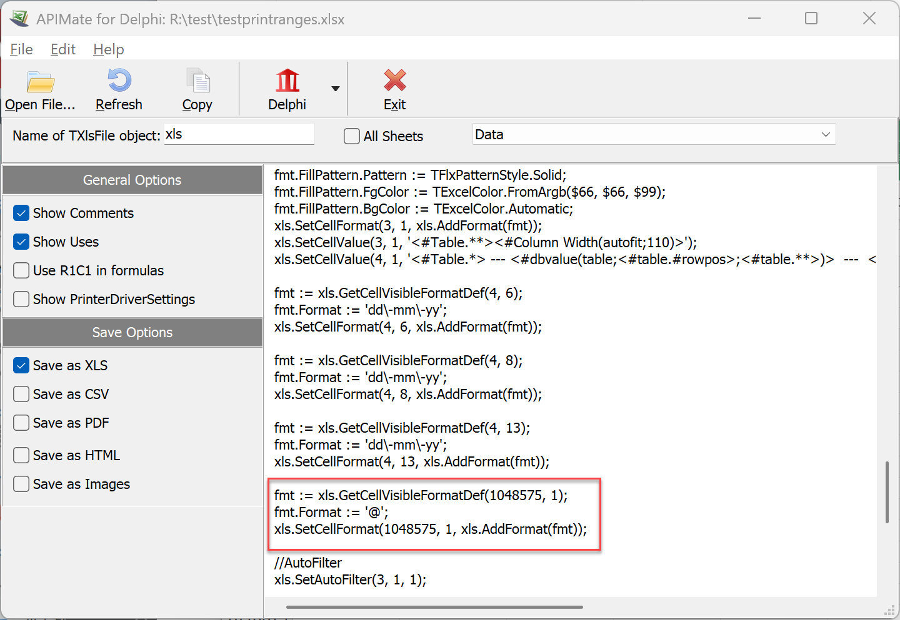
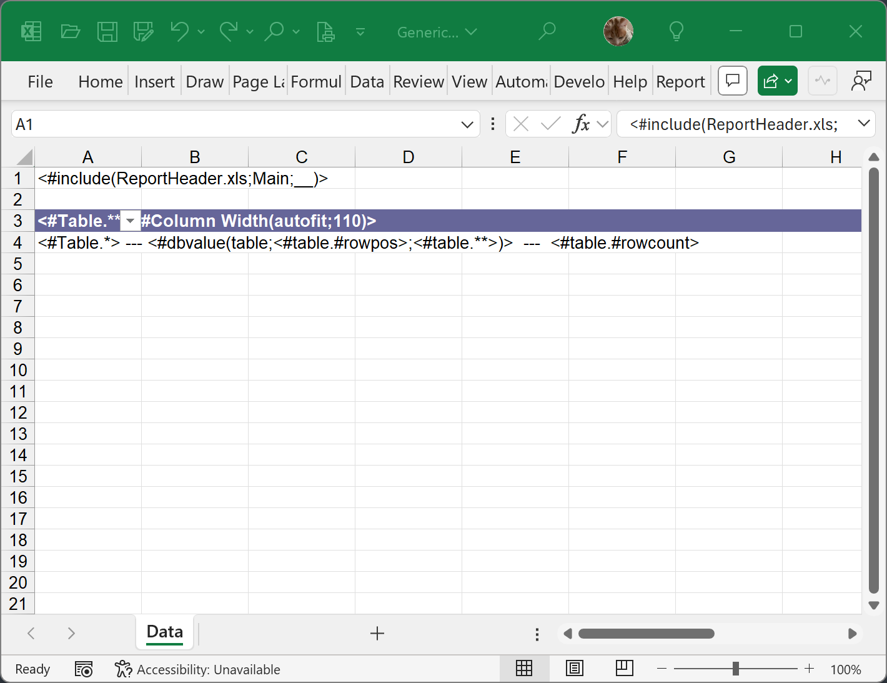

# If you are getting a “Too many rows” error message

The first thing to mention is that FlexCel row count is virtually never wrong. It is not only a simple algorithm very unlikely to have bugs (it just returns the Count of a list), but it is also at the core of everything FlexCel does, so it has been tested by tens of thousands of customers over more than 20 years. If you are getting a too many rows error, it means that your file has too many rows.

This error likely stems from two sources:

1. **There is some logic in your app that creates just too many rows.** This can happen in reports with nested master-details, when you forget to filter the details with the current record in the master, and include the details every time. Something similar can happen if using the API.

FlexCel has a generous limit of a little over 1 million cells, but it is easy to go over that limit if you just multiply stuff. 

Imagine you have a master database with 200 records. Then, a detail with 100 records, which itself has another detail of 100 records. If you forget to add a dependency or filter the details table, and include all the details for each record of the master, you will include 200*100*100 = 2 million rows. Twice over the limit and with just 3 datasets with some hundred records each.

2. **Your starting file might already have near the limit of rows**, so when you insert a couple of them, you go over the limit. This can be difficult to spot, especially if the starting file looks empty. But there is always a simple telling sign, and it is the scrollbar at the right.

If you look at the scrollbar and it looks like this:

It means, even if the file looks completely empty, that it has some data near the very end.

However, that hidden stuff might be hard to find. Maybe it is a (otherwise empty) cell formatted as a number. It will look empty, but it is not. And if we insert rows at the top, we risk moving that hidden cell over the limit, and lose information. Even if we don’t care about that information, FlexCel cannot know that.

So a tool that comes handy is our old friend, APIMate. Just launch APIMate from the start menu, and open the file. The culprit should be easy to see now:

Once you know the reason, select all rows at the end, delete them, and save the file. The scrollbar should be back to normal again:

