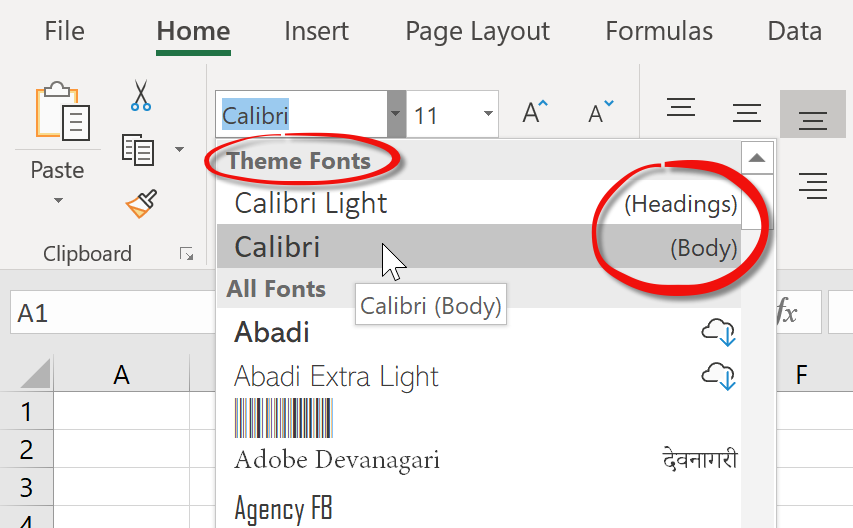

# Changing the font name

Before Excel 2007, changing the font name in a cell was a matter of well... just changing the font name. To use for example [noto](https://www.google.com/get/noto/), you would write:

<pre class="shiki shiki-themes light-plus dark-plus" style="background-color:#FFFFFF;--shiki-dark-bg:#1E1E1E;color:#000000;--shiki-dark:#D4D4D4" tabindex="0"><code>var
  fmt: TFlxFormat;
...
  fmt := xls.GetFormat(xls.GetCellFormat(row, col));
  fmt.Font.Name := 'noto';
  xls.SetCellFormat(row, col, xls.AddFormat(fmt));
</code></pre>

and that would be it. But if you try this code and open the generated file in a modern Excel, you will
see that the font didn't actually change. What is going on?

Excel 2007 introduced themes, which are a collection of settings like fonts or colors which you can change to alter the look of the document all at once.

Themes mostly affect colors, and you can find a more in-depth explanation of them at the [Api Developer Guide](xref:ApiDeveloperGuide#colors)

But **themes also affect font names**. The theme defines 2 fonts: **Major** (used in the headings) and **Minor** (used in the normal cells)

When you select a font in the font combo-box in Excel, you might have noticed that the first 2 entries are under the category "Theme fonts" and that they have (**Headings**) and (**Body**) written at the right:

The "(Headings)" font corresponds to [TFontScheme](~/api/FlexCel.Core/TFontScheme.md).Major and the "(Body)" font corresponds to [TFontScheme](~/api/FlexCel.Core/TFontScheme.md).Minor.

> [!Note]
> 
> Those 2 fonts in Excel are **different** from the same fonts without the (Headings) and (Body) labels at the right.
> 
> Imagine that you set cell A1 to **Calibri (Body)** and cell A2 to just **Calibri**. And now you change the spreadsheet theme to a theme where the Body (or minor) font is Arial. When you change the theme, **A1 will change to Arial**, but **A2 will continue to be Calibri**. 

So how does this affect FlexCel? Notice that in the code above, we didn't change the font scheme; only the font name. As the theme takes priority over the font name, a font linked to the **Minor** scheme will continue to be whatever font the theme defines for minor, and not what you specify in the font name.

**To make that code work you need to also change the [TFlxFont.Scheme](~/api/FlexCel.Core/TFlxFont/Scheme.md) to none**.

This is the correct way to change the font name:

<pre class="shiki shiki-themes light-plus dark-plus" style="background-color:#FFFFFF;--shiki-dark-bg:#1E1E1E;color:#000000;--shiki-dark:#D4D4D4" tabindex="0"><code>var
  fmt: TFlxFormat;
...
  fmt := xls.GetFormat(xls.GetCellFormat(row, col));
  fmt.Font.Name := 'noto';
   // For the font name to change, we need to
   // detach the font from the theme!
  fmt.Font.Scheme := TFontScheme.None;
  xls.SetCellFormat(row, col, xls.AddFormat(fmt));
</code></pre>

> [!Note]
> 
> To change **all** fonts of a given type to a different type in a file, take a look at [Replacing a font by another in an Excel file](xref:ReplacingAFontByAnotherInAnExcelFile). 

