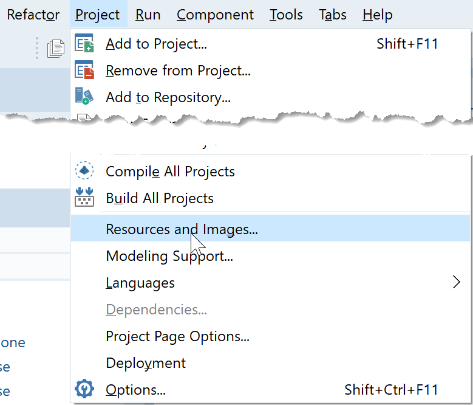
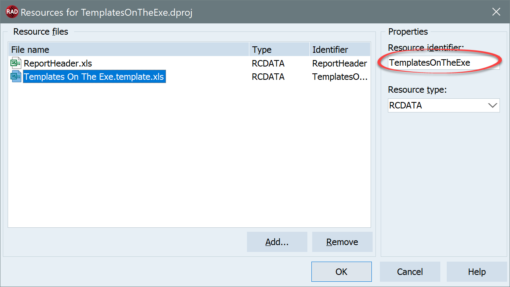

# Embedding Excel files in your application

Sometimes, you need to include either templates for reports or pre-made Excel files inside your application. The simplest option is just to deploy your xls/x files together with your application, but you might want to embed them in your executable instead.

One way you might think of to include the xls file is using APIMate to "convert" the file into code, then paste that code inside your application. But while that would work, it isn't really a nice solution:

  * The code generated by APIMate is very repetitive. So for example if you have the cells from A1 to A100 with the numbers 1 to 100, APIMate will write 100 calls to [TExcelFile.SetCellValue](~/api/FlexCel.Core/TExcelFile/SetCellValue.md)(1, 1, 1), [TExcelFile.SetCellValue](~/api/FlexCel.Core/TExcelFile/SetCellValue.md)(2, 1, 2), and so on, instead of calling [TExcelFile.SetCellValue](~/api/FlexCel.Core/TExcelFile/SetCellValue.md)(row, 1, row) in a loop with row from 1 to 100. The idea of APIMate is to show you how to do stuff, so for example you want to know how to format a cell conditionally, you conditionally format it in Excel, then open the file in APIMate and look at the code APIMate generates. But it is not great to actually convert files to code.

  * For the reason above, the code will be big, resulting in a bigger executable than if you embedded the file directly, and it will be slower to compile too.

  * Embedded files as resources will normally open faster than the code that APIMate generates uses to create the file. Again, the code generated by APIMate is not designed for this, and it can be inefficient as it sets every cell with a different call.

  * Resources are simpler to update. Just edit the file in Excel, save it and rebuild your app. While if you used APIMate, you would have to relaunch APIMate and recopy-paste the code every time.

So how do you embed a file as a resource?

1. In Rad Studio, go to the Menu-&gt;Project-&gt;Resources and Images:

   

2. In the dialog that appears, add the xls/x files you need. For every file, give it a meaningful resource identifier at the right:

   

3.  Now, to open the file from your code use a TResourceStream:

<pre class="shiki shiki-themes light-plus dark-plus" style="background-color:#FFFFFF;--shiki-dark-bg:#1E1E1E;color:#000000;--shiki-dark:#D4D4D4" tabindex="0"><code>var
  TemplateStream: TResourceStream;
...
  TemplateStream := TResourceStream.Create(hinstance, 'TemplatesInTheExe', RT_RCDATA);
  try
    xls := TXlsFile.Create(TemplateStream, true);
    DoSomething(xls);
  finally
    TemplateStream.Free;
  end;
</code></pre>

> [!Warning]
> 
> TResourceStream only works in **Desktop** platforms. In mobile you can't embed files, and the only option is to use the deployment manager to deploy them.
> See http://docwiki.embarcadero.com/RADStudio/en/Resource_Files_Support for more information.

