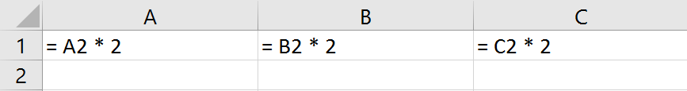

# Expanding formulas in consecutive cells

One common thing you might want to do when entering formulas in FlexCel is to change the column or rows where they appear. So for example, let's imagine you have this formula in A1:

<pre class="shiki shiki-themes light-plus dark-plus" style="background-color:#FFFFFF;--shiki-dark-bg:#1E1E1E;color:#000000;--shiki-dark:#D4D4D4" tabindex="0"><code>= A2 * 2
</code></pre>

And you want to expand the formula to Columns **B** to **Z**.
In **B1**, you will want the formula **=B2 * 2**, in **C1** you will want **=C2 * 2** and so on.

There are multiple ways to achieve this:

1) You can enter the formula in A1:

<pre class="shiki shiki-themes light-plus dark-plus" style="background-color:#FFFFFF;--shiki-dark-bg:#1E1E1E;color:#000000;--shiki-dark:#D4D4D4" tabindex="0"><code>  xls.SetCellValue(1, 1, TFormula.Create('= A2 * 2'));
</code></pre>

   And then copy the cell to the range **B:X**:

<pre class="shiki shiki-themes light-plus dark-plus" style="background-color:#FFFFFF;--shiki-dark-bg:#1E1E1E;color:#000000;--shiki-dark:#D4D4D4" tabindex="0"><code>  xls.InsertAndCopyRange(TXlsCellRange.Create(1, 1, 1, 1), 1, 2, $19, TFlxInsertMode.NoneRight, TRangeCopyMode.All);
</code></pre>

   This will work the same as in Excel, and the formulas will be adapted when copied. Same as in Excel *absolute references* (like for example $B$1) won't be changed, but **relative references** will change when copied.

2) You can manually create the formulas by using [TCellAddress](~/api/FlexCel.Core/TCellAddress/index.md)

   TCellAddress is the record you use in FlexCel to convert cell references from/to numbers to letters. Here is a little example on how you can get the **row** and **column** from the string "B5" and also how to get the string "B5" from the row and column:

   <pre class="shiki shiki-themes light-plus dark-plus" style="background-color:#FFFFFF;--shiki-dark-bg:#1E1E1E;color:#000000;--shiki-dark:#D4D4D4" tabindex="0"><code>var
     a: TCellAddress;
   ...
      // From string to number
      // We will extract the row (5) 
      // and the column (2) from the reference "B5"
     a := TCellAddress.Create('B5');
     xls.GetCellValue(a.Row, a.Col);
   
      // From numbers to string
      // We will get the string "B5" from the row (5) 
      // and the column(2)
     a := TCellAddress.Create(5, 2);
     DoSomething(a.CellRef);
   </code></pre>
   

   So, for our original example, we could use some code like this:

   <pre class="shiki shiki-themes light-plus dark-plus" style="background-color:#FFFFFF;--shiki-dark-bg:#1E1E1E;color:#000000;--shiki-dark:#D4D4D4" tabindex="0"><code>  for col := 1 to 26 do
     begin
       xls.SetCellValue(1, col, TFormula.Create(('= ' + TCellAddress.Create(2, col).CellRef) + ' * 2'));
     end;
   </code></pre>
   

3) Using **R1C1** notation.
**R1C1** is an alternative notation to the classical **A1**” notation, to describe formulas based in their rows and columns, instead of in a letter and a number.

   R1C1 is completely equivalent to A1, but has the advantage of always using column numbers, and that the cells are relative to their position, which is what you usually want.

> [!Note]
> 
> You can find a lot of information in R1C1 cell references internet just by a web search, and I recommend you to search for R1C1 if you weren't aware that this mode existed.
> As it makes no sense to repeat all the information in this doc, here we will focus on how to use R1C1 from FlexCel.

   There are a couple of properties that govern R1C1 in FlexCel:

   * [TExcelFile.FormulaReferenceStyle](~/api/FlexCel.Core/TExcelFile/FormulaReferenceStyle.md) := TReferenceStyle.R1C1;

   This will affect how you can insert the formulas in FlexCel, but it is independent of how Excel will show them. To change how Excel displays R1C1 formulas, you need:

   * [TExcelFile.OptionsR1C1](~/api/FlexCel.Core/TExcelFile/OptionsR1C1.md) := true

     OptionsR1C1 only affects how Excel shows the formulas, but not how you enter them in FlexCel, or how FlexCel will return the text of the formulas to you. That is the job of [TExcelFile.FormulaReferenceStyle](~/api/FlexCel.Core/TExcelFile/FormulaReferenceStyle.md).

     So for our original example, here is the code to do it with R1C1 notation. Note that due to the fact that R1C1 is relative, the formula is always exactly the same. There is no need to calculate a formula for each cell as we did in Solution 2; in fact **we can move the creation of the formula outside of the loop** to avoid creating temporary objects:

<pre class="shiki shiki-themes light-plus dark-plus" style="background-color:#FFFFFF;--shiki-dark-bg:#1E1E1E;color:#000000;--shiki-dark:#D4D4D4" tabindex="0"><code>var
  Formula: TFormula;
...
  xls.FormulaReferenceStyle := TReferenceStyle.R1C1;
  Formula := TFormula.Create('= R[1]C * 2');
  for col := 1 to 26 do
  begin
    xls.SetCellValue(1, col, Formula);
  end;
</code></pre>

> [!Important]
> 
> While we used **R1C1** internally to enter the formulas, in Excel they will show in A1 notation exactly the same as they do with the other 2 solutions. That is because as explained above R1C1 support is divided in a property that only affects FlexCel: [TExcelFile.FormulaReferenceStyle](~/api/FlexCel.Core/TExcelFile/FormulaReferenceStyle.md) and a property that only affects Excel: [TExcelFile.OptionsR1C1](~/api/FlexCel.Core/TExcelFile/OptionsR1C1.md)
> 
> So you can work in R1C1 mode in FlexCel while keeping A1 mode in Excel, or vice-versa.

   FlexCel comes with full R1C1 support built-in.

## Bonus track - Checking the formulas in a spreadsheet

R1C1 references are not only nice to enter formulas, but also to check for consistency in existing files.

Imagine you have a file with formulas like in our example above, and you want to check that they are all as they are supposed to be. So for example in Column J, you have =J2 * 2 and not =A2 * 2. Checking this in A1 notation can be very complex, especially if the formulas are not simple.

But retrieve the formulas in R1C1 instead, and all you need to do to check for consistency is to **check that all formulas in A1:Z1 are the same!**.

That is, retrieve the formula in A1 (in this case `"=R[1]C * 2"`) and then check that all other formulas in the range have the same as the text in A1. If a formula is different, then it is not consistent.
