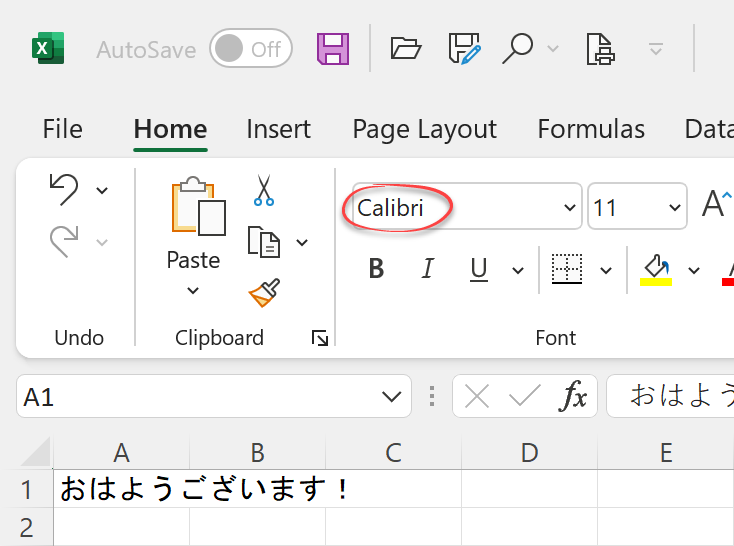
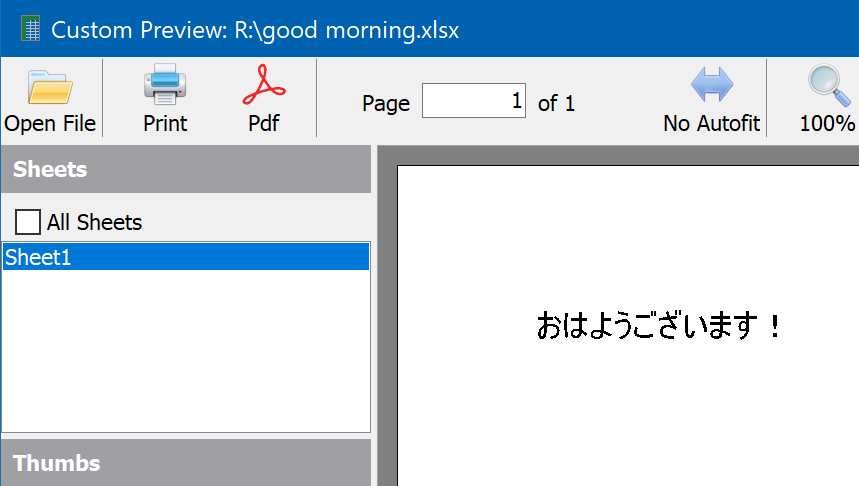
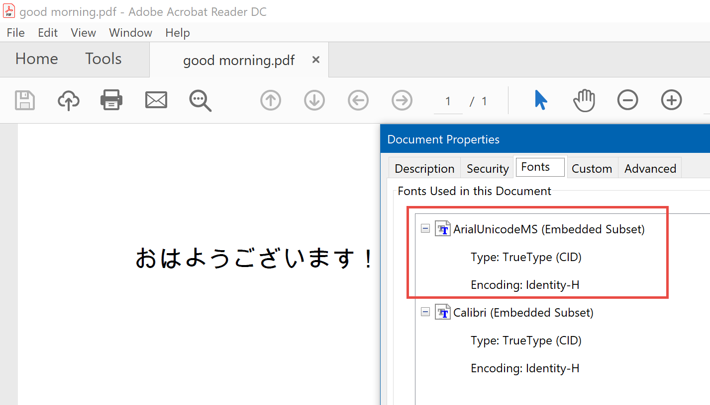
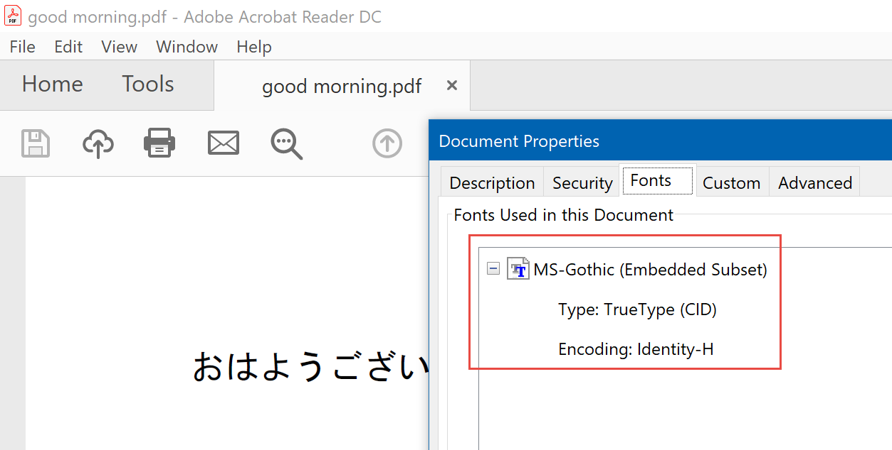

# Finding the actual fonts used when exporting to PDF

As explained in the [PDF exporting guide](xref:PdfExportingGuide#dealing-with-missing-fonts-and-glyphs), when you export a file to PDF, you might end up with white rectangles instead of the actual text.

The cause of those problems is font substitution: If you create a new file in Excel and write おはようございます！in cell A1, the text will display correctly, even if you don't change the default Calibri font:

If you open this file in the FlexCel previewer it will also look fine:

If you **print**, export to **HTML**, **images** or **SVG**, from Excel or FlexCel, the file will look fine. But what happens if you export to PDF? Given the fact that I just gave you a link about font problems in PDF, and that this tip is about fonts on PDF, you might expect the export to PDF to be wrong. But no, if you export to PDF, with Excel or FlexCel, you will see then same nice Japanese text.

And yet, everybody is lying here. Calibri doesn't contain definitions for Japanese characters, and so it is impossible to draw a お using Calibri. The image isn't there. So why do you see お instead of a blank square when you look at the text in Excel? Because under the hood, Windows is replacing Calibri by a different font that has a definition for お, and using that font to draw お instead. Same when you look at the FlexCel previewer, or when you export to PDF. Whoever is rendering the font realizes that they can't do it with Calibri, and they use a different font instead.

However, now we come to the part where PDF is different. In all the other cases, when printing, exporting to HTML or whatever, it is the Operating System or the Browser who does the font substitution. You just tell the OS to draw a お in Calibri, and it takes care of finding the best font.

PDF is different. If a PDF file tells a PDF reader to draw a お in Calibri, it will not do font replacement, and print a square. So we need to do the font replacement ourselves **before** writing the PDF file. The PDF file we generate must have the correct font to draw the characters we want.

But now you might be wondering: Why, when we exported to PDF with FlexCel, we didn't get blank squares? We can get a hint of what is happening if we look at the generated file in Acrobat and press "Ctrl-D" to see the fonts used in the document:

A-ha! There is an extra "Arial Unicode MS" font, and that is what Acrobat must be using to render the text. And so, where does "Arial Unicode MS" comes from? As mentioned in the [PDF exporting guide](xref:PdfExportingGuide#dealing-with-missing-fonts-and-glyphs), FlexCel is using the **[TFlexCelPdfExport.FallbackFonts](~/api/FlexCel.Render/TFlexCelPdfExport/FallbackFonts.md)** property to figure out which font to use. It tries the fonts one by one until it finds one that supports the character, and then uses that instead when exporting to PDF.

And the problem is that this is all transparent to you until it isn't. Because while we have a good set of default fallback fonts, we don't and can't cover every language. Some languages will still get a blank square (if the character is not in any of the fallback fonts), and some might get uglier fonts (because the replacement font with nicer glyphs is not in the FallbackFonts list). Also, there used to be a font with most glyphs out there (Arial Unicode) installed by default in Windows, but that font doesn't ship with Windows 10 anymore (probably because it was too big).

So let's go back to our Japanese. Let's imagine that we are in a computer without Arial Unicode or any other fallback font supporting Japanese, and we want to modify our FalbackFonts list to support it. Which font should we use? 

Excel won't show you what font it is using to display the text on the screen. It will happily tell you it is "Calibri" even when we know it isn't. If you export the file to HTML, it will be exported as "Calibri" too, and the browser will perform the font substitution, but the browser won't tell you either. The process is so transparent; that nobody will tell you the real font they are using. They will just pretend it is Calibri.

Until we remember that PDF is different. And now, after so many words, this leads us to today's tip: **To find out the fallback fonts you need for exporting to PDF in FlexCel, export the file to PDF with Excel, and then press Ctrl-D in Acrobat to look at the fonts Excel used.**

In our example, if we exported the original file to PDF with Excel, not FlexCel, and pressed Ctrl-D, we would see:

And this solves the case. Excel used MS-Gothic, not Calibri, to draw the Japanese text. If you are getting white squares when exporting from FlexCel, consider exporting the file to PDF from Excel, and look at the fonts it used.