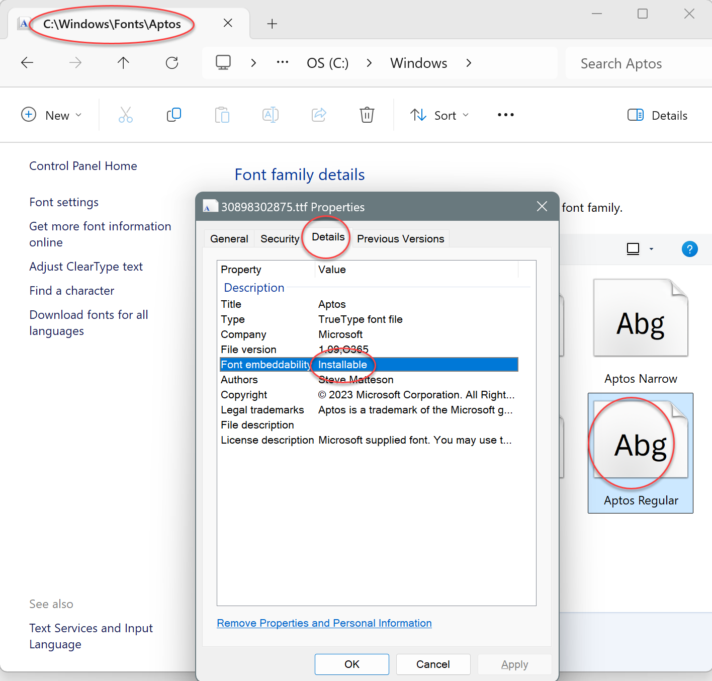

# Font Licensing

Sometimes, when trying to export a file to PDF, you might get a message like:

<pre class="shiki shiki-themes light-plus dark-plus" style="background-color:#FFFFFF;--shiki-dark-bg:#1E1E1E;color:#000000;--shiki-dark:#D4D4D4" tabindex="0"><code>Error trying to embed font '&#x3C;font name>' in the document.
Font licensing doesn't allow embedding.
</code></pre>

Not all fonts are licensed to be embedded. So if you are getting this error, the first thing to check is that the font you are trying to use has a license of type "Print and preview", "Installable", or "Editable". In Windows Explorer, go to the folder `c:\Windows\Fonts` (or wherever you have the fonts installed), click on the font and look at the details:

> [!Note]
> 
> You can find more information about the types of licensing by reading the article: [Document font embedding demystified | Microsoft 365 Blog](https://www.microsoft.com/en-us/microsoft-365/blog/2015/07/06/document-font-embedding-demystified/)

FlexCel will automatically check that the fonts you embed have valid licenses and refuse to embed them if they don't. Usually, if a font is not licensed to be embedded, the best solution is to replace it with another that is. You can change fonts in the Excel file by using the [tip on changing fonts](xref:ReplacingAFontByAnotherInAnExcelFile), or you can use [TFlexCelPdfExport.UnlicensedFontAction](~/api/FlexCel.Render/TFlexCelPdfExport/UnlicensedFontAction.md) to change the fonts only when exporting to PDF.

But sometimes, this might be an error. You may have a licensing agreement to embed the font, even if the font itself is not marked as embeddable. In that case, you can set [TFlexCelPdfExport.UnlicensedFontAction](~/api/FlexCel.Render/TFlexCelPdfExport/UnlicensedFontAction.md) to "Ignore", and this will override the default behavior and force FlexCel to ignore the check.

> [!Warning]
> 
> Beware if you set UnlicensedFontAction to "Ignore", as FlexCel will then ignore the licensing of all fonts in the document, not just the font for which you have the license.

## Duplicated Fonts
You can have multiple versions of the same font in different folders or even in the same folder. The font filename doesn't matter; the font name is inside the font file itself. For example, you could have a file named "potato.ttf", which inside has the font "Arial", the same as "Arial.ttf".

Since FlexCel 7.22, when multiple font files are available for the same font name, FlexCel will try to use the "best" one. This means using the font with the highest version number among those that have licensing that allows embedding. Before FlexCel 7.22, the font would be chosen at random and could be a font that didn't allow embedding, even if another font file for the same font did. 

If you want to check for duplicated fonts, we've made a small tool that will report duplicated fonts.
You can download it from https://download.tmssoftware.com/flexcel/samples/fontinspector.zip

