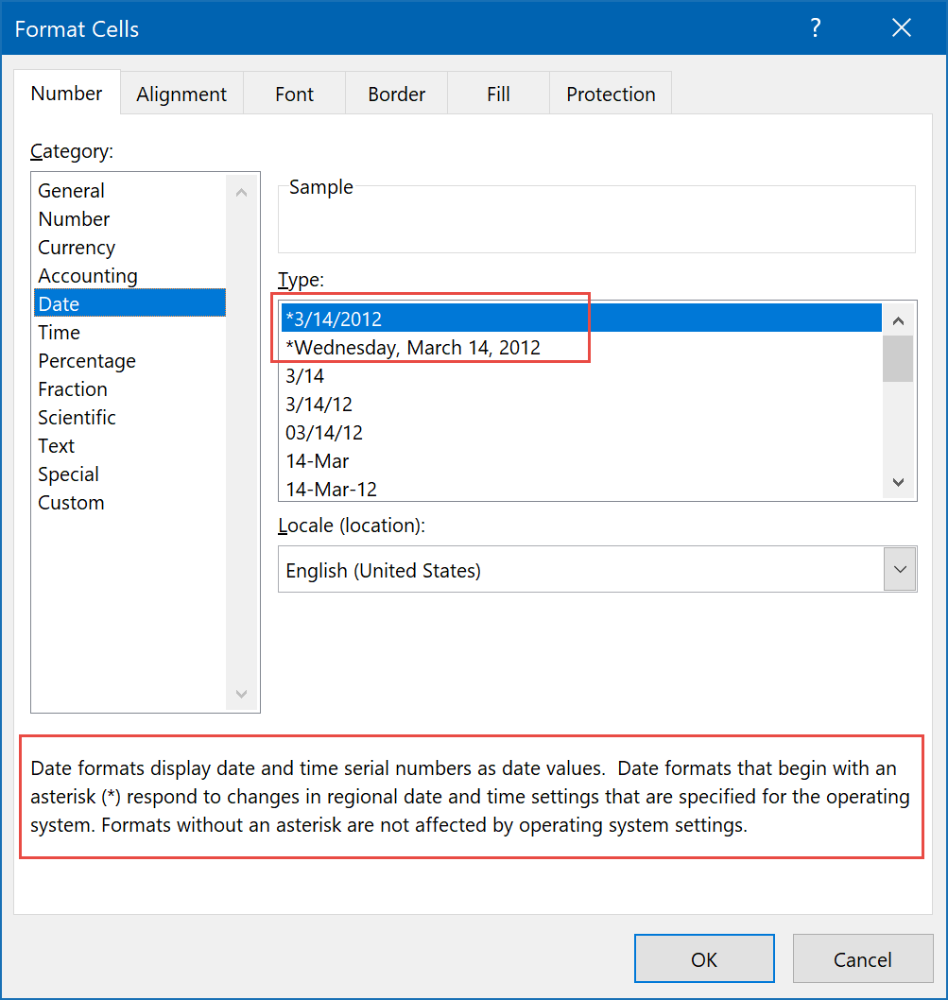
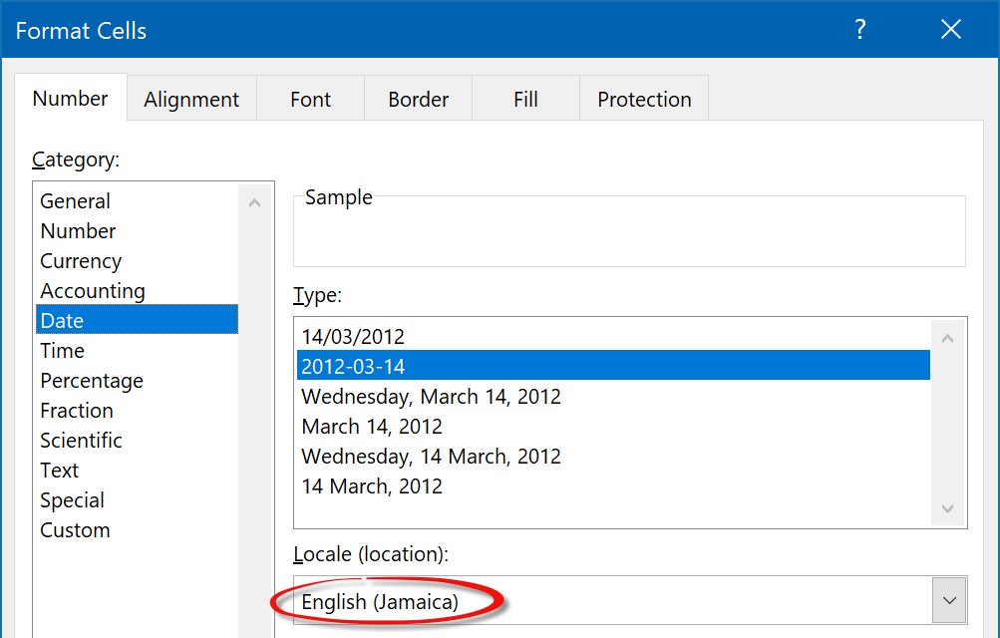
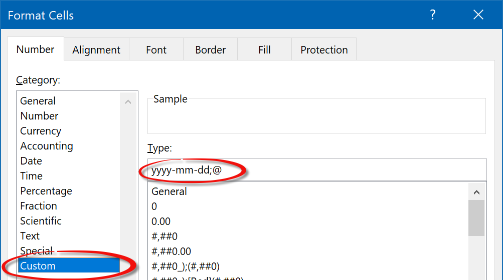

# Internal numeric formats.

Excel numeric formats should in theory be simple. For example you set a cell format to be "00.00", then the number 1 is formatted as 01.00. But it gets more complex than that, and in this tip we are going to dig deeper into format strings. Most of the information here is Excel -not FlexCel- specific, but it helps to know about how format strings work in detail.

## Localized format strings
The first thing you need to be aware of is that Excel uses different format strings depending on the language of the Excel version that you have installed. For example, in English Excel you could use "yyyy-mm-dd" (year-month-day) to print a date like "2000-01-01". But if your Excel is in Spanish, you would have to write "**aaaa**-mm-dd" (**a**ño-mes-día)

This sounds like a nightmare for sharing files: I write a file with my English Excel, using a format like "yyyy-mm-dd" so the cell looks to me like "2000-01-01", but when I share it with you and you open it in your Spanish Excel, you will see "yyyy-01-01" in the cells instead of "2000-01-01" since the file is using "y" for year and it should be using "a" for año.

But luckily it is not that bad. Internally, in the file all formats are stored in English and converted on the fly by Excel when showing them to you. This means that inside the xls or xlsx file the format will always be stored as "yyyy-mm-dd". When you open it in a Spanish Excel, Excel will display it as "aaaa-mm-dd". When you enter "aaaa-mm-dd" as a format in a cell in a Spanish Excel, it will be saved as "yyyy-mm-dd" inside the file. So the file can actually be shared between different languages, without issues. Some users will see "yyyy-mm-dd" when they open it and others will see "aaaa-mm-dd", but the file is the same internally.

This is the reason **you always have to enter format strings in English when using FlexCel.** It doesn't matter if you have a Spanish Excel installed and you see the format strings using Spanish names, what goes on the file is always English format strings. **You can use APIMate** to get the English format strings that you need to use in FlexCel even if you have a Spanish or another language Excel. Just enter the format string in your language in Excel, save the file, and open it with APIMate. It will show you the English format string that you need to use.

> [!Warning]
> 
> While numeric formats in cells will be automatically converted as mentioned above, you have to be extra careful when using functions like [Text](https://support.office.com/en-us/article/text-function-20d5ac4d-7b94-49fd-bb38-93d29371225c)
> 
> In those cases the format will **not** be automatically translated. The formula `=Text(A1,"yyyy-mm-dd")` will **not** work correctly when opened in a non-English Excel. Similarly, the formula `=Text(A1,"aaaa-mm-dd")` will work in your Spanish Excel, but users with other languages will see it wrong.

## Internal format strings
Ok, now we know that the format strings are stored always as English strings, except when inside formula functions. This means that a format like "dd/mm/yyyy" should look the same everywhere, shouldn't it?

Sadly not always. The most commonly used format strings are not stored as strings inside a file, but as format ids. This is probably a file size optimization for times where floppy disks had 1.44 mb, but it still is like this today. And as you might guess, those internal formats are also a problem, because they change with the language of Excel.

So for example, format number 20 is "h:mm" in an Excel from the USA, but "hh:mm" in an Excel from England. If you set the cell format in the USA to be "h:mm" and then send the file to a customer in England, he will likely see "hh:mm" when he opens your file.

> [!Note]
> 
> The internal formats, except for formats number 14 and 22, are hardcoded into Excel itself, they don't change with the machine locale. This means that if you buy a USA version of Excel, it will always read format 20 as "h:mm" even if you are in a machine with a British locale and your Windows settings are "hh:mm".
> 
> Formats 14 and 22 are different, and we cover them in the next section.

This creates a problem for FlexCel. What should we display when we find a format 20 in a file? There are no "American" and "British" versions of FlexCel, there is a single flexcel.dll file that is the same for all users over the world. So we can't hardcode "h:mm" for American versions of flexcel.dll and "hh:mm" for British versions.

What FlexCel does instead is to behave as an American Excel by default, but letting you customize the built-in format to whatever you want. The method you use for that is [TXlsFile.SetBuiltInFormat](~/api/FlexCel.XlsAdapter/TXlsFile/SetBuiltInFormat.md)

Please read the link above to see a list with every internal format and how it is interpreted by FlexCel.

## Format strings that actually change with the locale

As it was mentioned above, all internal formats except 14 and 22 are hardcoded. But formats 14 and 22 behave differently: they change depending on your locale.

So if you save a file with the format "mm/dd/yyy" in an American locale, this format will be saved as format 14. If you now change the Windows locale so dates are "dd/mm/yyyy", the same Excel will show the file differently.

Those two internal formats are shown by Excel starting with an "*", and it is explained in the format dialog that those formats change with the locale.

There are actually four formats that change with the locale. Two of them are for dates (long and short form) one is for date and time, and the last one is for time. Two of them use an internal format (14 and 22), the others use a [$-F0000] syntax.

They are as follows:
  1. **Short Date**: This is the internal format number 14. To set a cell to this format, set the format string to be  RegionalDateString. RegionalDateString is a FlexCel variable which will change depending on your ShortDatePattern in your locale settings.

  > [!Note]
>  This format is not directly the format string in your Windows settings converted to an Excel formatted string. While it will read the format string from the Windows settings, only some formats are allowed and extra stuff might be ignored. For example, if the Windows format string is "mm/dd/yyyy dd/mm" the Excel string will be "mm/dd/yyyy".
>   

  2. **Long Date**: This is not stored as an internal format, but as a format starting with the string "[$-F800]". What goes after [$-F800] doesn't really matter, but normally it is the format string for a long date in the language Excel was when creating the file. This allows third-party Excel readers which don't understand the [$-F800] string to still display something.

  So for example you could have the format string: "[$-F800]dddd\,\ mmmm\ dd\,\ yyyy". As it starts with [$-F800], it will be converted to a regional date by Excel (or FlexCel), and what is after the [$-F800] will be ignored. But some other third-party Excel viewer which doesn't know about this will ignore the [$-F800] and still display a long date, just not correctly localized.

  3. **Date and Time**: This is the internal format number 22. To set a cell to this format, set the format string to be  RegionalDateTimeString. RegionalDateTimeString is a FlexCel variable which will change depending on your locale settings.

  4. **Time** This is not stored as an internal format, but as a format starting with the string "[$-F400]". What goes after [$-F400] doesn't really matter, but normally it is the format string for a time in the language Excel was when creating the file. This allows third-party Excel readers which don't understand the [$-F400] string to still display something.

  So for example you could have the format string: "[$-F400]h:mm:ss\ AM/PM". As it starts with [$-F400], it will be converted to a regional time by Excel (or FlexCel), and what is after the [$-F400] will be ignored. But some other third-party Excel viewer which doesn't know about this will ignore the [$-F800] and still display a time, just not correctly localized.

> [!Note]
> 
> Those formats will change in FlexCel depending in your machine locale, just as they would in Excel. But you can change what FlexCel uses without needing to change the Windows locale. See the link about [how to change the FlexCel locale](xref:HowToChangeTheFlexCelLocale)

> [!Tip]
> 
> Besides the formats [$-F800] and [$-F400] you can actually use any locale with the same syntax. For example, the string: `[$-409]m/d/yy h:mm AM/PM;@` is formatted with English locale. Those formats are what is shown at the bottom of the "Format cell" dialog, and FlexCel also fully supports them.
> 
> But those formats don't change with your machine locale: They show the same everywhere so they aren't really a problem and this is why we don't discuss them in this tip.

## How to avoid internal format strings

As we have seen before, if you have an Excel from the USA and set the cell format to be "h:mm", this will be saved as format 20, not "h:mm" in the file. This format 20 then can be displayed differently to different customers with different localized versions of Excel.

FlexCel behaves the same: If you set the format to be "h:mm", it will realize that it matches internal format 20, and save the internal format 20 into the file.

So how do you set the format to be "h:mm" for everybody, and not the Excel-Locale-Dependent format 20?

The bad news is that there is no easy way to do exactly that. Whenever Excel sees "h:mm" it will be converted to format 20. But the good news is that it is very simple to do something that has the same effect: **You can set the format to be "h:mm;@" **

As you can see [here](https://support.office.com/en-us/article/Number-format-codes-5026bbd6-04bc-48cd-bf33-80f18b4eae68?ui=en-US&rs=en-US&ad=US) this is a format string with two parts: "h:mm" for positive numbers and zeros, and "@" for negative values (Excel doesn't support negative dates, so the value here doesn't really matter). "h:mm;@" works exactly the same as "h:mm", but due to the extra @ it won't match the internal format and won't be converted. To match the internal format the string must be exactly "h:mm".

This is the trick Excel uses when you select a "locale" in the format dialog. Let's for example select a "Jamaica" locale:

If you then go to "Custom" without closing the dialog, you will see that the format added was **yyyy-mm-dd;@**:

The @ at the end makes sure this won't be replaced by an internal format.

## How to find out the internal formats in your Excel version

As discussed, every localized Excel version has its own version of the internal formats. Also as discussed, we can't ship a different flexcel.dll for every locale, so our flexcel.dll comes localized by default as a USA Excel. And finally as also mentioned, you should try not to use localized formats if you care about the differences, by adding a ";@" at the end.

But what do you do if you are not creating the files, and your users are sending you files with internal formats created with their localized Excel versions?

Let's say you live in Spain, and your users are creating files with Spanish Excel with a format "dd/mm/yyyy". You are opening those files with FlexCel and exporting them to pdf, but in the export the dates appear as "mm/dd/yyyy" since FlexCel by default is localized as USA, and is behaving the same as if you had a USA Excel.

You can try to explain all of this to your users, but it is likely that they won't understand: They saved the files as "dd/mm/yyyy" and they expect the pdf to be "dd/mm/yyyy".

As we have learned in this article, the solution is to use [TXlsFile.SetBuiltInFormat](~/api/FlexCel.XlsAdapter/TXlsFile/SetBuiltInFormat.md) to make FlexCel behave as a Spanish Excel. But how do you know which string to use in every one of the internal formats?

We can't sadly provide every translation from every locale Excel is translated too. And notice that even US locale is different from UK locale, so it is not just about different languages.

But what we can do is to give you a spreadsheet, which has all the relevant built-in formats in column B. This file has a user-defined function which will calculate the localized format on column B using the [NumberFormatLocal VBA property](https://msdn.microsoft.com/en-us/vba/excel-vba/articles/range-numberformatlocal-property-excel). Then it shows you the code you need to write on columns F and G, in C# or Delphi respectively. If you are using a different programming language, it should be simple to change the formulas in either column F or G to return the calls in your language.

You can get the spreadsheet from here:

[all-builtin-formats.xlsm](~/files/all-builtin-formats.xlsm)

> [!Tip]
> 
> Remember to enable macros in this spreadsheet so the user-defined function will work.

