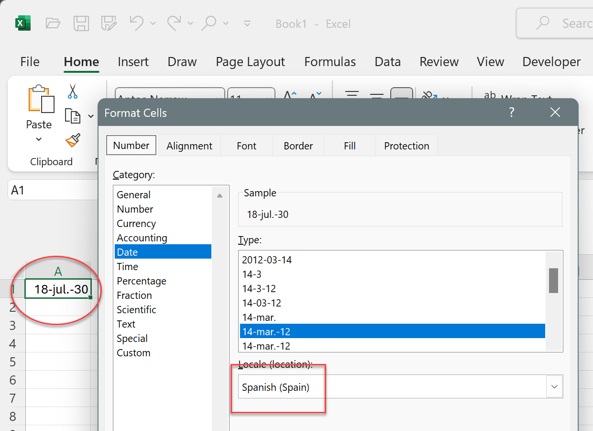
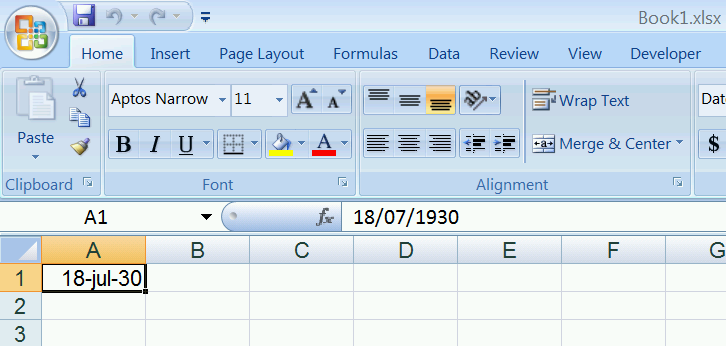

# Localized Month Names

Month names can be more complex than what they look like. 

A simple example:
In Excel, let's write the date "1930-07-18" and let's format it in a Spanish "dd-MMM-yyyy" format:

As you can see, it uses a dot after the month abbreviation ("jul." instead of "jul"). This is because [Abbreviations must always be followed by a full stop](https://ihdemu.com/en/abbreviations-in-spanish/#:~:text=Abbreviations%20must%20always%20be%20followed,full%20stop)

It makes sense. We native Spanish speakers have always known that abbreviations end in dots. 

But just for fun, let's open this same file we just created in Excel 2007, Windows 7:

It makes sense, too. While we write dots after abbreviations, it is not common to write dots after abbreviated month names. Maybe because we usually write the [Código trilítero](https://www.wikilengua.org/index.php/Abreviaciones_en_fechas), not the abbreviation. 
So, we can conclude that, initially, the people coding Excel used the "Código trilítero," but then they realized it was wrong and switched to the abbreviation. 

But now, let's look at the .NET world. Let's try this program:

<pre class="shiki shiki-themes light-plus dark-plus" style="background-color:#FFFFFF;--shiki-dark-bg:#1E1E1E;color:#000000;--shiki-dark:#D4D4D4" tabindex="0"><code>using System;
using System.Globalization;
                    
public class Program
{
    public static void Main()
    {
        var Culture = CultureInfo.CreateSpecificCulture("es-ES");
        Console.WriteLine(new DateTime(1930, 7, 18).ToString("dd/MMM/yy"));
    }
}
</code></pre>

If we compile it with .NET 4.8, we will get `18/Jul/30`. No dot, and the "J" in "Julio" is uppercase. What can I say? The whole thing is starting to look crazy. But we shouldn't surrender so soon. Let's change our framework to .NET 8 on the same machine and try again. And now we get "18/jul./30". So they went the reverse route as Excel/Windows, they started with the Código trilítero and then switched to abbreviations.

And Delphi has its own set of cases where it doesn't show the same as Excel (or .NET). Everyone does as they please here.

I could keep writing for hours: we've just made an example with the fourth most spoken language in the world and a language with a [Royal Academy](https://www.rae.es) that ensures it has clear rules. If we use languages with no-so-clear rules, differences start to grow bigger. And we only tried Microsoft Windows here; if we add other OSs, it gets even worse. 

There are combinations where it uses "July" instead of "Jul" as the "July abbreviation," but only for "en-AU," not "en-EN." Don't Australians abbreviate July? I don't know, and it looks like nobody does. 

There are also [Genitive Month Names](https://learn.microsoft.com/en-us/dotnet/api/system.globalization.datetimeformatinfo.monthgenitivenames) and even [Abbreviated Genitive Month Names](https://learn.microsoft.com/en-us/dotnet/api/system.globalization.datetimeformatinfo.abbreviatedmonthgenitivenames). .NET 4 will never use Genitive Month Names, .NET 8 will use them if you have a format string like "dd/MMM/yyyy", but not if you have "MMM" alone. Excel has its own rules (that also changed over the years) on whether to use Genitive month or standard month names. In .NET Core 5, Microsoft [switched from using the built-in Windows functions to ICU](https://learn.microsoft.com/en-us/dotnet/core/extensions/globalization-icu) even in Windows.

This is all to say that it is possible that you won't get the same abbreviated month names that you see in your Excel when you export from FlexCel. And if you see them the same, those might change when you update Windows, .NET, Delphi, or Excel.

It usually won't matter, but in some cases it might. For example, you might see "Jul" in Excel but "July" in FlexCel, and the text won't fit in the cell anymore. I advise not to use abbreviated month names and always leave some extra space in the cell so longer text can fit.

But if you need to get the same results as Excel with FlexCel, you can. 

The first thing is to set the month names  in the TFormatSettings of your app, so they look as you want them to:

<pre class="shiki shiki-themes light-plus dark-plus" style="background-color:#FFFFFF;--shiki-dark-bg:#1E1E1E;color:#000000;--shiki-dark:#D4D4D4" tabindex="0"><code>const
  MyOwnNames: Array[1..12] of string =
               ('ENE', 'FEB', 'MAR', 'ABR', 'MAY', 'JUN',
                'JUL', 'AGO', 'SET', 'OCT', 'NOV', 'DEC');
var
  Locale: TFormatSettings;
  i: integer;
...
  Locale := TFormatSettings.Create('es-ES');
  for i := Low(Locale.ShortMonthNames) to High(Locale.ShortMonthNames) do Locale.ShortMonthNames[i] := MyOwnNames[i - 1];

  TFlexCelFormatSettings.SetGlobalFormat('es-ES', Locale);
</code></pre>

But this won't cover all cases. As we saw in the first screenshot, you can specify a different language for the format of a cell, even if Excel itself is using a different locale. In this case FlexCel will create that locale based in the locale code, and you need to override that too. You can use the code below to override the locale creation:

<pre class="shiki shiki-themes light-plus dark-plus" style="background-color:#FFFFFF;--shiki-dark-bg:#1E1E1E;color:#000000;--shiki-dark:#D4D4D4" tabindex="0"><code>  TMyCultureEvents = class
  public
    class procedure CultureCreating(const e: TCultureCreatingEventArgs);
  end;
...
  TFlxNumberFormat.CultureCreating:= TMyCultureEvents.CultureCreating;
...
class procedure TMyCultureEvents.CultureCreating(
  const e: TCultureCreatingEventArgs);
const
  MyOwnNames: Array[1..12] of string =
               ('ENE', 'FEB', 'MAR', 'ABR', 'MAY', 'JUN',
                'JUL', 'AGO', 'SET', 'OCT', 'NOV', 'DEC');
var
  i: integer;
  Locale: TFormatSettings;
begin
  case e.LanguageCode of
  // see https://learn.microsoft.com/en-us/openspecs/office_standards/ms-oe376/6c085406-a698-4e12-9d4d-c3b0ee3dbc4a
  //for the language code
  1034:
  begin  //Spanish - Spain (Traditional Sort)
    Locale := TFormatSettings.Create('es-ES');
    for i := Low(Locale.ShortMonthNames) to High(Locale.ShortMonthNames) do Locale.ShortMonthNames[i] := MyOwnNames[i - 1];
    e.Culture := Locale;
  end;
end;

end;
</code></pre>

