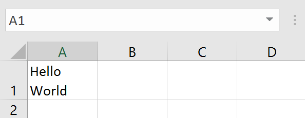
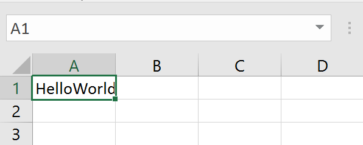

# Entering multiple lines of text inside a cell

In Excel, you can enter multiple lines of text by pressing **Alt-Enter** between words.

You start with this:

Then type **Hello**, press **Alt-Enter**, then type **World**, and you end up with this:

In the surface, you have just entered text into the cell. But digging a little below the surface, you have not only entered data, but also **changed the format of the cell**!

When you entered the text, Excel noticed that it had multiple lines, so it helpfully decided to change the format of the cell to **Wrap text**. If you look at the cell format now, you will see that it has wrap text enabled:

And it wasn't enabled before. If you manually disable it, you will end up with this:

Because the format changed without anybody telling you when you pressed Alt-Enter, you might not be aware of the fact that in order to display multiline cells you need to set [TFlxFormat.WrapText](~/api/FlexCel.Core/TFlxFormat/WrapText.md) := true.

**So in order to enter a multiline text with FlexCel you need to:**
1. Set [TFlxFormat.WrapText](~/api/FlexCel.Core/TFlxFormat/WrapText.md) := true. 
2. Make sure you use a character 10 (\\n) to separate the lines. 

> [!Warning]
> 
> It doesn't matter if your OS uses \\r\\n or any other character to separate lines: **Excel always uses the character 10 as line separator**. 
> 
> 

> [!Note]
> 
> You might wonder why FlexCel isn't as *"smart"* as Excel, and when it detects that you have carriage returns in your text, automatically change 
> the format to wrap text.
> 
> The reason is simple: Excel and FlexCel have different target users. Excel is an interactive application, and in those cases every help the application can give you by guessing what you want to do is welcome. (well not *every* one, but most. Some guessings can be infuriating even in interactive mode.)
> 
> If Excel guesses wrong, you can see it immediately and just press ctrl-z to undo.
> 
> In FlexCel case, you are writing a program to create files, and every "smart" guess just makes the outcome more unpredictable. You tell FlexCel to do A, but it will end up doing B because it guessed B is what you really wanted to do.
> 
> So **FlexCel is dumb on purpose**. If you tell it to do A, it will do A and nothing else. If you set a cell value, it won't also change the cell format because it thinks you might want to do that too. 
> 

> [!Note]
> 
> Still here? Ok, what we told you in the last note was only partially true.
>  
> There is this method **[TExcelFile.SetCellFromString](~/api/FlexCel.Core/TExcelFile/SetCellFromString.md)** in FlexCel that is designed to work as Excel, and will change the format to
> wrap text if it detects carriage returns inside the string. But this is so because **SetCellFromString is specifically designed to replicate the Excel behavior** in case you need it. SetCellFromString is not the preferred way to enter text with FlexCel.
> 
> For most cases what was said in the last note stands: FlexCel won't do B when you tell it to do A. That is the only sane way to write a reliable program.

 
