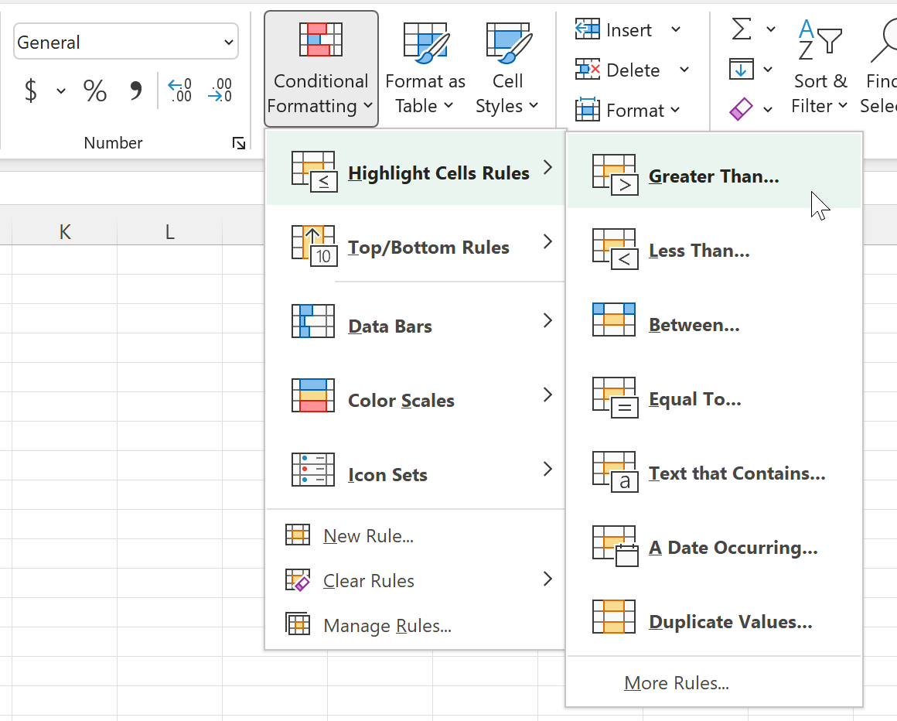
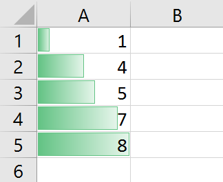
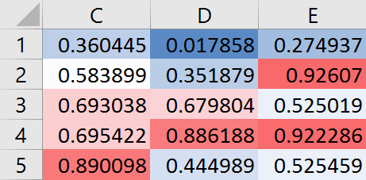
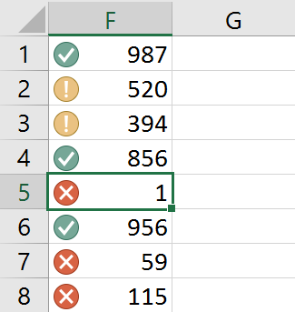

# Conditionally format all things!

In Excel 2007, Excel completely changed conditional formatting, turning it from a very useful tool to something that you just need to know about.

> [!Note]
> 
> FlexCel has supported the old conditional formats basically since forever, but it also added complete support for the new Excel 2007 conditional formats in version 6.9.
> 
> This means that in the current FlexCel version you can add, remove and modify any existing conditional formatting in any file. Every little thing is supported up to the features introduced in Excel 2016 (the latest version at the time of writing this tip). And FlexCel will also calculate all of them and export them to PDF, HTML, SVG, etc.
> 
> If you weren't using them before because FlexCel didn't support them, make sure to give them a second look now.

As usual **[ApiMate](xref:GettingStarted#2-creating-a-more-complex-file-with-code)** will tell you everything about how to enter a conditional format with code, but **conditional formats are especially useful when doing reports.**

Let's imagine you want to paint a cell in red if it is bigger than 10. You could do this with tags like [&lt;#Format cell>](xref:ReportsTagReference#format-cell), but that can get tiring soon and it won't be so simple to maintain. It is much simpler to just press the "Conditional Formatting" button in the home tab of the ribbon:

Then go to "Highlight cell rules" and select "Greater than" in the cell that you want to format. Then save the template, and when you run the report, if the value is bigger than 10 it will be red. No tags or code required!

But this is just scratching the surface. Conditional formats will not only allow you to do stuff that is possible with normal formatting (with more work), they will also allow you to do stuff that is just not possible at all without them. Like for example:

**Data bars**

**Color scales**

**Icon sets**

Conditional formats allow a full new world of possibilities to the formatting of your documents, and better of all, they are fun to use. FlexCel currently supports everything you can throw at it, up to the latest features in Excel 2016.

> [!Note]
> 
> Not only FlexCel supports all the features in conditional formatting, it sometimes supports them better than Excel itself!
> 
> For example, iconsets in Excel (up to the latest Excel 2021) are bitmaps, which means that they won't look so good when zoomed in or printed.
> 
> This is a screenshot of one of the icons above with Excel at 350% zoom:
> 
> 
> 
> To be fair to Excel, they did increase the resolution of those bitmaps in newer versions, they used to look much more jagged. You might also need a high-dpi monitor to see the differences better.
> 
> On the other hand, FlexCel will draw those icons as vectors and export them as vectors to pdf, which means that they will look great no matter the resolution or size of the final result.
> 
> This is a screenshot of the same icons as exported to pdf by FlexCel, at 400% zoom:
> 
> 
> 
> As we value conditional formats so much, we put a lot of effort and months of work to make sure every little detail is right: From the rendering of icons and databars to the performance and memory usage with huge files. Take advantage of them.
> 
> 

