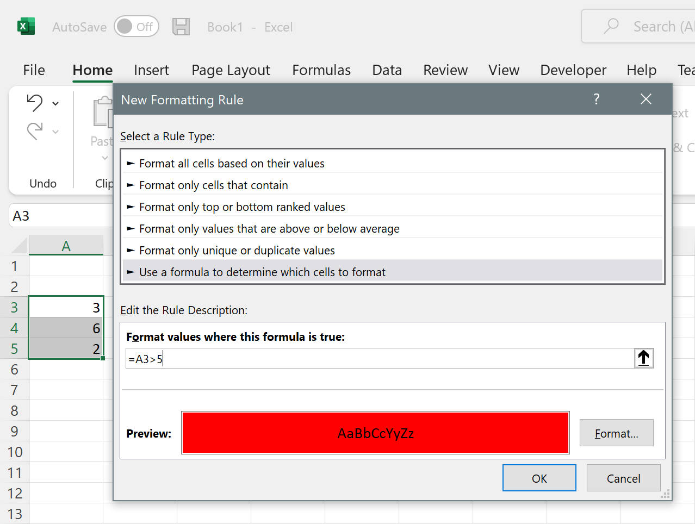
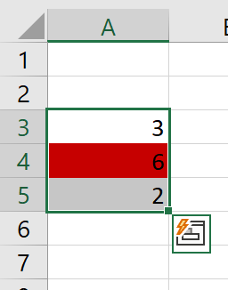

# References in conditional formats and data validations

In theory, formulas in conditional formats should behave similarly to formulas in cells. But the thing is: A conditional format applies not to a **cell** (like cell formulas) but to a **range of cells**. As we will see below, this causes differences that are important to know.

> [!Note]
> 
> In this tip, we will focus on Conditional formats. But what we say here applies whenever a formula covers a range of cells, as it is the case with, for example, data validations too.

Say, you might apply a conditional format to cells A3:A5 where if the number is > 5 it will show red:

As you can see in the image, we apply the format if A3 is bigger than 5. But what does "A3" mean here? If you press enter, you will see that A4 becomes red, even when the formula we wrote said "a3>5" (and A3 is not bigger than 5):

And if you think about it, you can't write a "normal" cell formula here, because the same formula applies to a range of cells, and you want the formula to apply to A3 when it is in A3, to A4 when it is in A4, and so on. So A3 in the formula above means "the cell where we are evaluating the format". If the cell is A3, it means A3; if the cell is A5, it means A5.

Here Excel and FlexCel behave a little different. Excel uses the top left corner cell of the range (in this case, A3) to mean "cell with 0-offset". So here, A3 means "current cell" and in this formula A4 would mean "cell which is 1 row below". This is because the range where the conditional format applies starts at A3. In FlexCel the "0 offset cell" is always A1. 

So if you look at the formula in FlexCel, it will say "=A1>5" instead of "=A3>5". This is a cosmetic difference, as Excel internally uses(and stores in the file) the formula "=A1>5", and using A1 always as the 0-offset cell makes more sense. But it is a difference you should be aware of.

> [!Note]
> 
> The fact that references in conditional format's formulas are relative can also have some interesting consequences when the offset is negative. What happens if we want to refer to "the cell that is 4 rows above us"? In the example we used, A3 meant "the cell that is in the current row". So the cell 4 rows above should be A(-1)? 
> 
> No, we can't have negative rows. We need to wrap up the formula and start counting from the bottom of the spreadsheet (row 1068576). So the cell that is 4 rows above is A1068575 for Excel, and A1068572 when in FlexCel.
> 
> And this creates yet another problem: What is the last row of the spreadsheet? Currently, for an xlsx file it is indeed 1068576, but for xls files is 65536. And it used to be less than that, and in the future it could be bigger than that. Every time Excel changes the grid size, references in conditional formats can break. (see ["Conditional Formats might become invalid" in the API Guide](xref:ApiDeveloperGuide#considerations-about-excel-2007-support).
> 
> While we wouldn't expect Excel to change the grid size again soon (because this and other problems it can cause), if possible, it is a good idea to not use negative offsets inside formulas that apply to ranges of cells.
> 

