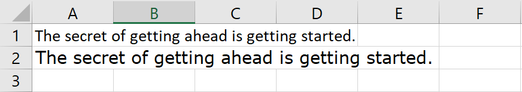
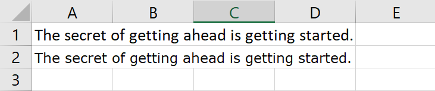

# Replacing a font by another in an Excel file.

Sometimes you might want to replace all occurrences of a font by another inside an Excel file. Maybe the old font isn't widely available in some new platforms that you want to support, maybe there are licensing issues with the font, or maybe your company changed their corporate font and you need to change it in all existing reports.  The reason doesn't really matter. So, how do we do it?

> [!Note]
> 
> Sometimes you might want to only change the font in the resulting PDF file, not in the xls/x files. If you only care about PDF outputs, make sure also to read the [PDF exporting guide](xref:PdfExportingGuide)

## Step 1: Manually inspect the old and the new font.
Before even starting, let's make this clear: **Fonts can have different metrics**. Some fonts are very similar, like Arial and Helvetica, but some other fonts can be completely different. 

If the fonts you are replacing have similar metrics, you can skip to the next step. But if they don't, the first thing to do is to analyze how different they are.

In this example we are going to replace Calibri by Verdana, so let's write a sentence in Calibri 11pt and Verdana 11pt to see how different they are:

Oops... they are quite different. So we can't just do a "search and replace" from Calibri to Arial, without breaking the report layout. For this particular phrase, Calibri 11pt should be replaced by something like Verdana 8.5 pt:

And this means that the existing Calibri text must be reduced in size by about 0.8 to get a similar text in Verdana.

> [!Note]
> 
> 0.8 is the factor for the phrase that we tested: "The secret of getting ahead is getting started."  While it shouldn't vary too much, some phrases will be shorter or longer, depending on the metrics of every character in both fonts. We are doing no exact science here, and unless you are replacing very similar fonts like Arial by Helvetica, you must expect some layouts to break.

## Step 2: Replace the fonts.
Ok, so we now know we have to replace Calibri 11pt by Verdana 8.5pt, or more in general Calibri Npt by Verdana N\*0.8pt.

In Excel, we would have to change the fonts in every cell, and the styles, and the themes, and text inside autoshapes, and text inside charts, and so on. But luckily for us, in FlexCel it is more straightforward. There are two places we have to change: The font list and the themes. And you can do so with the code below:

<pre class="shiki shiki-themes light-plus dark-plus" style="background-color:#FFFFFF;--shiki-dark-bg:#1E1E1E;color:#000000;--shiki-dark:#D4D4D4" tabindex="0"><code>var
  xls: TXlsFile;
  i: Int32;
  fnt: TFlxFont;
  Theme: ITheme;
  textFont: TThemeTextFont;
const
  FontToReplace = 'Calibri';
  ReplaceWith = 'Verdana';
  FontFactor = 0.8;
begin
  xls := TXlsFile.Create('original_file.xlsx', true);
  try
     //Change the fonts
    for i := 0 to xls.FontCount do
    begin
      fnt := xls.GetFont(i);
      if SameText(fnt.Name, FontToReplace) then
      begin
        fnt.Name := ReplaceWith;
        fnt.Size20 := Trunc((fnt.Size20 * FontFactor));
      end;

      xls.SetFont(i, fnt);
    end;

     //Change the theme font
    Theme := xls.GetTheme;
    Theme.Name := 'My theme';
    Theme.Elements.FontScheme.Name := 'My font scheme';
    textFont := TThemeTextFont.Create(ReplaceWith, '', TPitchFamily.FIXED_PITCH__SWISS_FONT_FAMILY, FlexCel.Core.TFontCharSet.Ansi);
    if SameText(Theme.Elements.FontScheme.MajorFont.Latin.Typeface, FontToReplace) then
    begin
      Theme.Elements.FontScheme.MajorFont.Latin := textFont;
    end;

    if SameText(Theme.Elements.FontScheme.MajorFont.ComplexScript.Typeface, FontToReplace) then
    begin
      Theme.Elements.FontScheme.MajorFont.ComplexScript := textFont;
    end;

    if SameText(Theme.Elements.FontScheme.MajorFont.EastAsian.Typeface, FontToReplace) then
    begin
      Theme.Elements.FontScheme.MajorFont.EastAsian := textFont;
    end;

    if SameText(Theme.Elements.FontScheme.MinorFont.Latin.Typeface, FontToReplace) then
    begin
      Theme.Elements.FontScheme.MinorFont.Latin := textFont;
    end;

    if SameText(Theme.Elements.FontScheme.MinorFont.ComplexScript.Typeface, FontToReplace) then
    begin
      Theme.Elements.FontScheme.MinorFont.ComplexScript := textFont;
    end;

    if SameText(Theme.Elements.FontScheme.MinorFont.EastAsian.Typeface, FontToReplace) then
    begin
      Theme.Elements.FontScheme.MinorFont.EastAsian := textFont;
    end;

    xls.SetTheme(Theme);
    xls.Save('result_file.xlsx');
  finally
    xls.Free;
  end;
end;
</code></pre>

