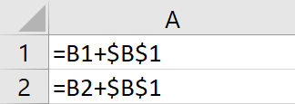
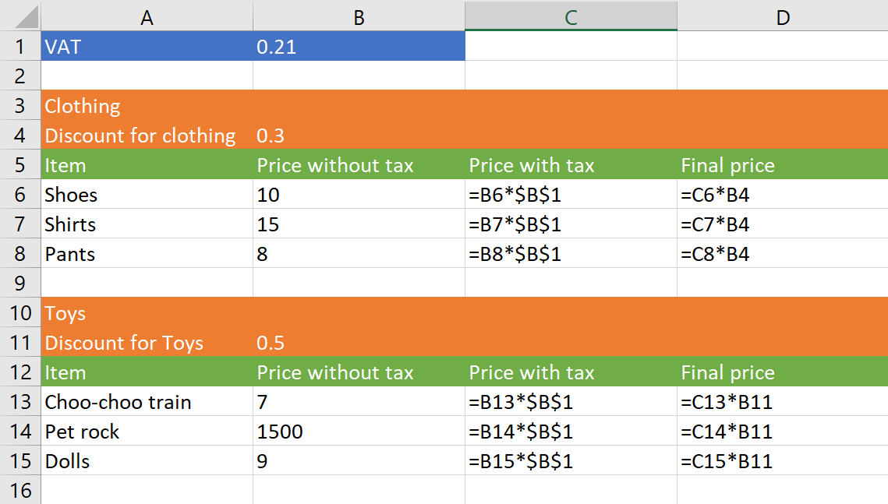

# Semi-absolute references

As you probably already know, in Excel, you have absolute and relative references. An absolute reference has a $ before either the column or the row. So, for example, $B4 has an absolute column and a relative row, while $B$4 has both absolute column and row.

Absolute references don't change when you copy the formula, while relative references adapt. If you have the following formula in cell A1:

`=B1+$B$1`

And you copy cell A1 into A2, you will get 

`=B2+$B$1`

The row in the relative reference changed, while the absolute reference didn't. This is all simple and makes sense: You use relative references for variables that change when you change the row or column, and absolute references for constants. It seems like this should cover all cases, and yet, you might find that sometimes none of them works in the way you want them.

## When a reference needs to be relative sometimes, and absolute others

Let's imagine this simple case:

Here cell B1 is a clear case of an absolute reference. It contains the VAT, and the VAT is a constant for all cells in the sheet. On the other hand, column "Price without Tax" is a clear case of a relative reference: You want "Price with Tax" to be =B6 * $B$1 for row 6, and =B7 * $B$1 for row 7.

But take a look at the formula in column "Final price". For the first block (clothing), you want an absolute reference to the clothing discount (cell B4). But for the second block (toys) you want a different reference to the toys discount (cell B11)

If we made the formula in "Final price" column to be =C6 * $B$4, it will work fine for the first block, but cell D13 would have the formula =C13 * $B$4 instead of =C11 * B11.  

But if we made the formula relative: =C6 * B4, then the formula in D7 would be =C7 * B5

This is a case where neither relative or absolute references would work. And so FlexCel introduces a new mode, which we've called "semi-absolute references".

## What is a semi-absolute reference

We define a semi-absolute reference as a reference which behaves as relative when inside the block being copied, and as absolute when outside. In the example above, when we copy the rows from 3 to 9 to row 10:

 * Cell B1 is outside the block being copied (outside rows 3 to 9). So references to $B$1 will be absolute.
 * Cell B4 is inside the block being copied. So even when we write $B$4, this reference will be relative, and point to row 11 for the copied block (rows 10 to 15)

## How to use FlexCel's semi-absolute references

Since we can't change Excel formula syntax, semi-absolute references don't introduce a new notation. That is, we can't add a new syntax like =A1 + €A€1 for semi-absolute references, because Excel wouldn't understand them. So semi-absolute references are a mode instead, which applies to all absolute references.

When in semi-absolute mode, all absolute references will behave as semi-absolute.

You can enter semi-absolute reference mode by either:

 * When using the API, setting [TExcelFile.SemiAbsoluteReferences](~/api/FlexCel.Core/TExcelFile/SemiAbsoluteReferences.md) = true.

 * When using Reports, setting [TFlexCelReport.SemiAbsoluteReferences](~/api/FlexCel.Report/TFlexCelReport/SemiAbsoluteReferences.md) = true

 * When using Reports, you can also write <#Semi Absolute References> or <#Absolute References> in the expressions column in the <#config> sheet. This allows you to decide if to use semi-absolute references on a report-by-report basis.

> [!Note]
> 
>  You will find that semi-absolute references make more sense than absolute-absolute references in most cases. They simply behave more intuitively. So typically, there is no problem in setting SemiAbsoluteReferences = true by default in your reports. When an absolute reference is inside the block being copied, you usually want the new cells to refer to the copied absolute reference, not to the old reference.
> 
>  The only reason we don't set semi-absolute references on by default is because this is not the way Excel behaves, and we try to be the as much compatible as possible with Excel.
>  

