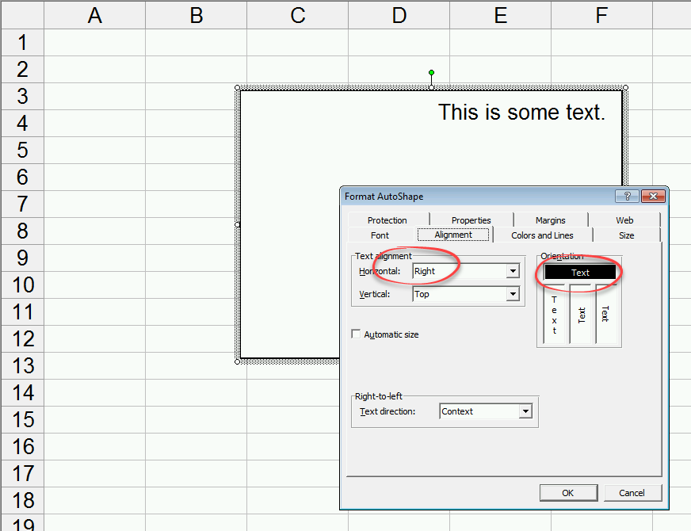
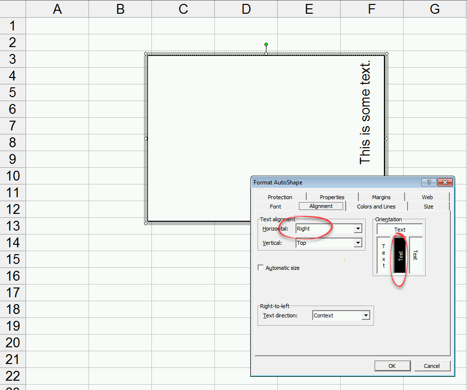
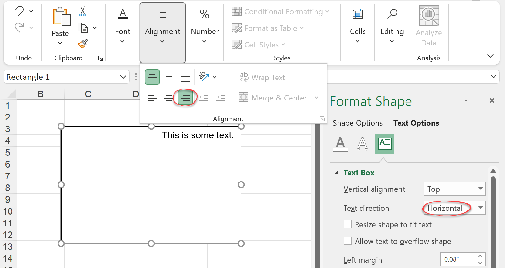
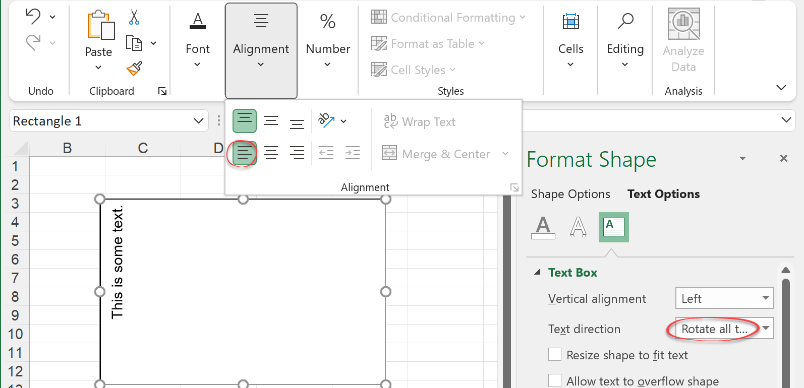
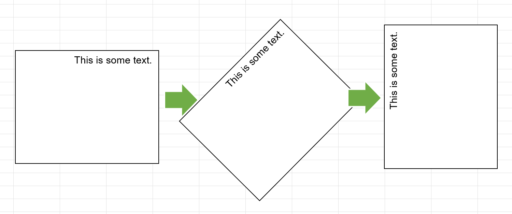

# Text rotation in shapes inside xls and xlsx files

## The problem with shape rotation

When Excel changed the file format from xls to xlsx back in 2007, they rewrote the entire graphics engine. And while the functionality was more or less the same, the base was completely different, and this created subtle differences. We usually keep those differences abstracted from you, but in this tip, we wanted to review a small thing that can be confusing.

Back in Excel 2003 times (xls), you could change the rotation of the text inside an autoshape to be rotated 90 degrees, -90 degrees, vertical or horizontal. Besides that, you could align the text to the right, left, top, or bottom.

So let's imagine we have some text aligned to the right:

And then we rotate it 90 degrees counter-clockwise:

As you can see, Excel first applies the rotation, then the alignment. That means the text is still aligned to the right after rotating it. On the other hand, if you have a similar file in a newer Excel:

And rotate it the same:

The text will now be aligned to the left, not to the right. This happens because, in newer Excels, the text is first aligned to the right, then rotated. The alignment is part of the text, not of the shape. It might be easier to see with an image:

In older Excels, the shape would be rotated first, and the text aligned to the right no matter the rotation.

So, we've seen the process is different under the hood. However, Excel tries to keep the illusion that nothing changed, and so it displays the text as "Top-Left aligned" in this screenshot:

 
But internally, in the xlsx file,  the text will be saved as "Top-Bottom" aligned, with a rotation of -90 degrees clockwise.

## The problem with comments and controls rotation
Probably because of how huge the task was, comments and controls weren't really migrated to xlsx in the big Excel 2007 rewrite. Xlsx files used an older, Excel-2003 xml to store those. And that means that comments and controls kept working as in Excel 2003. They rotate first, then align.

Newer revisions of xlsx introduced newer ways to write comments and controls inside the xlsx file, and that made everything worse. Now you have a control saved twice in the file, and one part has xls behavior while the other has xlsx. 

## How it affects FlexCel

When writing code, you need to know the order in which operations are applied. Let's imagine we are trying to get the text rotated 90 degrees and aligned to the top-right as in the second screenshot.

Inside an xls file, we need to write:
<pre class="shiki shiki-themes light-plus dark-plus" style="background-color:#FFFFFF;--shiki-dark-bg:#1E1E1E;color:#000000;--shiki-dark:#D4D4D4" tabindex="0"><code>    Shape.VerticalJustification = Top 
    Shape.HorizontalJustification = Right
    Shape.Rotation = Rotation90DegressCounterClockwise.
</code></pre>

But for xlsx, we need:
<pre class="shiki shiki-themes light-plus dark-plus" style="background-color:#FFFFFF;--shiki-dark-bg:#1E1E1E;color:#000000;--shiki-dark:#D4D4D4" tabindex="0"><code>    Shape.VerticalJustification = Bottom
    Shape.HorizontalJustification = Right
    Shape.Rotation = Rotation90DegressCounterClockwise.
</code></pre>

We have a single API for both xls and xlsx files, so properties have to have some defined behavior. It can't be that you set the text to be top-right, then rotate the text, and when you save as xls or as xlsx you get different results.

So we've decided to have all properties to behave like xls. **To get the text top right, you need to set the justification to Top-Right**. Then FlexCel will save in the xlsx file the alignment as Bottom-Right. Same when you read the file: If an xlsx file says "Bottom-Right" in its alignment and it is rotated 90 degrees, FlexCel will report Top-Right. **If you are manually reviewing the xml inside an xlsx file, the values will differ from what FlexCel reports.**

The reasons we settled for the xls approach, even when xlsx is much newer and would normally be preferred are:

1. Our code predates xlsx, so we already had properties like [IShapeProperties.TextFlags](~/api/FlexCel.Core/IShapeProperties/TextFlags.md) or [IShapeProperties.TextRotation](~/api/FlexCel.Core/IShapeProperties/TextRotation.md) that used the xls approach. When we introduced simpler properties like [IShapeProperties.TextVerticalAlignment](~/api/FlexCel.Core/IShapeProperties/TextVerticalAlignment.md) it made sense to keep a consistent approach, instead of having some properties behave in one way and some in another.

2. The xlsx way applies only to Autoshapes, but not to comments or the text in controls. So if we took the xlsx approach, we would also have to convert the comments and controls even in xlsx files.

3. It is the way Excel displays it. Even when internally the file will say "Bottom-Right", in the Excel UI you will see the text aligned as "Top-right".
