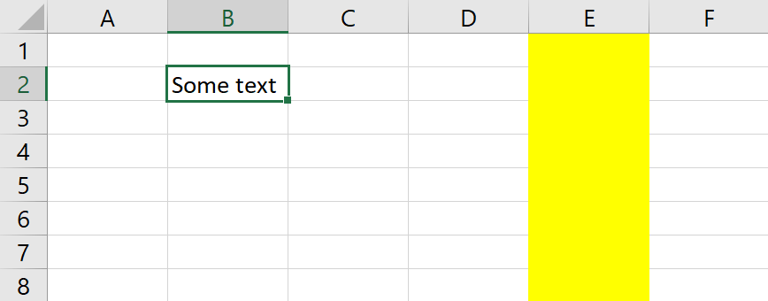
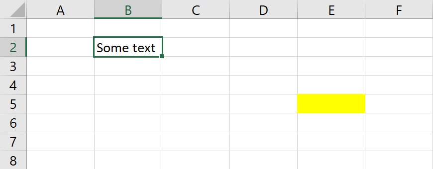
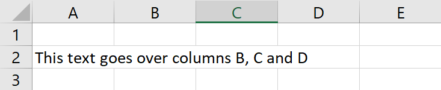

# The maximum used column on a sheet.

This one looks simple enough. What is the maximum used column on a sheet?  In Excel, you can find out with this macro:

<pre class="shiki shiki-themes light-plus dark-plus" style="background-color:#FFFFFF;--shiki-dark-bg:#1E1E1E;color:#000000;--shiki-dark:#D4D4D4" tabindex="0"><code>Sub Macro1() 
      Range("a1").FormulaR1C1 = ActiveSheet.UsedRange.Address 
End Sub
</code></pre>

In FlexCel, we have not one, but two methods to get this information:  
 * [TExcelFile.ColCount](~/api/FlexCel.Core/TExcelFile/ColCount.md)
 * [TExcelFile.ColCountOnlyData](~/api/FlexCel.Core/TExcelFile/ColCountOnlyData.md)
And yet, how to get the column count is a common [question in our inbox](https://support.tmssoftware.com/t/colcountdataonly-counts-column-with-formatting-only/12394). The main problem being, everyone has a different definition in mind of what "ColCount" should return.

The first question that comes to mind is: Should we include formatted columns in the result? For example, in the image below, should ColCount return 2 or 5?

That's why we have two different methods to measure the column count. [TExcelFile.ColCount](~/api/FlexCel.Core/TExcelFile/ColCount.md) will include formatted columns (column E in the example above), and [TExcelFile.ColCountOnlyData](~/api/FlexCel.Core/TExcelFile/ColCountOnlyData.md) won't.

But this is just the entrance to the rabbit hole. The next question to answer is, "Should we include blank formatted cells in the count?"  And there is no simple answer, as it depends on why you want the column count for.

Let's say we want to calculate the range of visible cells that we want to print and let's imagine we have the following spreadsheet:

It seems evident that if you want to print that sheet, you should include cell E5. And both ColCount and ColCountOnlyData in FlexCel will include cell E5 because both count blank formatted cells.
But let's imagine now that cell E5 was bold, with a white background. It now makes no sense to include E5, since it won't be visible when you print it. So for printing, neither ColCountOnlyData nor ColCount will work. We would need a "MaxPrintableColumn" method, including an empty cell with a yellow background, but not including an empty cell with bold formatting.

Now let's consider a case like the following:

Again, depending on what your need is for the column count, the result changes. If you need to process the cells with data, then the last column with Data is A. But if you need to print the sheet, you should print it up to column D.

And we can keep going for a while. What happens if the last column with data is hidden? It shouldn't count for printing, but it should count for processing data. And what if the cell has a formula, and the formula has an empty result? Should the cell be considered empty?  Should we consider empty a cell that only has whitespace? Or a cell with a formula that returns 0, if the "display zeros" option in the workbook is off? When we start combining all the options, it turns out that we would need a lot of methods or parameters to accommodate them all, and we might still miss the particular combination that looks like the "logical" ColCount output given your situation.

The final issue with all ColCount variants is that no variant would be efficient. Given that FlexCel stores the cells grouped by rows, finding the maximum column means looping over all rows to find the maximum. It is not something that we can do more efficiently than you could. So to sum it up:

  1. For most cases, you shouldn't use ColCount or ColCountOnlyData at all. Use [TExcelFile.ColCountInRow](~/api/FlexCel.Core/TExcelFile/ColCountInRow.md) instead. It is not just that ColCount is slow to compute, it is also that it calculates the maximum enclosing rectangle, and that can include lots of empty cells. See the [Performance Guide](xref:PerformanceGuide#avoid-calling-colcount) for more information.

  2. For the cases where you really need a column count, decide which is the exact column count that you want. Do you need to include empty formatted cells, formatted columns, etc? Then you can use the following code to calculate it: 

<pre class="shiki shiki-themes light-plus dark-plus" style="background-color:#FFFFFF;--shiki-dark-bg:#1E1E1E;color:#000000;--shiki-dark:#D4D4D4" tabindex="0"><code>class function DocMaxColCount.CalcMaxColumn(const xls: TExcelFile): Int32;
var
  RowCount: Int32;
  MaxCol: Int32;
  row: Int32;
  ColCountInRow: Int32;
  colIndex: Int32;
  XF: Int32;
  cellValue: TCellValue;
  c: Int32;
begin
  RowCount := xls.RowCount;
  MaxCol := 0;
  for row := 1 to RowCount do
  begin
    ColCountInRow := xls.ColCountInRow(row);
    for colIndex := ColCountInRow downto 1 do
    begin
      XF := -1;
      cellValue := xls.GetCellValueIndexed(row, colIndex, XF);
      if cellValue.IsEmpty then  // you can add some other condition here like if it is a RichString and the richstring is whitespace
        continue;

      c := xls.ColFromIndex(row, colIndex);
      if c > MaxCol then
        MaxCol := c;

      break;
    end;

  end;

  Result := MaxCol;
end;

</code></pre>

