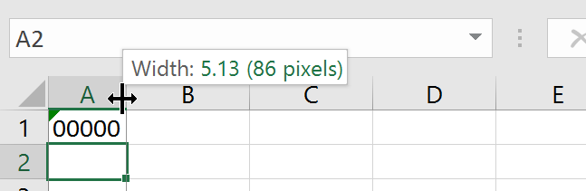
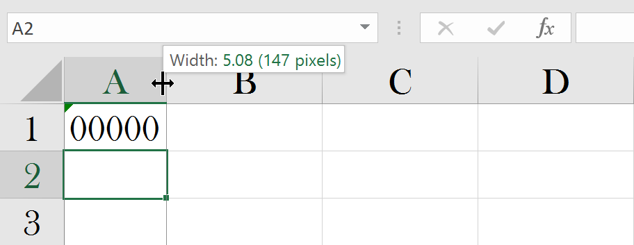

# Understanding Excel measurement units

Excel uses many different units for measuring different things, and FlexCel uses the same. 

For most rendering stuff, including the PDF API, FlexCel uses points, and those are simple: **A point is 1/72 of an inch**. As you can see in the [Google calculator here](https://www.google.com/search?rls=en&q=inches+points&ie=UTF-8&oe=UTF-8). 

A point is also normally used to specify font sizes: For example a font with 11 points has a bounding box of 11/72 inches. 

Sometimes we use pixels, where a pixel is not defined as a physical point on the screen, but just as 1/96 of an inch, no matter the actual resolution of the screen. **Excel and FlexCel are resolution-independent, so physical pixels are never used**. When we mention "pixels", we always refer to resolution-independent pixels.

Now, the Excel units are a little more complex. The simplest ones are the y coordinates (rows): **A row is measured in [twips](https://en.wikipedia.org/wiki/Twip), or 1/20 of an point**. [TExcelFile.GetRowHeight](~/api/FlexCel.Core/TExcelFile/GetRowHeight.md) returns the current row height in twips. 

But the x coordinates (columns) are more complex. They measure how many “0”s you can put in a cell in the font used in the “Normal” style, plus some margins. 

For example, the normal style for an Excel 2007 or newer file is “Calibri 11”, so if you can fit 5 “0”s in a column with that font, (“00000”) then the column width is 5. But not exactly, there are some margins too, which aren’t correctly documented in Excel docs, and which actually change depending on the screen resolution. So the width is not going to be 5, but 5.something. 

Here you can see how a column autofitted to "00000" looks like:

It is interesting to see what happens when we change the "normal" font of the spreadsheet to some bigger font. The column width in pixels will get bigger, but the internal units will still be around 5, because you can still fit 5 "0"s in that column. In fact, even when physically much bigger, the "size" got a little smaller when selecting a bigger font: from 5.13 to 5.08.

You can convert between columns and rows and pixels using [TExcelMetrics.ColMult](~/api/FlexCel.Core/TExcelMetrics/ColMult.md) and [TFlxConsts.RowMult](~/api/FlexCel.Core/TFlxConsts/RowMult.md). For example:

<pre class="shiki shiki-themes light-plus dark-plus" style="background-color:#FFFFFF;--shiki-dark-bg:#1E1E1E;color:#000000;--shiki-dark:#D4D4D4" tabindex="0"><code>  RowHeightInPixels := xls.GetRowHeight(Row) / TFlxConsts.RowMult;
</code></pre>

<pre class="shiki shiki-themes light-plus dark-plus" style="background-color:#FFFFFF;--shiki-dark-bg:#1E1E1E;color:#000000;--shiki-dark:#D4D4D4" tabindex="0"><code>  ColWidthInPixels := xls.GetColWidth(Col) / TExcelMetrics.ColMult(xls);
</code></pre>

> [!Note]
> 
> The "pixels" in those examples are the "resolution-independent-pixels" we mentioned at the start. That is, 1/96 of an inch.

Now, sadly Excel isn’t very exact about the units, so this isn't an exact conversion. You can see it simply by pressing a screen preview and measuring the real width of a cell, and compare it with what you see on the screen: you’ll see it is not exactly the same. 

The actual box width for a cell can also change if you use a different screen scaling: They will look different if you use say 100% or 175% screen scaling. FlexCel can offset this with the property [TExcelFile.ScreenScaling](~/api/FlexCel.Core/TExcelFile/ScreenScaling.md). While by default the screen scaling is 100 (which corresponds to 100% scaling or 96 dpi), if you are always working in a different setting, changing this property will make FlexCel work as if it was Excel showing the file at that particular screen scaling.

Changes between resolutions are not much, but they exist so in general it is a bad idea to try to do “pixel perfect” designs in Excel. You always need to leave some extra room because in different resolutions the cells might be slightly smaller or bigger. 

For more info about how Excel units can change with the resolution, you can also read [Autofitting Rows and Columns in the API Developer Guide](xref:ApiDeveloperGuide#autofitting-rows-and-columns)

> [!Note]
> 
> As you can see in the images above, Excel will also show you the column size in "**Pixels**" besides the internal units.
> 
> But sadly those "pixels" aren't actual pixels either, or "resolution-independent-pixels" which we mentioned at the start which are 1/96 of an inch. If you took the effort to count them, you would realize that the pixels in that column are not what Excel says they are. Also, if you double the resolution of the screen those "pixels" will remain the same, even if the actual count of pixels doubled with the double resolution. 
> 
> But the main issue is that those "pixels" are as unreliable as the other units Excel uses. They share the same resolution problems as the internal Excel units, so they don't really solve any problem.
> 

