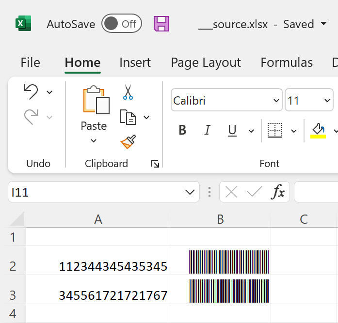

# Using barcodes.

One question we get regularly is how to embed barcodes using FlexCel. Excel doesn't have any barcode-specific functionality, so the ways to do that are to either insert an image with a barcode, or write text with a special font which will render the text as the barcode representation.

## Using a barcode font

This is the simplest, and in my opinion best method to get barcodes into Excel. Just install a barcode font, then write the barcode in text, and it will be rendered as expected.

Advantages:
  1. The font is vectorial, not a bitmap, and fonts are great for scaling. That means that if you zoom in the page or print with a high-resolution printer, you won't see a pixelated image. It will always be crisp just like any other text in the document, because it is text, just rendered with a special font.

  2. The generated file will probably be smaller. If you have thousands of barcodes, each barcode will be stored as an ASCII text instead of as an image. It can make a big difference.

  3. The file can be easily edited by another user once you created it. They only need to change the text and the barcode will update.

  4. It is just simpler to write the text in FlexCel to a cell than to generate an image and insert the image.

Disadvantages:
    1. You need to find the special font that renders the barcode and you need and make sure you are legally allowed to redistribute the font. There are lots of free fonts on the internet, such as https://www.barcodesinc.com/free-barcode-font/ but you will have to find one that suits your needs.

    2. With images you might get more complex barcodes than with a font. Say for example a barcode with the shape of your logo, or with annotated text.

    3. In Excel you can't embed fonts, so to redistribute an xls or xlsx file using a barcode font, you need to make sure your users also have the font installed in their machines. If they don't have the font installed, they will see the text but not the barcodes.

> [!Note]
> 
> When exporting to PDF, not only you can embed the fonts, but also this is what FlexCel does by default when exporting. So a PDF generated with a barcode font will look great anywhere, no matter if the user seeing the pdf actually has the font installed on his machine or not.

## Using an image

If a barcode font won't work for you, then the other option is to insert an image with the barcode where you need it. You will still need a separate component for creating the barcode image, and it is best if you can export it to wmf or emf since those are vectorial formats which will look better at higher resolutions. If you can only get pngs, make sure they are of a resolution that is good enough for printing. Try not to use jpegs as they are bad for this kind of images and can have a lot of artifacts.

Using images is more complex than using a font, files will be bigger, and basically all "Advantages" in the previous section become the "Disadvantages" of using images. But on the nice side, the users won't need to have any font installed to see the barcodes. So if you need to send the xls/x files to random users, an image might be the only sane choice. Once again, remember that pdf files don't have this problem, so you might want to still use a barcode font, but redistribute the pdfs instead of the xls/x files.
