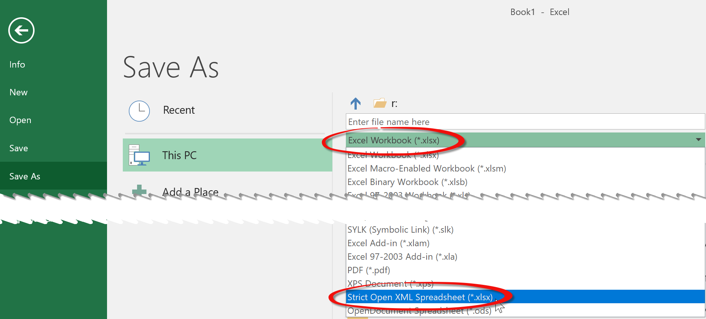

# Deciding between standard xlsx files and strict xlsx files.

FlexCel 6.17 introduced full support for reading and saving strict xlsx files. Strict xlsx files are a different file format from normal xlsx files, and you can select them when doing a "File Save As..." in Excel:

Now the question is: Should I use normal or strict xlsx files? And the short answer is: **Use normal xlsx files** unless you have a non-negotiable requirement from your customers to use strict xlsx.

The long answer: When Microsoft introduced xlsx back in Excel 2007 they didn't have the time to define all the parts of the new file format, and so for some parts (mostly drawings) they just reused an older xml file format: [Office XML Formats](https://en.wikipedia.org/wiki/Microsoft_Office_XML_formats).

Using the existing file formats for the parts that weren't ready gave them a head start and allowed them to ship xlsx earlier, but it introduced at least two problems:
1. The style and namespaces for the xml are different. This is mostly a cosmetic issue, but for example the old xml format uses pascal case for the identifiers (for example "**L**egacy**D**rawing") while the new system uses lower camel case (**l**egacy**D**rawing). The old xml also relies more on attributes while the new one relies more on xml children, store booleans differently and a long list of etc. In general the xml in those legacy parts is very different from the rest of the newer parts. To read or write to them, they require a lot of specific code which is different from the code to read or write similar non-legacy parts.

2. More importantly the old format wasn't always valid xml. So for example the text of a button with an enter in the text would be stored as "Some text&lt;br&gt;Second line." This will crash any compliant xml readers, because xml readers are required to fail when they find invalid xml and &lt;br&gt; is not valid xml as there is no ending tag.

So in order to fix this and other issues, Microsoft has been developing a parallel "Strict xml" standard which uses different xml namespaces and has no legacy parts. They renamed the "normal xlsx" to "transitional xlsx" and added the "strict xlsx" variant.

But the support for strict xlsx in Excel came late, with Excel 2010 being first able to read it, and Excel 2013 first able to write them. By that time, transitional xlsx was already the standard, and that hasn't changed up to the day I am writing this hint. And if strict xlsx hasn't gained traction yet, it is unlikely that it ever will. (even when I would like to be proven wrong as the strict xlsx format is simpler and free of legacy baggage)

So coming back to the answer: Normal xlsx is the standard, and the format that everyone else will understand (including old FlexCel versions). So if you have no specific need for the strict xml parts, just keep using the standard.

The strict xlsx format on the other side should be cleaner, but being "cleaner" is not a property of a file format that should concern you much. The fact that everyone can read the files you create should be a bigger concern. And actually, **strict xlsx files as saved by Excel aren't cleaner** because they still include the legacy parts inside conditionals so older Excels as Excel 2007 can still read them. And on the other side, "normal" xlsx files still include the new, non-legacy parts too for tools that can't understand the legacy parts, so both file formats are basically the same, except for the different xml namespaces and some syntax differences.

> [!Note]
> 
> As mentioned above, when saving a strict xlsx file with Excel it will still include all the legacy and potentially invalid xml parts. We believe this defeats the purpose of having a cleaner format, so when you save with FlexCel, we will only write the non-legacy parts. You will need to have Excel 2010 so it understands the new non-legacy parts, but you also need Excel 2010 for strict files saved with Excel, since the xml namespaces are different so older tools won't understand the files. If an xlsx reader knows about strict xml and the strict xml namespaces, it should be able to handle the non-legacy parts too.

