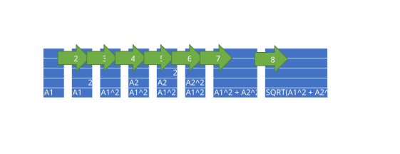

# Using Tokens to get information from formulas

## Introduction
When reading formulas with FlexCel, you get a string with the formula definition, like for example:

<pre class="shiki shiki-themes light-plus dark-plus" style="background-color:#FFFFFF;--shiki-dark-bg:#1E1E1E;color:#000000;--shiki-dark:#D4D4D4" tabindex="0"><code>=SQRT(A1^2 + A2^2)
</code></pre>

And while this is enough in many cases, sometimes you need a little more information. For example, which are the cells used in the formula above? It is challenging to know that the cells used are A1 and A2 just by looking at the string. You could try to use some kind of regex to get the information, but you will hit limits soon. Formula syntax depends on the context, and depending on its surroundings, the string "A1" might be present in the formula and not mean a cell.

To solve this problem correctly, we need to parse the string. And guess what? FlexCel already has one parser which you can use. To print out the cells used in the formula above, you can use the following code:

<pre class="shiki shiki-themes light-plus dark-plus" style="background-color:#FFFFFF;--shiki-dark-bg:#1E1E1E;color:#000000;--shiki-dark:#D4D4D4" tabindex="0"><code>var
  xls: TXlsFile;
  tokens: ITokenList;
  token: TToken;
  i: integer;
begin
  //Set up a file to analyze.
  xls := TXlsFile.Create(1, TExcelFileFormat.v2019, false);
  try
    xls.SetCellValue('A2', TFormula.Create('=SQRT(A1^2 + A2^2)'));

    //Print the cell addresses in the formula.
    tokens := xls.GetFormulaTokens(2, 1);

    for token in tokens do
    begin
      if (token is TTokenCellAddress) then
      begin
        WriteLn(TTokenCellAddress(token).Address.CellRef);
      end;
    end;
  finally
    xls.Free;
  end;
end;
</code></pre>

> [!Note]
> 
> In the example above, we set cell A2 to the formula and then use [TExcelFile.GetFormulaTokens](~/api/FlexCel.Core/TExcelFile/GetFormulaTokens.md) to read the tokens. This was done to simulate a real-world situation where we already have the formulas in an existing file, and we want to parse them. But for this particular example, instead of setting the value of a cell and then reading the tokens from the cell, we could have used [TExcelFile.GetTokens](~/api/FlexCel.Core/TExcelFile/GetTokens.md) to get the tokens directly from the string.

## Analyzing formulas in a file

[TExcelFile.GetFormulaTokens](~/api/FlexCel.Core/TExcelFile/GetFormulaTokens.md) returns an array with the tokens that make up the formula, using [RPN Notation](https://en.wikipedia.org/wiki/Reverse_Polish_notation)

RPN is straightforward to evaluate mechanically. When you have a data token, you push it into the stack. When the token is an operator or function taking n parameters, you combine the n last members of the stack and replace them by the result.
So let's see in more detail the tokens in the formula above. This is the full list of tokens returned by GetFormulaTokens:

* TTokenCellAddress - **A1**
* TTokenData - **2**
* TTokenOperator - **Power**
* TTokenWhitespace - the is the space before the "+". We will ignore whitespace
* TTokenCellAddress - **A2**
* TTokenData - **2**
* TTokenOperator - **Power**
* TTokenWhitespace
* TTokenOperator - **Add**
* TTokenFunction - **SQRT**

Using RPN, this is evaluated as follows:

1. Push A1 into the stack
2. Push 2 into the stack
3. Calculate A1^2 - Now the stack contains only A1^2
4. Push A2 into the stack
5. Push 2 into the stack
6. Calculate A2^2 - Now the stack contains A1^2 and A2^2
7. Add both entries in the stack. Now the stack contains A1^2 + A2^2
8. Calculate SQRT of the entries in the stack. The result is SQRT(A1^2 + A2^2)

You can visualize the stack after each step above in the following diagram:

## Manipulating formulas in a file

Up to now, we've seen how to analyze existing formulas. This enough can be very powerful, and allows you to create custom static analyzers that can detect unwanted constructs in spreadsheets. But do you know a nice feature that most good static analyzers have? They allow you to apply fixes to your code automatically.

So let's imagine we have a file with thousands of formulas, and in cell B1 we have a constant which contains the tax to apply. We want to check all the formulas for references to B1, and make sure they reference a name "Tax" instead. We have half of the solution already: [TExcelFile.GetFormulaTokens](~/api/FlexCel.Core/TExcelFile/GetFormulaTokens.md). This method will allow us to detect all references to B1 in the formulas. But now, to actually modify the code, we need the other half: [TExcelFile.SetFormulaTokens](~/api/FlexCel.Core/TExcelFile/SetFormulaTokens.md) 

We can now read the tokens of a formula, modify them, and write them back. The following code will replace all occurrences of B1 by the name "Tax":

<pre class="shiki shiki-themes light-plus dark-plus" style="background-color:#FFFFFF;--shiki-dark-bg:#1E1E1E;color:#000000;--shiki-dark:#D4D4D4" tabindex="0"><code>var
  xls: TXlsFile;
  tokens: ITokenList;
  modified: Boolean;
  i: integer;
begin
   //Set up a file to analyze.
  xls := TXlsFile.Create(1, TExcelFileFormat.v2021, true);
  try
    xls.SetCellValue('A2', TFormula.Create('=B1 * C2'));
    xls.SetNamedRange(TXlsNamedRange.Create('Tax', 0, 1, 1, 2, 1, 2, 0));
     //Modify all references to B1 to be references to the name "Tax"
    tokens := xls.GetFormulaTokens(2, 1);
    modified := false;

    for i := 0 to tokens.Count - 1 do
    begin
      if (tokens[i] is TTokenCellAddress)
                      and (TTokenCellAddress(tokens[i]).Address.Row = 1)
                      and (TTokenCellAddress(tokens[i]).Address.Col = 2) then
      begin
        tokens[i] := TTokenName.Create('Tax', '', '');
        modified := true;
      end
    end;

    if modified then
    begin
      xls.SetFormulaTokens(2, 1, tokens);
    end;
  finally
    xls.Free;
  end;
end;
</code></pre>

