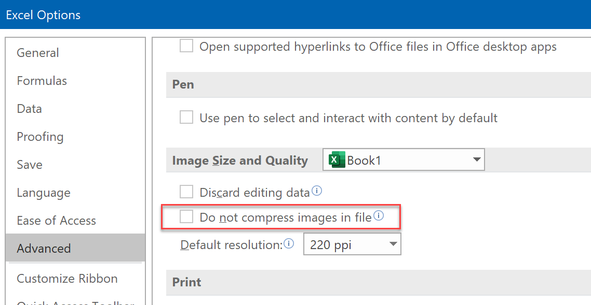

# Why are xlsx files generated by FlexCel smaller than the same files generated by Excel?

This is a question we get from time to time: You take an existing xlsx file, open it with FlexCel and save it, without doing anything else. You will notice that the new file is several kilobytes smaller than the original, and yet, nothing changed. What is going on?

There can be actually many causes for this, but the main reason is simple: Xlsx files are zip files with a different extension. In a zip file, you can specify the compression level ranging from "**fastest**" (less compression) to "**best**" (slowest).

Excel is an interactive tool, and it is really important that when a user presses enter the file is saved as fast as possible and control returned to the user. So Excel uses the "fastest" compression setting. On the other hand, FlexCel is optimized for server use, and in this case, smaller sizes win over some milliseconds less to generate the file. So we use the "default" compression setting which is normally the best compromise between speed and compression. And this is why the files generated by FlexCel are normally smaller than the same files as generated by Excel.

> [!Note]
> 
> Comparing file sizes of zip files is not really indicative of anything, but if you want to verify this, you can easily do the test:
> 1. Create a file in Excel
> 2. Open and save it with FlexCel
> 3. Open the file generated in 2. with Excel again and save it. The file size for this file should be similar to the file in 1., and bigger than the file in 2.

Finally, note that while "default" compression is normally the best compromise, you can change the compression of the files generated by FlexCel changing the [TExcelFile.XlsxCompressionLevel](~/api/FlexCel.Core/TExcelFile/XlsxCompressionLevel.md) property.

> [!Tip]
> 
> You might also see the opposite case: You generate a file in FlexCel and when you open it and save it with Excel, the size is smaller. 
> 
> This is normally because a setting in Excel. If you go to the Ribbon -> File -> Options -> Advanced, you will see the following options:
> 
> 
> 
> If the checkbox isn't checked (the default) Excel will reduce the resolution of the images in the file to match the given resolution. This will result in a smaller file with lower-resolution images.
> 
> On the other side, FlexCel will never try to automatically reduce the image quality. If you enter an image with AddImage, it will enter it "as-is" and assume you wanted that resolution. To get smaller images with FlexCel, reduce the image quality before entering the image into the file. 
> 

