# iOS Tutorial
## Overview
In this tutorial we will create a small xls/x document viewer. The app isn't particularly useful or flashy, but it is designed to show most concepts you need to know in order to work with files in iOS

> [!Note]
> 
> **The complete source for this tutorial is available as [FlexView demo](xref:iOS_FlexView-FireMonkey_Mobile) in the FlexCel distribution.**

## Step 1. Setting up the Application

Lets start by creating a new Multi-Device Application:

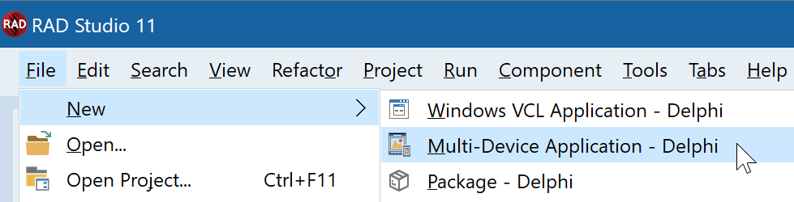

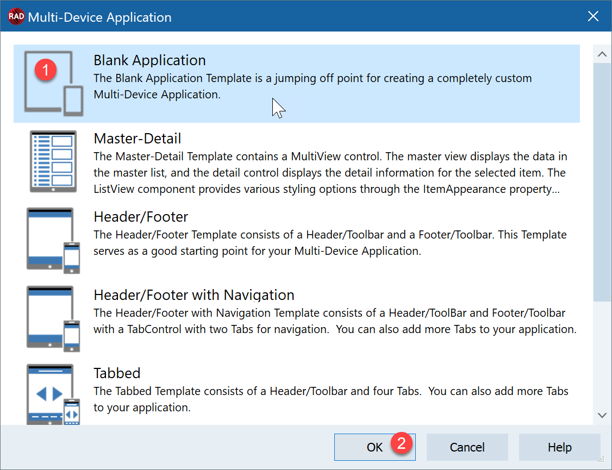

* Select **Blank Application** (1) and then **Ok** (2)
* In Delphi press **Save** and give it a name. In this tutorial we will use **FlexView.dproj**  for the project and **UFlexView.pas** for the unit.

Once you have saved the project, set the target to **iOS** device. (or simulator if you are testing in a simulator and your Rad Studio version supports simulators)

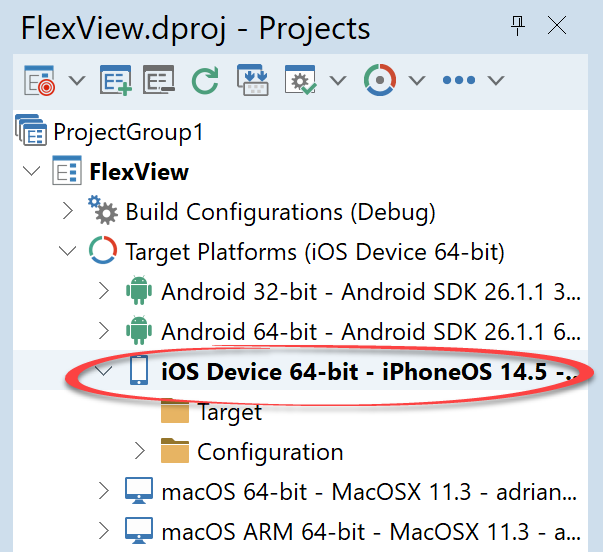

Then you can go to the application properties, and set icons and the application name.

You might now try running the application, it should show as an empty form in the simulator or the device.

## Step 2. Creating the User Interface

In the tool palette, select the “FlexCel” tab and drag a  to the Form:

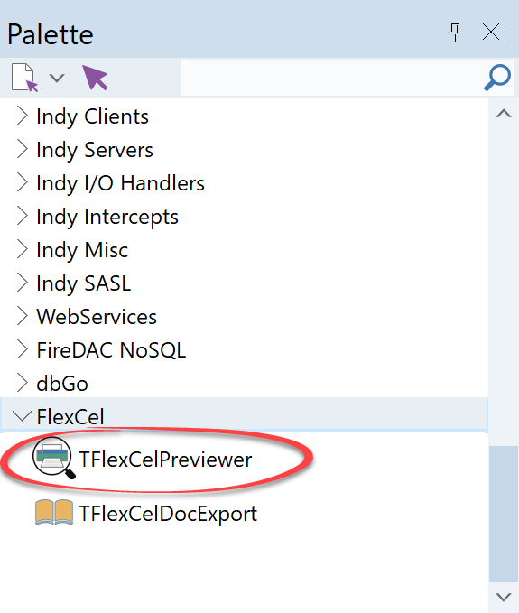

And set the “align” property of the TFlexCelPreviewer to “alClient”. The form should look like this:
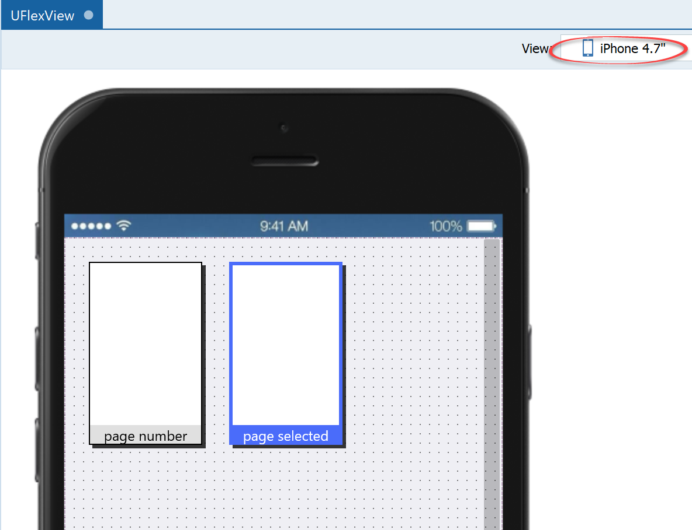

## Step 3. Registering the application
The next step is to tell iOS that our application can handle xls and xlsx files. This way, when another app like for example mail wants to share an xls or xlsx file, our application will show in the list of available options:

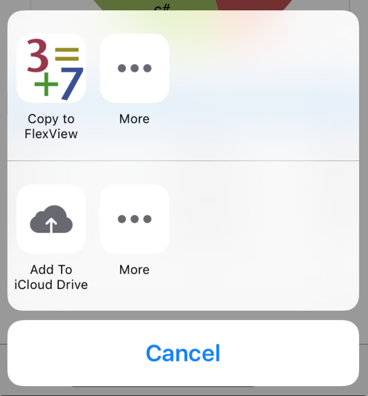

To register our app, we need to change the file Info.plist.

Delphi allows you to change simple properties in Info.plist in the “Version Info” screen:

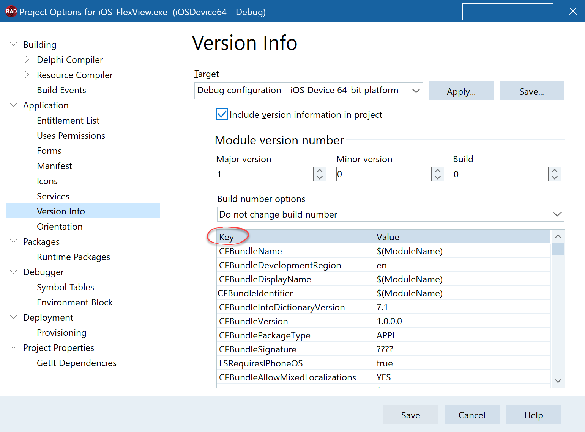

But this only allows entering simple “Key/Value” entries. To register a file handler, we need to enter a more complex dictionary. As this is not possible in Delphi at the time of this writing (Delphi 11), we are going to do a workaround.

> [!Note]
> 
> We want to keep the “Delphi Settings” in Info.plist and merge our own settings. We don’t want to replace the Delphi settings completely, so if we change the “Version Info” in Delphi in the future, it will change in our application.

1) Create a file “**DocumentTypes.plist**” in your source folder with the following contents:

<pre class="shiki shiki-themes light-plus dark-plus" style="background-color:#FFFFFF;--shiki-dark-bg:#1E1E1E;color:#000000;--shiki-dark:#D4D4D4" tabindex="0"><code>&#x3C;?xml version="1.0" encoding="UTF-8"?>
&#x3C;?xml version="1.0" encoding="UTF-8"?>
&#x3C;!DOCTYPE plist PUBLIC "-//Apple//DTD PLIST 1.0//EN" "http://www.apple.com/DTDs/PropertyList-1.0.dtd">
&#x3C;plist version="1.0">
&#x3C;dict>
&#x3C;key>CFBundleDocumentTypes&#x3C;/key>
&#x3C;array>
   &#x3C;dict>
       &#x3C;key>CFBundleTypeName&#x3C;/key>
       &#x3C;string>Excel document&#x3C;/string>
       &#x3C;key>CFBundleTypeRole&#x3C;/key>
       &#x3C;string>Editor&#x3C;/string>
       &#x3C;key>LSHandlerRank&#x3C;/key>
       &#x3C;string>Owner&#x3C;/string>
       &#x3C;key>LSItemContentTypes&#x3C;/key>
       &#x3C;array>
           &#x3C;string>com.microsoft.excel.xls&#x3C;/string>
           &#x3C;string>com.tms.flexcel.xlsx&#x3C;/string>
			&#x3C;string>org.openxmlformats.spreadsheetml.sheet&#x3C;/string>
       &#x3C;/array>
   &#x3C;/dict>
&#x3C;/array>
&#x3C;key>UTExportedTypeDeclarations&#x3C;/key>
&#x3C;array>
&#x3C;dict>
   &#x3C;key>UTTypeDescription&#x3C;/key>
   &#x3C;string>Excel xlsx document&#x3C;/string>
   &#x3C;key>UTTypeTagSpecification&#x3C;/key>
   &#x3C;dict>
       &#x3C;key>public.filename-extension&#x3C;/key>
       &#x3C;string>xlsx&#x3C;/string>
       &#x3C;key>public.mime-type&#x3C;/key>
       &#x3C;string>application/vnd.openxmlformats-officedocument.spreadsheetml.sheet&#x3C;/string>
   &#x3C;/dict>
   &#x3C;key>UTTypeConformsTo&#x3C;/key>
   &#x3C;array>
       &#x3C;string>public.data&#x3C;/string>
   &#x3C;/array>
   &#x3C;key>UTTypeIdentifier&#x3C;/key>
   &#x3C;string>com.tms.flexcel.xlsx&#x3C;/string>
&#x3C;/dict>
&#x3C;/array>
&#x3C;/dict>
&#x3C;/plist>
</code></pre>

   This is the plist needed to register xls and xlsx files. You can find this file in the [FlexView demo](xref:iOS_FlexView-FireMonkey_Mobile) that comes with the FlexCel distribution.

2) To merge this plist with the Delphi generated plist, we are going to use a small tool included with FlexCel: **infoplist.exe**.  This tool will take two plists as input, and return another plist with the contents of the two original files merged. You can find it at &lt;FlexCelInstallDir>\\Tools\\CompiledTools  (Full source code is also available in the FlexCel distribution).
   So let’s go to “Project Options->Build Events” and add the following line as “Post-build event”: (note that the text will wrap, but it is a single line)

<pre class="shiki shiki-themes light-plus dark-plus" style="background-color:#FFFFFF;--shiki-dark-bg:#1E1E1E;color:#000000;--shiki-dark:#D4D4D4" tabindex="0"><code>"$(FLEXCELVCLNT)\Tools\CompiledTools\infoplist.exe" "$(OUTPUTDIR)\FlexView.info.plist" "$(PROJECTDIR)\DocumentTypes.plist" "$(OUTPUTDIR)\ActualFlexView.info.plist"
</code></pre>

   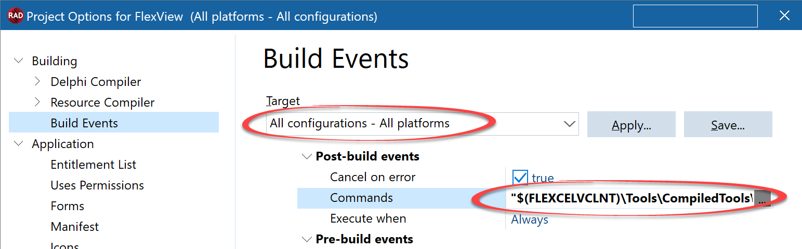

> [!Note]
> 
> Before writing the command, make sure to select “All configurations – All platforms” in the combobox at the top, so the command is applied in all cases

   If everything went fine, when you compile the project it should have a file “ActualFlexView.info.plist” in the output folder. You can view this file with notepad, and it should have the contents of the original FlexView.info.plist merged with our DocumentTypes.plist. Remember that this file will be recreated every time you build, so don’t edit it. Always edit the original “DocumentTypes.plist”.

> [!Note]
> 
> If you are having problems with this step, you can look at the “Output window” in Delphi and see if the post-build event is throwing any errors:
> 
> 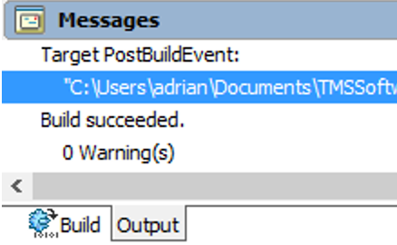

3) Compile the App in **Debug**/**Release** and for the **simulator**/**device**. This way all four ActualFlexView.info.plist files will be created.

4) The final step of the workaround is to make Delphi deploy the new “ActualFlexView.info.plist” instead of “FlexView.info.plist”.

   Go to “Menu->Project->Deployment”.

   If you want to register your app in all configurations, you’ll need to repeat this step four times: iOSDevice/Debug, iOSDevice/Release, iOSSimulator/Debug and iOSSimulator/Release. If you only care about registering in some of them, you can set just those. But as the files are in different folders, you can’t use “All configurations – All platforms” combobox. You’ll need to select each final configuration, and add the corresponding ActualFlexView.plist for the configuration:

   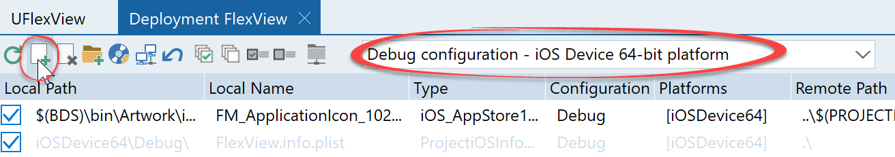

   Once the file is added, search for “info.plist” in the “Remote Name” column. You might see more than one entry, uncheck them all:

   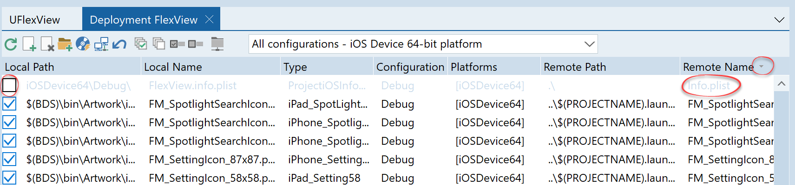

   Now locate our file “ActualFlexCelView.info.plist”, and in the “Remote Name” column, enter “Info.plist”

   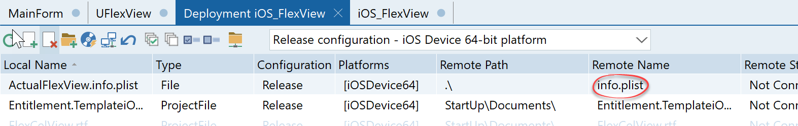

   And in the “Platforms” column, select the only the configuration/platform we are adding. For example, if we are adding the file for “Debug/iOS device”, select Platforms and uncheck “iOSSimulator:

   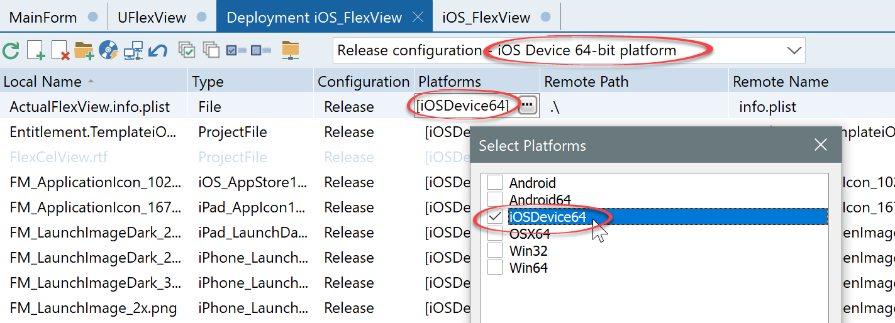

> [!Note]
> 
>    Some Delphi versions like for example Delphi 11 only support one iOS platform. (In Delphi 11's case this is iOS Device 64). If this is the case, then there is no need to unselect the other platforms, since there are none.
>    

   This concludes the workaround. Now the original Info.plist files won’t be deployed, and our merged file will be deployed instead.

Once you have done this, if you run the application and have for example an email with an xls or xlsx file, you should see “FlexView” in the list of possible applications where to send the file when you press "Share".

## Step 4. Reading the file sent by another application
If you tried the application after the last step, and pressed the “Open in FlexView” button, you will notice that FlexView starts, but the previewer is still empty. It won’t show the file that the other application sent.

What happens when you press the “Open in FlexView” button is that iOS  will copy the file in the “Documents/Inbox” private folder of FlexView, and send an OpenURL event to our app. We need to handle this event, and use it to load the file in the preview.

Add  **FMX.Platform** and **FMX.Platform.iOS** to your uses clause. After that, on the Form’s create event, write the following code:

<pre class="shiki shiki-themes light-plus dark-plus" style="background-color:#FFFFFF;--shiki-dark-bg:#1E1E1E;color:#000000;--shiki-dark:#D4D4D4" tabindex="0"><code>procedure TFormFlexView.FormCreate(Sender: TObject);
begin

  IFmxApplicationEventService(
    TPlatformServices.Current.GetPlatformService(
    IFmxApplicationEventService))
    .SetApplicationEventHandler(AppHandler);

  FlexCelPreviewer1.Document :=
    TFlexCelImgExport.Create(TXlsFile.Create(1, true), true);
    FlexCelPreviewer1.InvalidatePreview;
end;
</code></pre>

And define the procedure AppHandler as:

<pre class="shiki shiki-themes light-plus dark-plus" style="background-color:#FFFFFF;--shiki-dark-bg:#1E1E1E;color:#000000;--shiki-dark:#D4D4D4" tabindex="0"><code>function TFormFlexView.AppHandler(AAppEvent: TApplicationEvent;
  AContext: TObject): Boolean;
begin
  Result := true;

  case AAppEvent of
   TApplicationEvent.aeOpenURL:
   begin
     Result := OpenFile(GetPhysicalPath((AContext as TiOSOpenApplicationContext).URL));
   end;
  end;
end;
</code></pre>

> [!Note]
> 
> In iOS, we are going to get the URL of the file, not the filename. For example, the URL could be:
> 
> 'file://localhost/private/var/mobile/Applications/9D16227A-CB01-465D-B8F4-AC43D70C8461/Documents/Inbox/test.xlsx'
> 
> And the actual filename would be: ‘/private/var/mobile/Applications/9D16227A-CB01-465D-B8F4-AC43D70C8461/Documents/Inbox/test.xlsx’

But while iOS methods can normally use an URL or a path, Delphi’s TFileStream expects a path. This is why we need to convert the URL to a path, using the GetPhysicalPath function above.

We’ll use internal iOS functions to do the conversion, and so we will define it as:
<pre class="shiki shiki-themes light-plus dark-plus" style="background-color:#FFFFFF;--shiki-dark-bg:#1E1E1E;color:#000000;--shiki-dark:#D4D4D4" tabindex="0"><code>function GetPhysicalPath(const URL: string): string;
var
 FileName: string;
 FileURL: NSURL;
begin
  FileURL := TNSURL.Wrap(TNSURL.OCClass.URLWithString(NSStr(URL)));
  Result := UTF8ToString(FileURL.path.UTF8String);
end;
</code></pre>

And finally, define OpenFile as:

<pre class="shiki shiki-themes light-plus dark-plus" style="background-color:#FFFFFF;--shiki-dark-bg:#1E1E1E;color:#000000;--shiki-dark:#D4D4D4" tabindex="0"><code>function TFormFlexView.OpenFile(const aURL: string): boolean;
var
  xls: TXlsFile;
  ImgExport: TFlexCelImgExport;
begin
  Result := true;
  try
    try
      xls := TXlsFile.Create(aURL, true);
    finally
      TFile.Delete(aURL); //We've already read it. Now we need to
                //delete it or it would stay forever in the inbox.
      //The file must be deleted even if it was invalid and FlexCel
      //raised an Exception when opening it.

    end;
    ImgExport := TFlexCelImgExport.Create(xls, true);
    FlexCelPreviewer1.Document := ImgExport;
    FlexCelPreviewer1.InvalidatePreview;
  except
    Result := false;
  end;
end;
</code></pre>

> [!Note]
> 
> We are using **ARC** here, so we don’t need to worry about freeing the objects. If this code was for Win32 FlexCel, we would have to free all objects.

If you run the application now and press “Open in FlexView” from another application, FlexView should start and display the file.

## Step 5. Modifying the file
FlexCel currently doesn’t provide a “Spreadsheet” component, even when one is planned for the future. So we are doing this demo with a Preview component, which isn’t really designed for editing. But anyway, we can add some basic editing capabilities.

In this step, we are going to add edit functionality to our app:

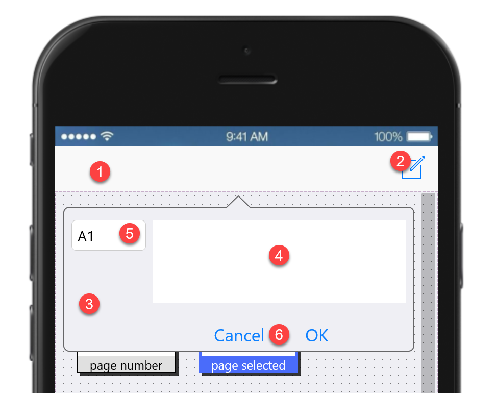

1. Select a Toolbar component from the component bar and drop it into the form.
2. Drop a TSpeedButton on it, and name it “edEdit”. Set the “StyleLookup” property of the button to “composetoolbuttonbordered”. Set its anchor to be “akRight” instead of “akLeft”
3. Add a TCalloutPanel, name it “PanelEditor”, set its “Visible” property to false, and add “akRight” to its Anchor property
4. Drop a TMemo in the panel, set its “WrapText” property to true, and name it “edCell”
5. Drop a TEdit, name it edAddress. Set its text to “A1”
6. Drop two buttons, name them edOk and edCancel

Double click on the edit button, and write the following code:
<pre class="shiki shiki-themes light-plus dark-plus" style="background-color:#FFFFFF;--shiki-dark-bg:#1E1E1E;color:#000000;--shiki-dark:#D4D4D4" tabindex="0"><code>procedure TFormFlexView.edEditClick(Sender: TObject);
begin
  PanelEditor.Visible := true;
end;
</code></pre>

Double click the edCancel button and write this code:

<pre class="shiki shiki-themes light-plus dark-plus" style="background-color:#FFFFFF;--shiki-dark-bg:#1E1E1E;color:#000000;--shiki-dark:#D4D4D4" tabindex="0"><code>procedure TFormFlexView.edCancelClick(Sender: TObject);
begin
  PanelEditor.Visible := false;
end;
</code></pre>

Double click the edOk button and write this code:

<pre class="shiki shiki-themes light-plus dark-plus" style="background-color:#FFFFFF;--shiki-dark-bg:#1E1E1E;color:#000000;--shiki-dark:#D4D4D4" tabindex="0"><code>procedure TFormFlexView.edOkClick(Sender: TObject);
var
  addr: TCellAddress;
begin
  if Trim(edAddress.Text) &#x3C;> '' then
  begin
    try
      addr := TCellAddress.Create(edAddress.Text);
    except
      ShowMessage('Invalid Cell Address: ' + edAddress.Text);
      exit;
    end;
    FlexCelPreviewer1.Document.Workbook.SetCellFromString(addr.Row, addr.Col, edCell.Text);
    FlexCelPreviewer1.Document.Workbook.Recalc;
    FlexCelPreviewer1.InvalidatePreview;
  end;
  PanelEditor.Visible := false;
end;
</code></pre>

This will take care of updating the cell and recalculating the file.

> [!Note]
> 
> While the preferred way to set a cell value in FlexCel is using [SetCellValue](~/api/FlexCel.Core/TExcelFile//SetCellValue.md), here we are using [SetCellFromString](~/api/FlexCel.Core/TExcelFile//SetCellFromString.md) since we have the values stored as strings, so we need to convert them.

Now the final step in editing is to update the value of the cell when you type a different address. We can do it with the “OnChange” event of the “edAddress” control:

<pre class="shiki shiki-themes light-plus dark-plus" style="background-color:#FFFFFF;--shiki-dark-bg:#1E1E1E;color:#000000;--shiki-dark:#D4D4D4" tabindex="0"><code>procedure TFormFlexView.edAddressChange(Sender: TObject);
begin
  UpdateCellValue;
end;
</code></pre>

 
And we define UpdateCellValue as follows:

<pre class="shiki shiki-themes light-plus dark-plus" style="background-color:#FFFFFF;--shiki-dark-bg:#1E1E1E;color:#000000;--shiki-dark:#D4D4D4" tabindex="0"><code>procedure TFormFlexView.UpdateCellValue;
var
  addr: TCellAddress;
begin
  if Trim(edAddress.Text) &#x3C;> '' then
  begin
    try
      addr := TCellAddress.Create(edAddress.Text);
    except
      exit;
    end;
    edCell.Text := FlexCelPreviewer1.Document.Workbook.GetCellValue(addr.Row, addr.Col);
  end else
  begin
    edCell.Text := '';
  end;
end;
</code></pre>

And to complete the app, we will call UpdateCellValue every time we show the panel. Let’s change the edit click event to be:

<pre class="shiki shiki-themes light-plus dark-plus" style="background-color:#FFFFFF;--shiki-dark-bg:#1E1E1E;color:#000000;--shiki-dark:#D4D4D4" tabindex="0"><code>procedure TFormFlexView.edEditClick(Sender: TObject);
begin
  UpdateCellValue;
  PanelEditor.Visible := true;
end;
</code></pre>

If you run the app now, you can press the “Edit” button and a popover with the editing options will appear. Type the cell reference you want to change (like for example A2) and the value for the cell, press Ok and the cell will change, while the full file will be recalculated.

## Step 6. Sending the file to other applications
In [step 4](#step-4-reading-the-file-sent-by-another-application)
we saw how to import a file from another application. In this step we are going to see how to do the opposite: How to export the file and make it available to other applications that handle xls or xlsx files. We will also see how to print the file.

Luckily, this isn’t complex to do.

FlexCel comes with a component that makes this easy: TFlexCelDocExport

To export the file, we'll follow the steps:

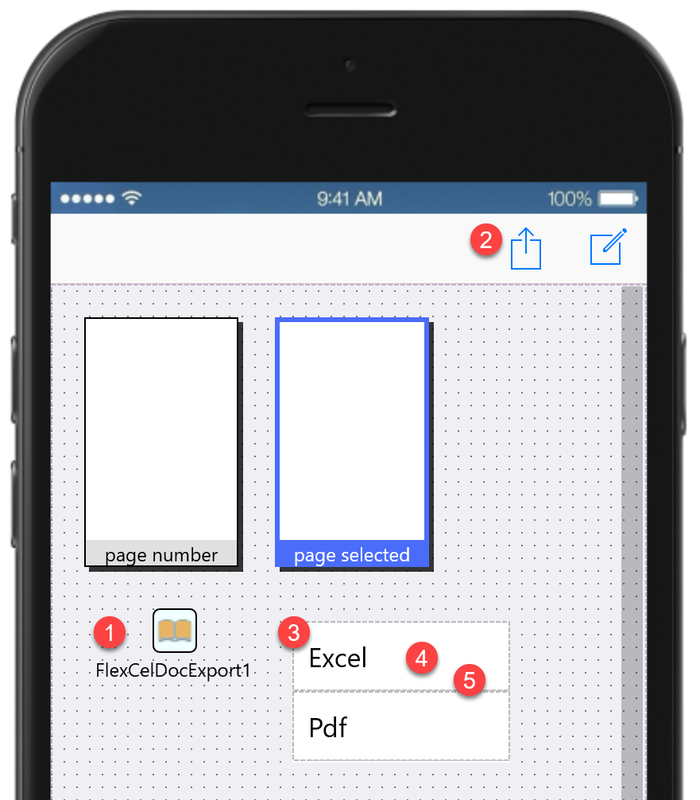

1. Drop a TFlexCelDocExport into the form.
2. Drop another TSpeedButton next to our edEdit button, name it “edShare”, and set its style to “actiontoolbuttonbordered”
   We want to be able to export the file either as Excel or as PDF, so we need to call a menu when you press this button. Exporting to pdf will also allow us to print the file, as this functionality comes for free with iOS.
3. Drop a TPopup in the form, name it PopShare
4. Drop a TListBox inside PopShare
5. Add two items to the listbox, name them edPdf and edExcel and set their text to Pdf and Excel.

Now, on the edShare handler, show the popup:

<pre class="shiki shiki-themes light-plus dark-plus" style="background-color:#FFFFFF;--shiki-dark-bg:#1E1E1E;color:#000000;--shiki-dark:#D4D4D4" tabindex="0"><code>procedure TFormFlexView.edShareClick(Sender: TObject);
begin
  PopShare.Parent := edShare;
  PopShare.Popup;
end;
</code></pre>

And, in the listbox item handlers, we will show the share dialog. The Excel handler is the easiest, because we don’t need to convert the file. We will just close the popup and call the ExportFile method in TFlexCelDocExport:

<pre class="shiki shiki-themes light-plus dark-plus" style="background-color:#FFFFFF;--shiki-dark-bg:#1E1E1E;color:#000000;--shiki-dark:#D4D4D4" tabindex="0"><code>procedure TFormFlexView.edExcelClick(Sender: TObject);
begin
  PopShare.Visible := false;
  FlexCelPreviewer1.Document.Workbook.Save(GetHomePath + '/tmp/tmpflexcel.xlsx');
  FlexCelDocExport1.ExportFile(edShare, FlexCelPreviewer1.Document.Workbook.ActiveFileName);
end;
</code></pre>

Note that we save the file to the tmp folder and export that. The tmp folder will be cleaned by iOS, so we don’t need to worry about deleting the file after we used it.

The pdf export code is a little more complex, in that we need to create the pdf file first:

<pre class="shiki shiki-themes light-plus dark-plus" style="background-color:#FFFFFF;--shiki-dark-bg:#1E1E1E;color:#000000;--shiki-dark:#D4D4D4" tabindex="0"><code>procedure TFormFlexView.edPdfClick(Sender: TObject);
var
  pdf: TFlexCelPdfExport;
  tmppdf: string;
begin
  PopShare.Visible := false;
  pdf := TFlexCelPdfExport.Create(FlexCelPreviewer1.Document.Workbook, true);
  tmppdf := GetHomePath + '/tmp/tmpflexcel.pdf';
  pdf.BeginExport(TFileStream.Create(tmppdf, fmCreate));
  pdf.ExportAllVisibleSheets(false, 'Sheets');
  pdf.EndExport;
  FlexCelDocExport1.ExportFile(edShare, tmppdf);

end;
</code></pre>

 
But conceptually is as simple as exporting an xls/x file.

> [!Note]
> 
> **Exporting to pdf will show a “Print” option when sharing the file**, allowing us to print it.

## Step 7. Final touches
In this small tutorial we’ve gone from zero to a fully working Excel preview / pdf converter application. But for simplicity, we’ve conveniently “forgotten” about an interesting fact: Excel files can have more than one sheet.

In this final step we will add the code to show any sheet in our application, not just the one that was selected when the file was saved.
To do this, we will add a combobox to the toolbar. In it, we will show the file name we are working in, and the active sheet. When the user changes the sheet, we will update our app.
So drop a combobox and set its right anchor to true:

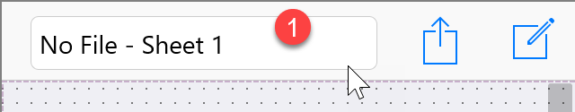

Name the combobox edSheets. In the “Items” property, write: “No File - Sheet 1” This text will show when you open the file from the Launchpad, instead of opening it from another app.

Set the ItemIndex property to 0.

Write the following event handler for the “OnChange” event in the combobox:

<pre class="shiki shiki-themes light-plus dark-plus" style="background-color:#FFFFFF;--shiki-dark-bg:#1E1E1E;color:#000000;--shiki-dark:#D4D4D4" tabindex="0"><code>procedure TFormFlexView.edSheetsChange(Sender: TObject);
begin
  if (edSheets.ItemIndex &#x3C; 0) then exit;
  FlexCelPreviewer1.Document.Workbook.ActiveSheet := edSheets.ItemIndex + 1;
  FlexCelPreviewer1.InvalidatePreview;
end;
</code></pre>

And finally, change the OpenFile method so when you open the file, you load the sheet in the combobox:

<pre class="shiki shiki-themes light-plus dark-plus" style="background-color:#FFFFFF;--shiki-dark-bg:#1E1E1E;color:#000000;--shiki-dark:#D4D4D4" tabindex="0"><code>function TFormFlexView.OpenFile(const aURL: string): boolean;
var
  xls: TXlsFile;
  ImgExport: TFlexCelImgExport;
begin
  Result := true;
  try
    try
      xls := TXlsFile.Create(aURL, true);
    finally
      TFile.Delete(aURL); //We've already read it. Now we need to
                //delete it or it would stay forever in the inbox.
      //The file must be deleted even if it was invalid and FlexCel
      //raised an Exception when opening it.

    end;
    ImgExport := TFlexCelImgExport.Create(xls, true);
    FlexCelPreviewer1.Document := ImgExport;
    LoadSheets(xls);
    FlexCelPreviewer1.InvalidatePreview;
  except
    Result := false;
  end;
end;
</code></pre>

 
Where “LoadSheets” is:

<pre class="shiki shiki-themes light-plus dark-plus" style="background-color:#FFFFFF;--shiki-dark-bg:#1E1E1E;color:#000000;--shiki-dark:#D4D4D4" tabindex="0"><code>procedure TFormFlexView.LoadSheets(const xls: TXlsFile);
var
  i: Integer;
begin
  edSheets.Clear;
  for i := 1 to xls.SheetCount do
  begin
    edSheets.Items.Add(ExtractFileName(xls.ActiveFileName) +
    ' - Sheet: ' + xls.GetSheetName(i));
  end;
  edSheets.ItemIndex := xls.ActiveSheet - 1;
end;
</code></pre>

And we are done! If you run the application now, you should be able to accept xls and xlsx files from other applications like mail or DropBox, to display them and edit them, and to share the modified files with other applications. You will also be able to natively print the xls and xlsx files by pressing the "Share" button.

